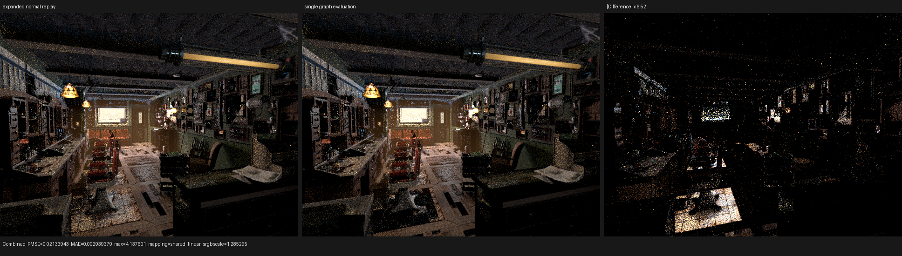
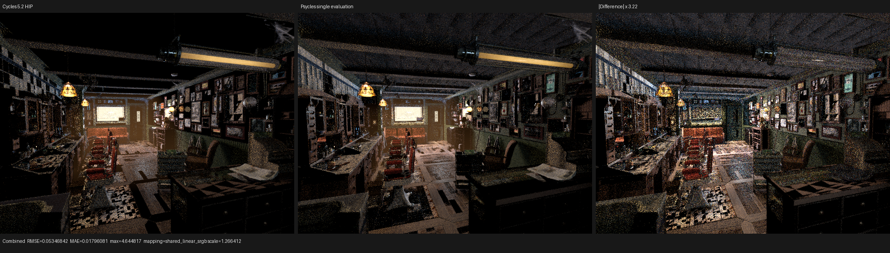

# Cycles-style single surface graph evaluation

## Root cause and model

Psycles already had a scene-pruned, typed surface bytecode interpreter, but one
consumer remained outside that execution model. `SurfaceGeometryStage` called a
separate `surface_shading_normal` material switch before surface population.
Barbershop therefore expanded 564 material topologies into a second callable
and evaluated the Bump/Set Normal dependency domain twice on affected hits.

Cycles 5.2 does not have that boundary. `surface_shader_eval()` runs its SVM
program once, updates `ShaderData::N`, and later shadow-terminator, light
sampling, MIS, and random-walk BSSRDF code consume that result. The Psycles
pipeline now implements the same data-flow architecture with Luisa DSL/JIT:

```text
raw SurfacePoint p
        |
        v
typed value DAG + raw closure program   (one evaluation)
        |
        +-- preparation reductions
        +-- physical closure consumers
        +-- final graph normal N --------+--> shadow terminator
                                        +--> light-tree/NEE sampling
                                        +--> forward-MIS state
                                        +--> random-walk BSSRDF entry
```

`SurfacePreparation::shading_normal` is the graph-level `ShaderData::N`
equivalent. It is intentionally separate from `SurfaceAov::normal`, which is a
closure-weighted camera pass. The packed callable ABI and Luisa reflection list
contain the new field explicitly. The legacy replay route keeps its raw
`SurfacePoint` unchanged and carries `N` in `SurfaceShadingState`, so a later
material replay cannot apply Bump twice.

Let `E_N(G, p)` be the deterministic normal dependency evaluation for graph
`G`, point `p`, and fixed shader services, and let `E_S(G, p)` be the complete
surface evaluation. The previous pipeline computed

```text
N_1 = E_N(G, p)
(N_2, C, A) = E_S(G, p)
```

where the normal projection of `E_S` is the same topologically closed program,
so `N_1 = N_2`. The new pipeline computes only `E_S` and forwards `N_2`.
Invalid tags and graphs without a normal root preserve `p.shading_normal`.
No material value or closure is evaluated on the host, baked, or delegated to
Cycles.

## Regression coverage

The compact preparation oracle now compares the final graph normal in addition
to emission, flags, every AOV, physical closure identity, evaluation, and
sampling. Its seven material topologies include automatic Bump, transformed
inputs, layered Principled, glass/emission, transparency/capacity, back-facing
queries, and the no-normal-root identity case.

All 15 surface-program tests plus nine downstream random-walk, light-tree, and
surface-NEE-normal tests passed on fallback, HIP, and Vulkan. Vulkan is the
strict native XIR-to-SPIR-V canary.

```sh
cmake --build build --parallel 32 --target \
  psycles_luisa_compact_surface_preparation_tests \
  psycles_render_blender_scene

ctest --test-dir build --output-on-failure -j 1 \
  -R 'psycles\.luisa_(surface_closure_collection|surface_population|compact_surface_preparation|principled_setup_callable|principled_thin_wall)_(fallback|hip|vk)$'

ctest --test-dir build --output-on-failure -j 1 \
  -R 'psycles\.luisa_(random_walk|light_tree|surface_nee_normal)_(fallback|hip|vk)$'
```

## Barbershop HIP performance

The scene contains 1,649 geometries, 2,565 instances, and 564 deduplicated
material topologies. Measurements use RX 9070 XT `gfx1201`, 640x480, 64 spp,
64 samples per dispatch, and `wavefront-staged`.

```sh
env PSYCLES_COMPACT_SURFACE_VALUES=1 \
    PSYCLES_POPULATE_SURFACE_ONCE=1 \
    LUISA_LOG_LEVEL=warning \
./build/bin/psycles_render_blender_scene \
  /home/mike/Projects/psycles-benchmarks/barbershop-480p-64spp/export \
  OUTPUT.exr hip 640 480 64 64 - 0 0 0 0 64 - 1 0 \
  wavefront-staged 32 32768 32 1 1 0 4 2 4096 0 0 0 1 1048576
```

An intermediate implementation replaced the 564-way normal switch with a
compact interpreter but still evaluated it separately. It reduced code size
yet regressed both warm runs to 3.992 s. That experiment rejects "smaller code
alone" as the explanation and identifies duplicate graph work as the runtime
cause.

| metric | previous expanded replay | rejected duplicate interpreter | single evaluation |
|---|---:|---:|---:|
| warm render-only | 3.735-3.755 s | 3.992/3.993 s | **3.685/3.626 s** |
| profiled render-only | 3.754 s | - | **3.657 s** |
| hot path-kernel time | 2,406.222 ms | - | **2,313.428 ms** |
| hot path ns/invocation | 35.401 ns | - | **34.031 ns** |
| fixed private segment | 6,160 B | - | **6,000 B** |
| main HIP object | 998,144 B | 783,360 B | **639,456 B** |
| separate normal callable | 369,872 B | 146,352 B | **removed** |

The final path kernel is 3.87% faster per launched invocation, its main object
is 35.9% smaller, and private state falls by 160 B. The safe profiler capture
used kernel and scratch traces only:

```sh
rocprofv3 --kernel-trace --scratch-memory-trace --stats -f rocpd \
  -d /var/tmp/rocprof-psycles-single-surface-eval \
  -o single_surface_eval -- RENDER_COMMAND
```

Machine-readable results are in [profile-summary.json](profile-summary.json).

## Numerical and visual inspection

The old/new Combined comparison has RMSE `0.0213394`, while two old runs have
RMSE `0.0196391`; their luminance ratio varies by about 4%. The change is thus
inside the existing atomic/Monte Carlo nondeterminism envelope. Normal has
RMSE `0.00124438`, a mean-luminance ratio of `0.999984`, and no orientation
change. Emission is equal to `1.8e-9` RMSE and Environment is exact. Full
per-pass data and triptychs are recorded in [visual-report.json](visual-report.json).



The Cycles 5.2 HIP comparison still shows the known overall Psycles brightness
gap: Combined mean-luminance ratio `1.18033` and RMSE `0.0534684`. Visual
inspection finds matching geometry, UV/material placement, and lighting
structure, but Psycles remains brighter across the room; this change does not
claim to solve that separate alignment problem.


