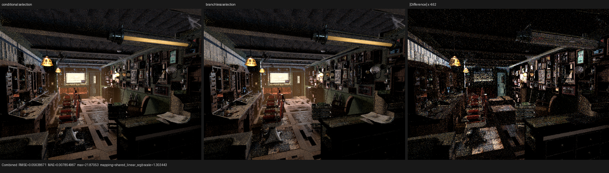

# Branchless surface-selection projection

## Result

Surface closure selection now represents its only conditional output,
`weight`, as data flow instead of a device control-flow region. On the
Barbershop 640x480, 64-spp HIP wavefront checkpoint this reduces the dominant
shade kernel from 35.689 ns to 35.401 ns per invocation (-0.81%) without
changing its 6,160-byte private-memory requirement. Repeated unprofiled
render-only measurements improve from the 3.7688 s baseline to 3.75476 s and
3.73524 s.

The Psycles source checkpoint before this change is
`a03606b175ef083684c04adb4c15d48e105c8e46`; the LuisaCompute submodule is
`7aa050c41f428ed3a610f1424c3c39ca66985d6d`.

## Formal equivalence

Let `E(c, q)` be the existing closure eligibility predicate for closure `c`
and surface query `q`, and let `s(c)` be the retained closure's sample weight.
The old AST executed

```
w := 0
if E(c, q):
    w := s(c)
```

while the new AST constructs

```
w := select(0, s(c), E(c, q))
```

For Boolean `E`, both definitions denote `w = E ? s(c) : 0`. The conditional
body had no side effects: it assigned only `w`, and its redundant normal
assignment wrote the value already assigned before the branch. Therefore the
transformation preserves the categorical measure, inverse-CDF intervals,
chosen closure, rescaled random coordinate, and every downstream BSDF input.
It does not speculate a texture, closure setup, BSDF evaluation, or sample.

The projection is consumed three times by the population-backed sampler
(measure, inverse-CDF scan, and selected-closure metadata). Removing the
control region at the shared definition prevents each consumer from recording
another pair of CFG blocks in the Luisa AST.

## Rejected runtime-flag experiment

A separate experiment removed the runtime-flag fold from the selection scan
and reused the value already computed during closure population. Its semantics
and 15 backend regressions were correct, and private scratch decreased from
6,160 B to 6,144 B, but the HIP shade kernel regressed from 35.689 ns to
38.582 ns per invocation (+8.1%) and Barbershop render-only time rose to
3.946-3.974 s. Moving the flag result to the outer shading state did not
recover the regression. The experiment was not committed; it remains in the
named local rejection stash for compiler-layout investigation.

This is evidence that the approximately 404 KiB machine function is still on
a HIP scheduling/layout cliff: removing instructions can make it slower even
when scratch and code-object size decrease. Future closure-IR work must use
matched whole-scene profiles rather than infer runtime speed from AST size.

## Reproduction and tests

The complete build used all 32 host threads:

```sh
cmake --build build --parallel 32
```

The following five suites passed on fallback, HIP, and Vulkan (15/15). The
Vulkan tests use the configured native XIR-to-SPIR-V route.

```sh
ctest --test-dir build --output-on-failure -j 1 \
  -R 'psycles\.luisa_(surface_closure_collection|surface_population|compact_surface_preparation|principled_setup_callable|principled_thin_wall)_(fallback|hip|vk)$'
```

The full-scene command was:

```sh
env PSYCLES_COMPACT_SURFACE_VALUES=1 \
    PSYCLES_POPULATE_SURFACE_ONCE=1 \
    LUISA_LOG_LEVEL=warning \
./build/bin/psycles_render_blender_scene \
  /home/mike/Projects/psycles-benchmarks/barbershop-480p-64spp/export \
  OUTPUT.exr hip 640 480 64 64 - 0 0 0 0 64 - 1 0 \
  wavefront-staged 32 32768 32 1 1 0 4 2 4096 0 0 0 1 1048576
```

The safe profiler capture used kernel and scratch tracing only:

```sh
rocprofv3 --kernel-trace --scratch-memory-trace --stats -f rocpd \
  -d /var/tmp/rocprof-psycles-selection-branchless \
  -o selection_branchless -- RENDER_COMMAND
```

| metric | conditional baseline | branchless projection |
|---|---:|---:|
| shade invocations | 67,950,752 | 67,971,392 |
| shade time | 2,425.075 ms | 2,406.222 ms |
| shade time/invocation | 35.689 ns | 35.401 ns |
| private scratch | 6,160 B | 6,160 B |
| HIP code-object payload | 998,144 B | 998,144 B |
| profiled render-only | 3.75115 s | 3.75352 s |

The profiled whole-render time includes scheduler variance; normalized shade
time and the two unprofiled repetitions establish the local improvement.

## Visual inspection

The [three-panel comparison](combined.png) shows the same geometry, material
placement, texture coordinates, lighting structure, and closure response on
both sides. The difference panel is high-frequency Monte Carlo/firefly noise,
not a coherent surface or transform change. At this 64-spp wavefront setting,
independent full runs are not exact-hash stable, so the numerical image report
is retained as an observation rather than claimed as a semantic proof:
[visual-report.json](visual-report.json).


