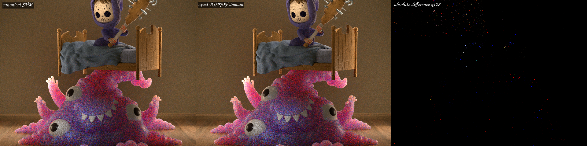
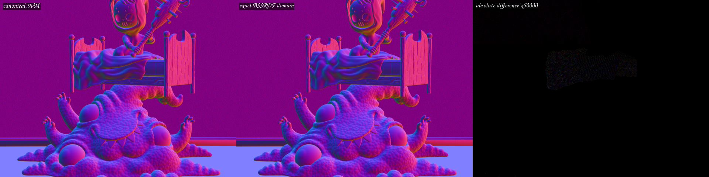
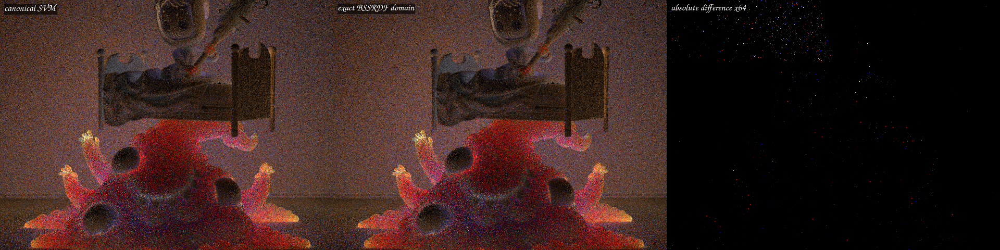

# Exact BSSRDF SVM execution domains

This validation isolates the BSSRDF-exit consumer of the canonical surface
SVM. The implementation follows the behavior of Blender/Cycles 5.2 without
copying its kernels: Cycles evaluates the material again at a subsurface exit
only when the shader has `SD_HAS_BSSRDF_BUMP`, preserves normal closure
allocation order, and then forms the weighted BSSRDF normal. Psycles now
generates only the value and closure switch cases reachable by the equivalent
scene capability set.

The test scene is the official **Monster Under the Bed** blend downloaded from
<https://download.blender.org/demo/cycles/monster_under_the_bed_sss_demo_by_metin_seven.blend>.
Its SHA-256 is
`9463082f8d365ad8ae19c1ba86429deb3b532c5a2d0db0b9492c3c759f64d28d`.
It was exported with Blender 5.2.0 LTS using the Psycles raw-graph exporter;
no shader evaluation, baking, or closure replacement was performed.

## Formal execution-domain model

Let `T` be the set of compact topology tags reached by scene materials whose
exact Cycles capability analysis sets `has_bssrdf_bump`. For a topology `t`,
let `P(t)` be its preparation value program and `N(t)` its automatic-normal
program. The generated domains are:

```text
V_B = union { instruction_variant(i) | t in T, i in P(t) }
N_B = union { instruction_variant(i) | t in T, i in N(t) }
H_B = least fixed point of Bump-height callees seeded by P(t) and N(t)
C_B = union { closure_static_variant(c) | t in T, c in closures(P(t)) }
```

Every program range and every transitive Bump-height edge is validated before
the domains are accepted. The sets are sorted and deduplicated, and affect
only host/JIT switch construction. Device program ids, topology tags, material
parameters, resolution, SPP, and dispatch chunk sizes remain runtime values
and do not enter shader AST/cache identity.

`C_B` deliberately retains **all** physical closure leaves in each selected
preparation program, not just BSSRDF leaves. This is required because Cycles'
finite closure array is allocated in program order: an earlier Diffuse or
Glossy leaf can consume a slot and change whether a later BSSRDF leaf exists.
Removing such a leaf would not be dead-code elimination; it would change the
observable BSSRDF normal. If `T` is empty, the BSSRDF callable is proven dead
scene-wide and is recorded as a small identity callable.

The domain/view selection was extracted into a real
`path_tracer_surface_execution_domain.h/.cpp` host abstraction. The main
surface implementation remains below 2,000 lines.

## Structural regression

The controlled compact-surface fixture contains two BSSRDF-capable topologies,
a non-BSSRDF nested-Bump topology, and a Glass topology. It proves that:

- invalid BSSRDF tags are rejected before JIT construction;
- the BSSRDF value/normal domains are strict subsets of the global domains;
- unrelated nested-Bump variants and Glass are absent;
- both Subsurface and Diffuse closure variants remain, preserving finite
  closure-budget semantics;
- fallback, HIP, and strict native Vulkan XIR-to-SPIR-V produce the same
  expected result.

The final focused matrix passed 20/20 in 38.21 seconds. Vulkan was run with
`LUISA_VULKAN_REQUIRE_NATIVE_XIR_SPIRV=1` and
`LUISA_VULKAN_DISABLE_DXC=1`, so a DXC compatibility fallback would fail the
test rather than pass silently.

## HIP code size and compiler results

The measurements are cold-cache runs on an AMD Radeon RX 9070 XT at
640x480, 64 spp, using the wavefront-staged path. Each side used an empty
Luisa shader cache and a distinct empty COMGR cache.

| Metric | Canonical surface SVM | Exact BSSRDF domain | Change |
|---|---:|---:|---:|
| BSSRDF value/normal/height variants | 41 / 11 / 23 (global) | 9 / 0 / 2 | exact scene subset |
| BSSRDF closure variants | 4 (global) | 1 | exact scene subset |
| Generated main AMDGPU blob | 481,148 B | 394,120 B | -18.09% |
| Final main HIP code object | 451,008 B | 335,808 B | -25.54% |
| Main HIP LLVM codegen | 898.061 ms | 704.709 ms | -21.53% |
| Main COMGR link | 2,751.063 ms | 2,076.120 ms | -24.53% |
| Complete Luisa shader JIT | 11.9615 s | 10.5959 s | -11.42% |

Barbershop is the negative control: it has zero BSSRDF-bump topology tags.
Its main blob stayed exactly 609,808 B and its code object stayed exactly
572,384 B; COMGR link changed only from 4.828 s to 4.833 s. Thus the reduction
comes from reachable BSSRDF SVM code, not an unrelated compiler fluctuation.

Five interleaved warm-cache Monster runs measured render-only time:

| Route | Samples (seconds) | Median | Mean | Standard deviation |
|---|---|---:|---:|---:|
| Canonical SVM | 2.02369, 2.02578, 2.02439, 2.02479, 2.02754 | 2.02479 s | 2.02524 s | 0.00149 s |
| Exact BSSRDF domain | 1.93671, 1.93806, 1.93327, 1.93540, 1.93697 | 1.93671 s | 1.93608 s | 0.00184 s |

The median render-only improvement is **4.35%**. This is consistent with the
smaller code object reducing instruction-cache and code-shape pressure; it is
not inferred from the cold JIT wall time.

## Numerical and visual validation

Both images use the identical global sample range `[0, 64)`. Narrowing switch
domains changes HIP fast-math optimization and instruction scheduling, so the
result is not bit-identical. The direct geometric signals remain extremely
close, while a small number of secondary stochastic paths amplify the tiny
normal perturbation:

| Pass | RMSE | Relative RMSE | P99 per-pixel RMSE | Maximum component error |
|---|---:|---:|---:|---:|
| Combined | 2.18110e-4 | 4.20217e-4 | 6.65188e-5 | 8.51537e-2 |
| Normal | 2.19681e-7 | 3.85361e-7 | 1.09315e-6 | 1.17057e-5 |
| Diffuse Direct | 2.49599e-5 | 7.08298e-5 | 9.06494e-7 | 1.53871e-2 |
| Diffuse Indirect | 7.99970e-4 | 7.36520e-3 | 2.37289e-4 | 2.63403e-1 |
| Glossy Indirect | 6.91489e-4 | 5.04363e-3 | 1.37945e-4 | 1.95714e-1 |

As a determinism control, repeating either unchanged binary gives Combined
RMSE near `1e-9`. Original-resolution inspection found no material, topology,
UV, normal-orientation, or BSSRDF-shape difference. The amplified difference
panels show sparse secondary-path changes rather than a structured region.







The full numerical and timing data are in
[`report.json`](report.json).

## Commands

```sh
cmake --build build --parallel 32

LUISA_VULKAN_USE_XIR=1 \
LUISA_VULKAN_REQUIRE_NATIVE_XIR_SPIRV=1 \
LUISA_VULKAN_DISABLE_DXC=1 \
ctest --test-dir build --output-on-failure -j 1 \
  -R 'psycles\.(surface_program_metadata|surface_closure_execution_plan|luisa_(surface_closure_collection|surface_population|compact_surface_preparation|principled_setup_callable|principled_thin_wall|subsurface_exit)_(fallback|hip|vk))$'

psycles_render_blender_scene <monster-5.2-export> out.exr hip \
  640 480 64 64 - 0 0 0 0 64 - 1 0 wavefront-staged
```
