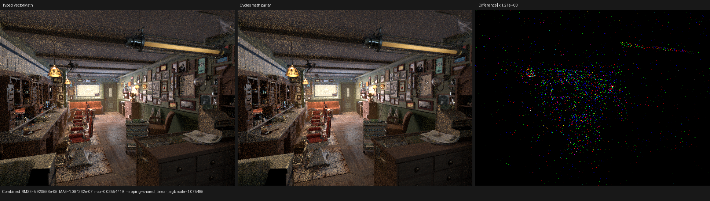
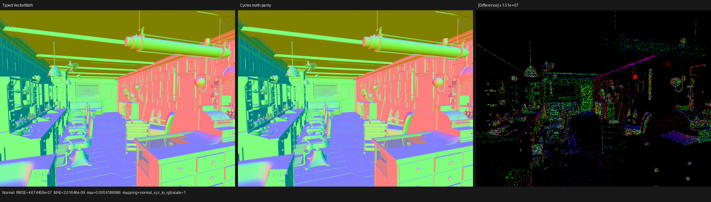
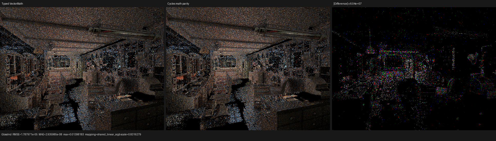

# Cycles Math boundary parity

This checkpoint closes two semantic gaps found by reading the Blender/Cycles
5.2 SVM source after the typed Math and VectorMath refactors:

- Vector Math `ROUND` now survives Blender graph import, surface-program
  lowering, compact-immediate validation, and typed device dispatch.
- Scalar Math and component-wise VectorMath now share Cycles' total
  `safe_powf` contract, including `0^negative -> 0` and `0^0 -> 1`.

No shader graph, texture, material, closure, or lighting value is pre-evaluated
at the Blender boundary.

## Source-derived contract

The authoritative source is Cycles 5.2 commit `fbe6228777e7`:

- `intern/cycles/scene/shader_nodes.cpp` registers `round` as
  `NODE_VECTOR_MATH_ROUND` and emits it in `SVMNodeVectorMath.math_type`.
- `intern/cycles/kernel/svm/types.h` includes
  `NODE_VECTOR_MATH_ROUND` in the complete 30-operation enum.
- `intern/cycles/kernel/svm/math_util.h` evaluates Round as
  `floor(a + 0.5f)` and routes scalar/vector Power through `safe_powf`.
- `intern/cycles/util/math_base.h` first handles exponent zero, then handles a
  zero base, then rejects negative bases with non-integral exponents before
  applying the GPU-compatible signed magnitude.

The Psycles implementation models the same ordered decision relation as a
total branchless expression. It selects a benign pow operand when the base is
zero, so a backend AST never evaluates `0^negative` and merely masks an
infinity afterward. Scalar Math and VectorMath call the same helper, preventing
their boundary behavior from drifting.

For finite `x` and `y`, the modeled relation is

```text
safe_pow(x, y) =
    1                         if y = 0
    0                         if x = 0 and y != 0
    0                         if x < 0 and y is not integral
    sign(x, y) * |x|^y        otherwise

sign(x, y) = -1 if x < 0 and |y| modulo 2 != 0, else 1.
```

## Regression evidence

The host lowering regression builds a real shader graph with
`Operation="ROUND"`, retains the VectorMath producer through the
`surface_normal` root, compiles it, and verifies that its exact enum reaches the
surface instruction. This prevents the old silent fallback to `ADD`.

The device regression executes these Cycles boundary cases through the typed
SVM handlers on fallback, HIP, and strict native-XIR Vulkan:

| Expression | Expected |
|---|---:|
| `0^-2` | `0` |
| `0^0` | `1` |
| `(-2)^3` | `-8` |
| `(-2)^2` | `4` |
| `(-2)^0.5` | `0` |
| `round((-1.5, 1.5, 2.49))` | `(-1, 2, 2)` |

All 8 focused tests pass. Vulkan is forced through native
AST-to-XIR-to-SPIR-V and DXC is disabled:

```sh
cmake --build build --parallel 32

LUISA_VULKAN_USE_XIR=1 \
LUISA_VULKAN_REQUIRE_NATIVE_XIR_SPIRV=1 \
LUISA_VULKAN_DISABLE_DXC=1 \
ctest --test-dir build --output-on-failure --parallel 1 \
  -R 'psycles\.(surface_svm_(math|vector_math)_immediate|luisa_surface_(math|vector_math)_svm_(fallback|hip|vk))$'
```

## HIP structural cost

An uncached 640x480, 64 spp Barbershop render used the same `wavefront-staged`
configuration as the preceding typed-VectorMath checkpoint.

| Main `shade_surface` metric | Before parity fix | After parity fix | Change |
|---|---:|---:|---:|
| Generated AMDGPU blob | 530,472 B | 530,632 B | +160 B (+0.030%) |
| HIP code object | 496,320 B | 496,576 B | +256 B (+0.052%) |
| Private segment | 5,440 B | 5,440 B | unchanged |
| SGPR spills | 42 | 42 | unchanged |
| VGPR spills | 422 | 422 | unchanged |
| Render time | 3.48134 s prior median | 3.48319 s | +0.05% |

One cold LLVM/COMGR timing sample improved, but it is not treated as a result;
the deterministic conclusion is that the complete boundary semantics cost only
256 B in the real code object and did not change frame or spill pressure.

## Full-scene comparison and visual inspection

The exact same 640x480, 64 spp Barbershop sample range was compared across all
45 channels in Combined, Normal, color, direct/indirect light, Emission,
Environment, transmission, and volume passes. Every value is finite.

Combined RMSE is `5.92056e-5`, while its 99th-percentile per-pixel RMSE is only
`8.60319e-9`; the aggregate is dominated by a tiny number of floating-point
atomic-order outliers. Combined luminance ratio is `1.00000174`. Normal RMSE is
`4.67446e-7`, Glossy Indirect RMSE is `1.78797e-5`, and Environment plus both
volume passes are bit-exact. Full measurements are in
[`report.json`](report.json).

The three 480p triptychs were inspected at native resolution. Geometry,
materials, UV/texture structure, normals, lighting, and orientation agree.
Difference panels require approximately `1e7` to `1e8` amplification and show
no coherent residual.







## Follow-up

The full Cycles source audit confirms that the major remaining structural gap
is not another per-mode handler. Cycles records all shader nodes into one
scene-wide typed SVM stream, schedules dependencies with a Sethi-Ullman
heuristic, reuses stack slots after last use, and inserts lazy closure jumps
after shared dependencies. Psycles still selects value evaluation through a
scene-specific outer `variant_index`. The next implementation checkpoint will
replace that outer expansion with opcode-driven typed interpretation while
preserving Psycles' typed banks and existing storage plan.
