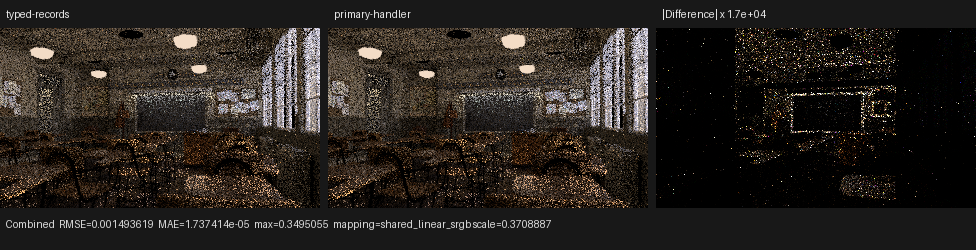
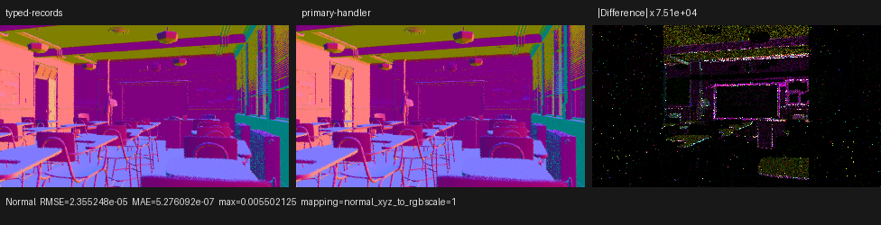
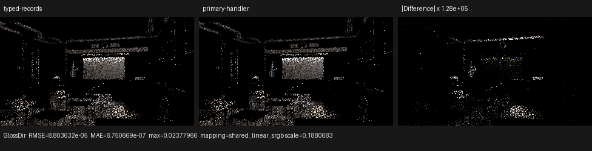

# Cycles-style primary SVM dispatch

This checkpoint replaces Psycles' unconditional per-instruction semantic-
variant dispatch with an instruction-derived opcode/execution-family dispatch.
An exact semantic discriminator is still read inside a primary branch whenever
that branch contains more than one evaluator body. This is a binding-time and
dispatch change only: Blender still exports the original shader graph and
closures, and no texture, material, BSDF, or closure is baked by Blender or
Cycles.

The reference is Blender/Cycles 5.2 at commit `fbe6228777e7`, read directly
from `/home/mike/Projects/blender-cycles`. The relevant source is:

- `intern/cycles/scene/shader_graph.cpp`: `simplify`, `finalize`, `clean`,
  default-input expansion, node deduplication, and multi-closure flattening;
- `intern/cycles/scene/svm.cpp`: typed stack allocation, lifetime release,
  Sethi-Ullman DAG scheduling, closure dependency partitioning, conditional
  jump patching, and surface/volume/bump/displacement program construction;
- `intern/cycles/scene/shader_nodes.cpp`: authored node properties encoded into
  typed records rather than C++ kernel specializations;
- `intern/cycles/kernel/svm/svm.h`: the single sequential opcode interpreter
  and scene-use guards;
- `intern/cycles/kernel/svm/node_types.h` and `util.h`: typed records,
  constant-or-stack inputs, optional output offsets, and typed stack access;
- `intern/cycles/kernel/svm/{clamp,map_range,mix,white_noise,magic,image}.h`:
  finite modes are record data, multi-output handlers write only live outputs,
  and Image Box remains a distinct execution-shape opcode.

## What Cycles actually does

Cycles first expands defaults, folds constants, deduplicates nodes, removes
dead graph regions, and rewrites closure mixes into explicit weights. Its SVM
compiler then schedules each reachable value node once. The `done` set
preserves DAG sharing, while a Sethi-Ullman heuristic orders producers to
reduce peak stack usage. Stack slots are released after the last unscheduled
consumer. Closure branches compute shared dependencies before their jump and
place only branch-exclusive dependencies behind the jump.

The device does not receive one generated shader body per Blender material.
It receives a typed record stream and executes a single opcode loop. Records
carry modes, constant-or-stack operands, resources, and optional output
offsets. This is why copying only Cycles' top-level `switch` would be
insufficient: graph scheduling, liveness, record design, and output fusion are
the architectural boundary.

Cycles marks its C++ SVM handlers `noinline` for its own ahead-of-time kernel
toolchains. Psycles does not copy that policy. Luisa/HIP/Vulkan are allowed to
make their own inlining decisions, as required by the existing project rule.

## Formal dispatch model

Let `E` be the set of exact evaluator variants after semantic interning, and
let an instruction-local primary key be

```text
h(i) = (opcode(i), result_bank(i), execution_family(i)).
```

The current nontrivial execution family is Image Box. Flat, Sphere, and Tube
use the regular one-sample image AST; Box uses normal-weighted multi-sampling
and therefore has a separate key. The key does not claim that every fiber is a
semantic equivalence class. For each reachable key `k`, define

```text
F(k) = { e in E | h(e) = k }.
```

Execution is:

```text
switch h(instruction):
    if |F(k)| == 1: evaluate the unique member directly
    otherwise:      read the exact variant and dispatch within F(k)
```

This is semantics-preserving by exhaustive partition: every valid instruction
has exactly one primary key; singleton fibers have one possible evaluator; and
non-singleton fibers retain the complete old discriminator. Instructions
outside ambiguous fibers no longer pay the immutable `instruction_variant`
buffer read. Invalid primary keys and invalid exact members remain
`unreachable`.

UV named/default selection was also moved into the opcode-owned typed
immediate. The expanded diagnostic graph remains host-specialized. The compact
handler starts from the default UV and conditionally loads the named attribute
when the record bit is set.

## Structural result

The table is the exact compact value-handler census after UV record merging.
For these exports, every remaining duplicate opcode is separated by result
bank or Image Box execution family, so all listed exact variants have singleton
primary fibers.

| Scene | Previous typed records | This checkpoint |
|---|---:|---:|
| Classroom | 32 | 32 |
| Monster Under the Bed | 29 | 29 |
| Barbershop | 54 | 53 |
| Lone Monk | 36 | 35 |
| Blender benchmark bundle | 43 | 42 |
| Flat Archiviz | 39 | 39 |

The reduction in Barbershop, Lone Monk, and the benchmark bundle is the named
versus default UV quotient. Classroom's count is unchanged; its gain comes
from deriving the primary handler from the instruction instead of loading and
switching on a global exact-variant side stream.

## HIP compile result

An empty-entry Classroom HIP compile was compared with the immediately prior
typed-record checkpoint `973199f`. Other renderer kernels were already cached,
so the large object below is the main surface path kernel in both runs.

| Main `shade_surface` metric | Typed-record baseline | Primary dispatch | Change |
|---|---:|---:|---:|
| HIP code object | 472,512 B | 367,904 B | -22.14% |
| HIP LLVM codegen | 2,293.501 ms | 1,101.045 ms | -51.99% |
| COMGR link | 4,325.328 ms | 2,395.285 ms | -44.62% |

The 320x180, 4-spp warm render completed in 0.042 seconds. That low-spp number
is a smoke measurement, not an end-to-end Cycles performance claim.

## Correctness and visual inspection

The focused matrix passed 29/29 tests on fallback, HIP, and strict native
Vulkan XIR-to-SPIR-V with DXC disabled. In addition to record validation, the
compact-preparation regression now constructs two live Clamp nodes with the
same primary key and different exact semantics (`MINMAX` and `RANGE`). It
compares the compact interpreter against the expanded evaluator on every
backend, proving that the ambiguous-fiber fallback is executed rather than
merely checking a host data structure.

Classroom was rendered at 320x180, 4 spp with identical global sample indices
and compared against `973199f` across all 15 film passes. Direct material data
is essentially unchanged: Diffuse Color RMSE is `3.67e-6`, Glossy Color RMSE
is `5.12e-8`, and Transmission Color RMSE is `3.34e-9`. Normal RMSE is
`2.36e-5`. A small number of indirect paths diverge after code-layout-induced
floating-point differences; Combined RMSE is `1.49e-3` (0.315%), while its
mean absolute error is `1.74e-5`. Repeating the new binary gives Combined RMSE
`6.63e-9`, so the result is stable rather than a race.

The Combined, Normal, and Glossy Direct triptychs were inspected at full
resolution. The two render panels have the same geometry, UV layout,
materials, normals, lights, and orientation. Amplified differences follow
surface detail and sparse indirect paths; there is no structural material or
geometry discrepancy.







Machine-readable measurements are in [`report.json`](report.json).

## Consequences for the next SVM work

The source audit gives two concrete next steps:

1. encode the remaining finite Clamp, Map Range, Mix Float/Vector, White Noise,
   Magic, and Voronoi modes as typed record fields, with legal-domain and
   encode/decode regressions; and
2. represent one authored multi-output node as one SVM instruction with typed
   optional outputs, so common computation is performed once exactly as in
   Cycles. This is more important than manufacturing additional callables.

The existing Psycles topological schedule and typed local banks already match
the broad Cycles model. They should be evolved toward optional multi-output
records without replacing Luisa's AST/JIT abstractions or copying Cycles kernel
text.

## Commands

```sh
cmake --build build --parallel 32

LUISA_VULKAN_USE_XIR=1 \
LUISA_VULKAN_REQUIRE_NATIVE_XIR_SPIRV=1 \
LUISA_VULKAN_DISABLE_DXC=1 \
ctest --test-dir build --output-on-failure --parallel 1 \
  -R 'psycles\.(surface_program_metadata|surface_svm_(math_immediate|vector_math_immediate|record_immediates)|normal_map_semantics|luisa_(compact_surface_preparation|surface_mix_svm|surface_math_svm|surface_vector_math_svm|normal_map|normal_map_callable|bump_callable|noise_callable)_(fallback|hip|vk))$'

PSYCLES_COMPACT_SURFACE_VALUES=1 \
PSYCLES_POPULATE_SURFACE_ONCE=1 \
build/bin/psycles_render_blender_scene <classroom-export> output.exr hip \
  320 180 4 4 - 0 0 0 0 4 - 1 0 wavefront-staged
```
