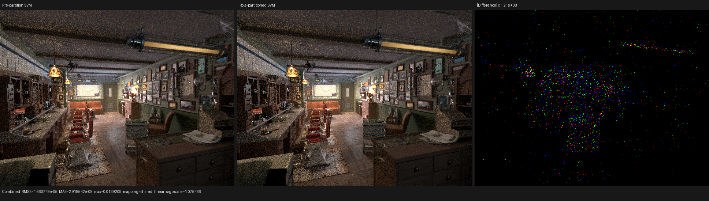
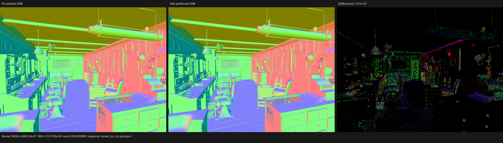

# Canonical Cycles-style surface SVM

## Outcome

The production surface route now compiles one typed, scene-deduplicated SVM
program image and populates physical closures once. Emission is an exact
endpoint projection of that image. The host/JIT builder emits only the value
and closure algorithms reachable by the loaded scene; material parameters,
program ids, and authored table data remain runtime data.

On the Blender 5.2 Barbershop export, the final call-graph-domain partition
reduces the main HIP code object from 665,312 B to 572,384 B. This is a 13.96%
reduction from the endpoint-projected SVM immediately before the partition and
a 10.49% reduction from the 639,456 B expanded-emission control. The main
kernel's HIP LLVM code generation falls from 1.427 s to 1.115--1.134 s
(20.5--21.9%). Thus compact bytecode is a measured code-size and compile-time
optimization, not merely an alternate material representation.

## Formal execution model

For each material topology, the runtime image contains three root programs in
a fixed bijection:

1. automatic shading normal;
2. physical preparation and closure population;
3. emission projection.

Authored Bump instructions add a finite DAG of height subprograms. Let
`I(p)` be the instruction range of program `p`, `variant(i)` the exact semantic
variant interned for instruction `i`, and `children(p)` the Bump-height program
ids named by instructions in `I(p)`. For a set of programs `D`, define:

```
closure(D) = least X such that D is a subset of X and
             p in X implies children(p) is a subset of X

variants(D) = { variant(i) | p in D and i in I(p) }
```

The six generated interpreter domains are the exact `variants(D)` sets for
physical root, automatic-normal root, transitive physical Bump height,
emission root, emission automatic normal, and transitive emission Bump height.
Every device switch therefore contains every case that an invocation in its
program domain can reach (soundness), and no case outside that reachability
set (minimality). Program ids and instruction order remain device data, so the
partition does not specialize on a material instance or resolution.

The builder validates every program/closure range before traversing it,
rejects a closure-bearing height subprogram, computes the transitive height
closure with a visited set, and sorts each exact domain for deterministic AST
construction. A controlled nested-Bump regression proves that the direct root
domain contains both centre-height Bumps while the offset-height domain omits
the outer Bump; replacing the latter with the root or scene-wide union fails
the test.

Emission's `SetNormal` dependency is also computed from semantics rather than
an opcode list. Value-DAG observation is transitive. Fresnel and Layer Weight
observe `ShaderData::N` only when their Normal input is unlinked, image texture
observes it for Box projection, and Bump observes it for an unlinked Normal or
the object-space fallback. Emitting Principled Sheen and Coat are closure-side
observers. The classifier is exhaustive over `ValueOperation`; an unclassified
operation cannot silently default to a weaker proof.

## Barbershop HIP A/B

All rows use the same RX 9070 XT, Blender 5.2 export, 640x480 image, 64 spp,
64 samples per dispatch, and `wavefront-staged` scheduler. The renderer's LMDB
shader cache was moved aside for every row.

| Surface implementation | Main HIP object | Cache package | Main LLVM codegen | Main COMGR link | Shader JIT | Render-only |
|---|---:|---:|---:|---:|---:|---:|
| Full second emission interpreter | 833,248 B | 835,079 B | 1.889 s | 9.109 s | 26.110 s | 4.233 s |
| Expanded emission control | 639,456 B | 641,287 B | 1.444 s | 6.304 s | 14.882 s | 3.659 s |
| Endpoint-projected SVM | 665,312 B | 667,143 B | 1.427 s | 6.583 s | 18.005 s | 3.697 s |
| Role-partitioned SVM, first new default-cache key | **572,384 B** | **574,215 B** | **1.115 s** | **4.804 s** | 18.055 s | 3.861 s |
| Role-partitioned SVM, fresh Luisa and COMGR dirs | **572,384 B** | **574,215 B** | **1.119 s** | **4.828 s** | 19.632 s | 3.842 s |
| Role-partitioned SVM, repeated process | **572,384 B** | **574,215 B** | **1.134 s** | 0.057 s | **12.284 s** | 3.833 s |

The code-object sizes are deterministic. LLVM codegen is also stable. The
fresh `AMD_COMGR_CACHE_DIR` run reproduces the first main-link time to within
0.5%, while COMGR's second default-cache process links the same object in
0.057 s. That cached link and 12.284 s aggregate JIT are reported separately
and are not attributed to the SVM transform. Aggregate JIT rows are not yet an
apples-to-apples ranking of all utility kernels because only the new row gives
every COMGR action an empty cache; the deterministic main-kernel measurements
are the accepted compiler result. Render-only differences in these single
interactive samples are below the threshold for a runtime claim; feature
parity remains the first priority.

The final Barbershop image contains 567 root programs (189 topologies times
three), 671 total programs, 9,233 instructions, 113 scene-wide semantic
variants, and 386 closure instructions. Exact generated domains are:

| Consumer | Direct root | Automatic normal | Transitive Bump height |
|---|---:|---:|---:|
| Physical population | 105 | 58 | 66 |
| Emission | 26 | 0 | 0 |

Previously, each evaluator body received the same scene-wide union. The new
counts explain the deterministic binary reduction without relying on backend
inlining heuristics or manual `noinline` annotations.

## Numerical and visual validation

The comparison uses the immediately preceding SVM binary with identical
global sample indices. All 15 recorded film passes are finite. Representative
metrics are:

| Pass | RMSE | Relative RMSE | Mean-luminance ratio | P99 pixel RMSE |
|---|---:|---:|---:|---:|
| Combined | 1.66075e-5 | 1.02429e-4 | 0.99999967 | 8.60319e-9 |
| Normal | 4.68615e-7 | 8.49645e-7 | 1.00000000 | 3.84746e-8 |
| Diffuse Color | 9.78792e-6 | 3.74574e-5 | 1.00000014 | 3.44128e-8 |
| Emission | 1.60996e-9 | 2.62043e-8 | 1.00000000 | 0 |
| Environment | 0 | 0 | 1.00000000 | 0 |
| Volume Direct / Indirect | 0 | 0 | 0 | 0 |

The small sparse Combined/indirect differences are within repeated HIP atomic
accumulation-order variation. Original-resolution visual inspection of the
Combined and Normal triptychs found no structural, material, UV, normal, or
orientation change.





The complete machine-readable comparison is in
[`image-report.json`](image-report.json); the `triptychs` directory contains
every recorded pass.

## Regression commands

The focused compiler and three-backend matrix is:

```sh
cmake --build build --parallel 32

LUISA_VULKAN_USE_XIR=1 \
LUISA_VULKAN_REQUIRE_NATIVE_XIR_SPIRV=1 \
LUISA_VULKAN_DISABLE_DXC=1 \
ctest --test-dir build --output-on-failure -j 1 \
  -R 'psycles\.(surface_program_metadata|surface_closure_execution_plan|luisa_(surface_closure_collection|surface_population|compact_surface_preparation|principled_setup_callable|principled_thin_wall|subsurface_exit)_(fallback|hip|vk))$'
```

The Vulkan cases require native XIR-to-SPIR-V and disable DXC, so a compatibility
fallback cannot turn a pass into a false positive. Intermediate XIR verification
remains opt-in; normal runs verify once at the beginning and end of each pass
pipeline.

The exact Barbershop command is:

```sh
./build/bin/psycles_render_blender_scene \
  /var/tmp/psycles-official-redownload-20260814/exports/barbershop-5.2 \
  /var/tmp/psycles-svm-role-partition.exr \
  hip 640 480 64 64 - 0 0 0 0 64 - 1 0 wavefront-staged
```

## Next code-size boundary

Cycles uses one data-driven interpreter loop and factors expensive node
algorithms into device functions. Psycles now has the same scene-data/program
shape, but physical population and BSSRDF exit-normal reconstruction still
record separate evaluator bodies. The next safe reduction is to derive the
BSSRDF evaluator domain from the exact set of BSSRDF-bump topology tags and
then factor shared node handlers through Luisa callables while leaving inlining
to the backend optimizer. It must retain Cycles closure allocation order and
capacity semantics; dropping non-BSSRDF closures without modelling their
consumed slots would be incorrect.
