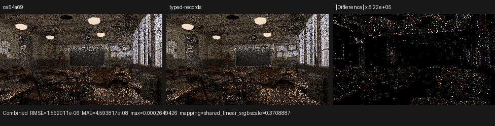
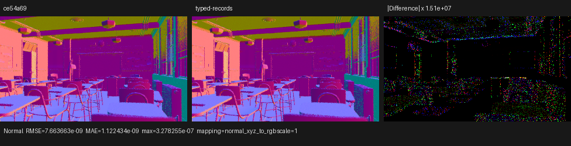
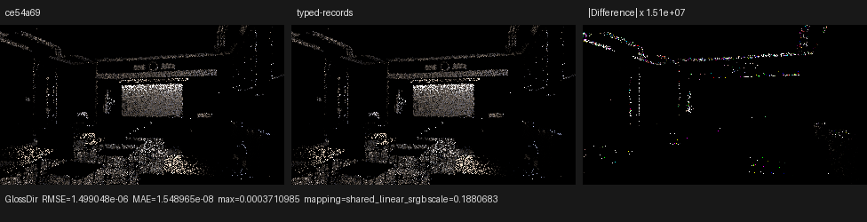

# Cycles-style typed SVM records

This checkpoint moves finite shader-node modes out of Psycles' host/JIT
evaluator identity and into the compact program instruction. It covers
Fresnel, Layer Weight, Gradient, Noise, Wave, Normal Map, and Bump. A material
graph still crosses the Blender boundary as its original node graph and
closures; no value, texture, BSDF, or closure is baked by Blender or Cycles.

The reference is Blender/Cycles 5.2 at commit `fbe6228777e7`, specifically:

- `intern/cycles/kernel/svm/svm.h`: a single sequential opcode interpreter;
- `intern/cycles/kernel/svm/util.h`: typed constant-or-stack inputs and typed
  stack loads/stores;
- `intern/cycles/kernel/svm/node_types.h`: typed instruction records;
- `intern/cycles/scene/shader_nodes.cpp`: node modes and flags emitted as data;
- `intern/cycles/scene/svm.cpp`: one-time DAG scheduling, stack allocation, and
  closure jump patching.

Cycles' important architectural boundary is not merely its `switch`: an
opcode selects an implementation, while the typed record supplies authored
mode, flags, inputs, outputs, and resources at run time. For example,
`SVMNodeTexNoise` stores dimensions, noise type, and Normalize; one
`svm_node_tex_noise` reads them. Wave type/directions/profile likewise live in
`SVMNodeTexWave`. Image Box is deliberately a distinct opcode because it has a
different execution shape, whereas ordinary image projections are record
data.

## Formal model

Let an authored value operation be

```text
S = (opcode, result bank, operand-bank vector, resource domain,
     static-table shape, execution-shape fields, finite mode fields).
```

The old compact evaluator identity was approximately `S`; consequently two
instructions with the same implementation but different finite modes could
materialize two large Luisa callables. Define the code-generation projection

```text
pi(S) = (opcode, result bank, operand-bank vector, resource domain,
         static-table shape, execution-shape family).
```

Two instructions share a handler exactly when their projections are equal.
The omitted finite fields are encoded in the instruction immediate and decoded
inside that handler. This is a quotient by equality of `pi`, hence reflexive,
symmetric, and transitive. It is sound if and only if:

1. every semantic field omitted from `pi` is present in the instruction;
2. decode is a left inverse of encode on the legal authored domain;
3. the handler observes the decoded value at every former specialization use;
4. fields that change operand/result representation or resource bindings stay
   in `pi` or select an explicit execution-shape branch.

The serialized-program validator enforces the legal bit domains and checks
that instruction immediates agree with immutable authored metadata. Invalid
dimensions, enum values, unused bits, or mismatched records are rejected. The
topology-expanded diagnostic path remains host-specialized, so the change is
strictly a compact-SVM binding-time transformation.

The packed immediate layouts are:

```text
Noise:     bit 0 Normalize, bits 1..3 dimensions, bits 4..6 noise type
Wave:      bit 0 type, bits 1..2 band direction,
           bits 3..4 ring direction, bits 5..6 profile
NormalMap: existing space/invert/base/tangent configuration through bit 10
Bump:      invert, normal-linked, and object-space flags
```

Wave canonicalizes the direction field that is semantically dead for its
selected type. Noise dynamically selects only the scene-reachable
`(dimensions, type)` execution shapes, while Normalize remains a device
boolean. This keeps Cycles' data-driven semantics without generating dead
algorithm families for a scene.

## Structural result

The number below is the full compact surface semantic-handler census for each
real Blender export. The exact baseline is Psycles `ce54a691ff4c`.

| Scene | Baseline | Typed records | Change |
|---|---:|---:|---:|
| Barbershop | 56 | 54 | -2 |
| Classroom | 33 | 32 | -1 |
| Monster Under the Bed | 30 | 29 | -1 |
| Lone Monk | 37 | 36 | -1 |
| Blender benchmark bundle | 47 | 43 | -4 |
| Flat Archiviz | 40 | 39 | -1 |

On Classroom, an empty-cache HIP A/B produced:

| Main `shade_surface` metric | Baseline | Typed records | Change |
|---|---:|---:|---:|
| Total semantic variants | 37 | 35 | -2 |
| Main HIP code object | 529,016 B | 472,512 B | -10.68% |
| HIP LLVM codegen | 2,909.029 ms | 2,293.501 ms | -21.16% |
| COMGR link | 5,740.233 ms | 4,325.328 ms | -24.65% |

Barbershop is an important counterexample rather than a hidden favorable
selection. Its handler census falls from 61 to 58 total semantic variants and
LLVM codegen falls from 1,565.358 ms to 1,384.330 ms (-11.56%), but the main
object grows from 500,080 B to 507,912 B (+1.57%) and COMGR link rises from
3,817.154 ms to 4,070.968 ms (+6.65%). The remaining scene-specialized dynamic
dispatch trees can therefore still outweigh the removed callable copies. This
is evidence for the next step: one shared opcode/execution-family handler,
rather than stopping at per-instruction variant quotienting.

## Correctness and visual inspection

The compiler regression proves one-handler quotienting for all seven node
families, exact immediate round trips, canonicalization, and rejection of
malformed or metadata-inconsistent programs. An instruction-granularity call
graph test also proves that the compact Bump program calls the typed record
handler rather than reconstructing a host-specialized evaluator.

The strict focused backend matrix passed 29/29 tests on fallback, HIP, and
Vulkan native XIR-to-SPIR-V. Vulkan required native SPIR-V and had DXC disabled.

An exact revision A/B rendered Classroom at 320x180, 4 spp, HIP, with the same
global sample indices. All 15 Combined/Normal/Albedo/light/volume passes were
compared. Representative results are:

| Pass | RMSE | Relative RMSE | Maximum absolute error | Luminance ratio |
|---|---:|---:|---:|---:|
| Combined | 1.56201e-6 | 3.29549e-6 | 2.64943e-4 | 1.0000000700 |
| Normal | 7.66366e-9 | 1.38273e-8 | 3.27826e-7 | -1.0 (signed normal mean) |
| Glossy Direct | 1.49905e-6 | 2.08132e-6 | 3.71099e-4 | 1.0 |
| Diffuse Color | 0 | 0 | 0 | 1.0 |
| Emit | 0 | 0 | 0 | 1.0 |
| Environment | 0 | 0 | 0 | 0 (both black) |
| Volume Direct | 0 | 0 | 0 | 0 (both black) |
| Volume Indirect | 0 | 0 | 0 | 0 (both black) |

`TransDir` has relative RMSE 0.390 only because its reference RMS is roughly
`2.5e-10`; its absolute RMSE is `9.71418e-11`. This is not a structural
transmission difference.

The Combined, Normal, and Glossy Direct triptychs were inspected at full
resolution. Baseline and typed-record images are structurally identical.
Amplified difference panels contain only sparse floating-point/concurrent film
accumulation residuals—no coherent material, UV, normal, geometry, lighting,
or orientation error.







Machine-readable measurements are in [`report.json`](report.json).

The existing 5.2 Barbershop export faults at the first staged surface queue on
both this revision and exact baseline `ce54a691ff4c`; the baseline megakernel
also faults. The export reports missing images. Therefore this checkpoint
makes no Barbershop render-time or image-correctness claim and does not
misattribute that pre-existing scene/runtime failure to typed records.

## Commands

```sh
cmake --build build --parallel 32

LUISA_VULKAN_USE_XIR=1 \
LUISA_VULKAN_REQUIRE_NATIVE_XIR_SPIRV=1 \
LUISA_VULKAN_DISABLE_DXC=1 \
ctest --test-dir build --output-on-failure --parallel 1 \
  -R 'psycles\.(surface_program_metadata|surface_svm_(math_immediate|vector_math_immediate|record_immediates)|normal_map_semantics|luisa_(compact_surface_preparation|surface_mix_svm|surface_math_svm|surface_vector_math_svm|normal_map|normal_map_callable|bump_callable|noise_callable)_(fallback|hip|vk))$'

psycles_render_blender_scene <classroom-export> baseline.exr hip \
  320 180 4 4 - 0 0 0 0 4 - 1 0 wavefront-staged

psycles_render_blender_scene <classroom-export> typed-records.exr hip \
  320 180 4 4 - 0 0 0 0 4 - 1 0 wavefront-staged

python tools/compare_cycles.py baseline.exr typed-records.exr \
  --cycles-label baseline --psycles-label typed-records \
  --output-dir <comparison-directory>
```
