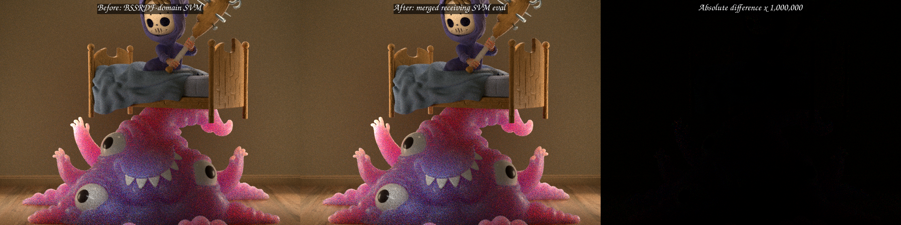
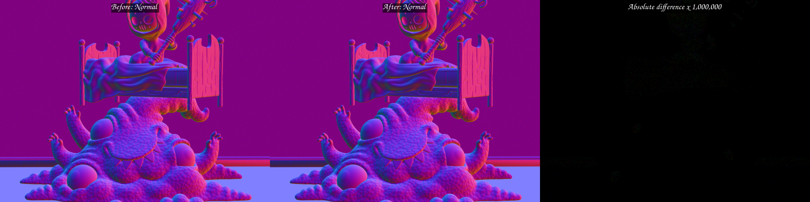
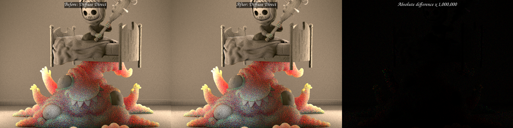

# Direct-light receiving SVM merge

This checkpoint removes a remaining source of scene-dependent shader expansion
from surface next-event estimation. The environment, emissive-triangle, and
analytic-light providers previously each recorded the complete receiving
surface evaluator. For a compact surface program this meant that the same SVM
value walk and closure evaluation appeared once per emitter kind in the HIP
module, even though the light distribution selects exactly one kind.

The accepted implementation records emitter-specific proposal work first,
merges the proposal into one typed `DirectLightSampleState`, evaluates the
receiving surface exactly once, and then performs emitter-specific deferred
emission. Raw Cycles closures remain represented by the Psycles surface
program; no material, emission, or BSDF value is baked by Blender/Cycles or by
the exporter.

The reference is Blender/Cycles 5.2.0 LTS. In particular, the state boundary
follows `intern/cycles/kernel/light/common.h` (`LightSample`), the ordering in
`intern/cycles/kernel/integrator/shade_surface.h`, and the on-demand emitter
reconstruction in `intern/cycles/kernel/integrator/shade_light.h`.

## Formal model

Let `K` be the selected `LightDistributionEmitterKind` and let `E` be the set
of compiled providers. Provider `e` accepts a proposal only under

```text
A_e = (K = e) and valid_e .
```

For distinct `e1` and `e2`, `(K = e1) and (K = e2)` is false. Therefore the
accept predicates are pairwise disjoint and the merged light state is the
well-defined partial phi

```text
L = phi { L_e under A_e | e in E } .
```

`L.valid` is false when the phi has no incoming accepted value. The receiving
evaluation is consequently recorded once as

```text
R = L.valid ? evaluate_receiving_surface(L.direction, L.shader_flags) : 0.
```

Each non-constant emitter shader is evaluated afterwards under
`A_e and any(R.f != 0)`. Constant emission remains before `R`, matching the
Cycles ordering. Final MIS and transport use the merged PDF, the provider's
original normalization PDF, and the same constant/deferred-emission factor as
the pre-merge implementation.

The state is a host/JIT aggregate of typed Luisa expressions, not a device ABI
or a weak float register file. The mesh provider retains only emitter identity,
position, barycentrics, direction, and distance across the merge. It
reconstructs geometric shader data on demand before evaluating the original
emission closure. Inspection of `_evaluate_emission` proves that its light-side
inputs are contained in that projection. Analytic lights similarly re-read the
selected `LightGpu`; environment emission needs only the selected direction.

## Rejected representations

The first implementation carried each provider's full proposal object across
the common receiving evaluation. It was semantically valid but failed the
lifetime objective:

| Metric | Committed BSSRDF-domain SVM | Full proposal merge | Change |
|---|---:|---:|---:|
| Coroutine frame | 496 B / 120 fields | 904 B / 221 fields | +82.26% |
| Main HIP code object | 335,808 B | 348,736 B | +3.85% |
| Main LLVM codegen | 704.709 ms | 731.671 ms | +3.83% |
| Main COMGR link | 2,076.120 ms | 2,817.282 ms | +35.70% |
| Complete shader JIT | 10.5959 s | 11.2430 s | +6.11% |

This negative result is why the final design uses the compact sufficient
projection above. Its frame is exactly the original 496 B / 120 fields.

A second experiment replaced the provider guards after the merge with one
explicit DSL `switch(K)`. That equivalent syntax produced a 324,032 B code
object, 717.619 ms LLVM codegen, 1,954.656 ms COMGR link, and 10.2336 s total
JIT. All were worse than the retained compact guarded form, so the switch was
reverted. The result is a useful compiler/code-shape observation, not a
semantic special case in production code.

## HIP code size and cold compilation

The real-renderer test is the official **Monster Under the Bed** scene,
exported from the original blend with Blender 5.2.0 LTS. The source SHA-256 is
`9463082f8d365ad8ae19c1ba86429deb3b532c5a2d0db0b9492c3c759f64d28d`.
The device is an AMD Radeon RX 9070 XT (`gfx1201`). Both primary runs used an
empty Luisa shader cache and separate empty COMGR caches.

| Main `shade_surface` metric | BSSRDF-domain SVM | Receiving SVM merge | Change |
|---|---:|---:|---:|
| Generated AMDGPU blob | 394,120 B | 379,912 B | -3.60% |
| HIP code object | 335,808 B | 323,776 B | -3.58% |
| Largest callable | 213,512 B | 201,552 B | -5.60% |
| LLVM codegen | 704.709 ms | 670.986 ms | -4.79% |
| COMGR link | 2,076.120 ms | 1,882.738 ms | -9.31% |
| Complete Luisa shader JIT | 10.5959 s | 9.78857 s | -7.62% |
| Kernel private segment | 7,248 B | 7,216 B | -32 B |
| Coroutine frame | 496 B / 120 fields | 496 B / 120 fields | unchanged |

The final clean rebuild reproduced the exact 379,912 B blob, 323,776 B code
object, 201,552 B largest callable, 7,216 B private segment, and structural
hash `484043ee276065db`. Its timing-only repeat was 693.131 ms LLVM,
1,894.642 ms COMGR, and 10.3305 s total JIT, illustrating host/cache noise while
the structural measurements remain exact.

Relative to the earlier global-domain Monster SVM checkpoint, the cumulative
main-kernel reductions are 28.21% in code-object size, 25.29% in LLVM codegen,
31.56% in COMGR link, and 18.17% in complete shader JIT. The independent
Barbershop canonical-SVM result remains a 13.96% code-object, 21% LLVM, and
26.7% COMGR reduction. These measurements support SVM as a compiler-size and
compile-latency architecture, not only as a runtime material interpreter.

## Render-only result

Five warm-cache 640x480, 64 spp, `wavefront-staged` runs were measured on each
side:

| Route | Samples (seconds) | Median | Mean |
|---|---|---:|---:|
| BSSRDF-domain SVM | 1.93671, 1.93806, 1.93327, 1.93540, 1.93697 | 1.93671 s | 1.93608 s |
| Receiving SVM merge | 1.95178, 1.95113, 1.94965, 1.94894, 1.95157 | 1.95113 s | 1.95061 s |

The retained version is **0.74% slower** by median in this run. The compile and
code-size improvement is therefore not reported as a render-time speedup. The
small runtime cost is consistent with reconstructing the selected emitter's
compact light-side state; an explicit switch did not remove it and was worse
for compilation as well. A callable ABI was not forced and no `noinline`
policy was introduced; LLVM retains ownership of inlining decisions.

## Regression and visual validation

The focused matrix passed 23/23 tests in 4.23 seconds. It includes a structural
host/JIT counter proving that the receiving evaluator body is recorded once,
a four-way one-hot state test, the surface-program/closure tests, and fallback,
HIP, and strict native Vulkan XIR-to-SPIR-V execution. Vulkan ran with DXC
disabled.

An additional 15-test forward/emissive/environment/surface-NEE matrix passed
14/15. The only failure was the pre-existing strict-XIR Vulkan full-spread
area-light absolute oracle (`0.217716` versus `0.218085` in the first mean
channel). Rebuilding and running commit `8701501` produced the same three means
and three sampled pixel values exactly, so this is a negative control rather
than a merge regression. No tolerance or backend special case was changed.

The complete 46-channel 640x480 EXRs use the identical global sample range
`[0, 64)`. `idiff -v -fail 0.0001 -failpercent 0.001` reports mean error
`1.42745e-9`, RMS `8.45294e-9`, maximum `2.38419e-6`, three pixels over
`1e-6`, and zero pixels over `1e-4`.

| Pass | Mean error | RMS error | Maximum error |
|---|---:|---:|---:|
| Combined | 2.69777e-9 | 7.45603e-9 | 4.76837e-7 |
| Normal | 8.25675e-10 | 7.18299e-9 | 2.38419e-7 |
| Diffuse Direct | 7.40832e-9 | 1.83848e-8 | 9.53674e-7 |

All three original-resolution triptychs were inspected manually. Geometry,
silhouettes, normals, material regions, direct-light placement, and BSSRDF
appearance agree. The difference panels are amplified by one million and show
only sparse floating-point speckles, with no coherent material, UV, lighting,
or topology difference.







The machine-readable measurements are in [`report.json`](report.json).

## Commands

```sh
cmake --build build --parallel 32

LUISA_VULKAN_USE_XIR=1 \
LUISA_VULKAN_REQUIRE_NATIVE_XIR_SPIRV=1 \
LUISA_VULKAN_DISABLE_DXC=1 \
ctest --test-dir build --output-on-failure -j 1 \
  -R 'psycles\.(luisa_direct_lighting_plan_(fallback|hip|vk)|surface_program_metadata|surface_closure_execution_plan|luisa_(surface_closure_collection|surface_population|compact_surface_preparation|principled_setup_callable|principled_thin_wall|subsurface_exit)_(fallback|hip|vk))$'

PSYCLES_DISABLE_SHADER_CACHE=1 \
AMD_COMGR_CACHE_DIR=<empty-comgr-cache> \
LUISA_DUMP_HIP_ISA=<empty-isa-directory> \
LUISA_CORO_SHADER_MAP=1 \
LUISA_CORO_DUMP_FRAME_LAYOUT=1 \
psycles_render_blender_scene <monster-5.2-export> out.exr hip \
  64 64 1 1 - 0 0 0 0 1 - 1 0 wavefront-staged

psycles_render_blender_scene <monster-5.2-export> out.exr hip \
  640 480 64 64 - 0 0 0 0 64 - 1 0 wavefront-staged
```
