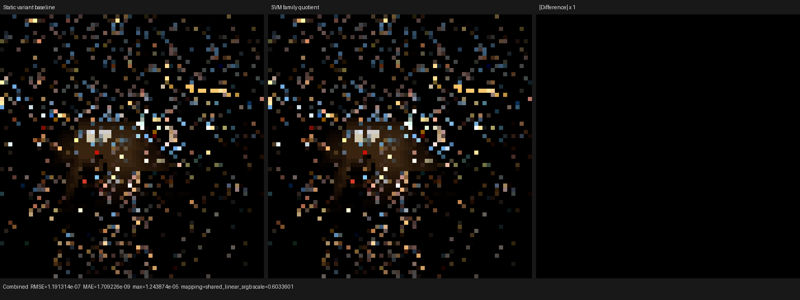
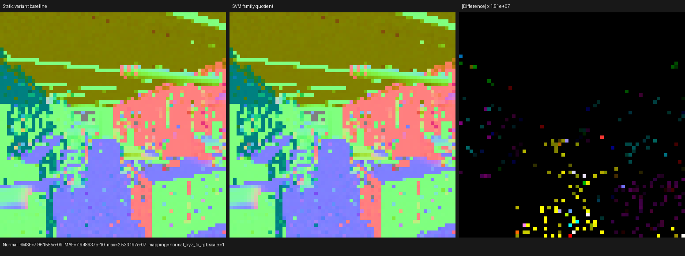
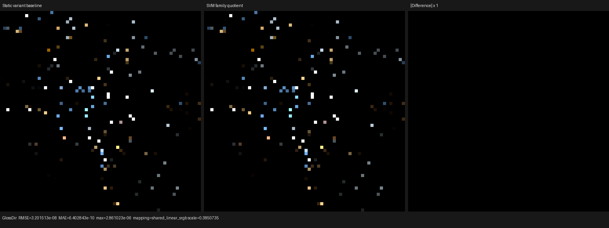

# Image SVM execution-family validation

This checkpoint moves the complete immutable Mapping and Image Texture
configuration into the surface-value bytecode immediate, while retaining only
the Image Texture execution shape that changes the Luisa AST in the host/JIT
variant key. It is based on direct inspection of Blender/Cycles 5.2 source at
commit `fbe6228777e7`.

## Cycles source model

Cycles uses one sequential interpreter over the scene-wide `svm_nodes` array:

- `intern/cycles/kernel/svm/svm.h` owns the interpreter loop and prunes unused
  handlers with the scene-wide `kernel_data_svm_usage_*` constants.
- `intern/cycles/kernel/svm/node_types.h` defines typed node records rather
  than compiling one shader graph into the kernel AST.
- `intern/cycles/scene/svm.cpp` emits nodes in Sethi-Ullman order, embeds
  constant float inputs in `SVMInputFloat`, assigns stack offsets only to live
  linked values, and reuses each offset after its last consumer.
- `intern/cycles/scene/shader_graph.cpp` performs constant folding, settings
  simplification, and bottom-up exact node deduplication before bytecode
  emission.
- `intern/cycles/scene/shader_nodes.cpp` emits `NODE_TEX_IMAGE_BOX` separately
  from `NODE_TEX_IMAGE`. Both records carry Color and Alpha output offsets.
- `intern/cycles/kernel/svm/image.h` samples a regular image once and stores
  every live output. The BOX handler is separate because it computes
  object-space normal weights and may issue three texture samples.

Psycles keeps its typed scalar/vector/unsigned-integer banks and exact interval
coloring; adopting Cycles' untyped 255-float stack would be a regression. The
useful structural lesson is the data-driven interpreter and typed multi-output
records, not that particular stack representation.

## Formal partition

Let `I` be the complete validated immutable configuration of one value
instruction and let `F(I)` be the Luisa evaluator AST family selected for it.
Two configurations share a host/JIT variant exactly when their opcode, result
and operand types agree and `F(I1) = F(I2)`.

For Mapping, every valid mapping mode and axis permutation has one evaluator
family; the device immediate carries the two-bit mode and six-bit axis map. For
Image Texture, `F(I)` is BOX exactly when the projection is BOX, and is regular
for FLAT, SPHERE, and TUBE. Environment Texture remains a different opcode.
The 14-bit image immediate carries extension, sRGB decoding, alpha
unassociation, interpolation, and exact projection.

This quotient is semantics-preserving because:

1. lowering rejects values outside each opcode's finite immediate domain;
2. executable-scene validation recomputes the immediate from immutable metadata
   and requires exact equality;
3. runtime switches are generated only for exact immediate values reachable in
   the scene;
4. the host family selects only a different AST subgraph, while all observable
   configuration remains device data;
5. BOX is not merged with the regular family because its normal-weighted
   multi-sample evaluator is structurally different, matching Cycles'
   `NODE_TEX_IMAGE_BOX` split.

## Performance

The HIP measurements use the same 640x480, 64 spp benchmark scene and the main
surface kernel. Render times are single warm samples, so small timing deltas are
directional rather than a final scene benchmark.

| Design | Scene variants | Code object | LLVM | COMGR | Render | Private | SGPR spills | VGPR spills |
| --- | ---: | ---: | ---: | ---: | ---: | ---: | ---: | ---: |
| Per-program callable baseline (`d338a936`) | 112 | 502,296 B | 1329.27 ms | 3670.68 ms | 3.54744 s | 5888 B | 43 | 423 |
| Mapping/Image fully merged | 77 | 562,328 B | 1509.87 ms | 3617.35 ms | 3.48964 s | 5360 B | 44 | 451 |
| BOX/regular execution families | 79 | 514,712 B | 1381.23 ms | 3858.40 ms | 3.46847 s | 5600 B | 42 | 412 |

Separating BOX from the regular image family reduces the code object by 47,616
bytes (8.47%), LLVM time by 128.64 ms (8.52%), and VGPR spills by 39 relative
to the fully merged experiment. It retains the runtime benefit over the
per-program baseline, but final object size and compile time remain slightly
above that baseline. COMGR variance needs repeated cold trials before it is
treated as a regression or improvement.

A separate experiment placed every value opcode behind a Luisa `Callable`.
Passing `SurfacePoint` by reference reduced pre-optimization LLVM IR from
28.35 MB to 14.70 MB, proving aggregate-by-value ABI expansion was real.
However, callable boundaries prevented enough specialization of the shared
root/normal/height handlers: final IR grew to 5.99 MB, the object to 733,640 B,
and render time to 3.63 s. The experiment was reverted. No manual `noinline`
attribute was introduced.

## Correctness matrix

The focused build used all 32 host threads:

```text
cmake --build build --parallel 32 --target \
  psycles_surface_program_metadata_tests \
  psycles_luisa_compact_surface_preparation_tests \
  psycles_render_blender_scene
```

The metadata/unit test and compact surface preparation passed on fallback and
HIP. Vulkan passed only through the strict native path:

```text
LUISA_VULKAN_USE_XIR=1 \
LUISA_VULKAN_REQUIRE_NATIVE_XIR_SPIRV=1 \
LUISA_VULKAN_DISABLE_DXC=1 \
build/bin/psycles_luisa_compact_surface_preparation_tests vk
```

The post-cleanup CTest matrix covered compact surface preparation, texture
sampling callables, vector mapping callables, shader-table callables, and
surface-program metadata on every applicable backend. All 13 tests passed.

The 64x64, 1 spp all-pass comparison against the pre-change executable produced
46 matching channels: mean absolute error `8.41952e-10`, RMS `1.58934e-7`, and
maximum error `6.17951e-5` in Diffuse Indirect. Five pixels exceeded `1e-6` and
none exceeded `1e-4`. These are sparse floating-point ordering differences,
not a structured image change. The machine-readable pass report is in
[`report.json`](report.json).

## Visual inspection

All triptychs are reference, current, and amplified absolute difference. The
Combined, Normal, and Glossy Direct images are visually identical; only sparse
ULP-scale Normal speckles become visible after a `15099494.4x` difference
amplification. No material, UV, normal-orientation, or geometry pattern changed.







## Next structural step

Cycles' image records write Color and Alpha from one texture fetch. Psycles
currently lowers graph outputs as separate value instructions, so a graph that
uses both outputs can repeat projection and sampling. The next SVM change should
therefore add typed multi-result records with an explicit live-output mask,
then extend liveness and stack allocation to multiple definitions. That change
must be driven by a scene census and must preserve read-before-write and
last-consumer reuse invariants.
