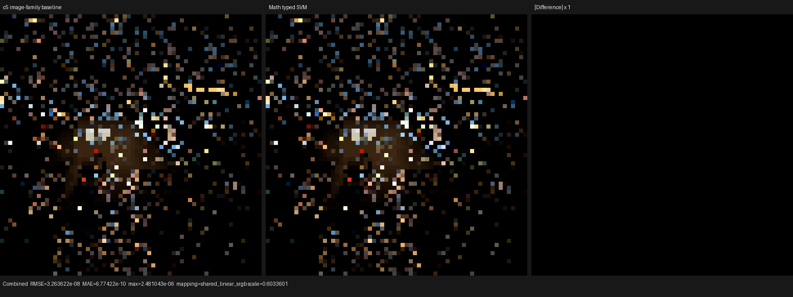
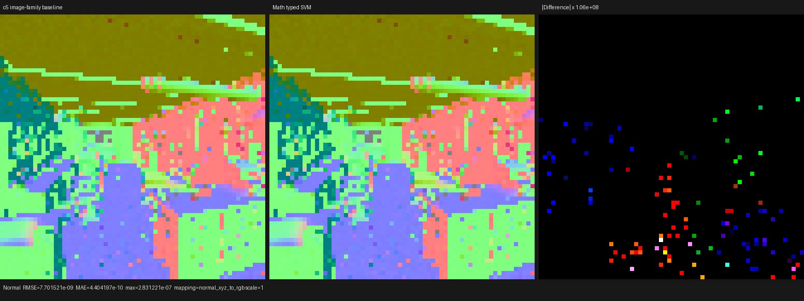
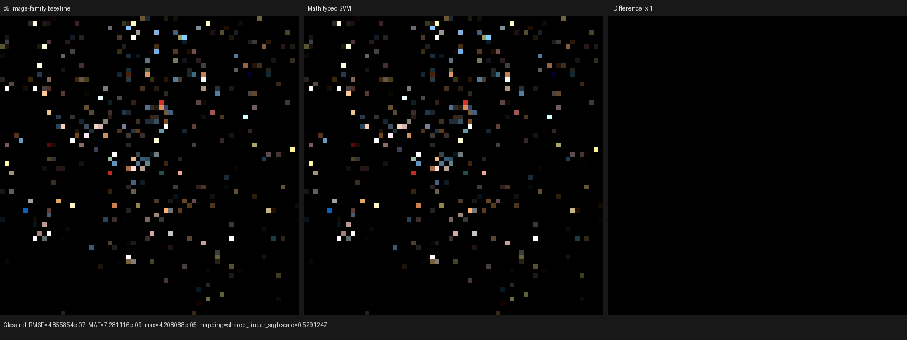

# Typed Math SVM handler

This checkpoint makes the Math operation device data instead of part of the
host/JIT surface-variant identity. Every compact Math instruction retains its
exact authored operation in the bytecode immediate, while one typed Luisa
callable interprets the exact set of operations reachable by the scene.

On the official Blender 5.2 Barbershop export, this removes six surface
variants, reduces the main HIP code object by 14,024 B (2.72%), and reduces
COMGR time by 6.61%. Five warm 640x480, 64 spp renders are runtime-neutral
within measurement noise (+0.24% versus the single exact-baseline sample).
No callable is manually marked `inline` or `noinline`.

Raw shader graphs, texture inputs, and closure parameters still cross the
Blender boundary. No material, texture, BSDF, closure, or lighting result is
baked or pre-evaluated.

## Cycles 5.2 source model

The implementation was derived from the structure of Cycles 5.2 at commit
`fbe6228777e7`, not from a per-test patch:

- `intern/cycles/scene/shader_graph.cpp` constant-folds, simplifies settings,
  and deduplicates nodes bottom-up. Equality checks the exact node type, bump
  mode, unlinkable values, unlinked defaults, and linked producer sockets.
- `intern/cycles/scene/svm.cpp` schedules each dependency DAG with a
  Sethi-Ullman heuristic, embeds unlinked scalar/vector constants directly in
  `SVMInputFloat`/`SVMInputFloat3`, allocates stack slots only for linked live
  values, and frees a producer after its last unscheduled consumer.
- `intern/cycles/scene/shader_nodes.cpp` emits one typed `SVMNodeMath` record.
  Its `math_type` remains data; the graph does not create a different GPU
  function for every Math mode.
- `intern/cycles/kernel/svm/svm.h` runs one sequential interpreter over the
  scene-wide `svm_nodes` array. `intern/cycles/kernel/svm/math.h` loads the
  typed Math operands and dispatches the mode in `svm_math`.
- `intern/cycles/scene/svm.cpp` compiles a closure tree with conditional jumps.
  Shared dependencies are emitted before the branch; only the selected closure
  branch and its exclusive dependencies execute. Cycles therefore does not
  eagerly populate every closure leaf.
- `SVMNodeVectorMath` owns both scalar and vector result offsets, and its kernel
  handler stores only the outputs whose offsets are valid. This is the model
  for the next Psycles multi-result step.

Cycles HIP currently gives SVM node handlers an explicit `__noinline__` and
compiles with `-ffast-math`. Psycles intentionally does not copy the manual
inlining policy: Luisa and LLVM retain the normal per-call-site decision. The
portable structural result adopted here is a typed data-driven handler with a
scene-pruned opcode domain. Psycles also retains separate typed scalar, vector,
and unsigned-integer banks instead of copying Cycles' untyped 255-float stack.

## Formal quotient

Let a validated compact Math instruction be

```text
I = (math_mode, a, b, c, dst).
```

The observable instruction semantics remain

```text
Eval(I, state) = state[dst <- Math[math_mode](state[a], state[b], state[c])].
```

Let `D` be the exact finite set of Math immediates reachable by one executable
surface scene and define

```text
P(D)[m] = exists i in D such that i.math_mode = m.
```

The host/JIT variant key erases `math_mode`; the instruction immediate does
not. The callable AST is a pure function of `P(D)` and records exactly one
switch case for each reachable operation. Its typed signature is

```text
(uint math_mode, float a, float b, float c) -> float result.
```

This construction has the following invariants:

- **Semantic preservation:** lowering stores the exact mode and runtime
  evaluation uses that immediate to select the same Math formula.
- **Domain closure:** every emitted instruction mode is contained in `D`, so a
  valid program cannot reach the callable's unreachable default.
- **Canonical sharing:** duplicate modes and domain order do not change
  `P(D)`, so independently constructed equal handlers have the same full Luisa
  AST hash and deduplicate.
- **Hash completeness:** different reachable operation sets record different
  switch cases and therefore different AST hashes. The regression explicitly
  checks both equal-domain sharing and unequal-domain separation.
- **Validation before execution:** invalid modes, reserved static bits, and
  metadata/immediate disagreement are rejected before shader recording.

The statically expanded graph route and compact SVM route call the same
`evaluate_surface_math_operation` component, avoiding two independently
maintained formula tables.

## Real-scene census

The inspector counts exact semantic variants before and after quotienting Math
mode out of the host/JIT identity. Serialized bytecode size is unchanged because
the operation remains instruction data.

| Blender 5.2 scene | Baseline value variants | Typed-Math value variants | Math variants | Scene bytecode |
|---|---:|---:|---:|---:|
| Barbershop | 72 | 67 | 6 -> 1 | 222,320 B |
| Classroom | 39 | 35 | 5 -> 1 | 21,896 B |
| Monster Under the Bed | 34 | 31 | 4 -> 1 | 8,412 B |
| Lone Monk | 42 | 41 | 2 -> 1 | 16,108 B |

The full Barbershop renderer reports 79 semantic surface variants before this
change and 73 after it. A separate producer census found no reachable image
node with both Color and Alpha outputs live in these four exports, so image
multi-result fusion was not added speculatively.

## HIP compiler and runtime A/B

The exact baseline is commit `c5c8fa49`, measured from a clean worktree with
the same Psycles/Luisa runtime, Blender 5.2 export, RX 9070 XT (`gfx1201`),
640x480 resolution, 64 spp, and `wavefront-staged` configuration.

| Main `shade_surface` metric | Exact baseline | Typed Math SVM | Change |
|---|---:|---:|---:|
| Semantic surface variants | 79 | 73 | -7.59% |
| Generated AMDGPU blob | 551,580 B | 534,168 B | -3.16% |
| HIP code object | 514,712 B | 500,688 B | -2.72% |
| LLVM IR before optimization | 15,382,756 B | 15,312,964 B | -0.45% |
| LLVM IR after optimization | 4,601,596 B | 4,475,401 B | -2.74% |
| Final LLVM IR | 4,602,013 B | 4,475,785 B | -2.74% |
| HIP LLVM codegen | 1,381.227 ms | 1,410.831 ms | +2.14% |
| COMGR | 3,858.396 ms | 3,603.520 ms | -6.61% |
| Private segment | 5,600 B | 5,440 B | -2.86% |
| SGPR spills | 42 | 44 | +2 |
| VGPR spills | 412 | 422 | +10 |

The code-object and IR reductions are deterministic structural wins. The LLVM
and COMGR timings are one cold sample each and are reported without hiding the
LLVM regression. Five warm typed-Math render samples were 3.47540, 3.47461,
3.47766, 3.48097, and 3.47517 seconds (median 3.47540 s, mean 3.47676 s). The
exact baseline sample was 3.46847 s, a +0.24% delta that is too small to treat
as a runtime regression or improvement.

## Correctness and visual inspection

A 64x64, one-sample Barbershop EXR was compared against the exact pre-Math
baseline for Combined, Normal, Albedo/color, every direct/indirect light pass,
Emission, Environment, transmission, and volume passes. All 46 compared
channels have finite values and no structured difference.

Combined RMSE is `3.26362e-8` with luminance ratio exactly 1. Normal RMSE is
`7.70152e-9`; its amplified panel contains only isolated ULP-scale pixels.
Glossy Indirect RMSE is `4.85585e-7` with luminance ratio `1.00000010` and no
visible difference at the percentile-selected display scale. Emission,
Environment, all transmission passes, and both volume passes are bit-exact.
The complete per-pass measurements are in [`report.json`](report.json).

The three triptychs were inspected visually. The baseline and current panels
match in material placement, UV/texture structure, normals, geometry,
lighting, and orientation; there is no coherent residual in any difference
panel.







## Backend regression matrix

The focused matrix passes 11/11 tests on fallback, HIP, and Vulkan. Vulkan is
required to take the native AST-to-XIR-to-SPIR-V route with DXC disabled. The
Math backend test covers all 41 operations, compares the shared dynamic handler
with statically selected evaluation, checks callable deduplication/hash
separation, and bounds the generated XIR size.

```sh
cmake --build build --parallel 32

LUISA_VULKAN_USE_XIR=1 \
LUISA_VULKAN_REQUIRE_NATIVE_XIR_SPIRV=1 \
LUISA_VULKAN_DISABLE_DXC=1 \
ctest --test-dir build --output-on-failure --parallel 1 \
  -R 'psycles\.(surface_program_metadata|surface_svm_math_immediate|luisa_(compact_surface_preparation|surface_mix_svm|surface_math_svm)_(fallback|hip|vk))$'
```

The cold HIP structural measurement disables both persistent shader caching
and COMGR caching and requests the actual LLVM and ISA dumps:

```sh
PSYCLES_DISABLE_SHADER_CACHE=1 \
AMD_COMGR_CACHE_DIR=<empty-comgr-cache> \
LUISA_DUMP_HIP_ISA=<empty-isa-directory> \
LUISA_DUMP_LLVM_IR=1 \
LUISA_CORO_SHADER_MAP=1 \
LUISA_CORO_DUMP_FRAME_LAYOUT=1 \
./build/bin/psycles_render_blender_scene \
  /var/tmp/psycles-official-redownload-20260814/exports/barbershop-5.2 \
  out.exr hip 640 480 64 64 - 0 0 0 0 64 - 1 0 \
  wavefront-staged 32 32768 32 1 1 0 4 2 4096 0 0 0 1 1048576
```

## Next structural step

Math proves that one opcode family can become device data without duplicating
its formula implementation. The next step is VectorMath: move its mode into
the same validated immediate/domain scheme and model its scalar/vector outputs
as one typed multi-result instruction with an explicit live-output mask, as
Cycles does. This must be followed by whole-graph typed SVM interpretation so
the outer per-variant dispatch disappears instead of accumulating nested
switches.
