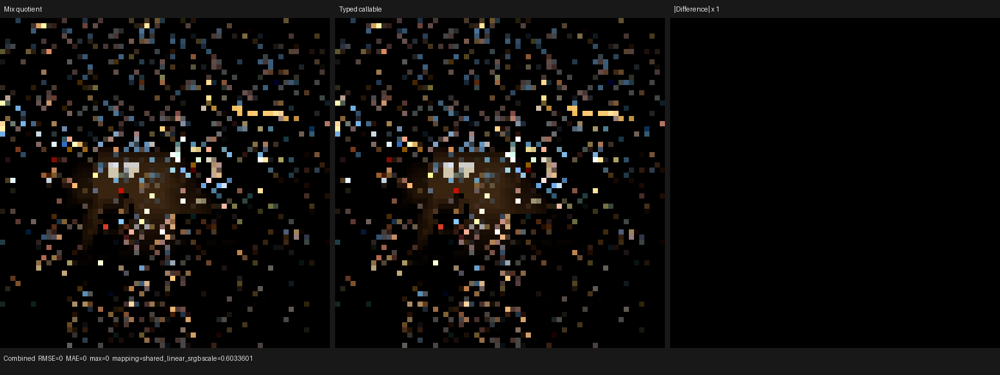
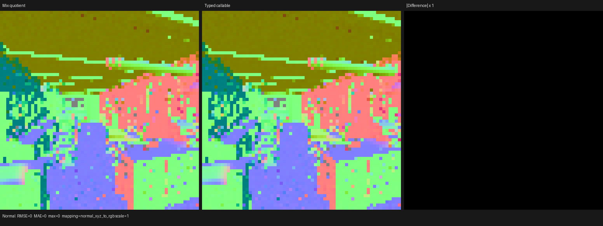
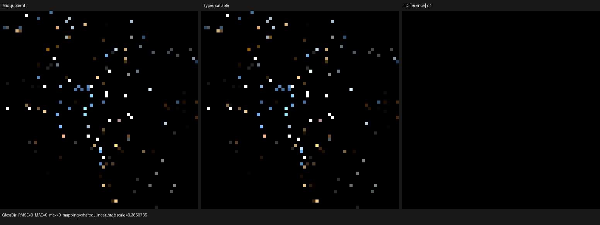

# Typed callable sharing for the Mix SVM

This checkpoint separates two concerns that were still coupled after Mix modes
were quotiented into the compact surface instruction immediate:

1. the material program has one semantic SVM variant for every Mix mode and
   clamp combination; and
2. every physical surface evaluator records the same Mix interpreter body.

The first property was established by the preceding checkpoint. This change
establishes the second by recording Mix evaluation as a typed Luisa callable.
Independently constructed callables with the same reachable operation domain
have the same complete AST hash and are deduplicated. No callable is annotated
`inline` or `noinline`; HIP LLVM retains the normal inlining decision.

On the official Blender 5.2 Barbershop scene, the cumulative Mix SVM change
reduces the main HIP code object from 543,928 B to 520,416 B (-4.32%). Relative
to the immediate-only checkpoint, callable sharing removes another 984 B,
reduces two-run mean LLVM code generation by 3.36%, and reduces mean COMGR link
time by 1.17%.

Raw surface programs and Cycles closure parameters still cross the Blender
boundary. No texture, material, BSDF, closure, or lighting result is baked or
pre-evaluated.

## Formal model

Let a Mix bytecode instruction carry

```text
I = (op, clamp_factor, clamp_result)
```

where `op` occupies bits 0 through 4, `clamp_factor` bit 5, and
`clamp_result` bit 6 of the 14-bit instruction immediate. Let `D` be the exact
set of Mix immediates reachable by one surface evaluator. Define the canonical
operation projection

```text
O(D)[i] = exists x in D such that x.op = i .
```

The callable AST is a pure function of `O(D)` and the typed shader-service
interface. It contains exactly one switch case for every true element of
`O(D)`. Clamp flags remain instruction data and are decoded inside that body.
The callable argument and result types are

```text
(uint immediate, float factor, float3 a, float3 b) -> float3 result.
```

This construction has two useful properties:

- **Soundness:** every reachable instruction has its operation in `O(D)`, so
  its original Mix formula and both authored clamp flags are evaluated.
- **Canonical physical sharing:** duplicate/order differences in `D` collapse
  to the same Boolean projection and therefore the same AST. A genuinely
  different reachable operation set produces a different switch and hash.

The host validator rejects any immediate with a foreign bit or an operation
outside the exhaustive `BlendOperation` range before recording the callable.
The compiler already validates the exact instruction-domain metadata. Thus the
callable does not weaken serialized-program validation or rely on a hash input
that was omitted from the AST.

The regression constructs two callables independently. Equal domains must
produce exactly one root custom callable; replacing the second domain by the
Mix-only domain must produce two. Both shapes are then compiled with shader
caching disabled, so this tests structural Luisa deduplication and the real
backend route rather than a persistent-cache hit.

## Structural HIP result

The cold structural dump used an RX 9070 XT (`gfx1201`) and the official
Barbershop blend, SHA-256
`95972b56180462cac47ec82f3a755bd9111ec18ca37a6196a319c013db994130`,
exported with Blender 5.2.0 LTS.

| Main `shade_surface` metric | Before Mix SVM | Immediate quotient | Typed callable | Cumulative change |
|---|---:|---:|---:|---:|
| Generated AMDGPU blob | 582,988 B | 552,928 B | 553,080 B | -5.13% |
| HIP code object | 543,928 B | 521,400 B | 520,416 B | -4.32% |
| Private segment | 6,000 B | 6,032 B | 6,016 B | +16 B |
| LLVM IR before optimization | n/a | n/a | 17,268,471 B | n/a |
| LLVM IR after optimization | n/a | n/a | 4,455,102 B | n/a |
| Final LLVM IR | n/a | n/a | 4,455,486 B | n/a |

The generated pre-link blob grows by 152 B relative to the immediate-only
checkpoint, while the linked object shrinks by 984 B; both are reported rather
than selecting only the favorable measure. The object contains one shared
`surface_mix_svm` device callable (`callable.23`, 1,272 B). LLVM inlines it at
two call sites and retains calls at two others. This directly verifies that
sharing did not impose a global inlining policy.

## Cold compilation

Each typed-callable sample used independent empty Luisa and COMGR caches.

| Main metric | Immediate quotient mean | Typed sample 1 | Typed sample 2 | Typed mean | Change |
|---|---:|---:|---:|---:|---:|
| LLVM codegen | 1,056.640 ms | 1,006.846 ms | 1,035.477 ms | 1,021.162 ms | -3.36% |
| COMGR link | 4,375.330 ms | 4,339.591 ms | 4,308.663 ms | 4,324.127 ms | -1.17% |

Complete shader JIT was 18.2906 s and 17.81 s for the two typed samples. It is
not used as an A/B claim because aggregate JIT includes utility kernels and
host/cache noise; the deterministic code-object size and isolated main-stage
timings are the accepted compiler result.

## Render-only and profiler result

Five warm-cache 640x480, 64 spp, `wavefront-staged` Barbershop runs were
compared with the immediately preceding checkpoint:

| Route | Samples (seconds) | Median | Mean |
|---|---|---:|---:|
| Immediate quotient | 3.94147, 3.93737, 3.94118 | 3.94118 s | 3.94001 s |
| Typed callable | 3.93650, 3.93549, 3.93594, 3.93402, 3.93785 | 3.93594 s | 3.93596 s |

The median improves by 0.13% and the mean by 0.10%; this is effectively runtime
neutral. HIP profiler attribution agrees: 372 `shade_surface` launches fall
from 2,866,904,647 ns to 2,864,147,407 ns (-0.096%). `intersect_closest` and
volume time are unchanged within noise.

This does **not** recover the complete runtime regression introduced by making
the Mix operation device-dynamic. Relative to the former static-operation
profile, `shade_surface` is still 4.41% slower. LLVM inspection explains the
gap: an outer SVM semantic-variant dispatch currently enters a Mix handler that
performs a second ten-way operation switch. Callable sharing removes duplicate
bodies but cannot remove that nested dynamic decision.

The next optimization is therefore a one-level dispatch refinement: preserve
the semantic SVM quotient and clamp flags as data, but let the exact JIT domain
fuse operation selection into the existing outer dispatch. That is a binding-
time refinement, not a return to one semantic variant per clamp combination.

## Rejected correlation specialization

An exact experiment derived the clamp state for each operation from the
authored immediate domain. A clamp was hoisted only when all reachable
instructions agreed; otherwise it remained inside the corresponding operation
case. This was formally sound but made the real code shape worse:

| Metric | Typed callable checkpoint | Correlated-clamp experiment |
|---|---:|---:|
| Main HIP code object | 520,416 B | 522,680 B |
| Warm render samples | 3.93650--3.93785 s | 3.94185, 3.94449, 3.94508 s |

The experiment duplicated non-uniform clamp control across cases and was
reverted. No scene-specific clamp special case remains in production code.

## Correctness and visual validation

The complete 64x64, one-sample Barbershop EXRs were compared against the
immediate-only checkpoint with identical global sample indices. All 15 film
passes are bit-exact: RMSE, mean absolute error, and maximum absolute error are
zero for Combined, Normal, Albedo/color, every direct/indirect light pass,
Emission, Environment, and both volume passes.

Combined, Normal, and Glossy Direct triptychs were inspected at full source
resolution. The before/after panels are visually identical and every
difference panel is black. There is no coherent material, UV, geometry,
normal, light, volume, or orientation difference.







Machine-readable measurements are in [`report.json`](report.json).

The focused compiler/backend matrix passed 10/10 tests. Mix formulas and all
four clamp combinations run on fallback, HIP, and Vulkan. Vulkan was required
to use native AST-to-XIR-to-SPIR-V with DXC disabled; the runtime and static
reference shaders optimized to 3,731 and 2,598 SPIR-V words respectively.

## Commands

```sh
cmake --build build --parallel 32

./build/bin/psycles_luisa_surface_mix_svm_tests fallback
./build/bin/psycles_luisa_surface_mix_svm_tests hip

LUISA_VULKAN_USE_XIR=1 \
LUISA_VULKAN_REQUIRE_NATIVE_XIR_SPIRV=1 \
LUISA_VULKAN_DISABLE_DXC=1 \
LUISA_VULKAN_PROFILE_COMPILATION=1 \
./build/bin/psycles_luisa_surface_mix_svm_tests vk

LUISA_VULKAN_USE_XIR=1 \
LUISA_VULKAN_REQUIRE_NATIVE_XIR_SPIRV=1 \
LUISA_VULKAN_DISABLE_DXC=1 \
ctest --test-dir build --output-on-failure -j 1 \
  -R 'psycles\.(surface_program_metadata|luisa_(compact_surface_preparation|noise_callable|surface_mix_svm)_(fallback|hip|vk))$'

PSYCLES_DISABLE_SHADER_CACHE=1 \
AMD_COMGR_CACHE_DIR=<empty-comgr-cache> \
LUISA_DUMP_HIP_ISA=<empty-isa-directory> \
LUISA_DUMP_HIP_LLVM=<empty-llvm-directory> \
./build/bin/psycles_render_blender_scene \
  /var/tmp/psycles-official-redownload-20260814/exports/barbershop-5.2 \
  out.exr hip 640 480 64 64 - 0 0 0 0 64 - 1 0 wavefront-staged
```
