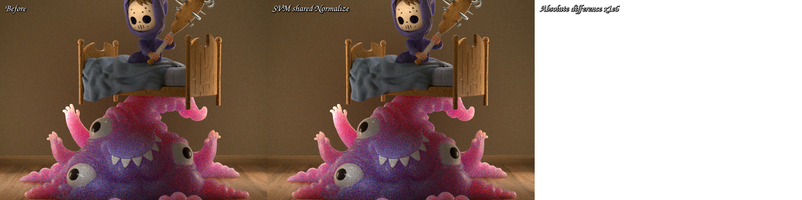
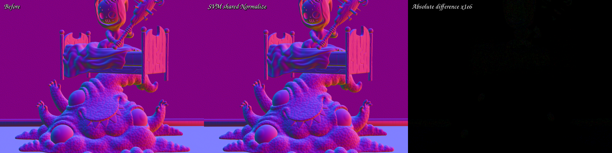
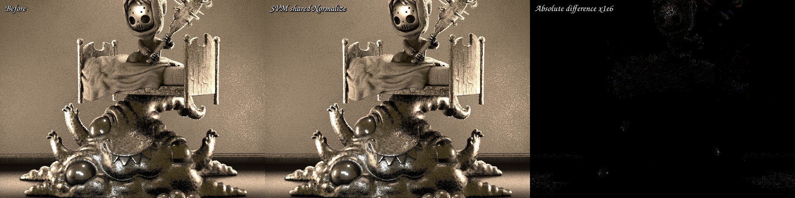

# Noise Normalize SVM quotient

This checkpoint removes a scene-dependent material-code duplicate from the
compact surface interpreter. Monster Under the Bed contains two 3D fBm
`Noise Texture / Fac` semantic variants whose only difference is the Cycles
`Normalize` property. The previous host/JIT binding generated one complete
fBm callable for each value. The retained implementation stores Normalize in
the 16-byte SVM instruction and records one shared fBm loop.

The source scene is the official Monster blend exported with Blender 5.2.0
LTS. Its SHA-256 is
`9463082f8d365ad8ae19c1ba86429deb3b532c5a2d0db0b9492c3c759f64d28d`.
Raw surface programs and closure graphs still cross the Blender boundary; no
material, BSDF, texture, or closure value is baked or pre-evaluated.

## Formal model

For a Noise instruction, write the immutable semantic tuple as

```text
K = (operation, result type, dimensions, fractal type, Normalize,
     static floats, parameter, operand result types, static-table shape).
```

The low bit of `static_u1` is `Normalize`; bits 8 through 15 are the fractal
type. Define `K1 ~ K2` exactly when every component except Normalize is equal.
This is an equivalence relation. The compact evaluator is keyed by the
quotient `K / ~`, while each bytecode instruction carries its original
Normalize bit.

This quotient is sound because Normalize is observed only by fBm's terminal
range mapping. For an octave sum `S`, maximum amplitude `A`, and fractional
octave interpolation, the two alternatives are

```text
F_raw  = S
F_norm = 0.5 * S / A + 0.5
F      = select(F_raw, F_norm, instruction.Normalize)
```

The same selection is applied to the extended fractional-octave sum before
the existing interpolation. Coordinates, dimensions, octave count, signed
Perlin calls, roughness, lacunarity, distortion, fractal type, color/factor
output, and operand types remain static and exact. Other fractal algorithms
continue to ignore Normalize, matching their previous behavior.

The serialized-image validator proves two ownership invariants:

1. the new control bit is legal only for `noise_factor` and `noise_color`;
2. its value must equal the authored low bit in immutable metadata.

The topology-expanded renderer path receives no override and keeps its
original host-specialized callable. Only compact SVM execution passes a device
`Bool` to the shared callable. Thus this is a binding-time change, not an
approximation or a change to exported material semantics.

## Structural result

The real Monster surface runtime changed as follows:

| Metric | Previous SVM | Normalize quotient | Change |
|---|---:|---:|---:|
| Scene semantic variants | 48 | 47 | -1 |
| Population variants | 41 | 40 | -1 |
| Height-domain variants | 23 | 22 | -1 |
| Main AMDGPU blob | 379,912 B | 367,428 B | -3.29% |
| Main HIP code object | 323,776 B | 308,632 B | -4.68% |
| Largest callable | 201,552 B | 199,960 B | -0.79% |
| Private segment | 7,216 B | 7,216 B | unchanged |
| Coroutine frame | 496 B / 120 fields | 496 B / 120 fields | unchanged |

The previous object contained a separate 11,772-byte callable that disappears
after quotienting. The largest remaining callable also shrinks by 1,592 bytes.
Two independent empty-cache builds reproduced the exact 367,428-byte blob,
308,632-byte code object, 199,960-byte largest callable, and shader hash
`9d2a2d1b74f2be4c`.

The final host-only cleanup unified the static and dynamic type/dimension
dispatch trees and passed Normalize by reference. Its main-kernel `.text`
section is byte-identical to the object used for the full image and warm-time
measurements (SHA-256
`b7b9ab4277dd9d27f588363cd92b6f023da8315c83f9e7aa32a58bf4d3695048`),
and its independent 64x64 EXR comparison has zero error in all 46 channels.

The focused XIR shape regression reports:

```text
Runtime Normalize Noise family XIR: 11020, definitions=3, runtime loops=4
```

That kernel uses one dynamically raw/normalized factor output and one color
output. The three definitions are the shared signed-Perlin callable plus one
Noise callable for each statically distinct output kind; dispatching both
Normalize values does not add another callable or loop body.

## HIP compile time

The RX 9070 XT (`gfx1201`) measurements use independent empty Luisa and COMGR
caches. Timing varies measurably even when structural output is byte-identical,
so both samples and their two-run mean are reported rather than selecting only
the favorable run.

| Main `shade_surface` metric | Previous run 1 | New run 1 | Previous run 2 | New run 2 | Two-run mean change |
|---|---:|---:|---:|---:|---:|
| LLVM codegen | 670.986 ms | 656.363 ms | 693.131 ms | 646.003 ms | -4.53% |
| COMGR link | 1,882.738 ms | 1,830.687 ms | 1,894.642 ms | 1,822.843 ms | -3.28% |
| Complete shader JIT | 9.78857 s | 9.82264 s | 10.3305 s | 9.72345 s | -2.85% |

The first full-JIT pair is 0.35% slower despite faster LLVM and COMGR stages;
the second is 5.88% faster. The defensible conclusion is a clear code-size
reduction, a repeatable LLVM/COMGR reduction, and a modest noisy improvement in
aggregate full-JIT time—not a claim that every cold invocation is faster.

Relative to the earlier global-domain Monster SVM checkpoint, the cumulative
main HIP code-object reduction is now 31.57% (451,008 B to 308,632 B).

## Render time

Five warm-cache 640x480, 64 spp, `wavefront-staged` runs were paired with the
immediately preceding revision:

| Route | Samples (seconds) | Median | Mean |
|---|---|---:|---:|
| Previous SVM | 1.95178, 1.95113, 1.94965, 1.94894, 1.95157 | 1.95113 s | 1.950614 s |
| Normalize quotient | 1.94561, 1.94409, 1.94700, 1.94769, 1.94538 | 1.94561 s | 1.945954 s |

The new median is 0.28% faster and the mean is 0.24% faster. This is best
treated as no runtime regression with a small favorable movement; code-object
size and compile latency are the primary result.

## Correctness and visual validation

The compiler regression constructs raw and normalized 3D fBm programs and
proves that they share exactly one semantic evaluator. It also proves that a
different dimension, fractal type, or factor/color output remains distinct,
and that malformed control/metadata combinations are rejected.

Dynamic raw and normalized execution was compared against the original static
specializations on fallback, HIP, and strict native Vulkan XIR-to-SPIR-V.
The full focused matrix passed 26/26 tests. Its first strict-XIR run took
32.47 seconds; the final cached revalidation took 4.29 seconds. Vulkan ran
with XIR enabled, native SPIR-V required, and DXC disabled.

The before/after EXRs use the same 46 channels and global sample range
`[0, 64)`. `idiff -v -fail 0.0001 -failpercent 0.001` passed:

| Pass | Mean error | RMS error | Maximum error | Pixels over 1e-6 |
|---|---:|---:|---:|---:|
| All 46 channels | 1.94244e-10 | 3.52300e-9 | 9.53674e-7 | 0 |
| Combined | 3.16907e-11 | 1.07099e-9 | 2.38419e-7 | 0 |
| Normal | 8.52572e-10 | 7.34268e-9 | 2.38419e-7 | 0 |
| Glossy Direct | 5.03109e-10 | 7.86832e-9 | 9.53674e-7 | 0 |

All three triptychs were inspected at full resolution. The left and center
images are visually indistinguishable. Difference panels are amplified by one
million and contain only sparse ULP-scale speckles on evaluated surfaces, with
no coherent material region, UV, geometry, normal, lighting, or topology
difference.







Machine-readable measurements are in [`report.json`](report.json).

## Commands

```sh
cmake --build build --parallel 32

LUISA_VULKAN_USE_XIR=1 \
LUISA_VULKAN_REQUIRE_NATIVE_XIR_SPIRV=1 \
LUISA_VULKAN_DISABLE_DXC=1 \
ctest --test-dir build --output-on-failure -j 1 \
  -R 'psycles\.(surface_program_metadata|surface_closure_execution_plan|luisa_(noise_callable|direct_lighting_plan|surface_closure_collection|surface_population|compact_surface_preparation|principled_setup_callable|principled_thin_wall|subsurface_exit)_(fallback|hip|vk))$'

PSYCLES_DISABLE_SHADER_CACHE=1 \
AMD_COMGR_CACHE_DIR=<empty-comgr-cache> \
LUISA_DUMP_HIP_ISA=<empty-isa-directory> \
LUISA_CORO_SHADER_MAP=1 \
LUISA_CORO_DUMP_FRAME_LAYOUT=1 \
psycles_render_blender_scene <monster-5.2-export> out.exr hip \
  64 64 1 1 - 0 0 0 0 1 - 1 0 wavefront-staged

psycles_render_blender_scene <monster-5.2-export> out.exr hip \
  640 480 64 64 - 0 0 0 0 64 - 1 0 wavefront-staged
```
