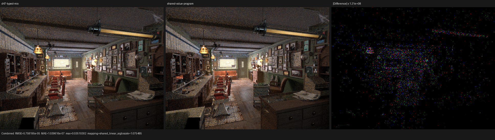
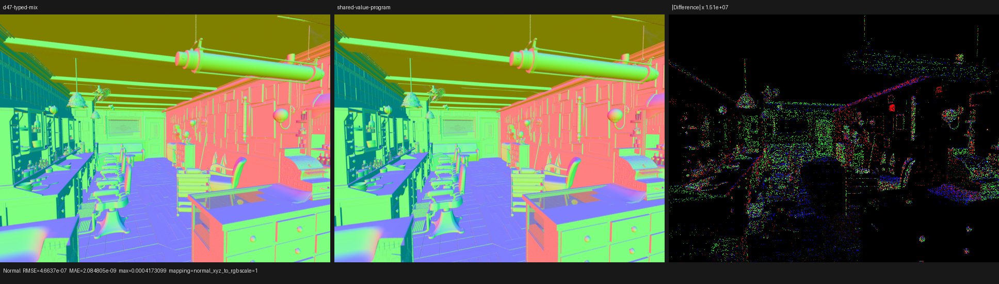
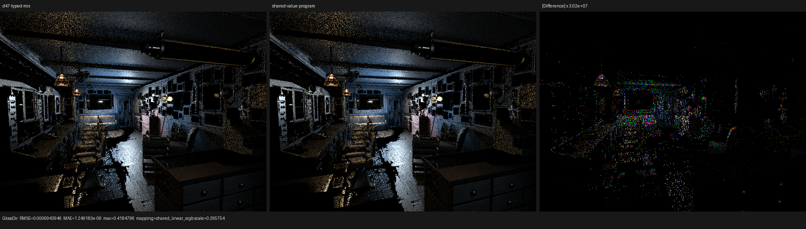

# Shared surface value-program transaction

## Outcome

The compact surface SVM now records automatic `SetNormal`, the selected root
value program, and every transitive Bump-height subprogram behind one typed
Luisa callable. The caller retains ownership of the small scalar, vector, and
uint64 banks and passes them by reference; closure population consumes those
banks immediately, with no global scratch buffer and no material or closure
baking.

On the official Blender 5.2 Barbershop export, this checkpoint reduces the
main HIP code object from 520,416 B to 502,296 B (-3.48%) and the before-opt
LLVM IR from 17,268,471 B to 15,872,052 B (-8.09%). Relative to the earlier
expanded-emission control (639,456 B), the cumulative compact-SVM reduction is
21.45%. Three warm 640x480, 64 spp renders move from the previous checkpoint's
3.93596 s mean to 3.54744 s (-9.87%).

Compilation improved in aggregate but exposed the next structural boundary.
The shared handler lowers COMGR link time by 14.97% and complete shader JIT by
10.34%, while LLVM optimization itself grows by 30.31%. The before-opt module
contains one approximately 157k-line value handler. The next SVM step is
therefore Cycles' actual organization: one interpreter loop with typed
opcode/family handlers, leaving ordinary LLVM heuristics to inline where
profitable. No callable receives a manual `inline` or `noinline` attribute.

## Formal execution model

For an endpoint domain `D`, let

```text
V(D) = exact variants in the endpoint root program
N(D) = exact variants in its automatic-normal program
H(D) = least fixed point of variants reachable through Bump height calls
P(D) = root-program offset
C(D) = whether SetNormal execution is runtime-conditional
```

`SurfaceValueProgramDomainView` now carries the complete tuple
`(V, N, H, P, C)`. The public callable factory accepts only `D`; it derives the
height callable and root transaction from the same view. A caller can no
longer combine, for example, an emission root with the physical Bump domain.
The existing executable-image validator proves all program ranges and Bump
edges before this tuple is constructed.

For each invocation, the caller creates typed banks

```text
S : float[8]
V : float3[12]
U : uint64[1]
```

and invokes

```text
(buffers, surface_tag, SurfacePoint, ref S, ref V, ref U) -> SurfacePoint
```

The callable executes `N(D)` and then `V(D)` in topological bytecode order.
The returned point contains the resulting shading normal; closures read the
same referenced banks in the caller's lexical continuation. Thus every value
still has one definition and every use observes the same typed slot. Sharing
changes only the host-stage AST ownership, not the device program, sampling,
closure order, or authored data.

Two independently constructed callables with the same complete AST hash are
deduplicated by Luisa. A new regression also passes independently allocated
`float[8]`, `float3[12]`, and `uint64` locals through a callable by reference,
mutates dynamic indices, and verifies both results and the single shared
custom-callable shape on fallback, HIP, and strict native Vulkan.

## HIP structural and compile result

The device is an AMD Radeon RX 9070 XT (`gfx1201`). Every cold sample used an
empty COMGR directory, disabled Psycles' persistent shader cache, and dumped
the final object through `LUISA_DUMP_HIP_ISA`.

| Main shade kernel metric | Typed Mix checkpoint | Shared value program | Change |
|---|---:|---:|---:|
| Generated AMDGPU blob | 553,080 B | 566,208 B | +2.37% |
| HIP code object | 520,416 B | **502,296 B** | **-3.48%** |
| Before-opt LLVM IR | 17,268,471 B | **15,872,052 B** | **-8.09%** |
| After-opt LLVM IR | 4,455,102 B | 4,651,126 B | +4.40% |
| Final LLVM IR | 4,455,486 B | 4,651,510 B | +4.40% |
| Private segment | 6,016 B | **5,888 B** | **-2.13%** |
| Coroutine frame | 848 B | 848 B | unchanged |

The main object was reproduced three times. Its SHA-256 is
`2b5430179719a0fced2c8bb888b6f811a8cdd27d66422edd99ab65498b33dfb8`.
After the C++ component split, a fresh cold build produced the same hash,
proving that the h+.cpp refactor did not change the shader AST or cache key.

| Cold metric | Previous mean | Samples | New mean | Change |
|---|---:|---:|---:|---:|
| HIP LLVM codegen | 1,021.162 ms | 1329.267, 1339.841, 1323.053 ms | 1,330.720 ms | +30.31% |
| COMGR link | 4,324.127 ms | 3670.676, 3705.409, 3654.614 ms | 3,676.900 ms | -14.97% |
| LLVM + COMGR | 5,345.289 ms | derived pairwise | 5,007.620 ms | **-6.32%** |
| Complete shader JIT | 18.0503 s | 16.1259, 16.2591, 16.1641 s | 16.1830 s | **-10.34%** |

The generated pre-link blob and post-opt IR increases are retained in the
table rather than hidden. They show that sharing has removed source/JIT
duplication but has not yet produced the final compact opcode-handler shape.

## Render and image validation

The warm render command used 640x480, 64 spp, 64 samples per dispatch, and the
`wavefront-staged` scheduler.

| Route | Samples (seconds) | Median | Mean |
|---|---|---:|---:|
| Previous typed Mix callable | 3.93650, 3.93549, 3.93594, 3.93402, 3.93785 | 3.93594 | 3.93596 |
| Shared value program | 3.55045, 3.54859, 3.54329 | **3.54859** | **3.54744** |

The stable 9.87% mean movement is promising and consistent with the smaller
object/private segment, but kernel-level profiling is still required before
assigning it to instruction-cache pressure rather than another GPU effect.

A 64x64, one-sample A/B against the previous checkpoint is bit-exact for all
15 recorded film passes: Combined, Normal, all color/direct/indirect light
passes, Emission, Environment, and both volume passes. The 640x480, 64 spp
comparison differs only through parallel floating-point accumulation order.
Combined relative RMSE is `3.55144e-4`, mean-luminance ratio is `0.99999848`,
and Normal relative RMSE is `8.45573e-7`.

The following original-resolution triptychs were inspected. The rendered
panels have no structural material, UV, normal, geometry, light, or volume
difference. Difference panels are independently amplified by roughly
`1.2e8`, `1.5e7`, and `3.0e7`; they show sparse accumulation-order speckles,
not a coherent shader change.







All pass metrics are retained in [`image-report.json`](image-report.json).

## Maintainability result

The former 2,149-line `path_tracer_surface_values.cpp` is now a 1,315-line
closure/consumer component. The typed value interpreter lives in a real
766-line `path_tracer_surface_value_program.cpp` plus a 124-line contract
header. This is a link-time component boundary, not an `.inl` extraction.

## Commands

```sh
cmake --build build --parallel 32

./build/bin/psycles_luisa_surface_mix_svm_tests fallback
./build/bin/psycles_luisa_surface_mix_svm_tests hip
LUISA_VULKAN_USE_XIR=1 \
LUISA_VULKAN_REQUIRE_NATIVE_XIR_SPIRV=1 \
LUISA_VULKAN_DISABLE_DXC=1 \
./build/bin/psycles_luisa_surface_mix_svm_tests vk

./build/bin/psycles_luisa_compact_surface_preparation_tests fallback
./build/bin/psycles_luisa_compact_surface_preparation_tests hip
LUISA_VULKAN_USE_XIR=1 \
LUISA_VULKAN_REQUIRE_NATIVE_XIR_SPIRV=1 \
LUISA_VULKAN_DISABLE_DXC=1 \
./build/bin/psycles_luisa_compact_surface_preparation_tests vk

PSYCLES_DISABLE_SHADER_CACHE=1 \
AMD_COMGR_CACHE_DIR=<empty-directory> \
LUISA_DUMP_HIP_ISA=<empty-directory> \
./build/bin/psycles_render_blender_scene \
  /var/tmp/psycles-official-redownload-20260814/exports/barbershop-5.2 \
  out.exr hip 640 480 64 64 - 0 0 0 0 64 - 1 0 wavefront-staged
```
