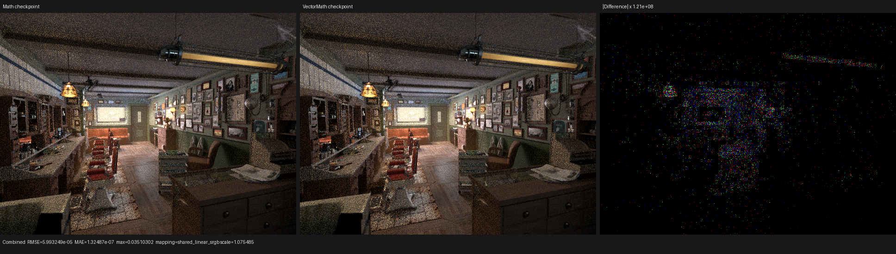
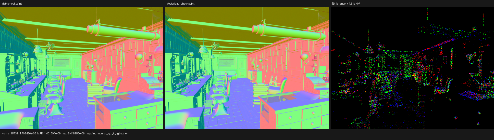
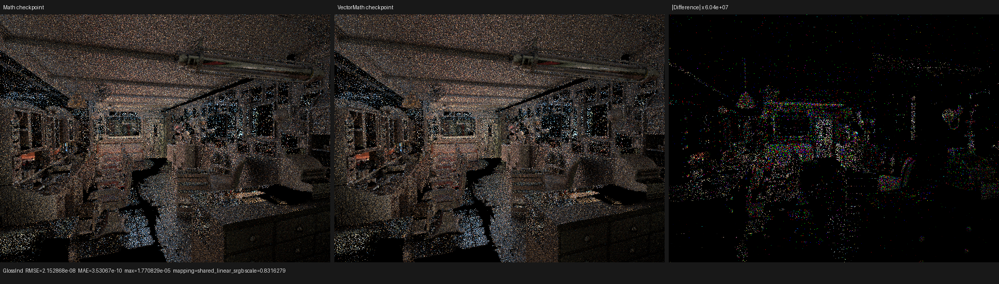

# Typed VectorMath SVM handlers

This checkpoint makes the authored Vector Math operation device data instead
of part of the host/JIT surface-evaluator identity. Compact instructions retain
the exact operation as a validated immediate, while scalar-result and
vector-result instructions execute through separate strongly typed Luisa
callables. The static graph route and compact route share one formula
implementation; there is no `float4` parameter ABI and no manual `inline` or
`noinline` policy.

On the official Blender 5.2 Barbershop export, the combined Math and VectorMath
quotients reduce value evaluator variants from 72 to 64. Relative to the
immediately preceding typed-Math checkpoint, VectorMath reduces the full
renderer's semantic surface domain from 73 to 69, the main HIP code object by
4,368 B (0.87%), and one-sample COMGR time by 4.85%. Five warm 640x480, 64 spp
renders are runtime-neutral within noise (+0.17%).

Raw Blender shader graphs, texture inputs, and closure parameters still cross
the scene boundary. No material, texture, BSDF, closure, or lighting result is
baked or pre-evaluated.

## Cycles 5.2 source model

The design was checked against Cycles 5.2 commit `fbe6228777e7`:

- `intern/cycles/scene/shader_nodes.cpp` emits one `SVMNodeVectorMath` record
  containing the operation, four typed inputs, and both scalar/vector result
  offsets. The operation is data, not a shader specialization.
- `intern/cycles/kernel/svm/math.h` loads the typed operands, calls
  `svm_vector_math`, and stores only result offsets that are live.
- `intern/cycles/kernel/svm/math_util.h` contains one operation switch shared
  by the scalar and vector outputs.
- `intern/cycles/kernel/svm/svm.h` executes Math and VectorMath as cases in one
  sequential interpreter over scene-wide `svm_nodes`.
- `intern/cycles/scene/svm.cpp` embeds unlinked constants, schedules graph
  dependencies using a Sethi-Ullman heuristic, assigns stack slots only to
  linked values, and frees a producer after its last unscheduled consumer.
- The same compiler emits closure jump records after shared dependencies, so a
  zero/one mix can skip the exclusive dependency subgraph and closure branch.

Psycles intentionally retains typed scalar/vector/unsigned banks instead of
copying Cycles' untyped float stack. It also leaves callable inlining to Luisa
and LLVM. The adopted invariant is the data-driven typed record, not Cycles'
backend-specific `__noinline__` spelling.

The source audit also found two pre-existing semantic gaps that are not hidden
inside this structural A/B: Psycles does not yet import Vector Math `ROUND`,
and its power helper needs Cycles' explicit `0^negative -> 0` behavior. They
are follow-up semantic fixes with dedicated oracle-boundary regressions.

## Formal quotient

For an output family `F` in `{scalar, vector}`, let a validated instruction be

```text
I = (F, operation, a, b, c, scale, dst).
```

Its observable transition is

```text
Eval(I, state) = state[dst <- VectorMath[F, operation](a, b, c, scale)].
```

For one executable scene and output family, let `D_F` be the exact finite set
of reachable operation immediates, and let its characteristic vector be

```text
P(D_F)[m] = exists operation in D_F such that operation = m.
```

The evaluator key erases `operation` but retains `F` and all other immutable
configuration. The instruction immediate retains the exact operation. The
callable AST is a pure function of `P(D_F)` and records exactly the reachable
cases, with signatures

```text
(uint operation, float3 a, float3 b, float3 c, float scale) -> float
(uint operation, float3 a, float3 b, float3 c, float scale) -> float3
```

Therefore:

- **Semantic preservation:** lowering serializes the exact mode and evaluation
  selects the same shared formula at runtime.
- **Typed separation:** scalar and vector output families cannot alias because
  their opcodes, evaluator keys, callable signatures, banks, and return types
  differ.
- **Domain closure:** every serialized immediate belongs to its callable's
  exact scene domain; the default branch is unreachable for valid input.
- **Canonical sharing:** domain order and duplicates do not affect `P(D_F)`, so
  independently recorded equal callables have equal complete AST hashes.
- **Hash completeness:** unequal reachable domains record unequal switch ASTs;
  the regression checks equal-domain deduplication and unequal-domain
  separation.
- **Validation before execution:** invalid modes, reserved fields, and
  immutable-metadata/immediate disagreement are rejected before shader
  recording.

## Multi-result liveness census

Cycles can write both outputs from one `SVMNodeVectorMath`. Psycles currently
lowers each live output as a typed instruction. Before adding a multi-result
storage abstraction, the inspector grouped instructions only when a valid
authored source-node identity and every operand/static field matched exactly.
Synthetic invalid identities remain distinct.

| Blender 5.2 scene | Reachable producers / outputs | Dual-output producers | Preparation producers / outputs | Preparation dual-output |
|---|---:|---:|---:|---:|
| Barbershop | 139 / 139 | 0 | 14 / 14 | 0 |
| Classroom | 16 / 16 | 0 | 2 / 2 | 0 |
| Monster Under the Bed | 2 / 2 | 0 | 0 / 0 | 0 |
| Lone Monk | 0 / 0 | 0 | 0 / 0 | 0 |
| Blender benchmark | 33 / 33 | 0 | 9 / 9 | 0 |
| Flat Archiviz | 14 / 14 | 0 | 1 / 1 | 0 |

No tested execution domain consumes both outputs of one producer, so this
checkpoint does not introduce a speculative multi-result lifetime mechanism.
The eventual whole-graph SVM still must support Cycles' single-record/two-live-
offset model when a scene demonstrates that requirement.

## Real-scene evaluator census

Serialized bytecode sizes are unchanged: operation mode remains data. The
baseline is commit `c5c8fa49`, before typed Math and typed VectorMath.

| Blender 5.2 scene | Baseline value variants | Current value variants | Math variants | Vector scalar variants | Vector result variants | Scene bytecode |
|---|---:|---:|---:|---:|---:|---:|
| Barbershop | 72 | 64 | 6 -> 1 | 0 -> 0 | 4 -> 1 | 222,320 B |
| Classroom | 39 | 34 | 5 -> 1 | 0 -> 0 | 2 -> 1 | 21,896 B |
| Monster Under the Bed | 34 | 31 | 4 -> 1 | 0 -> 0 | 0 -> 0 | 8,412 B |
| Lone Monk | 42 | 41 | 2 -> 1 | 0 -> 0 | 0 -> 0 | 16,040 B |
| Blender benchmark | 57 | 53 | 3 -> 1 | 0 -> 0 | 3 -> 1 | 56,720 B |
| Flat Archiviz | 47 | 42 | 6 -> 1 | 1 -> 1 | 0 -> 0 | 24,240 B |

The full Barbershop runtime domain changes from 73 to 69 semantic variants
relative to the typed-Math checkpoint. Population/normal/height domains change
from 67/41/47 to 64/39/43.

## HIP compiler and runtime A/B

The exact A/B baseline is commit `092000e4` (typed Math, before typed
VectorMath). Both measurements use the same Psycles/Luisa build configuration,
official Blender 5.2 Barbershop export, RX 9070 XT (`gfx1201`), 640x480, 64 spp,
and `wavefront-staged` scheduler.

| Main `shade_surface` metric | Typed Math baseline | Typed VectorMath | Change |
|---|---:|---:|---:|
| Semantic surface variants | 73 | 69 | -5.48% |
| Generated AMDGPU blob | 534,168 B | 530,472 B | -0.69% |
| HIP code object | 500,688 B | 496,320 B | -0.87% |
| LLVM IR before optimization | 15,312,964 B | 15,242,417 B | -0.46% |
| LLVM IR after optimization | 4,475,401 B | 4,450,001 B | -0.57% |
| Final LLVM IR | 4,475,785 B | 4,450,385 B | -0.57% |
| HIP LLVM codegen | 1,410.831 ms | 1,455.511 ms | +3.17% |
| COMGR | 3,603.520 ms | 3,428.868 ms | -4.85% |
| Private segment | 5,440 B | 5,440 B | unchanged |
| SGPR spills | 44 | 42 | -2 |
| VGPR spills | 422 | 422 | unchanged |

Object and IR size reductions are deterministic structural results. LLVM and
COMGR timings are one cold sample and both directions are reported. Five warm
typed-VectorMath samples were 3.47861, 3.48134, 3.48184, 3.48123, and 3.49007
seconds (median 3.48134 s, mean 3.48262 s). The typed-Math median was 3.47540 s;
the +0.17% delta is measurement noise, not a claimed runtime change.

## Correctness and visual inspection

The exact same 640x480, 64 spp Barbershop sample range was rendered before and
after the structural change. All 45 channels across Combined, Normal, color,
all direct/indirect light, Emission, Environment, transmission, and volume
passes are finite. The 99th percentile Combined pixel RMSE is
`8.60319e-9`; its total RMSE is `5.99325e-5` because a tiny number of concurrent
film reductions changed floating-point order. Combined luminance ratio is
`0.99999804`. Normal RMSE is `1.70243e-8`; Glossy Indirect RMSE is
`2.15287e-8`. Environment and both volume passes are bit-exact. Complete
per-pass measurements are in [`report.json`](report.json).

The three 480p triptychs were inspected at native resolution. Baseline and
current panels agree in material placement, UV/texture structure, geometry,
normals, lighting, and orientation. The difference panels require roughly
`1e7` to `1e8` amplification and contain no coherent residual.







## Backend regression matrix

The focused matrix passes 15/15 tests on fallback, HIP, and Vulkan. Vulkan is
forced through native AST-to-XIR-to-SPIR-V with DXC disabled. The backend test
covers every currently represented VectorMath operation, compares dynamic
handlers with the shared statically selected formulas, verifies exact callable
hash sharing/separation, and bounds the runtime kernel at 4,096 XIR
instructions (observed: 3,634).

```sh
cmake --build build --parallel 32

LUISA_VULKAN_USE_XIR=1 \
LUISA_VULKAN_REQUIRE_NATIVE_XIR_SPIRV=1 \
LUISA_VULKAN_DISABLE_DXC=1 \
ctest --test-dir build --output-on-failure --parallel 1 \
  -R 'psycles\.(surface_program_metadata|surface_svm_math_immediate|surface_svm_vector_math_immediate|luisa_(compact_surface_preparation|surface_mix_svm|surface_math_svm|surface_vector_math_svm)_(fallback|hip|vk))$'
```

The cold HIP measurement disables persistent Psycles shader caching and uses a
fresh COMGR directory while dumping the actual LLVM and code objects:

```sh
PSYCLES_DISABLE_SHADER_CACHE=1 \
AMD_COMGR_CACHE_DIR=<empty-comgr-cache> \
LUISA_DUMP_HIP_ISA=<empty-isa-directory> \
LUISA_DUMP_LLVM_IR=1 \
LUISA_CORO_SHADER_MAP=1 \
LUISA_CORO_DUMP_FRAME_LAYOUT=1 \
./build/bin/psycles_render_blender_scene \
  /var/tmp/psycles-official-redownload-20260814/exports/barbershop-5.2 \
  out.exr hip 640 480 64 64 - 0 0 0 0 64 - 1 0 \
  wavefront-staged 32 32768 32 1 1 0 4 2 4096 0 0 0 1 1048576
```

## Next structural step

The current compact runtime still dispatches each bytecode instruction by a
scene-specific `variant_index`. Consequently the shader AST contains one outer
case per immutable evaluator configuration even though Math, VectorMath, Mix,
mapping, noise, and image families have begun moving configuration into
typed immediates.

The next step is a whole value-graph interpreter that switches by typed opcode,
decodes typed operand/result banks, and uses exact scene feature domains to omit
unreachable handlers. It must preserve the existing last-use storage plan,
Bump strata, shader services, and raw closure flow. After that, closure
bytecode can adopt Cycles' lazy jump structure so exclusive closure dependencies
are not eagerly populated.
