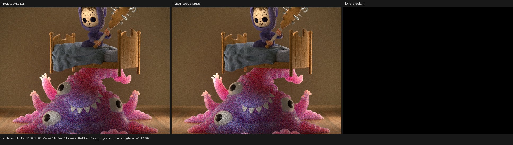
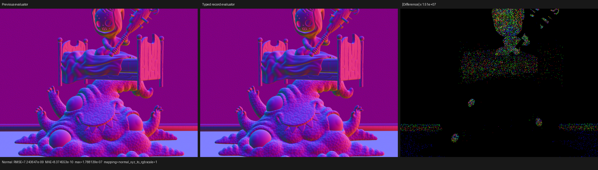
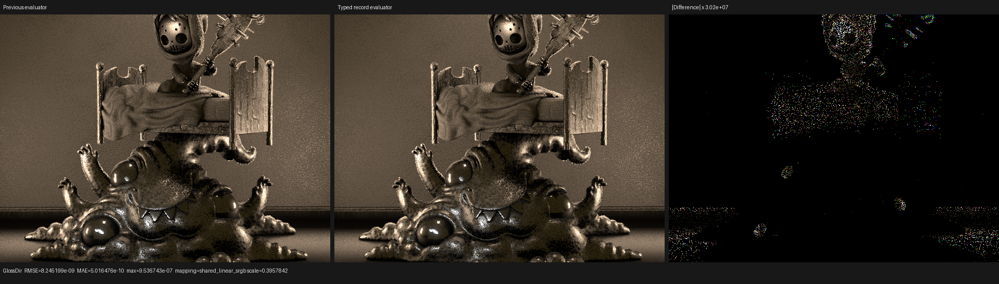

# Typed Clamp and Map Range SVM records

This checkpoint removes Clamp and Map Range modes from the host evaluator
identity only after proving that their complete immutable semantics can be
recovered from the compact instruction record. It does not change the Blender
boundary: Psycles still receives the authored graph and original closure
parameters, and Blender/Cycles does not pre-evaluate or bake any material.

The oracle is Blender/Cycles 5.2, branch `blender-v5.2-release`, commit
`fbe6228777e7d9afefcd61a413844e790ae75db7`. The implementation was checked
against:

- `intern/cycles/kernel/svm/clamp.h`;
- `intern/cycles/kernel/svm/map_range.h`;
- `intern/cycles/kernel/svm/node_types.h` and `types.h`; and
- `intern/cycles/scene/shader_nodes.cpp`, including scalar Map Range's
  graph-expanded RANGE Clamp and vector Map Range's encoded clamp flag.

## Formal model

Let the legal Clamp configuration set be

```text
C_clamp = { MINMAX, RANGE }.
```

Let the legal Map Range configuration set be

```text
C_map = { LINEAR, STEPPED, SMOOTHSTEP, SMOOTHERSTEP } x { false, true }.
```

The compact record encodings are

```text
encode_clamp(mode) = uint(mode)
encode_map(interpolation, clamp) = uint(interpolation) | (uint(clamp) << 2).
```

Clamp owns bit 0. Map Range owns bits 0--1 for interpolation and bit 2 for
the clamp flag. These fields are disjoint and fit the existing 14-bit
opcode-owned immediate.

The host evaluator quotient is sound if the following obligations hold:

1. **Legal-domain validation:** only members of `C_clamp` and `C_map` reach
   record construction.
2. **Left inverse:** `decode(encode(c)) = c` for every legal configuration.
3. **Injectivity:** distinct legal configurations have distinct encodings.
4. **Complete observation:** every erased field is read from the instruction
   immediate by the compact evaluator; no erased field remains captured in a
   host-specialized AST.
5. **Shape preservation:** fields not represented by this encoding remain in
   the evaluator key.

The implementation exhausts the two- and eight-element domains in `constexpr`
proof functions. The build fails if either the left-inverse or injectivity
property stops holding. The scene/program validator rejects an out-of-range
Clamp mode, an out-of-range Map Range interpolation, a non-Boolean clamp field,
or a foreign immutable Clamp field before encoding. Only after that validation
does evaluator canonicalization zero the encoded host fields.

The compact handlers receive the record immediate as a typed `UInt` argument.
They construct cases only for interpolation modes present in the exact scene
domain. Clamp flags remain record data and do not duplicate evaluator bodies.
Expanded graph evaluation and compact SVM evaluation call the same
`surface_map_range.h/.cpp` semantic implementation, while the three-backend
regression compares their different binding-time routes.

## Cycles semantic correspondence

- MINMAX clamps with the authored endpoint order. RANGE exchanges reversed
  endpoints before clamping.
- Scalar Map Range returns zero for an empty From interval. Linear, Stepped,
  Smoothstep, and Smootherstep follow Cycles' scalar formulas. Scalar Clamp is
  applied as the separate RANGE Clamp produced by Cycles graph expansion.
- Vector Map Range performs component-wise safe division. Smoothstep and
  Smootherstep already clamp the interpolation factor and therefore ignore the
  authored result-clamp flag, as Cycles does. Linear and Stepped apply the flag
  component-wise over the possibly reversed To interval.
- Reversed scalar smooth interpolation uses the algebraically equivalent
  normalized factor. This checkpoint does not claim identical floating-point
  operation order; the real-scene A/B below bounds the resulting difference.

## Regression matrix

The host regression exhausts all legal configurations and proves that they
form one Clamp handler, one scalar Map Range handler, and one vector Map Range
handler. It also checks that invalid configurations fail closed. The live
shader regression makes every configuration directly observable and compares
compact versus expanded evaluation on fallback, HIP, and Vulkan.

| Test | Result |
|---|---:|
| `psycles_surface_svm_record_immediate_tests` | passed |
| `psycles.luisa_compact_surface_preparation_fallback` | passed, 4.07 s |
| `psycles.luisa_compact_surface_preparation_hip` | passed, 6.11 s |
| `psycles.luisa_compact_surface_preparation_vk` | passed, 26.13 s |

The Vulkan test used strict native AST-to-XIR-to-SPIR-V and prohibited DXC:

```sh
LUISA_VULKAN_USE_XIR=1 \
LUISA_VULKAN_REQUIRE_NATIVE_XIR_SPIRV=1 \
LUISA_VULKAN_DISABLE_DXC=1 \
ctest --test-dir build --output-on-failure \
  -R '^psycles\.luisa_compact_surface_preparation_vk$'
```

## Real-scene reachability

The current Blender 5.2 exports were inspected after rebuilding the material
inspector. Opcode values 16, 17, and 18 are Clamp, scalar Map Range, and vector
Map Range respectively.

| Scene | Clamp | Scalar Map Range | Vector Map Range | Static variants |
|---|---:|---:|---:|---:|
| Lone Monk | 0 | 0 | 0 | 35 |
| Classroom | 0 | 0 | 0 | 32 |
| Monster Under the Bed | 0 | 2 | 0 | 29 |
| Barbershop 5.2 | 0 | 0 | 0 | 53 |
| Blender benchmark bundle | 0 | 0 | 0 | 42 |
| Flat Archiviz | 0 | 0 | 0 | 39 |

Monster is therefore the only one of these scenes that directly exercises the
new Map Range record. Its two instructions already share one authored
configuration, so the total variant count stays 29. The representative's
captured fields change from `(static_u0, static_u1) = (3, 1)` to `(0, 0)`;
the record immediate remains the sole source of that configuration. This is a
semantic binding-time result, not a claimed real-scene variant-count win.

## HIP image and runtime A/B

The previous evaluator binary and the typed-record binary rendered Monster at
640x480, 64 spp, with scheduler `wavefront-staged` and the same absolute sample
range `[0, 64)`. All 15 requested film passes are finite. Representative
linear-pass differences are:

| Pass | RMSE | Maximum absolute error |
|---|---:|---:|
| Combined | `1.26808e-9` | `2.38419e-7` |
| Normal | `7.24365e-9` | `1.78814e-7` |
| Glossy Direct | `8.24520e-9` | `9.53674e-7` |
| Environment, transmission, volume passes | `0` | `0` |

The complete metrics are in [image-report.json](image-report.json). Native
resolution inspection found identical geometry, material placement, texture
coordinates, normals, and lighting. Combined's difference panel is black;
Normal and Glossy Direct reveal only sparse ULP-scale arithmetic differences
after amplification by roughly `1.5e7` and `3.0e7`, without a structural
discontinuity.







The single warm render measurements are `1.88263 s` before and `1.88000 s`
after. The main HIP code object is exactly 380,280 bytes in both runs. These
figures establish runtime and object-size non-regression for Monster; they are
not treated as a statistically supported speedup. A scene containing multiple
reachable Clamp/Map Range configurations is required to measure the handler
count reduction in production.

## Commands

```sh
cmake --build build --parallel 32 \
  --target psycles_surface_svm_record_immediate_tests \
           psycles_luisa_compact_surface_preparation_tests \
           psycles_inspect_blender_material \
           psycles_render_blender_scene

./build/psycles_surface_svm_record_immediate_tests

ctest --test-dir build --output-on-failure \
  -R '^psycles\.luisa_compact_surface_preparation_(fallback|hip)$'

build/bin/psycles_render_blender_scene \
  /var/tmp/psycles-all-scenes-5.2-20260814/exports/monster \
  monster.exr hip 640 480 64 64 - 0 0 0 0 64 - 1 0 wavefront-staged
```
