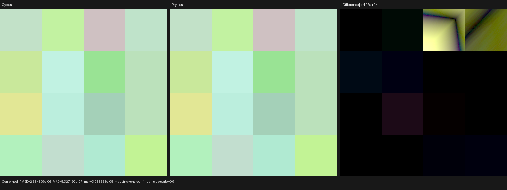
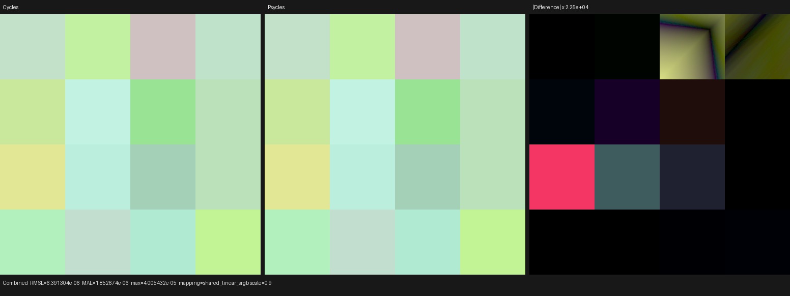
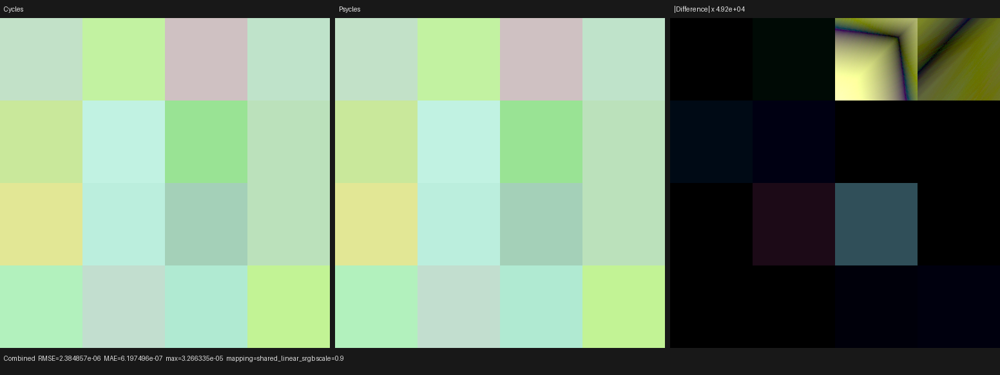
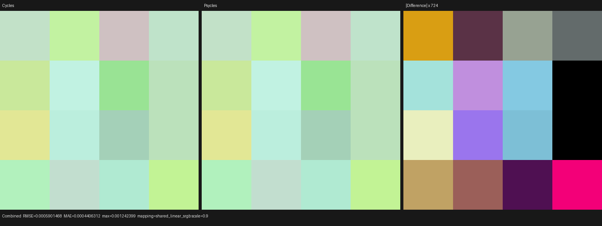
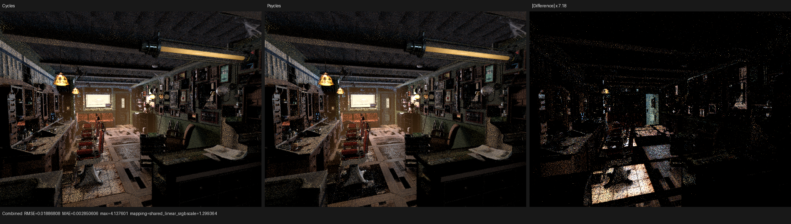
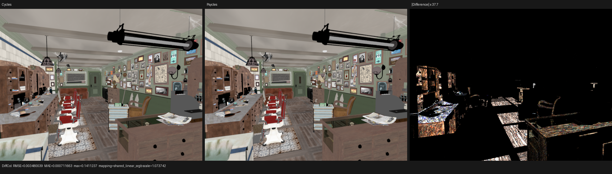
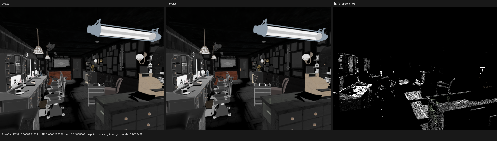
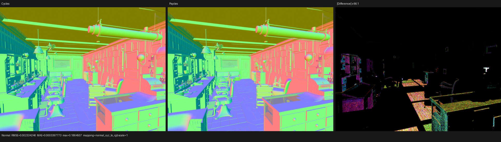

# Typed Image Texture BOX operation

## Outcome

Image Texture BOX projection is now one canonical, strongly typed Luisa
operation instead of a large expression copied into every compact-SVM caller.
The graph evaluator still loads the original node operands and writes the
original result locally; only the pure BOX calculation crosses the callable
boundary. No SVM stack, program counter, result slot, material identity, or
prebaked Cycles value is passed through that boundary.

The implementation is based on an explicit finite-domain proof and on the
Cycles 5.2 source at commit `fbe6228777e7`, especially
`intern/cycles/kernel/svm/image.h`. The Psycles baseline is `9c72f7a6cec8` and
the LuisaCompute submodule is `6f172f351d7d`.

The principal measured results are:

| Quantity | Inline/baseline | Typed/shared | Change |
| --- | ---: | ---: | ---: |
| Repeated BOX operation, 8 copies, XIR instructions | 28,353 | 2,282 | -91.95% |
| Repeated raw sampler, 8 copies, XIR instructions | 5,945 | 790 | -86.71% |
| Barbershop main HIP code object | 496,392 B | 472,912 B | -4.73% |
| Barbershop final main LLVM IR | 4,413,048 B | 4,443,821 B | +0.70% |
| Barbershop final LLVM texture-load occurrences | 153 | 141 | -7.84% |
| Barbershop Bump-height callable | 10,877 lines / 100 loads | 6,476 lines / 16 loads | -40.46% / -84% |
| Barbershop warm render-only median | 3.29809 s, one baseline sample | 3.26710 s, three samples | -0.94% |

The total optimized LLVM module did **not** shrink: it grew by 0.70% because
the four BOX sampling specializations are now visible as shared functions.
The final AMDGPU object nevertheless shrank by 4.73%, and the repeatedly
expanded Bump-height body became substantially smaller. The approximately 1%
render-time change is within the resolution of this small run set and is not
claimed as a throughput speedup. The durable result of this checkpoint is the
bounded code-growth model and exact semantic boundary.

## Formal model

### Finite sampling quotient

Let the authored interpolation domain be

```text
I = {Nearest, Linear, Cubic, Smart}
```

and the extension domain be

```text
E = {Repeat, Clip, Extend, Mirror}.
```

Cycles implements Cubic and Smart with the same cubic filter. Define

```text
c(Nearest) = 0
c(Linear)  = 1
c(Cubic)   = 2
c(Smart)   = 2
q(i, e)    = 4 * c(i) + e.
```

The compiler header exhausts all `4 * 4` authored pairs at compile time and
proves three obligations:

1. boundedness: `0 <= q(i, e) < 12`, so the result is a safe specialization
   index;
2. surjectivity: every one of the 12 canonical slots has a representative;
3. exactness: `q(i, e) == q(j, f)` iff `c(i) == c(j)` and `e == f`.

Thus the quotient erases exactly the Cubic/Smart spelling distinction. It does
not merge extension modes or any other sampling behavior. Graph dispatch and
callable lookup both use this single compiler definition.

### Completeness of the runtime switch

For each compact evaluator variant `v`, let `D_v` be its sorted
`svm_immediates` vector. A runtime instruction assigned to `v` can only carry
an immediate in `D_v`:

1. lowering validates the complete immutable Image configuration and encodes
   that exact configuration into the bytecode instruction;
2. the exact-variant builder processes every lowered instruction, appends its
   immediate to its variant domain, and records a parallel instruction-to-
   variant index;
3. execution reads the instruction and that parallel variant index together.

Therefore the device sampling key is always in `q(D_v)`. Emitting switch cases
from `q(D_v)` is complete, and its `unreachable` default is unreachable for a
validated executable scene. This is a construction invariant, not an
assumption inferred from the current test scenes.

### Canonical BOX operation

For a canonical sampling mode `m`, define:

- `T_m(h, u)`: the raw Cycles-compatible texture filter for handle `h` and UV
  `u`;
- `C(s, a, g)`: optional alpha unassociation followed by optional sRGB-to-
  linear conversion;
- `W(N, b)`: the Cycles BOX weights computed from signed object normal `N` and
  blend `b`;
- `U_x`, `U_y`, `U_z`: the three Cycles BOX face coordinates, including the
  existing host-image row-order Y conversion.

The operation is the ordered fold

```text
acc = 0
for axis in [x, y, z]:
    if W_axis > 0:
        acc = acc + W_axis * C(T_m(h, U_axis), a, g)
return acc
```

The order of `C` matches `svm_image_texture`: filter associated encoded
texels, optionally unassociate alpha, then decode RGB. Ordinary and BOX
projections now call the same decoder, eliminating a duplicated semantic
definition.

The `W_axis > 0` guards are essential over IEEE-754 values. Replacing them by
an unconditional algebraic sum is not semantics preserving because
`0 * NaN` is NaN, while an unselected texture read is absent. Cycles uses the
same ordered guarded reads. The regression supplies a finite selected face and
NaN-valued unselected faces from runtime buffers; all three backends must
return the finite selected sample.

### Callable equivalence and hashing

The callable ABI is exactly

```text
(textures, coordinate, signed_normal, blend, texture_handle,
 unassociate_alpha, encoded_as_srgb) -> float4.
```

All fields are semantic device values. The interpolation/extension pair is
immutable host metadata selecting one callable before shader recording. A
host virtual sampler endpoint is used only while Luisa records the AST and is
absent from device code. No manual `noinline` marker is applied; the backend
retains its normal optimization freedom.

Hash interning has two converse obligations, both checked on the recorded AST:

- independently constructed callables for the same canonical mode collapse to
  one definition;
- the full authored `4 * 4` domain produces exactly 12 BOX definitions.

The second condition is particularly important: the outer BOX functions have
the same shape, and differ through their nested raw-sampler dependency. If the
callable hash omitted nested callable semantics, this regression would
incorrectly observe one definition rather than 12.

## Focused validation

The relevant build and regression command was:

```bash
cmake --build build --parallel 32 \
  --target psycles_luisa_texture_sampling_callable_tests \
           psycles_render_blender_scene

LUISA_VULKAN_USE_XIR=1 \
LUISA_VULKAN_REQUIRE_NATIVE_XIR_SPIRV=1 \
LUISA_VULKAN_DISABLE_DXC=1 \
ctest --test-dir build --output-on-failure \
  -R 'psycles\.(luisa_compact_surface_preparation_(fallback|hip|vk)|luisa_texture_sampling_callable_(fallback|hip|vk)|surface_program_metadata|surface_svm_record_immediates)$'
```

All eight tests passed. The strict Vulkan runs used native XIR to SPIR-V and
did not enable the DXC path.

The callable test covers:

- all 16 authored interpolation/extension pairs;
- all four alpha-unassociation/sRGB flag combinations;
- axis-aligned, two-face, three-face, zero-normal, negative-coordinate, and
  out-of-range-coordinate inputs;
- direct canonical evaluation versus the shared provider on fallback, HIP,
  and strict Vulkan;
- the non-finite unused-face counterexample;
- independent callable construction and both sides of the 16-to-12 hash
  quotient;
- repeated-operation XIR growth.

On the deterministic projection probe, callable and inline evaluation differ
only by float reassociation: Combined relative RMSE is `1.0551e-8`, luminance
ratio is exactly `1.0`, and maximum absolute error is one float ULP
(`1.1921e-7`). See [callable-vs-inline.json](callable-vs-inline.json).

## Cycles oracle and backend floor

The reference probe is 512x512, 16 spp, Tabulated Sobol, seed 20903, adaptive
sampling disabled. Cycles is Blender 5.2.0 LTS at `fbe6228777e7`. These are the
Combined results against the **Cycles CPU** algorithmic oracle:

| Psycles backend | Luminance ratio | Relative RMSE | Maximum absolute error |
| --- | ---: | ---: | ---: |
| fallback | 1.00000038 | 3.4383e-6 | 3.2663e-5 |
| HIP | 1.00000030 | 3.3946e-6 | 3.2663e-5 |
| Vulkan native XIR to SPIR-V | 0.99999939 | 9.2145e-6 | 4.0054e-5 |

Reports: [fallback](projection-fallback-vs-cycles-cpu.json),
[HIP](projection-hip-vs-cycles-cpu.json), and
[Vulkan](projection-vk-vs-cycles-cpu.json).

Cycles 5.2 CPU and Cycles 5.2 HIP do not produce identical filtered texture
values on this RX 9070 XT. Their Combined relative RMSE is `8.5083e-4`, about
250 times the Psycles HIP versus Cycles CPU error, with maximum absolute error
`1.2424e-3`. This is the AMD hardware texture-filter precision floor, not an
Image BOX algorithm discrepancy. Psycles therefore uses Cycles CPU as the
cross-backend semantic oracle and records CPU-to-HIP separately rather than
teaching every Psycles backend to imitate one device's filtering precision.
See [cycles-cpu-vs-hip-device-floor.json](cycles-cpu-vs-hip-device-floor.json).









The first three differences require factors between roughly 22,500 and 49,200
to become visible. The CPU-to-HIP device-floor image requires only about 724x.

## Barbershop code generation and runtime

The production check uses the same exported Barbershop input before and after:
567 root programs, 671 programs including nested Bump evaluators, 9,233 value
instructions, 57 semantic variants, 640x480, 64 spp, and staged wavefront on
the RX 9070 XT.

The cold command isolated the COMGR cache and disabled the Psycles render
shader cache:

```bash
PSYCLES_DISABLE_SHADER_CACHE=1 \
AMD_COMGR_CACHE_DIR=<fresh-empty-directory> \
LUISA_DUMP_HIP_ISA=<fresh-empty-directory> \
LUISA_DUMP_LLVM_IR=1 \
build/bin/psycles_render_blender_scene \
  /home/mike/Projects/psycles-benchmarks/barbershop-480p-64spp/export \
  out.exr hip 640 480 64 64 - 0 0 0 0 64 - 1 0 \
  wavefront-staged 32 32768 32 1 1 0 4 2 4096 131072 0 0 1
```

The main LLVM codegen time changed from 1368.00 ms to 1373.72 ms (+0.42%) and
the isolated COMGR link from 3472.04 ms to 3404.47 ms (-1.95%). These are one
cold observation each and are reported as neutral, not as compilation-speed
claims. Exact measurements are in
[barbershop-hip-metrics.json](barbershop-hip-metrics.json).

The final three render-only times are 3.27005, 3.26710, and 3.26612 seconds.
The last run loaded the 472,912-byte main shader from cache. The single exact-
input baseline was 3.29809 seconds. The measured -0.94% median is small enough
to classify as neutral.

The current export logs ten unavailable optional images, including the agent
face set, `guilder_ornament.png`, and `generic_scratches.png`. Consequently this
Barbershop artifact is used only for before/after Psycles code-generation and
structural-image checks, not as a fresh absolute Cycles scene-parity claim.

At 64 spp, changing floating evaluation boundaries can make otherwise equal
paths diverge into different Monte Carlo samples. The before/after Combined
relative RMSE is therefore 0.1417 and its luminance ratio is 0.9462, while two
unchanged final binaries themselves have Combined relative RMSE 0.0907. The
stable material passes are the relevant structural evidence:

| Pass | Before/after luminance ratio | Relative RMSE |
| --- | ---: | ---: |
| Diffuse Color | 1.000203 | 0.01333 |
| Glossy Color | 0.999942 | 0.00473 |
| Normal | 1.000037 | 0.00424 |
| Emission | 0.999999 | 0.000466 |
| Environment | 1.000000 | 0 |

The Combined difference is spatially noise/firefly-like. Diffuse Color,
Glossy Color, and Normal preserve the floor, ceiling, wall, cabinet, and
furniture topology with no UV, handedness, or material-family replacement.
The deterministic projection probe above, rather than this stochastic scene
pair, establishes node-level equality.









Reports: [before/after](barbershop-vs-baseline.json) and
[same-code warm repeat](barbershop-warm-repeat.json).
