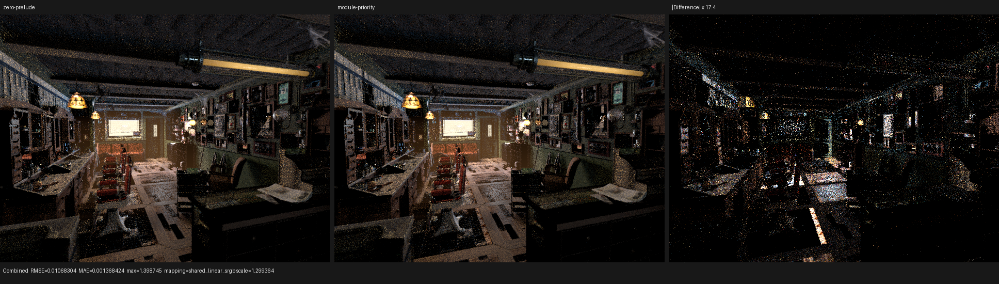
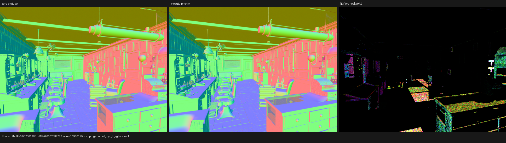
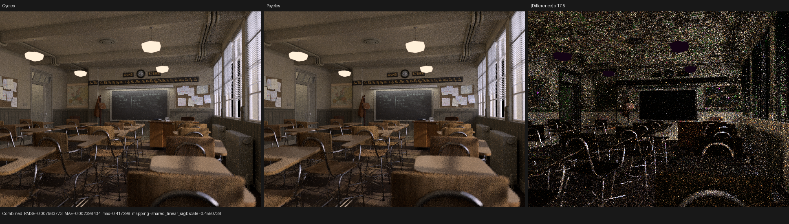
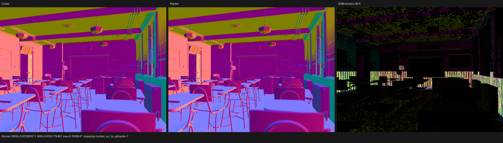
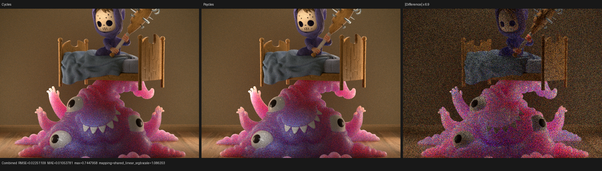
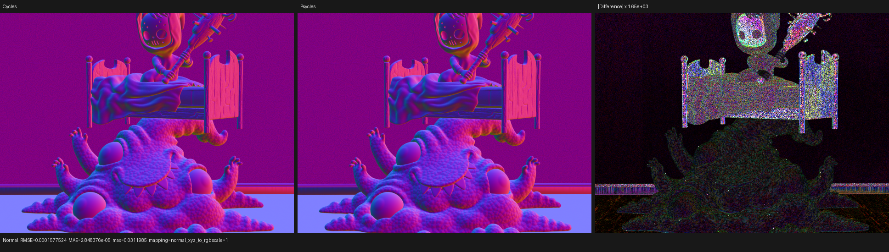
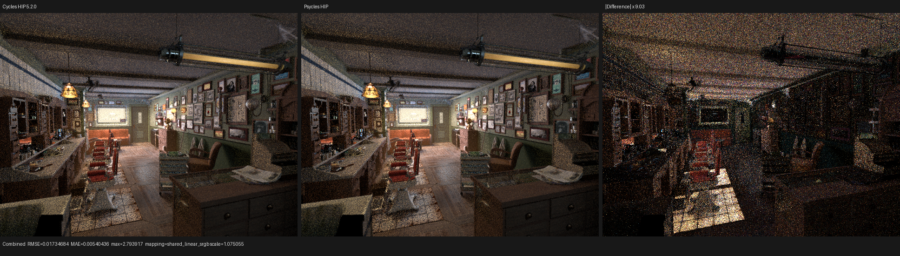
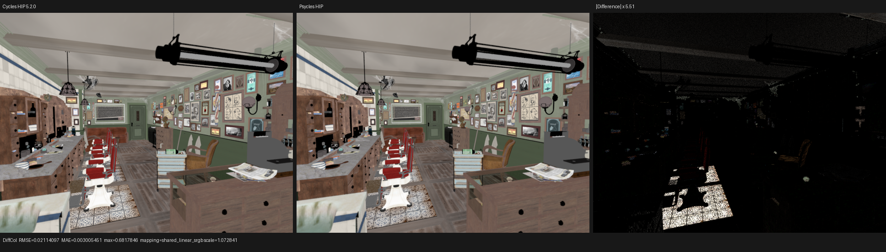
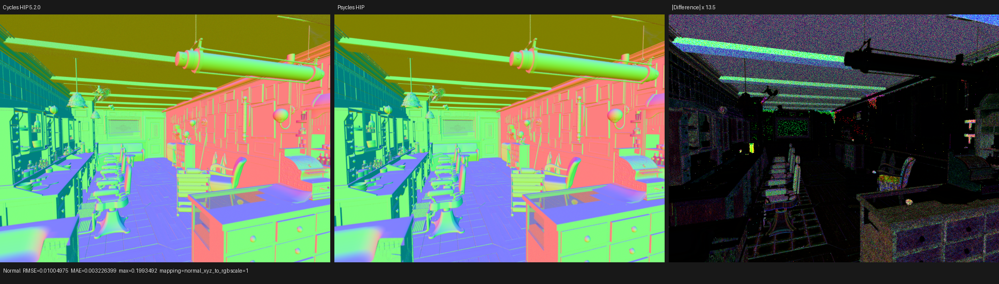

# Physical-closure reachability and HIP inlining ownership

## Outcome

This change removes unreachable physical BSDF algorithms from the Luisa AST
without changing the material program or pre-evaluating any closure. It also
fixes a HIP LLVM pipeline instability in which deleting shader code could make
one of two consumers inline a shared callable while leaving the other consumer
and the callable body present.

On the Barbershop `shade_surface` kernel, the final policy reduces the code
object from `400544 B` to `367384 B` (`-8.28%`). In the controlled run, LLVM
optimization time fell from `1266.36 ms` to `1122.53 ms` (`-11.36%`) and COMGR
link time from `2590.97 ms` to `2381.20 ms` (`-8.10%`). Render time was
statistically flat (`2.77594 s` versus `2.80564 s` at 640x480, 64 spp); this is
a compile-size/JIT improvement, not a claimed render-speed win.

The first Barbershop comparison made during this change was invalid: its
export and golden came from Blender 5.3 Alpha even though the report called it
Cycles 5.2. A fresh export and golden from the exact Blender 5.2 release build
reproduce the established alignment: Combined luminance ratio `0.999578` and
RMSE `0.017347` at 640x480, 64 spp. The comparison tool now rejects missing or
mismatched build identities by default so this oracle error cannot silently
produce another renderer conclusion.

## Formal reachability model

Let `K` be the finite set of canonical `SurfaceClosureKind` values and `L` the
finite set of Principled lobe tags that select distinct directional
algorithms. The host/JIT abstract state is

```text
D = P(K) x P(L)
order = component-wise subset
join  = component-wise union
top   = (all physical kinds, all Principled lobes)
```

The scene image already contains immutable sets of closure opcodes and
Principled feature bits. The transfer maps each singleton source bit to the
physical identities that the canonical setup expansion can emit, then joins
the singleton images. Therefore, for recognized masks `a` and `b`,

```text
F(a union b) = F(a) join F(b)
```

No authored float, texture, random number, or path state participates in this
analysis. Unknown opcode or feature bits map to `top`, so schema drift can only
disable specialization; it cannot remove required shader code.

The production expansion now checks every physical closure at its actual
`emit` boundary. The check first applies the same canonical identity projection
used to build the device record and asserts that the projected kind/lobe is in
`F(source operation, source features)`. This closes the gap between a
hand-written transfer test and the constructors that scattering actually
consumes.

One subtle but important audited case is Principled transmission. Thick
transmission canonicalizes to `glass`; thin transmission emits `glossy`,
`thin_glass_transmission`, and `transparent`. The carried `transmission` lobe
tag never makes those records use the `principled` directional branch, so the
transfer must include those physical kinds rather than a fictitious
`principled/transmission` algorithm.

## Reachability regression

`test_luisa_surface_closure_reachability` provides three independent gates:

- It exhausts all `4096 * 2048 = 8388608` products of recognized operation and
  feature subsets and proves the union-homomorphism equation above.
- It checks that unknown bit 31 maps to `top`.
- It compiles specialized and `top` evaluation/sampling probes on fallback,
  HIP, and strict native Vulkan, then requires bit-exact results for every
  reachable probe record.

For a diffuse-only probe, recursive Luisa AST footprint changed as follows:

| AST entity | Top | Specialized | Reduction |
| --- | ---: | ---: | ---: |
| Expressions | 7984 | 1865 | 76.6% |
| Statements | 3841 | 975 | 74.6% |

The full physical-constructor matrix was also exercised by the existing
collection, population, Principled transmission/setup/thin-wall, compact
preparation, and subsurface tests. All 24 fallback/HIP/Vulkan tests passed.
Vulkan ran with `LUISA_VULKAN_USE_XIR=1`,
`LUISA_VULKAN_REQUIRE_NATIVE_XIR_SPIRV=1`, and
`LUISA_VULKAN_DISABLE_DXC=1`.

## HIP inlining root cause and policy

The failing Barbershop IR contained two calls to the same generated
`callable.15`. LLVM's ordinary CGSCC inliner visits call sites bottom-up.
Removing an unrelated material branch changed a caller-local cost enough that
one call was inlined while the other call and the shared body remained. The
smaller pre-optimization module consequently produced a larger code object.

The final pipeline partitions inline decisions into two cost domains:

```text
positive growth: inline_cost(edge) < threshold(opt level)
canonicalization: inline_cost(edge) < max(1, 0)
```

LLVM's module inliner owns all positive-growth decisions through one global
priority queue over the frontend call graph, before a caller-specializing pass
can make formerly equivalent sites diverge. The later standard CGSCC pipeline
uses threshold zero, which still admits modeled cost zero or below and
last-private-call cleanup but cannot make a positive-growth clone. Generated
callables carry no `alwaysinline`, `noinline`, or `inlinehint` marker; LLVM
still decides every edge. Explicit low-level wrapper attributes are preserved.

Two tempting placements were measured and rejected:

| Positive-growth owner position | `callable.15` result | Post-opt IR | Main code object |
| --- | --- | ---: | ---: |
| Default CGSCC only | one call plus retained body | 3654285 B | 400544 B |
| `OptimizerEarly` module queue | one call plus retained body | 3654824 B | 385960 B |
| `PipelineEarlySimplification` module queue | both calls inlined | 3563109 B | 382160 B |
| Frontend-call-graph module queue, then threshold-zero CGSCC | two calls plus one shared body | 3497703 B | 367384 B |

This is why the pass is deliberately before SROA/IPSCCP/CGSCC rather than at a
later, superficially more optimized extension point.

The Luisa unit regression checks removal of generated-callable directives,
preservation of unrelated wrapper directives, the zero-threshold CGSCC domain,
the normal O3 module threshold, disabled SCC deferral for a global priority
queue, and execution of the real PassBuilder pipeline. It passes `408` asserts
in `28` tests.

## Multi-scene compile A/B

The final module-queue policy was compared with the immediately preceding
zero-threshold candidate on the same closure-specialized source. Times are
single cold measurements and small render differences are noise, not claimed
speedups.

| Scene | Main code object before -> after | Main LLVM | Main COMGR | Render-only |
| --- | ---: | ---: | ---: | ---: |
| Barbershop | 376352 -> 367384 B | 1060.26 -> 1122.53 ms | 2303.25 -> 2381.20 ms | 2.80623 -> 2.80564 s |
| Classroom | 262800 -> 255792 B | 924.06 -> 881.35 ms | 1553.93 -> 1549.38 ms | 1.35462 -> 1.35506 s |
| Monster | 258832 -> 258576 B | 958.34 -> 948.12 ms | 1684.37 -> 1662.73 ms | 2.30116 -> 2.29308 s |

Barbershop's first row shows a tradeoff relative to the zero-threshold
candidate, but the final policy is substantially better than the original
default-CGSCC baseline given in the Outcome. Classroom improves consistently;
Monster is a useful near-neutral negative control.

The cold-render command was:

```bash
PSYCLES_DISABLE_SHADER_CACHE=1 \
AMD_COMGR_CACHE_DIR=ARTIFACT/comgr \
LUISA_DUMP_HIP_ISA=ARTIFACT/isa \
LUISA_DUMP_LLVM_IR=1 \
build/bin/psycles_render_blender_scene SCENE/export ARTIFACT/out.exr hip \
  640 480 64 64 - 0 0 0 0 64 - 1 0 wavefront-staged \
  32 32768 32 1 1 0 4 2 4096 131072 0 0 1
```

## Numerical and visual inspection

The compiler-policy A/B on Barbershop has Combined luminance ratio `1.00340`,
Combined RMSE `0.010683`, and Normal RMSE `0.002302`. Emission is nearly exact
(`5.80e-5` RMSE), transmission direct is effectively exact (`3.07e-9` RMSE),
and both volume passes are exactly zero. At original resolution the residual is
sampling noise and isolated fireflies; there is no coherent geometry,
material, UV, or lighting change caused by the compiler policy.





Against Cycles HIP 5.2, Classroom and Monster retain aligned silhouettes,
materials, normals, and lighting structure:

| Scene | Combined RMSE | Combined luminance ratio | Normal RMSE |
| --- | ---: | ---: | ---: |
| Classroom | 0.007964 | 0.999277 | 0.002966 |
| Monster | 0.022511 | 1.002830 | 0.000158 |









The exact Blender 5.2 Barbershop rerun is also structurally aligned. Geometry,
UV placement, material regions, silhouettes, normals, and the direct/indirect
lighting pattern agree under visual inspection. The difference image is
dominated by independent Monte Carlo noise and sparse fireflies rather than a
coherent missing surface or lighting term.

| Pass | RMSE | Relative RMSE | Luminance ratio |
| --- | ---: | ---: | ---: |
| Combined | 0.017347 | 0.107201 | 0.999578 |
| Diffuse Color | 0.021141 | 0.080620 | 0.997216 |
| Diffuse Direct | 0.034566 | 0.072587 | 0.999642 |
| Diffuse Indirect | 0.045442 | 0.404927 | 1.004920 |
| Glossy Color | 0.000797 | 0.004398 | 1.000542 |
| Glossy Direct | 0.276702 | 0.176119 | 0.996297 |
| Glossy Indirect | 0.173500 | 0.541908 | 1.001327 |
| Normal | 0.010050 | 0.018290 | 1.003860 |
| Emission | 0.0000248 | 0.000403 | 0.999995 |

The high relative error in the indirect glossy and diffuse passes is paired
with an approximately unit mean and visibly stochastic residual; those passes
have a much smaller RMS denominator at only 64 spp. Both volume passes are
exactly zero in this non-volume scene.







Machine-readable reports are
[the compiler A/B](barbershop-pipeline-ab.json),
[Barbershop versus Cycles](barbershop-cycles-compare.json),
[Classroom versus Cycles](classroom-cycles-compare.json), and
[Monster versus Cycles](monster-cycles-compare.json).

### Exact oracle identity and regression

The accepted Barbershop artifacts use this exact Blender identity:

```text
version       = 5.2.0 LTS
version_cycle = release
version_tuple = [5, 2, 0]
build_hash    = fbe6228777e7
build_branch  = blender-v5.2-release
build_type    = Release
```

The source `.blend` SHA-256 is
`95972b56180462cac47ec82f3a755bd9111ec18ca37a6196a319c013db994130`.
The fresh `scene.json` and `geometry.bin` hashes are respectively
`56844951ebab83f4f89af82b393d9eab5cc63962ad7c2feda99e586cdc3b8bac`
and `02182cb86234edbfe30be8156f4cd1a12c3ed30fd72dad4c071ce802c462f1af`.

A cache-warm repeat of the accepted 5.2 export reported `16.681 s` scene
construction, `2.40693 s` shader JIT/cache loading, and `2.69466 s`
render-only time for the staged wavefront kernel. The freshly launched Blender
golden reported `8.59937 s` around `bpy.ops.render`; that interval also owns
Cycles scene synchronization and device setup, so it is recorded for
reproducibility but is not presented as an apples-to-apples kernel speedup.

`compare_cycles.py` now treats the Blender build identity as part of the
comparison domain. It requires both `--reference-metadata` and
`--actual-metadata`, validates all six fields above, and fails before reading
the images if either identity is absent, incomplete, invalid, or unequal. An
unverified comparison remains available only through the explicit
`--allow-unverified-build-identity` diagnostic switch and records
`verified: false`. Reports carrying this contract use schema
`psycles.cycles-differential.v2`. The scene benchmark and shader-probe runners pass their
metadata sidecars automatically. Regression tests cover exact equality, a
hash mismatch, missing metadata, and the explicit diagnostic escape.

The rejected artifacts were an older export that reported `5.3.0 Alpha` and
did not contain an exact `blender_build` record. Their apparent Combined
luminance ratio of `1.22918` was therefore never valid evidence about the
5.2 renderer implementation.

## Cycles source audit

The Blender 5.2 source at `/home/mike/Projects/blender-cycles` confirms that
Cycles uses a true SVM interpreter: uint bytecode, a fixed float stack, a
feature-gated dispatch loop, and selected node handlers that may be explicitly
out-of-line. Its HIP build also enables AMDGPU function calls, disables the
early-inline-all mode, and uses fast math.

Psycles does not copy those kernels or add blanket `noinline` annotations. The
useful architectural lesson is retained instead: keep shared semantic
operations as real callables, specialize the reachable execution domain at JIT
construction time, and let a module-level compiler policy decide profitable
inlining. Continued SVM work should reduce program and stack traffic while
preserving the original Blender closure graph and the same physical setup
implementation used by the expanded path.
