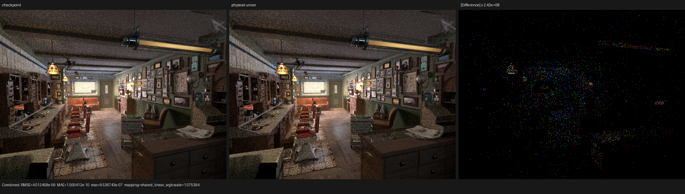
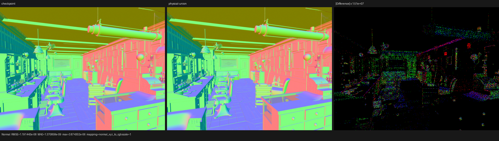
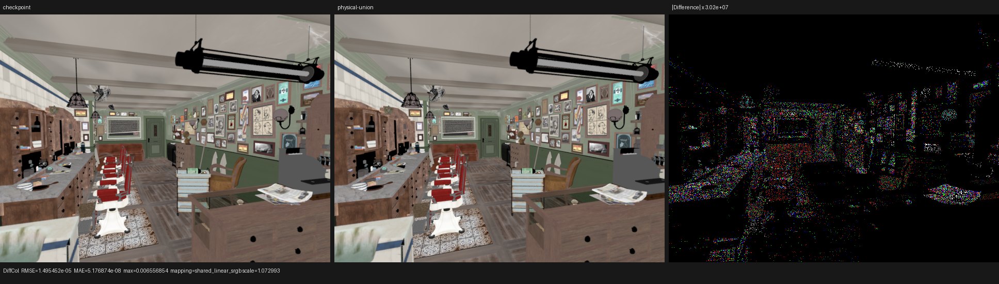

# Tagged physical-closure storage

## Outcome

The post-population physical closure set now stores each closure in two
`float4x4` blocks instead of three. This is a lossless tagged-union projection
of the raw closure parameters, not a baked BSDF response. On the Barbershop
surface kernel, twelve closure slots therefore remove exactly
`12 * 64 = 768` bytes from the private segment.

Three warm-cache HIP profiler samples put `shade_surface` at a 1534.480 ms
median, 2.57% below the preceding state-projection checkpoint and 6.17% below
the original production baseline. Summed renderer-kernel time improved by
2.01% against the checkpoint and 3.91% against the baseline. This is a proven
incremental gain, not completion of the Cycles performance target: Psycles is
still 2.64x Cycles in `shade_surface` and 1.60x in the compared renderer-kernel
sum.

## Root cause

`SurfaceClosurePhysicalRecord` is a logical union of mutually exclusive
families, but its former physical ABI serialized every family simultaneously:

- generic diffuse, sheen, and microfacet fields;
- glass/refraction Fresnel and tint fields;
- BSSRDF radius, albedo, IOR, roughness, and anisotropy.

The resulting three 64-byte matrices were stored in three twelve-element
`Local<float4x4>` arrays. AMDGPU metadata reported a 4320-byte private segment
for the Barbershop surface kernel. The source accounting predicts that removing
one matrix from every slot saves 768 bytes; the compiled kernel reports 3552
bytes, exactly matching that prediction.

Cycles 5.2 remains the only rendering reference. This change follows its
tagged physical-closure model while retaining Psycles' Luisa DSL/JIT design.
No host evaluation, texture pre-baking, or Cycles-produced closure response is
introduced.

## Formal model

Let `K` be the runtime `(kind, lobe)` tag, `A(K)` the fields observable by all
physical consumers for that tag, `F(K)` its generic, glass/refraction, or
BSSRDF payload family, `B(F)` the fields stored by that conservative family,
and `Z` the canonical defaults from `SurfaceClosureRecord::zero()`. The
representation implements `pack` and `unpack` with these obligations:

```text
adequacy:    A(K) is a subset of B(F(K))
injective:   x|B(F) != y|B(F)  =>  pack(K, x) != pack(K, y)
left inverse: unpack(pack(K, x))|B(F) = x|B(F)
canonical:   unpack(pack(K, x))|not B(F) = Z|not B(F)
idempotent:  pack(unpack(pack(K, x))) = pack(K, x) bit-for-bit
```

The two matrices have 32 scalar lanes. Their field partition is:

| Family | Common block | Tagged payload block |
|---|---|---|
| generic | identity/flags, weight/allocation, color/sample weight, normal/roughness | specular tint/diffuse roughness, evaluation scale/metallic, sheen transforms/IOR |
| glass/refraction | identity/flags, weight/allocation, evaluation scale/sample weight, normal/roughness | Fresnel F0/IOR, Fresnel F90/color.x, reflection tint/color.y, transmission tint/color.z |
| BSSRDF | identity/flags, weight/allocation, color/sample weight, normal/roughness | radius/anisotropy, albedo/roughness, BSSRDF IOR/general IOR |

Glass/refraction is the widest member and consumes all 32 lanes:

```text
identity/flags 4 + weight/allocation 4 + sample weight 1 +
normal/roughness 4 + color 3 + dielectric payload 16 = 32
```

Therefore two matrices are sufficient and one matrix cannot represent the
widest member. A conservative family may retain a field unused by one member
tag, but fields outside the selected family canonicalize to `Z` and never alias
a simultaneously observable field. This avoids extra per-kind selects without
weakening semantic adequacy. Pack and unpack use only Luisa expression-level
selects, so the runtime tag remains device data and scene specialization
remains available to the JIT.

## Permanent regression

`test_luisa_surface_closure_physical` now enumerates every concrete closure
kind, exercises the generic, glass/refraction, and BSSRDF layouts with distinct
sentinels, and verifies:

- all fields observable for the selected tag round-trip;
- fields outside the selected payload family become the documented canonical
  defaults;
- repacking a canonical record is bit-identical for both matrices;
- the physical ABI contains exactly two matrices;
- the round-trip helper remains one reused Luisa callable definition.

The collection regression separately checks that physical-profile storage
canonicalizes inactive poison fields while the complete profile still retains
all logical fields.

Build and the 51-test closure/material matrix:

```sh
cmake --build build --parallel 32

LUISA_VULKAN_USE_XIR=1 \
LUISA_VULKAN_REQUIRE_NATIVE_XIR_SPIRV=1 \
LUISA_VULKAN_DISABLE_DXC=1 \
ctest --test-dir build --output-on-failure --parallel 1 -I 128,178
```

Result: 51/51 passed across fallback, HIP, and Vulkan. Strict Vulkan logs
reported native SPIR-V optimization and successful compilation with DXC
disabled.

The complete suite produced 283/289 passes. The same six pre-existing numeric
oracle failures documented by the immediately preceding checkpoint remain:

- `luisa_stacked_volume_fallback`;
- `luisa_homogeneous_volume_fallback`;
- `luisa_area_light_forward_vk`;
- `luisa_volume_path_fallback`;
- `luisa_volume_path_vk`;
- `luisa_volume_triangle_fallback`.

Those failures were previously reproduced against the older binaries with the
same values. No tolerance was relaxed, and the changed physical surface
storage is not executed by their failing volume/light cases.

## Static compiler evidence

Both builds use LuisaCompute `9ff741933`, the exact Blender 5.2 Barbershop
export, and the same HIP compiler pipeline.

| Metric | State-projection checkpoint | Tagged storage | Change |
|---|---:|---:|---:|
| final surface LLVM IR | 3,425,622 B | 3,358,482 B | -1.96% |
| surface code object | 364,448 B | 362,912 B | -0.42% |
| root surface-kernel code | 170,472 B | 168,836 B | -0.96% |
| private segment | 4,320 B | 3,552 B | -17.78% |
| root-kernel VGPRs | 256 | 256 | unchanged |
| reported VGPR spills | 282 | 293 | +11 |

The exact 768-byte private-segment reduction proves the storage attribution.
The root kernel still reaches 256 VGPRs and the compiler reports eleven more
spill instructions, so closure packing is not presented as a complete register
pressure fix.

## HIP performance

The device was an AMD Radeon RX 9070 XT (`gfx1201`) with ROCm 7.2.4. Both
Psycles builds rendered Barbershop at 640x480, 64 spp, staged wavefront, block
size 64, compact surface values, and one surface population per hit. Shader
caches were warm. Times below are GPU dispatch durations from `rocprofv3`.

| Build/sample | `shade_surface` | summed renderer kernels |
|---|---:|---:|
| original production baseline | 1635.322 ms | 2390.231 ms |
| state projection, sample 1 | 1555.016 ms | 2316.572 ms |
| state projection, sample 2 | 1574.894 ms | 2343.734 ms |
| state projection, sample 3 | 1583.952 ms | 2357.914 ms |
| tagged storage, sample 1 | 1551.467 ms | 2323.553 ms |
| tagged storage, sample 2 | 1534.480 ms | 2296.731 ms |
| tagged storage, sample 3 | 1531.667 ms | 2292.462 ms |
| tagged-storage median | 1534.480 ms | 2296.731 ms |
| exact Blender 5.2 Cycles HIP | 582.323 ms | 1436.930 ms |

The three tagged-storage renderer-reported render-only times were 2.63883,
2.61547, and 2.61093 seconds; their median is 2.61547 seconds, 1.43% below the
state-projection median.

The profiled command was:

```sh
env PSYCLES_COMPACT_SURFACE_VALUES=1 \
    PSYCLES_POPULATE_SURFACE_ONCE=1 \
rocprofv3 --kernel-trace -f rocpd -d PROFILE_DIR -o PROFILE_NAME -- \
  build/bin/psycles_render_blender_scene \
  /var/tmp/psycles-official-redownload-20260814/exports/barbershop-5.2 \
  PROFILE_DIR/barbershop.exr hip \
  640 480 64 64 - 0 0 0 0 64 - 1 0 wavefront-staged
```

## Image comparison and visual inspection

The tagged build and state-projection checkpoint used the same exact Blender
5.2.0 LTS release export (`fbe6228777e7`), 640x480, 64 spp, and all 15 film
passes. The comparison tool verified the matching build identities. Every pass
had zero invalid pixels.

| Pass | RMSE | relative RMSE | luminance ratio |
|---|---:|---:|---:|
| Combined | 4.01246e-9 | 2.47471e-8 | 1.000000 |
| Normal | 1.19144e-8 | 2.16020e-8 | 1.000000 |
| Diffuse Color | 1.49545e-5 | 5.72294e-5 | 1.00000014 |
| Diffuse Direct | 2.28929e-5 | 4.80823e-5 | 0.99999971 |

Manual inspection of Combined, Normal, and Diffuse Color found no visible
change in geometry, textures, material regions, silhouettes, or normal
orientation. Amplified differences are sparse numerical noise; the Diffuse
Color 99th-percentile pixel RMSE is only `3.44e-8`, so its larger global maximum
does not form a coherent image feature. Complete pass metrics are in
[`checkpoint-compare.json`](checkpoint-compare.json).






