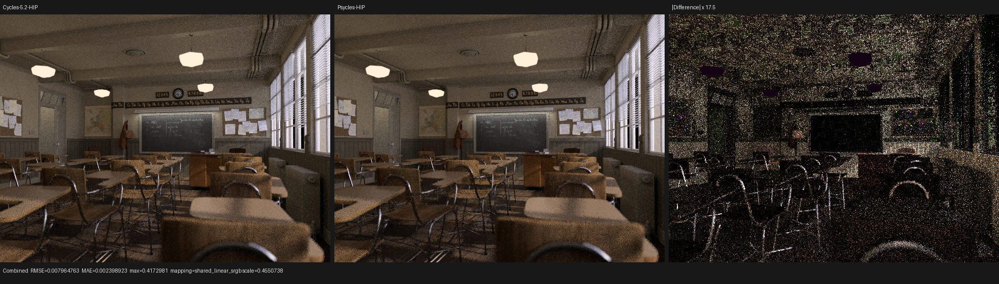
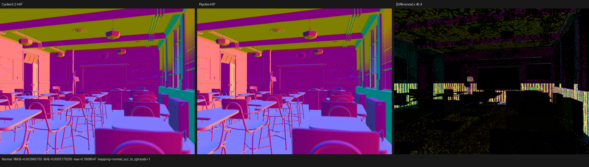
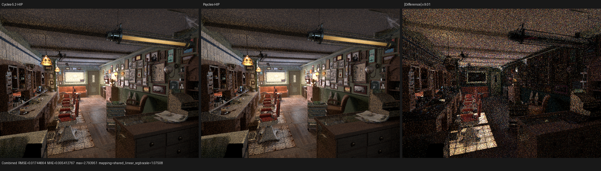
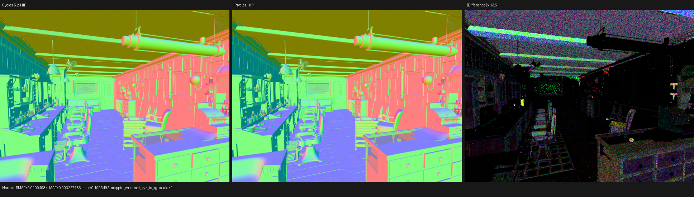
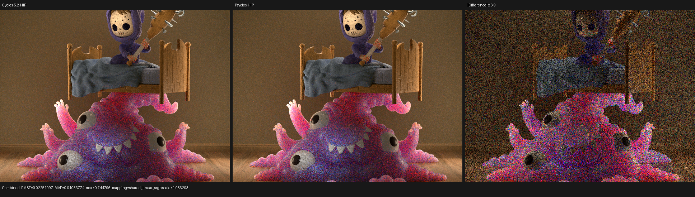
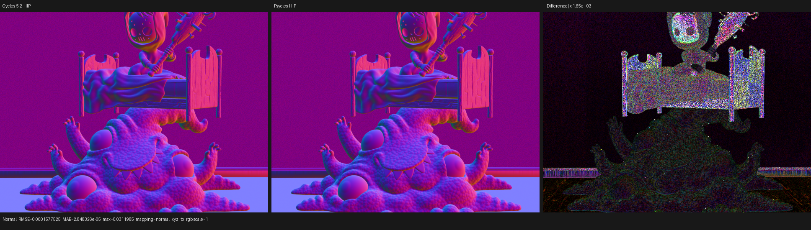

# Pre-surface continuation-roulette checkpoint

## Outcome

Psycles now makes Cycles' continuation-roulette decision in the
`intersect_closest` continuation, after the endpoint and its static material
flags are known but before any volume or surface shader is scheduled. Failed
paths which cannot still contribute surface emission or volume transport are
terminated there. Emissive-surface and active-volume paths retain Cycles'
deferred-termination flags and their required contributions.

This is a semantic scheduling correction, not a scene-specific early-out. On
the RX 9070 XT at 640x480 and 64 fixed spp it removes 25.37% of Classroom's,
22.17% of Barbershop's, and 6.44% of Monster's `shade_surface` invocations.
Median Barbershop render-only time falls from 3.26767 s to 2.74768 s, a 15.91%
reduction (1.189x speedup). The coroutine frame remains unchanged: 440 B for
Classroom, 848 B for Barbershop, and 496 B for Monster.

The corrected whole-render HIP kernel gaps to Cycles 5.2 are now 1.57x for
Classroom, 1.71x for Barbershop, and 1.78x for Monster. Closest intersection is
already faster than the matched Cycles kernel in all three scenes; the
remaining dominant structural gap is surface shading, which is 2.86x to 3.62x
slower for nearly equal active work.

## Formal transfer model

Let:

- `p` be Cycles' continuation probability, with `0 <= p <= 1`;
- `u` be the `PRNG_TERMINATE` Sobol sample;
- `E` mean that the committed surface's static shader flags may emit;
- `V` mean that the volume stack is non-empty.

The failed-roulette predicate is

```text
F = (p != 1) and ((p == 0) or (u >= p)).
```

The four observable outcomes are

```text
survive              = not F
defer_to_surface     = F and E
defer_to_volume      = F and not E and V
terminate_immediately = F and not E and not V.
```

For a failed decision, the three terminating outcomes are pairwise disjoint.
Their disjunction is `F`, so they are exhaustive. Surface emission has priority
over volume deferral exactly as in Cycles
`intern/cycles/kernel/integrator/intersect_closest.h`:
`integrator_intersect_terminate()` first tests `SD_HAS_EMISSION`, then the
volume stack, then immediate termination. No epsilon, object name, material
name, or backend identity enters the relation.

The transfer preserves contribution order:

1. An immediately terminated path has no remaining surface emission or active
   volume, so later shading is observationally dead.
2. `TERMINATE_ON_NEXT_SURFACE` lets volume attenuation/emission and surface
   emission execute, then stops before closure scattering.
3. `TERMINATE_IN_NEXT_VOLUME` lets volume attenuation/emission execute while
   suppressing phase scattering.
4. A survivor divides throughput by `p` exactly once, at the first surface or
   volume scatter, as Cycles does.

`PRNG_TERMINATE` remains a pure lookup from the unchanged global sample,
pixel hash, path RNG offset, and Sobol dimension. Removing it from the bundled
surface-light random state therefore changes neither the sample nor subsequent
RNG dimensions. Stored BSSRDF exits bypass closest traversal as before, and a
lamp/background endpoint runs continuation roulette only when an active volume
segment still precedes it.

## Regression contract

`test_luisa_cycles_path_state.cpp` records the transfer directly in Luisa DSL.
Its truth table covers `p=1`, `p=0`, an interior survivor, the exact `u=p`
failure boundary, immediate termination, surface deferral, volume deferral,
and surface priority when both `E` and `V` hold. The same kernel passes on
fallback, HIP, and Vulkan.

The implementation also removes the obsolete
`continuation_decided_in_volume` frame value and the duplicated roulette from
the volume and surface stages. Only `intersect_closest` decides; later stages
consume the probability and deferred flags. This makes a second random
decision or a second probability computation structurally impossible.

## Reference provenance

The oracle and exports are Blender 5.2.0 LTS, source commit `fbe6228777e7`.
Adaptive sampling and denoising are disabled. Barbershop's verified export has
1,055 geometries and 1,109 instances.

During this checkpoint an older Blender 5.3 Alpha Barbershop export with 1,649
geometries and 2,565 instances was detected in a legacy benchmark directory.
It had accidentally been paired with a 5.2 Cycles image during an exploratory
manual run. Those image and performance comparisons are invalid and are not
used below. The benchmark runner already checks exact Blender build identity;
the final commands use the explicitly verified 5.2 bundles.

## HIP performance

All rows use the same staged coroutine scheduler, 32-thread continuation
blocks, a 1,048,576-frame capacity, 64 samples per host dispatch, and
Tabulated Sobol. Times are rocprofv3 kernel traces unless marked as the
four-run no-profiler median.

| scene | old render | new render | reduction | old Psycles kernels | new Psycles kernels | Cycles kernels | new/Cycles |
| --- | ---: | ---: | ---: | ---: | ---: | ---: | ---: |
| Classroom | 1.65586 s | 1.40380 s | 15.22% | 1.51371 s | 1.26747 s | 0.80646 s | 1.57x |
| Barbershop 5.2 | 3.29500 s | 2.76518 s | 16.08% | 2.93291 s | 2.42976 s | 1.41896 s | 1.71x |
| Monster | 2.01376 s | 1.96658 s | 2.34% | 1.84254 s | 1.79055 s | 1.00797 s | 1.78x |
| Barbershop 5.2, no profiler | 3.26767 s | 2.74768 s | 15.91% | - | - | - | - |

The queue counters prove that this is dead-work elimination rather than a
timing coincidence:

| scene | old `shade_surface` work | new work | reduction | old shade time | new shade time | closest work change |
| --- | ---: | ---: | ---: | ---: | ---: | ---: |
| Classroom | 62,402,662 | 46,572,893 | 25.37% | 1.14769 s | 0.89265 s | +6 instances |
| Barbershop 5.2 | 68,938,462 | 53,654,171 | 22.17% | 2.19377 s | 1.66775 s | exactly zero |
| Monster | 43,292,238 | 40,505,408 | 6.44% | 1.11514 s | 1.04439 s | -3 instances |

Moving probability evaluation and the static emission-flag read into
`intersect_closest` makes that continuation modestly more expensive. On
Barbershop its time rises from 321.973 ms to 359.429 ms for exactly 71,117,579
executed instances, or from 4.527 ns to 5.054 ns per instance. The saved
surface work is much larger: shade time falls 23.98%, and total Psycles kernel
time falls 17.16%.

## Matched kernel diagnosis

The corrected 5.2 inputs change the performance diagnosis. Grid work and
semantic stages are matched to Cycles' HIP wavefront kernels:

| scene | Psycles/Cycles `shade_surface` | Psycles/Cycles `intersect_closest` | other notable stage |
| --- | ---: | ---: | ---: |
| Classroom | 3.11x | 0.57x | - |
| Barbershop 5.2 | 2.86x | 0.79x | - |
| Monster | 3.62x | 0.79x | `intersect_subsurface`: 0.86x |

For Barbershop, Psycles shades 53.65 M instances versus Cycles' 54.06 M, so
the 2.86x surface ratio is not a queue-population artifact. Conversely,
Psycles closest intersection uses 359.43 ms versus Cycles' 457.72 ms. Further
generic HIPRT closest-hit surgery is therefore not justified by this profile;
the next optimization target is the surface SVM/closure evaluator's live
ranges, spills, and instruction count. The new Barbershop surface kernel still
uses 256 VGPR and 4,544 B scratch per workgroup.

## Image validation

The scheduling change preserves the estimator. Old/new Combined comparisons
are limited to parallel accumulation noise:

| scene | Combined RMSE | relative RMSE | luminance ratio |
| --- | ---: | ---: | ---: |
| Classroom | 5.88e-9 | 1.51e-8 | 1.000000 |
| Barbershop 5.2 | 1.90e-6 | 1.17e-5 | 1.000000 |
| Monster | 1.02e-8 | scene-relative 6.4e-8 | 1.000000 |

Full Combined, Normal, color, direct/indirect, emission, environment,
transmission, and volume-pass metrics are retained in [reports](reports/).
The triptychs below were inspected at full resolution. Classroom retains the
same desks, clock, doorway, lamp boundaries, and window illumination; its
Normal residual is concentrated around window slats, thin geometry, and
ceiling detail. Corrected Barbershop 5.2 retains the Cycles floor, ceiling,
walls, cabinets, and texture orientation; its residual is strongest in the
sun patch, ceiling fixtures, cabinet edges, and indirect/glossy transport.
Monster retains every silhouette and material region; the remaining Combined
residual follows the SSS creature and bed lighting, while its Normal RMSE is
only 0.000158. There is no image flip, missing object population, new RR bias,
or new structured difference caused by this scheduling change.













## Commands and verification

The renderer command was the following, with only the scene and output paths
changed between runs:

```text
LUISA_CORO_WAVEFRONT_STATS=1 LUISA_CORO_SHADER_MAP=1 \
rocprofv3 --kernel-trace --output-directory <profile> -- \
./build/bin/psycles_render_blender_scene <verified-5.2-export> <out.exr> \
hip 640 480 64 64 - 0 0 0 0 64 - 1 0 wavefront-staged \
32 32768 32 1 1 0 4 2 4096 131072 0 0 1
```

The repository build uses all 32 workers:

```text
cmake --build build --parallel 32 \
  --target psycles_render_blender_scene \
           psycles_luisa_cycles_path_state_tests
```

Focused backend verification:

```text
ctest --test-dir build --output-on-failure \
  -R '^psycles\.luisa_cycles_path_state_(fallback|hip|vk)$' -j 3
```

All three tests pass. The complete-suite and strict native-XIR Vulkan canary
run used `ctest --test-dir build --output-on-failure -j 32`. It passed 277 of
286 tests; `psycles.luisa_compact_surface_preparation_vk`, which requires
`LUISA_VULKAN_REQUIRE_NATIVE_XIR_SPIRV=1`, passed.

The nine failures were A/B checked against unmodified commit `9b9a344`. Eight
runtime failures reproduce there with the same outputs: six existing
fallback/Vulkan volume or area-light numerical fixtures, the pre-existing
`cycles_closure_transparent_order` 11,529-instruction result above its 11,000
ceiling, and the pre-existing native Vulkan curve-path `restructure_cfg`
failure. The ninth is the unchanged 2,207-line
`tests/test_surface_program_metadata.cpp` source-size violation. They are not
caused by this continuation transfer and are retained as explicit follow-up
work rather than hidden with looser tolerances or a DXC fallback.
