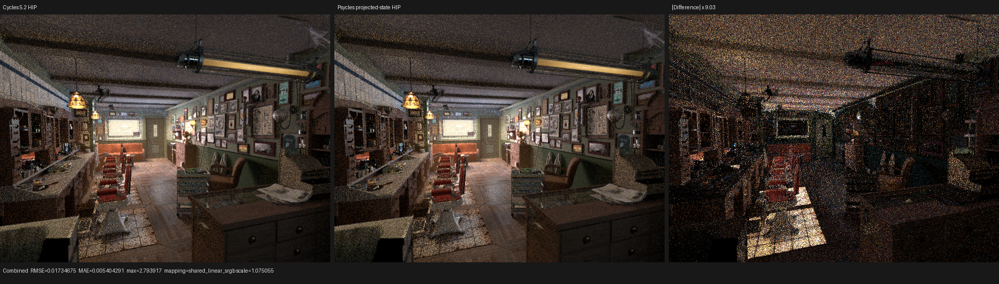
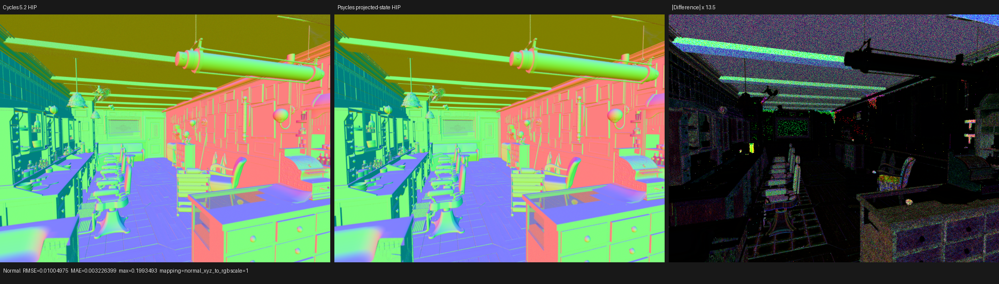
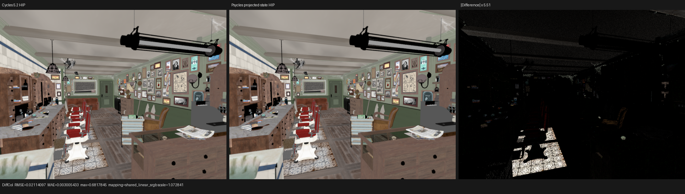

# Surface-value transaction state projection

## Outcome

The compact surface-value interpreter no longer carries an eager, by-value
`SurfacePointCall` transaction through every opcode. The immutable point is
passed by reference, each statically selected semantic handler reconstructs
only the fields it observes, and the interpreter carries only a phase bit and
the current shading normal.

This is a source-level liveness fix. It adds no HIP-specific inline advisor and
no `inline`/`noinline` attribute. LLVM remains responsible for its final
inlining choice.

On the RX 9070 XT Barbershop profile, the surface interpreter dropped from 253
to 216 VGPRs. Three `rocprofv3` samples put `shade_surface` at a 1574.894 ms
median, 3.70% below the 1635.322 ms production baseline. Median Psycles GPU
kernel time improved by 1.95%. Psycles is not yet as fast as Cycles: the same
profile is still 2.70x Cycles in `shade_surface` and 1.63x in summed renderer
kernels.

## Root cause

The previous value-program callable accepted and returned `SurfacePointCall`
by value. At entry it unpacked every field, copied an automatic-normal
transaction point, and retained that aggregate across the bytecode loop. The
mutually exclusive opcode bodies were not the dominant live state: the common
aggregate ABI was. AMDGPU assembly confirmed 253 VGPRs in the value
interpreter even though individual semantic handlers needed only 21-120.

Cycles 5.2 provides the architectural reference, not a CPU reference model.
`intern/cycles/kernel/svm/svm.h::svm_eval_nodes` passes `ShaderData *sd` to its
SVM handlers, and helpers in `intern/cycles/kernel/svm/util.h` demand-load the
fields they need. Psycles retains its own typed, scene-specialized Luisa DSL
interpreter and original Blender closure graph; it does not copy Cycles kernel
text or pre-bake materials.

## Formal state model

Let `P` be the immutable base `SurfacePoint`, `U` a Boolean indicating that
execution is still in the undisplaced automatic-normal prefix, and `N` the
current transaction shading normal. Define the projection `Pi(P, U, N)` as:

- `shading_normal = N`;
- `position`, `object_position`, `object_shading_normal`, `dPdx`, `dPdy`,
  `object_dPdx`, and `object_dPdy` select the corresponding undisplaced field
  exactly when `U` is true;
- every other field is the corresponding field of `P`.

Initialization is:

```text
U0 = program uses undisplaced automatic-normal geometry
N0 = U0 ? P.undisplaced_shading_normal : P.shading_normal
```

A normal-transition bytecode record performs:

```text
(U, N) := (false, normal_result)
```

All ordinary value instructions leave `(U, N)` unchanged. Typed-bank address
reads used by the transition observe only `P.parameter_block`, which the
projection never changes.

The equivalence proof is by induction over instruction position:

1. Before the first instruction, the old `automatic_normal_point` result is
   exactly `Pi(P, U0, N0)`.
2. For an ordinary instruction, the old and new handlers observe the same
   projected point and typed banks, produce the same bank write, and preserve
   the transaction state.
3. At the transition, the old implementation restored the seven displaced
   geometry fields and set `shading_normal = normal_result`; this is exactly
   `Pi(P, false, normal_result)`.
4. At termination, the only point field observable by the caller is
   `shading_normal`. Returning `N` and assigning that field is therefore
   equivalent to returning the whole transaction point. Typed-bank side
   effects remain reference arguments in both programs.

The implementation exposes one Luisa callable boundary per active exact
semantic variant. This gives host-side code a maintainable typed component
boundary while allowing the backend compiler to merge or inline handlers when
profitable.

## Static compiler evidence

The following artifacts came from the same Barbershop scene and HIP compiler
pipeline. The baseline is parent Psycles revision `f284867`; LuisaCompute is
`9ff741933` in both cases.

| Metric | Baseline | Projected state | Change |
|---|---:|---:|---:|
| final surface LLVM IR | 3,632,957 B | 3,425,622 B | -5.71% |
| surface code object | 381,344 B | 364,448 B | -4.43% |
| surface kernel machine code | 192,528 B | 163,764 B | -14.94% |
| value interpreter VGPRs | 253 | 216 | -14.62% |
| surface kernel scratch | 4,576 B | 4,384 B | -4.20% |
| surface kernel VGPRs | 256 | 256 | unchanged |

The full kernel still reaches 256 VGPRs, so this checkpoint removes one proven
source of pressure rather than claiming the whole surface kernel is solved.

## HIP performance

Hardware was an AMD Radeon RX 9070 XT (`gfx1201`) with ROCm 7.2.4. The render
was Barbershop at 640x480, 64 spp, staged wavefront, block size 64, compact
surface values enabled, and one surface population per hit. Shader caches were
warm. Timings below are GPU dispatch durations from `rocprofv3`, not scene
loading or shader compilation.

| Build/sample | `shade_surface` | summed renderer kernels |
|---|---:|---:|
| parent production baseline | 1635.322 ms | 2390.231 ms |
| projected state, sample 1 | 1555.016 ms | 2316.572 ms |
| projected state, sample 2 | 1574.894 ms | 2343.734 ms |
| projected state, sample 3 | 1583.952 ms | 2357.914 ms |
| projected-state median | 1574.894 ms | 2343.734 ms |
| exact Blender 5.2 Cycles HIP | 582.323 ms | 1436.930 ms |

Relative to the production baseline, the median gains are 3.70% in
`shade_surface` and 1.95% across renderer kernels. Relative to Cycles,
projected-state Psycles remains 2.70x in `shade_surface` and 1.63x overall.
This keeps the remaining performance target explicit.

The profiled command was:

```sh
env PSYCLES_COMPACT_SURFACE_VALUES=1 \
    PSYCLES_POPULATE_SURFACE_ONCE=1 \
rocprofv3 --kernel-trace -f rocpd -d PROFILE_DIR -o PROFILE_NAME -- \
  build/bin/psycles_render_blender_scene \
  /var/tmp/psycles-official-redownload-20260814/exports/barbershop-5.2 \
  PROFILE_DIR/barbershop.exr hip \
  640 480 64 64 - 0 0 0 0 64 - 1 0 wavefront-staged
```

That historical performance export lacks an exact Blender build sidecar, so
it is used only for within-Psycles A/B timing. Image comparison against Cycles
was rerun separately with the exact Blender 5.2 export described below.

## Regression coverage

The compact-surface differential fixture now gives every undisplaced geometry
field a value distinct from its displaced counterpart. Compact and expanded
execution therefore cannot agree if the phase projection is accidentally
reversed or a field is omitted. A structural AST regression additionally
requires:

- `float3` as the value-program result;
- exactly one `SurfacePointCall` argument, passed by reference;
- one named semantic-handler call site per active exact variant.

The test helpers were moved into the existing
`compact_surface_program_test_support.h/.cpp` translation unit. The main test
source is 1,999 lines after the change.

Build and focused validation:

```sh
cmake --build build --parallel 32

LUISA_VULKAN_USE_XIR=1 \
LUISA_VULKAN_REQUIRE_NATIVE_XIR_SPIRV=1 \
LUISA_VULKAN_DISABLE_DXC=1 \
ctest --test-dir build --output-on-failure --parallel 1 \
  -R 'psycles\.(surface_program_metadata|surface_svm_(math_immediate|vector_math_immediate|record_immediates)|normal_map_semantics|luisa_(compact_surface_preparation|surface_mix_svm|surface_math_svm|surface_vector_math_svm|normal_map|normal_map_callable|bump_callable|noise_callable)_(fallback|hip|vk))$'
```

Result: 29/29 passed. This covers fallback, HIP, and Vulkan with strict native
XIR to SPIR-V routing. Cold strict Vulkan logs reported `SPIR-V optimization
preset 'compute'` and `SPIR-V compilation successful`; DXC was disabled.

The full 289-test suite passed 283 tests. Six pre-existing numerical-oracle
failures remain in fallback volume and Vulkan light/volume tests. Each produced
the identical failing values with the older `2c77339` binaries:

- `luisa_stacked_volume_fallback`;
- `luisa_homogeneous_volume_fallback`;
- `luisa_area_light_forward_vk`;
- `luisa_volume_path_fallback`;
- `luisa_volume_path_vk`;
- `luisa_volume_triangle_fallback`.

They are recorded rather than hidden or loosened ad hoc; none executes the
changed surface-value path in the failing case. Their tolerance model requires
a separate formal audit.

## Exact Cycles comparison and visual inspection

The comparison used Blender 5.2.0 LTS, release build
`fbe6228777e7`, for both the Cycles HIP golden and the Psycles export. The
comparison tool verified all build-identity fields before reading either
image. Both renderers used 640x480 and 64 spp with Cycles adaptive sampling
disabled.

Key pass results are:

| Pass | RMSE | relative RMSE | luminance ratio |
|---|---:|---:|---:|
| Combined | 0.0173468 | 0.107200 | 0.999580 |
| Normal | 0.0100497 | 0.018290 | 1.003860 |
| Diffuse Color | 0.0211410 | 0.080620 | 0.997216 |
| Diffuse Direct | 0.0345660 | 0.072587 | 0.999643 |
| Glossy Color | 0.0007970 | 0.004398 | 1.000542 |

All 15 exported passes had zero invalid pixels. Complete metrics are in
[`cycles-compare.json`](cycles-compare.json).

Manual inspection of the three images below found matching camera geometry,
texture placement, material regions, silhouettes, and surface-normal
orientation. The amplified residuals show Monte Carlo/lobe differences but no
new coherent transform, UV, or transaction-phase error.






