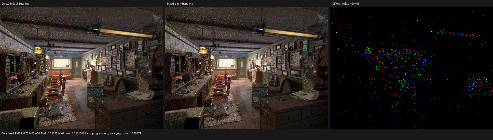
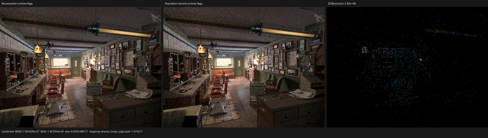
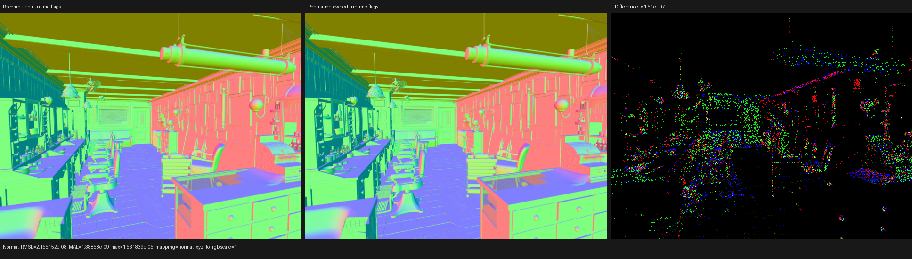
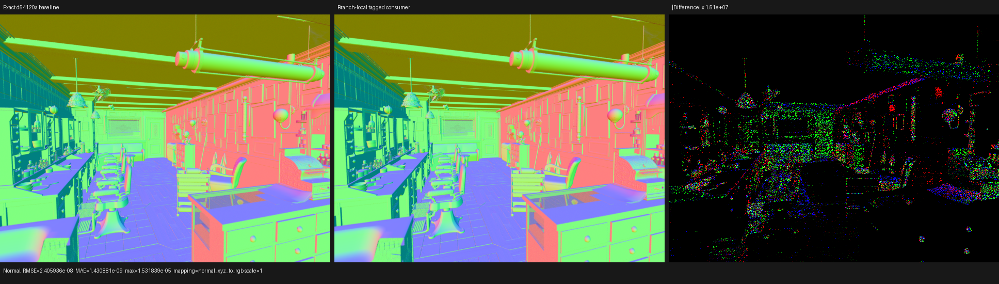
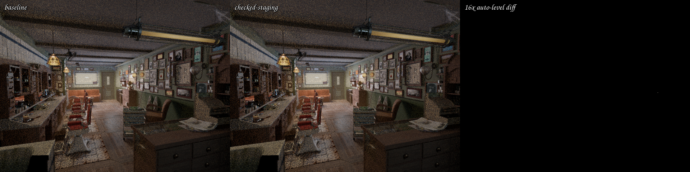

# Cycles 5.2 surface/SVM gap audit

## Outcome

Psycles already has a real, data-driven surface SVM. It is not a material
graph demo and it does not expand one shader AST per material. The current
implementation deduplicates scene topologies, schedules a strict typed DAG,
colors typed value lifetimes, packs operands, interprets scene data, and emits
only the semantic handler variants reachable by the loaded scene.

The remaining gap to Cycles is split across two independent boundaries:

1. Blender 5.2 node and closure semantics are not complete. Of the 93
   constructible Cycles shader-node types, 67 have a source route in the
   Blender adapter or are structural output roots and 26 do not. Several of
   the routed nodes are intentionally partial.
2. Post-population physical closures are stored as a tagged sum. The hot
   evaluation and sampling path now keeps the tag through a family dispatch,
   loads the payload only in the selected family block, and passes a compact
   `Common x Payload_family` staging record to the family handler. No hot
   handler can name another family's payload, and only the consumer result is
   merged. The universal record remains a producer/packing compatibility API,
   not the domain of the packed hot consumer.

The second difference remains a measured performance boundary. On the newest
interleaved 640x480, 64-spp Barbershop HIP traces, after single-pass transparent
population, the surface continuation costs 27.130 ns per launched item. The
retained Cycles 5.2 trace costs 10.778 ns per item, so the current normalized
gap is approximately 2.52x. Psycles still reaches 256 VGPRs; its full-scene
private allocation is 3,296 B while Cycles uses 192 VGPRs and 6,976 B private
storage. The result cannot be explained by private bytes alone.

The first part of this audit introduced the checked physical-closure access
boundary. The follow-up documented below implements consumer-directed family
elimination without returning a product of mutually exclusive payloads. A
first version accidentally transported the counted-prefix witness across a
runtime CFG edge and enlarged the coroutine frame from 880 B / 178 fields to
1,584 B / 189 fields. Reconstructing the witness inside the dominated family
block restores 880 B / 178 fields. The accepted result is performance-neutral:
`shade_surface` changes by -0.145% and render-only time by +0.238% in an A/B/B/A
profile. This is a formal staging and representation result, not a speedup
claim. It is covered by fallback/HIP/native-XIR-Vulkan regressions, complete
46-channel EXR comparison, and Combined/Normal triptychs.

The next follow-up removes the universal per-family adapters. It reduces the
surface code object by 1,024 B and the optimized LLVM module by 194 lines, with
the frame fixed at 880 B / 178 fields. Its interleaved HIP result is -0.072% in
normalized `shade_surface` time and -0.084% render-only, both noise. This is an
enforced non-interference and maintainability result, not a speedup claim.

The latest follow-up makes the populated closure sequence the single owner of
the ShaderData-equivalent runtime flags. Sampling no longer re-derives those
flags in both categorical scans and again for the chosen closure. It preserves
the 880 B / 178-field frame, reduces the main object by another 128 B, and
improves normalized `shade_surface` by 0.369% in an interleaved A/B/B/A trace.
The gain is small but repeatable in both samples and follows from removing
executed duplicate work rather than changing closure semantics or control-flow
shape.

The per-handler oracle has now isolated the first large closure-local defect.
Psycles eagerly evaluated both GGX and Beckmann VNDFs and evaluated a VNDF plus
the finite-direction evaluator even in the disjoint delta domain. The formal
domain partition in
[microfacet-domain-partition](../microfacet-domain-partition/README.md) reduces
the singular GGX probe from `3.35..3.60 ms` to a `0.822905 ms` median, slightly
faster than the corresponding Cycles 5.2 probe. It does not measurably change
Barbershop: the 64-spp render and `shade_surface` stage remain noise-level.
Regular GGX is still 47.6% slower than Cycles because Psycles' generic path
samples and then reconstructs the selected closure's expensive intermediates
in a separate evaluator.

## Reference identity

- Original audit Psycles point: `717176eebc7b47e7d1b55db6dcc9e00f7285ff3b`.
- Branch-local consumer baseline: `d54120a`.
- Population-owned runtime-flag baseline: `dc95f23`.
- LuisaCompute: `eeda4b154fcf43e8709d1b42478e958677b9c6ae`.
- Cycles source: `blender-v5.2-release` at
  `9e2066aef7ef7e20c142ad7bd3303138a4304c93`.
- Render oracle: Blender 5.2.0 LTS, build hash `fbe6228777e7`.
- Device: AMD Radeon RX 9070 XT, `gfx1201`, ROCm 7.2.4.

The source checkout is newer than the exact release binary. Source structure
claims below use the checkout; render and profiler claims use the release
binary and its recorded build identity.

## Branch-local tagged-consumer follow-up

### Formal decomposition

Let `K` be the finite set of reachable physical closure kinds, `C` the common
record decoded from physical block 0, `P_f` the payload of family `f`, and
`R_j` the compact result of consumer `j`. Evaluation uses the disjoint cover

```text
G = {Principled, Glossy, ThinGlassTransmission}
D = {Glass, Refraction}
C0 = K - G - D
```

and conditional sampling additionally splits

```text
B = {BSSRDF}
C1 = K - G - D - B.
```

The implementation records the following eliminator:

```text
consume_j(common, load_payload) =
  if tag in D: consume_j(decode_D(common, load_payload()), K intersect D)
  if tag in B: consume_j(decode_B(common, load_payload()), K intersect B)
  if tag in G: consume_j(decode_G(common, load_payload()), K intersect G)
  otherwise:   consume_j(decode_C(common),                 K intersect Cn)
```

`B` is absent from evaluation because its directional evaluation needs only
common fields. The family sets are pairwise disjoint and their union is `K`.
The reachability meet is part of the proof: the canonical inner consumer cannot
reintroduce a kind or Principled lobe excluded by the predicate which dominates
it. Only `SurfaceClosureEvaluationContributionCall` or
`SurfaceClosureConditionalSampleCall` crosses the merge. No union of mutually
exclusive payloads is returned to the closure loop.

`SurfaceClosurePhysicalPayloadLoader` is a host/JIT thunk, not a device
callable or a new IR entity. Invoking it while recording a family `$if` places
the Local read in that device CFG block. A device-side counter regression runs
all ten represented closure kinds and proves exact payload-read multiplicity:
zero for common-only kinds, two for General/Dielectric (evaluation plus
sampling), and one for BSSRDF (sampling only). It also compares the original
product decoder, the raw two-block eliminator, and the lazy storage-aware
eliminator for both consumer result tuples.

### Counted-prefix witness and the rejected 1,584-byte frame

For a physical arena with mutable count `n`, slot zero is initialized
unconditionally and every append initializes slot `n` before incrementing it.
For requested index `i`, `physical_access()` constructs

```text
valid = i < n
safe  = valid ? i : 0
safe < max(n, 1).
```

The existing coroutine Local analysis intentionally proves this relation from
the mutable `n` snapshot in the block containing the access. It does not guess
that a snapshot transported across arbitrary CFG edges is equal to the value
observed after the edge. The first lazy implementation captured an access
witness before the runtime family branch and reused it inside the branch. The
analysis therefore failed closed and retained the eleven otherwise dormant
payload matrices `_physical_1[1..11]` across the coroutine transitions:

```text
11 entries * 64 B/float4x4 = 704 B
880 B + 704 B = 1,584 B.
```

The cold layout contained 189 fields instead of 178. This was not padding and
was not fixed by adding a compiler special case. The accepted source rebuilds
`physical_access(i)` inside the family block which performs the payload read,
so the initialized-prefix proof and the read share one dominance region. A
permanent coroutine regression in `test_luisa_surface_population.cpp` exercises
this exact tag-then-payload shape and requires the physical arena to contribute
zero frame fields.

### Rejected alternatives and accepted fixed point

| Form | Frame | Final LLVM | HIP object | Private | `shade_surface` |
|---|---:|---:|---:|---:|---:|
| exact `d54120a` product baseline | 880 B / 178 | 57,966 lines | 356,640 B | 3,136 B | 28.064 ns/item median |
| nested family callable | 880 B | 63,922 lines | about 395 KB | 3,320 B | 30.148 ns/item |
| direct branch-local eliminator | 880 B | 58,014 lines | 356,384 B | 3,136 B | no repeatable gain |
| lazy loader with cross-CFG witness | 1,584 B / 189 | not retained | not retained | not retained | rejected before profiling |
| lazy loader with local witness | 880 B / 178 | 58,028 lines | 356,512 B | 3,136 B | 28.024 ns/item median |

The nested callable moved source code but enlarged the optimized program and
slowed the stage by 8.57%; it was removed. The direct form and accepted lazy
form show that branch placement alone does not make the backend execute less
work. The accepted code object is 128 B smaller than the exact baseline, while
final LLVM changes from 3,382,894 B / 57,966 lines to 3,386,673 B / 58,028
lines. Textual `phi` changes 2,806 to 2,831, `select` 2,596 to 2,567, and the
number of definitions/calls remains 13 / 3,342. VGPR stays at 256; private
storage stays 3,136 B; VGPR spills change from 383 to 382. The production cold
build reports 9 subroutines, 178 fields, 880 B, and stage hash
`24ec46cc4e919e42`.

The retained A/B/B/A HIP sequence used identical 640x480, 64-spp fixed-sample
Barbershop commands:

| Run | Render-only | `shade_surface` ns/item |
|---|---:|---:|
| baseline A | 2.57619 s | 27.973704 |
| candidate A | 2.58499 s | 27.965865 |
| candidate B | 2.59003 s | 28.081830 |
| baseline B | 2.58654 s | 28.155292 |
| baseline median | 2.581365 s | 28.064498 |
| candidate median | 2.587510 s | 28.023847 |

The candidate is -0.145% in normalized stage time and +0.238% in render-only
time. Both are noise; no runtime speedup is claimed. The structural result is
still useful because it establishes a correct lazy tagged-consumer boundary
without a coroutine-frame or code-object regression. The compact typed-handler
follow-up below performs the next representation step. Adding more
renderer-side branches by itself is not supported by this evidence.

### Compact typed family handlers

The retained handler interface models the physical closure as

```text
Physical = Common x (Unit + General + Dielectric + Bssrdf).
```

`SurfaceClosurePhysicalCommonOnlyRecord`,
`SurfaceClosurePhysicalGeneralRecord`,
`SurfaceClosurePhysicalDielectricRecord`, and
`SurfaceClosurePhysicalBssrdfRecord` are host-side bundles of Luisa
expressions. They add neither a device-memory ABI nor an XIR entity. Their C++
domains encode the non-interference proof: for example, a General handler has
no dielectric Fresnel or BSSRDF radius member, while a BSSRDF handler has a
semantic `bssrdf_ior` member and no generic dielectric `ior` member.

For family `f`, packed and direct producers share the same handler, and the
required commuting law is

```text
handler_f(unpack_f(pack(x))) = handler_f(project_f(x)).
```

The differential kernel checks that law for every represented closure kind and
for evaluation and sampling result tuples. Compile-time concepts additionally
make cross-family payload access ill-formed. This mirrors the relevant Cycles
structure: a base `ShaderClosure` is classified by type and then interpreted as
the matching compact closure payload; it does not reconstruct a universal
product before every BSDF operation.

An early version split BSSRDF evaluation into a new CFG arm and changed one
fallback diffuse result by one ULP, while HIP and Vulkan remained bit exact.
BSSRDF directional evaluation observes only `Common`, so the formal evaluation
partition already places it in the common-only family. Restoring that partition
also restores the original arithmetic/merge ordering under fallback fast math.
The exact-bit reachability test was retained and its diagnostic now prints both
float values and bit patterns; no tolerance was weakened.

Cold Barbershop production metrics relative to exact `31e2ab5` are:

| Form | Frame | Final LLVM | HIP object | Entry | Private / VGPR / spills |
|---|---:|---:|---:|---:|---:|
| lazy universal adapters | 880 B / 178 | 58,028 lines / 3,386,673 B | 356,512 B | 296,872 B | 3,136 B / 256 / 382 |
| compact typed handlers | 880 B / 178 | 57,834 lines / 3,376,707 B | 355,488 B | 295,880 B | 3,136 B / 256 / 384 |

The typed form removes 14 textual `phi`, 16 `select`, and 27 `call`
occurrences; definitions remain 13. The two additional reported VGPR spills do
not change the 3,136-byte private allocation, so the device result, rather than
the smaller text alone, remains decisive.

The same-machine A/B/B/A HIP sequence used 640x480, 64 fixed samples,
Tabulated Sobol, staged wavefront, 32-thread continuation blocks, and adaptive
sampling disabled:

| Run | Render-only | `shade_surface` ns/item |
|---|---:|---:|
| baseline A | 2.57198 s | 27.856133 |
| typed A | 2.56349 s | 27.791101 |
| typed B | 2.56559 s | 27.835435 |
| baseline B | 2.56143 s | 27.810585 |
| baseline median | 2.566705 s | 27.833359 |
| typed median | 2.564540 s | 27.813268 |

Normalized `shade_surface` changes by -0.072%; render-only changes by -0.084%.
Both are noise. The result proves that the stronger type boundary is safe and
slightly reduces generated structure, but it does not yet remove enough
executed scattering work to explain the 2.58x Cycles gap measured at that
checkpoint.

The 46-channel baseline/typed EXRs have mean absolute error `9.5861e-8`, RMS
`1.784e-4`, PSNR `123.853 dB`, and 55 pixels (`0.0179%`) over `1e-6`.
Combined has MAE `1.03645e-7`, RMSE `5.76346e-5`, and mean-luminance ratio
`0.99999848`; Normal has MAE `1.41769e-9` and RMSE `2.40553e-8`. I inspected
both triptychs at original resolution. Geometry, UVs, floor, ceiling, brick
wall, cabinet, material response, lighting, and normals coincide; the amplified
difference is sparse sampling/atomic-order noise rather than a coherent region.




### Compact SVM versus topology expansion

The compact surface route was also tested against the retained diagnostic
oracle which expands every deduplicated material topology into the shader AST.
This isolates the representation choice while keeping the same scene,
physical closure consumers, scheduler, samples, and HIP backend. It is not a
comparison against a simplified CPU implementation.

| Run | Render-only | `shade_surface` ns/item | Private bytes |
|---|---:|---:|---:|
| expanded A | 2.68987 s | 30.002956 | 3,944 |
| compact A | 2.56901 s | 27.715297 | 3,136 |
| compact B | 2.56493 s | 27.674820 | 3,136 |
| expanded B | 2.68922 s | 30.005483 | 3,944 |
| compact median | 2.566970 s | 27.695058 | 3,136 |
| expanded median | 2.689545 s | 30.004219 | 3,944 |

The compact SVM is 7.696% faster in normalized `shade_surface` time and 4.557%
faster render-only. The expanded surface shader cache payload is 1,989,501 B
versus roughly 357 KB for the compact route, and loading/constructing the
expanded shader set takes about 85.5 s in each retained profiled process. This
controlled result rejects the hypothesis that the SVM interpreter is the
source of the present surface gap. Expanding 189 topologies makes both code
size and execution worse; the remaining work is inside the post-population
consumer and individual node/closure algorithms.

### Population-owned runtime flags

Let the retained physical closure sequence be
`S = (c_0, ..., c_(n-1))`, let `b` be the back-facing bit, and let
`flags(c_i, r)` be the Cycles identity/setup flags for closure `c_i` at glossy
filter roughness `r`. Population now owns the fold

```text
F_0     = b
F_(i+1) = F_i OR flags(c_i, r)
F       = F_n.
```

The public preparation/pass projection is independently
`preparation_flags(q) = q ? F : 0`, while every later sample consumer observes
`sample_flags = F`. Therefore disabling a pass output cannot erase internal
ShaderData state. Capacity truncation cannot make the two views disagree:
storage and the fold occur in the same retained-append transaction. The
production evaluator accepts `F` only from that transaction; the standalone
diagnostic evaluator keeps the old recomputation oracle. Population and sample
use the same `r` by construction at a path hit.

Previously, `surface_closure_selection` computed `flags(c_i, r)` in both
categorical scans and once more for the chosen closure, then the selected
sample overwrote the already available population result. The accepted route
turns those projections into flag-free selection records and supplies `F` to
the final sample directly. This is common-subexpression ownership across
consumer phases, not a closure-specific shortcut.

Cold Barbershop structure relative to exact `dc95f23` is:

| Form | Frame | Final LLVM | HIP object | Entry | Private / VGPR / spills |
|---|---:|---:|---:|---:|---:|
| recomputed flags | 880 B / 178 | 57,834 lines / 3,376,707 B | 355,488 B | 295,880 B | 3,136 B / 256 / 384 |
| population-owned flags | 880 B / 178 | 57,804 lines / 3,374,620 B | 355,360 B | 295,728 B | 3,136 B / 256 / 381 |

The same-machine A/B/B/A HIP trace used fixed 640x480, 64 spp, Tabulated
Sobol, adaptive sampling disabled, and the staged wavefront scheduler:

| Run | Render-only | `shade_surface` ns/item |
|---|---:|---:|
| baseline A | 2.57333 s | 27.727642 |
| candidate A | 2.56853 s | 27.646866 |
| candidate B | 2.56392 s | 27.633726 |
| baseline B | 2.57265 s | 27.757612 |
| baseline median | 2.572990 s | 27.742627 |
| candidate median | 2.566225 s | 27.640296 |

Normalized `shade_surface` improves by 0.369%; render-only improves by 0.263%.
Both candidate samples are below both baseline samples. Calls stay at 293,
work stays at 53,659,264-53,659,296 items, and VGPR/private allocation do not
regress.

The full 46-channel EXRs differ only because concurrent film atomics are not
cross-process order-deterministic. `idiff -v -a` reports mean error
`2.24282e-9`, RMS `2.10451e-6`, PSNR `162.418 dB`, and 25 pixels (`0.00814%`)
over `1e-6`; an independent baseline/baseline pair is noisier at RMS
`7.73006e-6` and 36 pixels. Combined has MAE `1.46199e-9`, RMSE
`7.58443e-7`, and luminance ratio exactly 1 at reported precision. Normal has
MAE `1.38858e-9` and RMSE `2.15515e-8`. I inspected both triptychs at original
resolution. Geometry, UVs, material response, floor, ceiling, brick wall,
cabinet, lighting, and normals coincide; the amplified panels contain only
sparse order-sensitive samples and edge noise, with no coherent region.





### Backend and image validation

The focused matrix passes 15/15: reachability-lattice meet laws, physical
consumer equivalence, physical Local lifetime, compact surface preparation,
surface population, and surface mix-SVM on fallback, HIP, and Vulkan. The
population regression compares the cached flags against the independent replay
oracle for every fixture scenario and separately requires a masked preparation
output to coexist with nonzero internal sample flags. All five Vulkan tests set
`LUISA_VULKAN_REQUIRE_NATIVE_XIR_SPIRV=1`; no DXC route is accepted.

The retained full outputs are 640x480, 64-spp, 46-channel EXRs. `idiff -v -a`
reports mean error `1.19979e-7`, RMS `1.83019e-4`, PSNR `123.631 dB`, and 74
pixels (`0.0241%`) over `1e-6`. Atomic film accumulation is not cross-process
order-deterministic. Combined has MAE `1.17235e-7`, RMSE `5.79532e-5`, and
mean-luminance ratio `1.00000141`; Normal has MAE `1.43088e-9` and RMSE
`2.40594e-8`. I inspected both triptychs at their original resolution: geometry,
UV placement, material response, lighting, normals, floor, ceiling, brick wall,
and the left cabinet are structurally identical. Amplified differences are
sparse Monte Carlo/atomic-order samples rather than a coherent image region.




## What is already aligned

### Graph and bytecode structure

Cycles uses one sequential interpreter over scene `svm_nodes`, a 255-float
stack, typed instruction records, closure-tree jumps, and scene feature masks:

- `intern/cycles/kernel/svm/svm.h` owns `svm_eval_nodes`;
- `intern/cycles/kernel/svm/types.h` defines `SVM_STACK_SIZE = 255`;
- `intern/cycles/scene/svm.cpp` schedules the graph and allocates stack slots;
- `intern/cycles/scene/shader_graph.cpp` folds, simplifies, and deduplicates
  graph nodes.

Psycles implements the same essential data/algorithm separation without
copying the fixed untyped stack:

- `include/psycles/compiler/surface_program.h` defines a closed typed value IR
  and a separate typed closure IR;
- `include/psycles/compiler/surface_execution_plan.h` defines strict
  topological schedules, exact interval coloring, compact operand addresses,
  and executable scene images;
- `src/luisa/path_tracer_surface_values.cpp` interprets the value and closure
  programs and populates original physical closures in device code;
- host/JIT reachability retains only handler variants possible in the loaded
  scene, while program ids, parameters, and authored values remain runtime
  data.

For the Blender 5.2 Barbershop export, the current full surface runtime reports:

| Quantity | Value |
|---|---:|
| programs | 378 |
| value instructions | 10,301 |
| packed operand words | 9,628 |
| metadata records | 4,209 |
| semantic variants | 67 |
| scalar/vector/uint local slots | 8 / 9 / 0 |
| maximum program length | 230 |

The preparation domain has 189 unique material topologies and 6,272 runtime
instructions. This is already an SVM; replacing it with Cycles' untyped stack
would not address the measured hot path.

### Closure population

Both renderers preserve original closure graphs and allocate physical closures
at the shading point. Psycles does not ask Cycles to evaluate a material and
does not bake a BSDF response. Its current physical kinds include diffuse,
translucent, rough translucent, Principled lobes, glossy, glass, refraction,
thin-glass transmission, transparent, and BSSRDF. Principled sheen, coat,
metallic, transmission, and dielectric lobes retain distinct lobe tags.

Psycles also preserves Cycles' 64-closure capacity and stable Add/Mix order.
The two-matrix physical representation is a lossless tagged projection, not a
quality shortcut.

## Blender 5.2 functional coverage

The inventory was generated from the exact Blender 5.2 binary with:

```sh
/home/mike/Projects/blender-install-5.2/blender \
  --background --factory-startup \
  --python tools/cycles_shader_node_inventory.py -- \
  /var/tmp/psycles-blender-5.2-node-inventory-20260827.json
```

Blender exposes 93 constructible nodes applicable to Cycles. The disjoint
source/status classification is:

| Status | Count | Meaning |
|---|---:|---|
| present in the focused-probe registry | 42 | still-present node types whose checked-in probe status is `cycles_verified` |
| explicitly partial | 13 | a Luisa route exists but exposed Cycles semantics remain incomplete |
| source-routed, not certified by the registry | 9 | lowering exists, but the versioned coverage registry still says pending |
| structural output roots | 3 | Material, World, and Light Output select roots and emit no device instruction |
| no Psycles route | 26 | the active output falls back with a named diagnostic |

The checked-in probe baseline is stamped Blender 4.5.10. The 42-node number is
therefore evidence already accumulated for node semantics, not a false claim
that a Blender 5.2 release gate has passed. Blender 5.2 removes five old node
types from that inventory and adds `MATERIAL_RAYCAST` and Radial Tiling. A new
5.2 probe baseline is still required.

### Routed but known partial nodes

The coverage registry explicitly tracks these 13 nodes as partial:

```text
ATTRIBUTE, BSDF_GLOSSY, BSDF_PRINCIPLED, LIGHT_PATH, NEW_GEOMETRY,
OBJECT_INFO, PARTICLE_INFO, TEX_BRICK, TEX_COORD, TEX_IMAGE, TEX_SKY,
UVMAP, VERTEX_COLOR
```

Three material closures have concrete Blender 5.2 socket omissions:

- Principled BSDF does not lower `Anisotropic`, `Anisotropic Rotation`,
  `Tangent`, `Thin Film Thickness`, or `Thin Film IOR`.
- Glossy BSDF does not lower `Anisotropy`, `Rotation`, or `Tangent`.
- Glass BSDF has a route but does not lower `Thin Film Thickness` or
  `Thin Film IOR`.

The remaining partial statuses cover documented mode/output domains rather
than one shared failure. Examples include arbitrary Attribute domains,
Particle Info fields, Geometry Tangent/Parametric, complete Sky modes, and
texture source/mapping cases.

The nine routed node types not yet represented accurately by the coverage
registry are:

```text
BSDF_GLASS, DISPLACEMENT, HAIR_INFO, LIGHT_FALLOFF, PRINCIPLED_VOLUME,
SUBSURFACE_SCATTERING, VOLUME_ABSORPTION, VOLUME_COEFFICIENTS,
VOLUME_SCATTER
```

Some of these already have strong focused implementation regressions, notably
subsurface and volume closures. Their presence in this category is coverage
registry debt, not proof that their algorithms are absent.

### Nodes with no route

The seven absent surface-closure families are:

```text
BSDF_HAIR, BSDF_HAIR_PRINCIPLED, BSDF_METALLIC, BSDF_RAY_PORTAL,
BSDF_SHEEN, BSDF_TOON, HOLDOUT
```

Principled Sheen is implemented as a Principled lobe; that does not implement
the standalone Sheen BSDF node. Similarly, Principled metallic does not
implement Blender 5.2's standalone Metallic BSDF and its conductor/Fresnel
inputs.

The other 19 missing Cycles node routes are:

```text
AMBIENT_OCCLUSION, BEVEL, CAMERA, CURVE_FLOAT, CURVE_VEC,
MATERIAL_RAYCAST, NORMAL, OUTPUT_AOV, POINT_INFO, SQUEEZE,
ShaderNodeRadialTiling, TANGENT, TEX_GABOR, TEX_IES,
VECTOR_DISPLACEMENT, VECTOR_ROTATE, VECT_TRANSFORM, VOLUME_INFO,
WIREFRAME
```

This list is source-derived. A node is not counted as supported merely because
the generic unsupported-output path can return its exported socket default.

### Barbershop exposure

The raw Barbershop JSON contains two Hair BSDF nodes, but both are dead. The
two `shaving_brush_strands` materials connect Hair Info through a Color Ramp to
a Diffuse BSDF, and the active Material Output root consumes that Diffuse BSDF.
Running `psycles_inspect_blender_material SCENE '*'` reports no reachable
unsupported-node diagnostic and finds 189 unique active topologies.

Both Cycles and Psycles report the same missing external
`generic_scratches.png` and `guilder_ornament.png` assets for the retained
official file. Those warnings are an asset property, not an SVM semantic
difference. Consequently the measured Barbershop surface gap cannot be
attributed to an active missing Hair closure or to a Psycles-only missing
texture.

## The post-population representation gap

### Cycles

Cycles stores a fixed-size `ShaderClosure` base carrying weight, type,
sample weight, and normal. Derived closure structs duplicate that base layout.
`bsdf_sample` and `bsdf_eval` switch on `sc->type`; only the selected case casts
to `MicrofacetBsdf`, `HairBsdf`, `SheenBsdf`, or another derived payload and
loads its fields. `surface_shader_bsdf_eval` loops over the closure array and
accumulates the much smaller evaluation result.

This is elimination of a tagged sum:

```text
C = Common x (General + Dielectric + BSSRDF + ...)

consume(C) = case tag(C) of
  general    -> consume_general(common, general_payload)
  dielectric -> consume_dielectric(common, dielectric_payload)
  bssrdf     -> consume_bssrdf(common, bssrdf_payload)
```

### Psycles accepted representation

`pack_surface_closure_physical` stores the logical tagged sum in two
`float4x4` blocks. The first block is the common base; the second is interpreted
only after the runtime tag has selected General, Dielectric, or BSSRDF. The
hot evaluation and sampling consumers do not reconstruct the former universal
`SurfaceClosurePhysicalRecord`. Each family branch decodes its compact typed
record, calls a handler whose C++ type cannot name another family's payload,
and merges only the compact result tuple.

The two categorical selection scans and closure tracing read only the common
block. Runtime flags are no longer a scan responsibility: population folds
them exactly once over the retained sequence. The payload block is first read
inside the dominated family block after tag classification (and after
inverse-CDF selection for conditional sampling). The effective form is now

```text
C = Common x (Unit + General + Dielectric + BSSRDF)

result = case tag of
  common_only -> handler_common(Common)
  general     -> handler_general(Common, decode_G(payload))
  dielectric  -> handler_dielectric(Common, decode_D(payload))
  bssrdf      -> handler_bssrdf(Common, decode_B(payload)).
```

The pack/direct-projection commuting laws, runtime payload-read counters, and
compile-time non-interference concepts are permanent regressions. The current
Barbershop final LLVM module is 57,804 lines / 3,374,620 B. The surface object
is 355,360 B, of which `.text` is 351,744 B; its entry is 295,728 B. The
coroutine frame remains 880 B / 178 fields. The universal record remains only
a producer/packing and diagnostic compatibility API, not the domain of the
hot consumer.

Cycles' complete HIP object is 7.24 MB because it contains the whole kernel
set and shared helpers, so whole-object size is not comparable. Its
`kernel_gpu_integrator_shade_surface` entry symbol is only 2,552 B and calls
shared device functions. This is useful structural evidence, not a claim that
all Cycles surface code occupies 2,552 B.

## HIP comparison

Both traces use 640x480, 64 fixed samples, Tabulated Sobol, adaptive sampling
off, and the Radeon RX 9070 XT. Work is the sum of
`grid_x * grid_y * grid_z` over the named dispatches.

| Renderer/stage | Calls | Work items | GPU time | ns/item | VGPR | Private bytes |
|---|---:|---:|---:|---:|---:|---:|
| Psycles `shade_surface` | 293 | 53,659,280 median | 1,483.158 ms | 27.640 | 256 | 3,136 |
| Cycles `integrator_shade_surface` | 296 | 54,061,056 | 582.671 ms | 10.778 | 192 | 6,976 |

The work counts differ by less than 0.75%, so the 2.565x normalized ratio is
not a queue-count illusion. Cycles spills a larger private object yet runs much
faster; Psycles' 256-VGPR ceiling, large inlined entry, scratch instruction
traffic, and wider dynamic control/data flow are the relevant evidence.

This table does not assert that every instruction in the two stages is
identical. Both stages own material evaluation, closure setup, emission/data
passes, NEE preparation, and continuation sampling, while their scheduler
state layouts differ. Per-handler and per-closure probes remain necessary to
separate SVM dispatch, individual node algorithms, and BSDF consumption.

## Rejected tagged-elimination experiments

Several superficially plausible rewrites were measured and rejected:

| Experiment | Surface object | Render-only | Result |
|---|---:|---:|---|
| accepted product decoder | 356,760 B | 2.631 s profiled sample | baseline |
| family branches returning a unified record | 418,208 B | 5.103 s | reject |
| immutable direct record construction | 418,208 B | 5.097 s | reject |
| expression-view facade | 418,208 B | 5.106 s | reject |
| explicit `Expression*` matrix references | 418,208 B | 5.099 s | reject |
| common-only selection loops, payload after inversion | 418,464 B | 5.107 s | reject |

The failed final IR grew from 57,932 to 64,358 lines; `phi` occurrences grew
from about 2.8k to about 4.9k, and loads/stores grew correspondingly. Mutable
`Var<T>` construction was therefore not the root cause: an expression-only
view and explicit matrix-expression references produced the same final object.

Commit `b941992` supplied a second controlled counterexample. Its two
categorical passes decoded only physical block 0 and delayed the single block
1 load until after inverse-CDF selection. The semantic premise was valid and
the nine fallback/HIP/native-XIR-Vulkan closure tests passed, but the final
main entry acquired exactly 2,100 additional `phi` instructions while every
shared callable remained byte-for-byte structurally unchanged. Final LLVM
grew from 57,932 lines / 3,373,035 B to 64,290 lines / 4,029,923 B; the HIP
entry grew from 297,436 B to 359,060 B, private storage from 3,152 B to
7,040 B, scratch loads/stores from 846/647 to 2,624/2,446, and the VGPR limit
remained saturated at 256. On the same 293 calls and 53,659,296 work items,
`shade_surface` rose from 1,547.762 ms / 28.844 ns per item to 3,960.005 ms /
73.799 ns per item. The implementation was therefore removed while retaining
the invalid-index canonicalization regression.

This rules out payload-load volume as the immediate cause of that experiment:
the regression is a control/SSA-shape failure in the inlined main kernel. A
renderer rewrite that changes the staged consumer boundary without proving a
bounded merge can reproduce the same 4.9k-phi fixed point even when it reads
strictly fewer payload lanes.

The regression came from recording payload decoders separately inside every
family branch at every closure-loop consumption site. Branch-local payloads
were narrower, but the surrounding Luisa/LLVM loop state was cloned across
families and merged. A correct implementation cannot merely spell the current
decoder with more `$if` statements.

## Accepted checked staging

The rejected implementation exposed a second, independent invariant. A
single-variable experiment changed only the selected closure from `entry()`
to raw staged reads and reproduced the complete 2,272 B frame / 418,464 B
object fixed point. Restoring one canonical bound projection restored the
864 B frame and 356,768 B object:

```text
valid = requested_index < count
safe_index = select(0, requested_index, valid)
common = physical_0[safe_index]
payload = physical_1[safe_index]
```

This is not a renderer-specific compiler hint. Let physical slot zero be
initialized unconditionally and let each append initialize slot `count`
before incrementing `count`. The initialized prefix is therefore
`[0, max(count, 1))`. The projection above proves
`safe_index < max(count, 1)` for every request, while `valid` preserves the
observable meaning of the original index. By contrast, the business-level
predicate `inversion.selected()` does not syntactically prove
`selected_index < count` to coroutine alloca-scope analysis and must fail
closed.

`SurfaceClosurePhysicalAccess` now carries that pair, cannot be constructed
outside `SurfaceClosureSet`, and is host-checked against its owning set; raw
Local reads are private. Categorical scans, closure tracing, diagnostic
runtime-flag recomputation, and the post-inversion payload load must pass this
token. Production runtime flags have since moved into the retained-append
transaction and therefore do not reload the physical arena. The API makes the
storage-safety proof a construction invariant rather than a convention at
each call site.

The fixed points isolate the effect:

| Form | Prefix proofs | Coroutine frame | HIP object | Final LLVM | `phi` | HIP ns/item |
|---|---:|---:|---:|---:|---:|---:|
| accepted product baseline | not recorded | 864 B | 356,760 B | 57,932 lines / 3,373,035 B | 2,842 | 28.844 |
| unchecked staged access | 0 | 2,272 B | 418,464 B | 64,290 lines / 4,029,923 B | 4,942 | 73.799 |
| selected access checked, scan access unchecked | 1 | 1,568 B | 388,640 B | not retained | not retained | not profiled |
| all staged access checked | 2 | 864 B | 356,768 B | 57,906 lines / 3,373,150 B | 2,842 | 28.856 |

The 1,408 B unsafe-frame excess is exact for this kernel: each of the two
12-entry `float4x4` physical arrays has slot zero independently initialized,
so the remaining 11 entries contribute `2 * 11 * 64 = 1,408` B. The checked
candidate also has 2,594 textual `select` occurrences versus 2,609 in the
baseline. This is a structural preservation result; the 0.04% timing delta is
measurement noise and no speedup is claimed.

The permanent coroutine regression exercises both staged blocks with an
arbitrary runtime request and requires the physical arena to contribute zero
frame fields. The final focused matrix passed all nine combinations of
closure collection, surface population, and compact preparation on fallback,
HIP, and strict native XIR-to-SPIR-V Vulkan.

The retained Barbershop EXRs compare at mean absolute error
`1.03032e-07`, RMS `1.78531e-04`, PSNR `123.846 dB`, with 12 pixels
(`0.00391%`) above `1e-5`. Visual inspection found no structural difference;
the amplified panel contains only sparse scheduling-sensitive Monte Carlo
outliers. Independent repeated candidate runs varied more because atomic film
accumulation is not order-deterministic, so exact backend unit tests remain
the semantic oracle.



## Achieved invariant and next representation

Let `A(k)` be the payload fields observable for runtime closure kind `k`, and
let `R_j` be the result tuple of consumer `j` (evaluation, selection, sampling,
roughness, or BSSRDF transport). The consumer boundary must satisfy:

```text
semantic adequacy:
  result_j(k, blocks) = Cycles_result_j(k, decode_k(blocks))

demand loading:
  dynamically executed payload reads are a subset of A(k)

inactive-family non-liveness:
  no field outside A(k) is live across the family dispatch merge

bounded construction:
  generated control/data size is O(sum_f |handler_f| + |loop_j|),
  not O(number_of_sites * number_of_families * loop_state_width)
```

The branch-local tagged consumer now proves demand loading, inactive-family
non-liveness, and a bounded merge for evaluation and sampling. Compact family
records pass common fields plus exactly one family payload directly to typed
handlers; the universal-record adapter has been removed from the hot path.
Population additionally owns the retained-sequence runtime-flag fold, so
selection is a pure measure/inversion projection. The next representation
question is no longer "SVM or expanded graphs" or "universal or typed
payload": both have controlled answers. The Cycles-style runtime single-
closure categorical branch has now been rejected twice, including after the
latest population rewrite: despite covering 55.14% of Barbershop surface
events, its exact specialized form regressed normalized surface time by
0.111%. The remaining question is which individual handler or full-mixture
operation accounts for the executed gap.

No callable should receive blanket `noinline` or `alwaysinline`. Cycles leaves
ordinary profitability decisions to the backend, and the accepted Luisa HIP
policy now does the same. Any new callable boundary must be justified by final
IR, object, register/private metadata, and HIP time rather than source size.

## Priorities

1. Fuse the selected regular microfacet sample and its contribution while
   sampled `H/I/O`, distribution, Lambda, Fresnel, and Jacobian are live. Keep
   this local to the chosen handler/consumer so it does not repeat the rejected
   global selected-contribution ABI expansion; prove the singleton and mixture
   estimators separately, then gate it on final HIP object/resource/time data.
2. Add the missing high-use closure semantics: Principled/Glossy anisotropy
   and tangent, thin film, standalone Metallic/Sheen, then Hair families.
3. Add typed multi-result SVM instructions where a Cycles handler performs one
   expensive operation and writes multiple live outputs. Barbershop currently
   has no exact fusable Image or Vector Math pairs, so this is a general
   completeness/other-scene task rather than its present hotspot.
4. Implement the remaining ray-tracing value nodes through backend-neutral
   RayQuery semantics and keep HIP traversal optimization in the HIP backend.
5. Regenerate a Blender 5.2 coverage baseline and run the release gate, then
   repeat complex-scene fallback/HIP/native-XIR Vulkan correctness and HIP
   per-stage profiling.

## Reproduction snippets

Build and focused backend matrix:

```sh
cmake --build build --parallel "$(nproc)"

ctest --test-dir build --output-on-failure -j1 \
  -R '^psycles\.(luisa_surface_closure_reachability|luisa_surface_closure_physical|luisa_surface_population|luisa_compact_surface_preparation|luisa_surface_mix_svm)_(fallback|hip|vk)$'
```

Cold production frame check (the one-sample run changes execution work, not
the recorded shader AST):

```sh
PSYCLES_DISABLE_SHADER_CACHE=1 \
PSYCLES_COMPACT_SURFACE_VALUES=1 \
PSYCLES_POPULATE_SURFACE_ONCE=1 \
LUISA_CORO_SHADER_MAP=1 \
LUISA_CORO_DUMP_FRAME_LAYOUT=1 \
LUISA_DUMP_LLVM_IR=1 \
LUISA_DUMP_HIP_ISA=ISA_DIRECTORY \
build/bin/psycles_render_blender_scene SCENE out.exr hip \
  640 480 1 1 - 0 0 0 0 1 - 1 0 wavefront-staged \
  32 32768 32 1 1 0 4 2 4096 0 0 0 1 1048576
```

Current Barbershop executable-image census:

```sh
build/bin/psycles_inspect_blender_material \
  /var/tmp/psycles-official-redownload-20260814/exports/barbershop-5.2 '*'
```

Psycles trace aggregation:

```sql
select name,
       count(*) as calls,
       sum(duration) / 1000000.0 as milliseconds,
       sum(grid_x * grid_y * grid_z) as work,
       sum(duration) * 1.0 / sum(grid_x * grid_y * grid_z) as ns_per_work
from kernels
where name = 'kernel_bedcc364b19536f4'
group by name;
```

The stage/hash association is printed by the renderer as:

```text
wavefront_resume_5/shade_surface -> bedcc364b19536f4
```

Static object inspection used `llvm-readelf`, `llvm-nm`, and `llvm-objdump` on
the dumped HIP code objects. No instruction-level profiler claim is made:
`rocprofv3 --list-avail true` reports no PC-sampling configuration for
`gfx1201`; ATT cannot start because this ROCm installation does not contain the
trace-decoder library; and PMC collection currently aborts in rocprof's vector
assertion. Ordinary timestamped kernel tracing is reliable and is the source
of every stage timing in this document.
