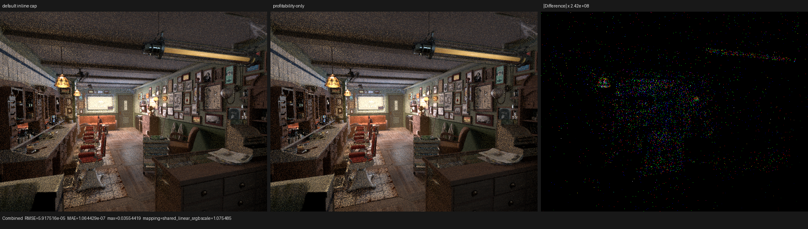
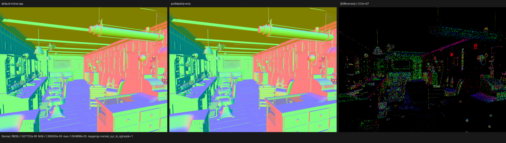
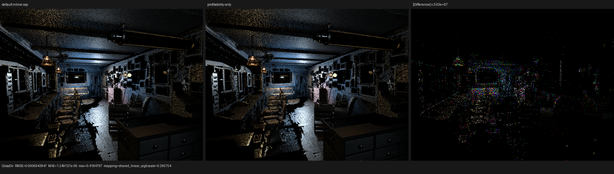
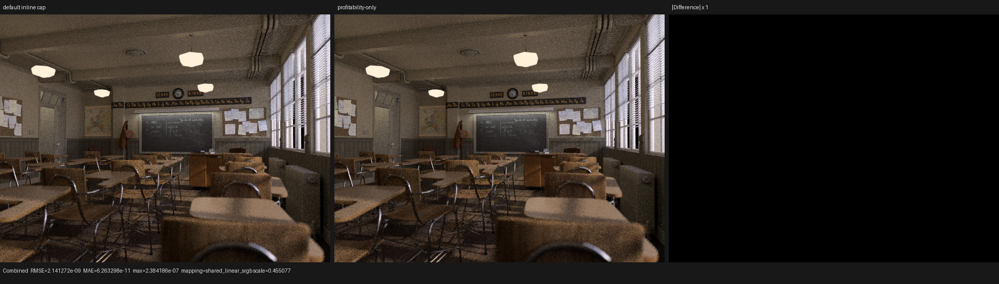
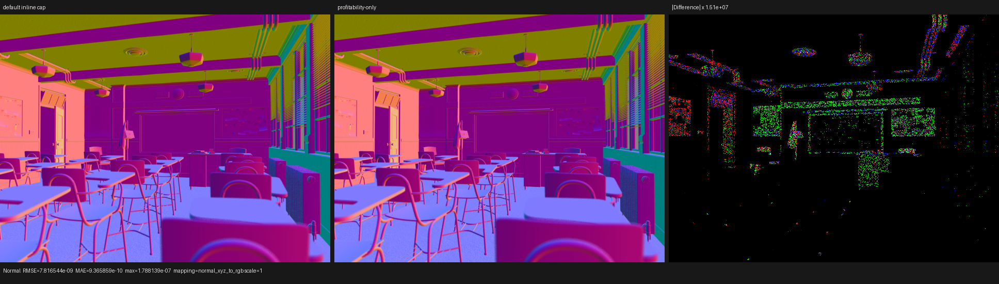
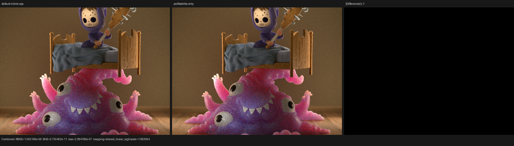
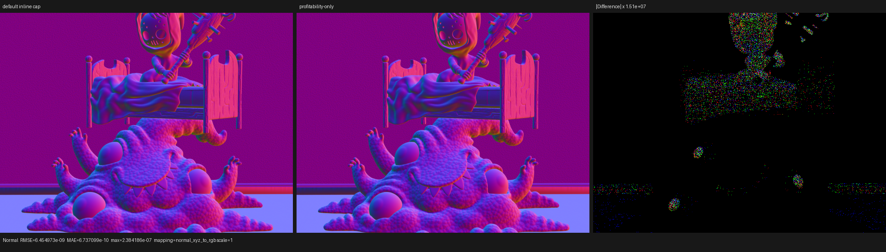

# HIPRTC profitability-only large-callable inlining

## Outcome

LuisaCompute commit `eeda4b154` removes AMDGPU's independent 1,100-basic-block
compile-time inlining ceiling at the HIPRTC IR-to-ISA boundary. It does **not**
mark Luisa callables `alwaysinline`, remove LLVM's ordinary cost model, or add a
renderer-specific callable list. The LLVM inline advisor remains the sole
profitability decision maker.

On the RX 9070 XT, the matched 640x480, 64-spp staged-wavefront A/B reduced
mapped Psycles renderer-kernel time by 5.6% in Barbershop, 4.0% in Classroom,
and 31.6% in Monster Under the Bed. Monster's large BSSRDF continuation fell
from 861.7 to 273.0 ms. All 15 film passes remained numerically and visually
equivalent between the two Psycles builds.

This is a compiler-policy checkpoint, not a claim that Psycles has caught
Cycles. Against the preserved exact Blender 5.2 Cycles HIP traces, current
Psycles is still 1.43x--1.56x in summed renderer GPU time for these scenes.

## Formal root cause

AMDGPU target transform info applies a target-specific feasibility predicate
before the generic inline advisor. For caller `c`, callee `f`, and limit `B`:

```text
H_B(c, f) = true                                      if blocks(f) = 1
            blocks(c) + blocks(f) - 1 <= B            if B != 0
            true                                      if B = 0

inline(edge) = H_B(c, f) and ProfitableLLVM(edge)
```

The LLVM source describes `amdgpu-inline-max-bb` as a compile-time constraint
and initializes `B` to 1,100. It returns before the ordinary advisor when the
combined basic-block count exceeds that limit. In Barbershop's surface module:

| function | basic blocks |
|---|---:|
| surface continuation root | 865 |
| SVM evaluation `callable.6` | 898 |
| combined after inlining | 1,762 |

Thus `1,762 > 1,100` made this edge impossible even when downstream analysis
found it profitable. Passing `-amdgpu-inline-max-bb=0` changes only `H_B` to
`true`; `ProfitableLLVM` is unchanged.

The final code objects provide a constructive check of that claim:

- the baseline Barbershop surface object contains both `callable.6` and
  `callable.15`;
- the candidate removes `callable.6` after profitable inlining;
- the candidate still contains `callable.15`, so expensive edges are not
  blindly expanded.

No callable carries a new `noinline`, `alwaysinline`, or `inlinehint`
attribute. The policy is backend-wide and structural rather than a list of
Psycles cases.

## Implementation

`HIPRTCLinkOptions` owns all three pointer-bearing layers required by HIPRTC:
the two compiler-option strings, the two option identifiers, and their value
array. The object is non-copyable and non-movable because its value array points
back into its own string array, and its lifetime encloses
`hiprtcLinkCreate` through `hiprtcLinkComplete`.

The HIPRTC link state receives exactly:

```text
HIPRTC_JIT_IR_TO_ISA_OPT_EXT       -> { "-mllvm",
                                       "-amdgpu-inline-max-bb=0" }
HIPRTC_JIT_IR_TO_ISA_OPT_COUNT_EXT -> 2
```

The HIP shader cache code-generation revision is 83 because this final
compilation choice changes code objects without changing Luisa AST hashes.
The DXC and Vulkan paths are untouched.

The permanent Luisa regression checks option spelling, ordering, option kinds,
count encoding, self-referential pointer topology, and the non-copy/non-move
lifetime contract.

## IR and code-object evidence

For each structural kernel hash, baseline and candidate pre-link final LLVM IR
are byte-identical. Only the HIPRTC IR-to-ISA policy changes. Relevant code
objects report:

| Scene / continuation | Object bytes, baseline -> candidate | Private bytes | SGPR spills | VGPR spills |
|---|---:|---:|---:|---:|
| Barbershop `shade_surface` | 362,912 -> 353,912 | 3,552 -> 3,072 | 10 -> 0 | 293 -> 351 |
| Barbershop `intersect_shadow` | 236,080 -> 58,416 | 688 -> 288 | 0 -> 0 | 0 -> 0 |
| Classroom `shade_surface` | 250,672 -> 244,368 | 3,208 -> 2,696 | 16 -> 0 | 126 -> 165 |
| Monster `shade_surface` | 256,272 -> 248,552 | 5,024 -> 4,336 | 18 -> 0 | 302 -> 307 |
| Monster `intersect_subsurface` | 221,512 -> 97,736 | 704 -> 288 | 26 -> 0 | 5 -> 0 |

The surface kernels still reach 256 VGPRs, and their reported VGPR spill
instruction counts can increase even while private storage and runtime fall.
The result is therefore not summarized by one metadata counter. The smaller
shadow/BSSRDF objects show the cleaner case: smaller objects and private
segments, fewer registers, and no spills.

There is a compile-time tradeoff:

| Scene / continuation | Baseline HIPRTC link | Candidate HIPRTC link |
|---|---:|---:|
| Barbershop surface | 2,256.5 ms | 3,098.2 ms |
| Barbershop shadow | 1,170.6 ms | 566.4 ms |
| Classroom surface | 1,406.8 ms | 1,663.8 ms |
| Monster surface | 1,599.4 ms | 1,785.0 ms |
| Monster BSSRDF | 1,200.7 ms | 693.1 ms |

Inlining makes the surface optimization problem larger, while deleting large
residual helper functions in the shadow/BSSRDF continuations makes those links
substantially cheaper.
This is why cold compile time and render time are reported separately.

## HIP performance methodology

Hardware and software:

- AMD Radeon RX 9070 XT, `gfx1201`;
- ROCm 7.2.4 and rocprofv3 1.1.0;
- Psycles base `e8c398d`, LuisaCompute base `9ff741933`;
- candidate LuisaCompute `eeda4b154`;
- 640x480, 64 fixed samples, Tabulated Sobol, no adaptive sampling;
- staged wavefront, 32-thread continuation blocks;
- compact surface values and one surface population per hit.

The command shape was:

```sh
env PSYCLES_COMPACT_SURFACE_VALUES=1 \
    PSYCLES_POPULATE_SURFACE_ONCE=1 \
rocprofv3 --kernel-trace -f rocpd -d PROFILE_DIR -o trace -- \
  RUNTIME/psycles_render_blender_scene SCENE PROFILE_DIR/out.exr hip \
  640 480 64 64 - 0 0 0 0 64 - 1 0 wavefront-staged \
  32 32768 32 1 1 0 4 2 4096 131072 0 0 1
```

An initial profiler pair was discarded after an inode check proved that the
two snapshot `.cache/data.mdb` files were hard links. That baseline loaded the
candidate's 98,937-byte BSSRDF cache entry. The accepted profiles use separate
runtime directories and newly generated LMDB caches. Before profiling, loaded
cache entries were explicitly verified as:

| Entry | Baseline cache bytes | Candidate cache bytes |
|---|---:|---:|
| Monster surface | 258,103 | 250,383 |
| Monster BSSRDF | 222,713 | 98,937 |

### Whole renderer-kernel result

`rocprofv3` durations sum mapped Psycles entry, continuation, and scheduler
kernels; they exclude HIPRT build kernels, copies, output, and host work.
Monster is the median of three alternating A/B pairs. Barbershop and Classroom
are isolated-cache matched pairs corroborating the earlier render-only A/B.

| Scene | Baseline GPU kernels | Candidate GPU kernels | Change | Render-only baseline -> candidate |
|---|---:|---:|---:|---:|
| Barbershop | 2,378.336 ms | 2,245.858 ms | -5.57% | 2.6716 -> 2.5401 s (-4.92%) |
| Classroom | 1,232.583 ms | 1,183.651 ms | -3.97% | 1.3724 -> 1.3114 s (-4.44%) |
| Monster | 2,130.073 ms | 1,457.494 ms | -31.58% | 2.3039 -> 1.6255 s (-29.44%) |

Monster's three accepted render-only samples were
`2.32298/2.30385/2.29939 s` and `1.64949/1.62549/1.62488 s`.

### Continuation attribution

| Scene / continuation | Calls | Baseline | Candidate | Change |
|---|---:|---:|---:|---:|
| Barbershop `shade_surface` | 293 | 1,544.786 ms | 1,485.932 ms | -3.81% |
| Barbershop `intersect_shadow` | 78 | 96.052 ms | 47.092 ms | -50.97% |
| Classroom `shade_surface` | 88 | 853.889 ms | 803.582 ms | -5.89% |
| Monster `shade_surface`, median | 127 | 788.048 ms | 711.020 ms | -9.77% |
| Monster `intersect_subsurface`, median | 47 | 861.709 ms | 272.962 ms | -68.32% |
| Monster `intersect_closest`, median | 175 | 146.211 ms | 143.546 ms | -1.82% |

The Monster BSSRDF samples were tightly grouped:
`868.911/861.709/860.990 ms` versus
`273.707/272.962/272.273 ms`. Other continuations were generally within 2%,
so the result is not a scheduler-wide timing shift.

### Remaining gap to Cycles

The Cycles values below are preserved exact Blender 5.2 HIP traces from the
same RX 9070 XT, resolution, fixed sample count, and sampling configuration.
They were not recaptured in this checkpoint, so this table is a cross-check
against the validated reference rather than a new back-to-back pair.

| Scene | Cycles HIP kernels | Current Psycles HIP kernels | Psycles / Cycles |
|---|---:|---:|---:|
| Barbershop | 1,436.930 ms | 2,245.858 ms | 1.563x |
| Classroom | 818.604 ms | 1,183.651 ms | 1.446x |
| Monster | 1,021.209 ms | 1,457.494 ms | 1.427x |

The current gap is therefore approximately 42.7%--56.3%, not zero. This
checkpoint materially reduces surface/BSSRDF cost, while closest intersection
is almost unchanged and remains a separate HIPRT/traversal investigation.

## Numerical and visual validation

Baseline and candidate rendered all 15 exported passes at 640x480 and 64 spp.
Every pass in every scene contained zero invalid pixels.

| Scene / pass | RMSE | Maximum absolute error | Luminance ratio |
|---|---:|---:|---:|
| Barbershop Combined | 5.91752e-5 | 3.55442e-2 | 1.00000163 |
| Barbershop Normal | 1.50770e-8 | 1.06469e-5 | 1.00000000 |
| Classroom Combined | 2.14127e-9 | 2.38419e-7 | 1.00000000 |
| Classroom Normal | 7.81654e-9 | 1.78814e-7 | 1.00000000 |
| Monster Combined | 1.55520e-9 | 2.38419e-7 | 1.00000000 |
| Monster Normal | 6.45497e-9 | 2.38419e-7 | 1.00000000 |

Barbershop's Combined maximum is a sparse high-energy outlier: its 99th
percentile pixel RMSE is only `4.30e-9`. Manual inspection at original
resolution found no change in camera, silhouette, geometry, UV layout,
material regions, normal orientation, or illumination structure. The
Barbershop Normal and Glossy Direct difference panels contain sparse amplified
floating-point/sample noise, not coherent image features. Classroom and
Monster difference panels are visually black at unit display scale.

The raw comparison reports use the comparator's historical `cycles` field for
the reference image; in this checkpoint that field means the default-limit
Psycles baseline, not Blender/Cycles:

- [Barbershop metrics](comparisons/barbershop.json)
- [Classroom metrics](comparisons/classroom.json)
- [Monster metrics](comparisons/monster.json)

### Triptychs















## Regression and build validation

The production build completed with all host threads:

```sh
cmake --build build --parallel "$(nproc)"
```

The dependency-light Luisa regression passed:

```text
test_hip_shader_link_options: 1/1 passed
```

The focused surface/SVM/closure matrix passed 54/54 across fallback, HIP, and
strict native Vulkan XIR-to-SPIR-V. The complete Psycles suite used:

```sh
LUISA_VULKAN_USE_XIR=1 \
LUISA_VULKAN_REQUIRE_NATIVE_XIR_SPIRV=1 \
LUISA_VULKAN_DISABLE_DXC=1 \
ctest --test-dir build --parallel 1 --output-on-failure
```

Result: 283/289 passed. The failing set is exactly the six pre-existing
numeric-oracle cases, with no new failure:

- `psycles.luisa_stacked_volume_fallback`;
- `psycles.luisa_homogeneous_volume_fallback`;
- `psycles.luisa_area_light_forward_vk`;
- `psycles.luisa_volume_path_fallback`;
- `psycles.luisa_volume_path_vk`;
- `psycles.luisa_volume_triangle_fallback`.

No tolerance was changed. `git diff --check` passed in both repositories.
LuisaCompute `eeda4b154` was pushed non-forcing to `next`.
