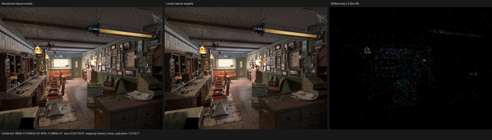
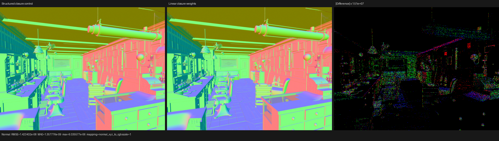

# Linear closure-weight SVM

## Outcome

Psycles now lowers surface `Add Closure` / `Mix Closure` trees to the same
essential dataflow form used by Cycles after `transform_multi_closure`: Add
forwards its incoming weight, each live Mix evaluates its factor once and
defines child weights, and each leaf reads one already-computed weight. The
device executes one forward loop over a topologically ordered data stream.

This removes traversal markers and parent restoration from the shader. On the
Blender 5.2 Barbershop export, the inspected closure stream falls from 745 to
561 instructions (-24.70%); the complete runtime image falls from 754 to 570
(-24.40%). A retained HIP trace measures `shade_surface` at 27.769 ns/work,
down from 28.856 ns/work (-3.77%). Mapped renderer-kernel time falls 2.54%.

This is a real improvement, but it does not close the surface gap: the matched
Cycles 5.2 HIP `shade_surface` reference is 10.778 ns/work. Psycles therefore
still costs 2.576x per launched work item in this scene. The next investigation
remains physical-closure population/consumption and operand traffic, not more
Mix-tree special cases.

Implementation commit: `2e0aae2a` (`surface: linearize closure mix weights`).

## Cycles reference and representation

The reference checkout is `blender-v5.2-release` at
`9e2066aef7ef7e20c142ad7bd3303138a4304c93`.

- `intern/cycles/scene/shader_graph.cpp::transform_multi_closure` replaces the
  closure tree with weight-producing nodes. Add forwards the same weight to
  both children; Mix creates two outputs.
- `intern/cycles/kernel/svm/closure.h::svm_node_mix_closure` loads the factor
  and optional input weight, clamps the factor, and stores
  `w * (1 - f)` / `w * f` to stack slots.
- closure instructions receive the corresponding `mix_weight_offset` from
  `intern/cycles/scene/svm.cpp::generate_closure_node`.

Psycles retains its typed, scene-specialized SVM rather than copying Cycles'
fixed untyped stack. Its compact `uint4` closure ABI is now:

| Kind | payload 0 | payload 1 | payload 2 |
|---|---|---|---|
| leaf | operand begin | incoming weight slot | reserved zero |
| binary Mix | factor address | parent slot | packed left/right slots |
| left-only Mix | factor address | parent slot | left slot |
| right-only Mix | factor address | parent slot | right slot |

The root weight is an explicit sentinel meaning constant one. Endpoint
projection emits a unary Mix when only one child contributes, so a pruned
closure family does not allocate or execute its other result.

## Formal model

Let the projected closure language be

```text
C ::= Leaf | Add(C, C) | Mix(f, C, C)
```

and let `W(n)` be the weight reaching node `n`:

```text
W(root)  = 1
W(Add.a) = W(Add.b) = W(Add)
W(Mix.a) = W(Mix) * (1 - clamp(f, 0, 1))
W(Mix.b) = W(Mix) * clamp(f, 0, 1)
```

Lowering performs a deterministic left-to-right DFS while emitting each Mix
before its children. Every retained Mix output receives a virtual SSA weight.
Consequently its definition strictly precedes every use. Add emits no
instruction, and a leaf records the virtual weight reaching it.

For every virtual weight `v`, the host computes the half-open live interval
from `def(v)` through `last_use(v)`. Instructions read inputs before writing
outputs. At instruction `i`, linear-scan coloring therefore:

1. reads the input slot;
2. releases it when `last_use(input) == i`;
3. assigns the lowest free slot to each output.

The ordering makes reuse of a parent's slot by one child at the same Mix
correct. Distinct live intervals never share a slot; the lowest-free policy
only grows the slot vector when all existing slots are live, so the published
extent is dense and equals the peak simultaneous demand. By structural
induction over `C`, every leaf receives exactly the recurrence above. The
linear program is therefore observationally equivalent to the authored
closure tree for all finite factors; the existing `!(weight <= 0)` predicate
is retained so NaN behavior is unchanged.

The serialized-image verifier independently rejects undefined parent/leaf
reads, out-of-range or aliased binary outputs, invalid unary encoding,
nonzero leaf payload, semantic bits on Mix instructions, wrong factor/operand
types, and non-dense slot extents. Scene aggregation relocates only leaf
operand bases; weight slots are program-local and require no relocation.

## Regression coverage

The host execution-plan test now fixes these cases permanently:

- a binary root Mix and exact two-slot recurrence;
- one-sided endpoint projection;
- nested Mixes with read-before-write parent-slot reuse;
- `Add(Mix(A, B), C)`, proving `C` retains the root weight;
- statically pruned Mixes;
- malformed undefined reads, aliased/out-of-range outputs, malformed unary
  encoding, reserved leaf payload, and non-dense allocation;
- concatenation of two programs into one scene image.

The compact device oracle compares the lowered program with expanded Luisa
graph execution for preparation, emission, BSSRDF normal, closure population,
evaluation, and sampling. The focused matrix passed on fallback, HIP, and
strict native Vulkan XIR-to-SPIR-V:

```text
psycles.luisa_compact_surface_preparation_{fallback,hip,vk}
psycles.luisa_compact_surface_tail_{fallback,hip,vk}
psycles.luisa_surface_mix_svm_{fallback,hip,vk}
psycles.surface_closure_execution_plan
```

All 10 tests passed. The build configuration has
`LUISA_COMPUTE_VULKAN_ENABLE_DXC_COMPATIBILITY=OFF`; the Vulkan tests therefore
do not exercise the legacy DXC route.

## Scene census

Command:

```sh
build/bin/psycles_inspect_blender_material \
  /var/tmp/psycles-official-redownload-20260814/exports/barbershop-5.2 '*'
```

The original Barbershop image contains 184 formally contributing Mixes. The
new stream contains exactly 184 Mix instructions: 184 binary, zero left-only,
and zero right-only. Its 377 leaves produce 561 total instructions. Maximum
authored Mix depth is three, while exact interval coloring needs four scalar
weight slots. The full runtime has 570 closure instructions because it also
contains endpoint projections.

With all closure input computation replaced by constants for the isolated
cost experiment, the closure stream falls from 218 to 160 instructions and
the runtime from 222 to 164. This confirms that the improvement is independent
of texture/value-SVM cost.

## HIP profile

Hardware was an AMD Radeon RX 9070 XT (`gfx1201`), ROCm 7.2.4. Both retained
runs use 640x480, 64 fixed samples, Tabulated Sobol, staged wavefront, a
32-thread continuation block, and adaptive sampling disabled.

```sh
rocprofv3 --kernel-trace -f rocpd -d PROFILE_DIR -o trace -- \
  build/bin/psycles_render_blender_scene SCENE PROFILE_DIR/out.exr hip \
  640 480 64 64 - 0 0 0 0 64 - 1 0 wavefront-staged \
  32 32768 32 1 1 0 4 2 4096 0 0 0 1 1048576
```

| Full Barbershop | Structured baseline | Linear weights | Change |
|---|---:|---:|---:|
| `shade_surface` calls | 293 | 293 | identical |
| launched work | 53,659,264 | 53,659,296 | +32 scheduler items |
| `shade_surface` GPU time | 1,548.387 ms | 1,490.086 ms | -3.77% normalized |
| `shade_surface` ns/work | 28.8559 | 27.7694 | -3.77% |
| private bytes / VGPR | 3,152 / 256 | 3,136 / 256 | -16 B / unchanged |
| mapped renderer kernels | 2,299.055 ms | 2,240.594 ms | -2.54% |
| render-only | about 2.631 s | 2.57011 s | about -2.3% |

The accepted coroutine frame changes from 864 B / 182 fields to 880 B / 178
fields. This is not hidden: four live scalar weight slots alter aggregate
layout by 16 B even though the field count and HIP private allocation decrease.
The measured shader gain is accepted on final device time, not on frame size.

The constant-closure-input experiment isolates the weight interpreter from
the value SVM:

| Constant closure inputs | Structured baseline | Linear weights | Change |
|---|---:|---:|---:|
| calls / work | 128 / 56,089,600 | same | identical |
| `shade_surface` GPU time | 749.520 ms | 721.017 ms | -3.80% |
| ns/work | 13.3629 | 12.8547 | -3.80% |
| private bytes / VGPR | 2,456 / 256 | 2,424 / 256 | -32 B / unchanged |
| mapped renderer kernels | 1,243.856 ms | 1,214.848 ms | -2.33% |

The isolated result proves the speedup is due to closure-control work rather
than an accidental texture or scene change. It also leaves a 1.85x
`shade_surface` cost over Cycles even with closure inputs held constant.

## Image validation

The retained baseline and candidate are complete 46-channel EXRs. `idiff -v
-a` reports mean error `1.01062e-7`, RMS `1.78515e-4`, peak SNR `123.847 dB`,
and 29 pixels (`0.00944%`) above `1e-6`. Atomic film accumulation and sparse
Monte Carlo samples are not cross-process deterministic, so exact semantic
evidence comes from the device oracle rather than an exact full-scene hash.

Combined comparison: MAE `1.04885e-7`, RMS `5.76396e-5`, mean-luminance ratio
`1.00000174`. Normal comparison: MAE `1.35778e-9`, RMS `1.42343e-8`.
I visually inspected both triptychs: the baseline and linear-weight panels
have the same geometry, material response, texture placement, lighting, and
normal structure. The amplified difference panels contain sparse numerical /
scheduling-sensitive samples and no coherent structural region.





## Reproduction

```sh
cmake --build build --parallel "$(nproc)"

ctest --test-dir build --output-on-failure -j 1 \
  -R 'psycles\.(surface_closure_execution_plan|luisa_(compact_surface_(preparation|tail)|surface_mix_svm)_(fallback|hip|vk))$'

python tools/compare_cycles.py \
  BASELINE.exr visual-report.json \
  --triptych-dir triptychs \
  --reference-label 'Structured closure control' \
  --actual-label 'Linear closure weights' \
  --allow-unverified-build-identity \
  Combined=CANDIDATE.exr Normal=CANDIDATE.exr
```

Retained local artifacts:

- structured baseline: `/var/tmp/psycles-checked-physical-access.uyOQ9v`;
- full candidate: `/var/tmp/psycles-linear-closure-weights-20260827`;
- constant-input profiles:
  `/var/tmp/psycles-barbershop-surface-cost-20260827/profile-closure-inputs-{psycles,linear}`.
