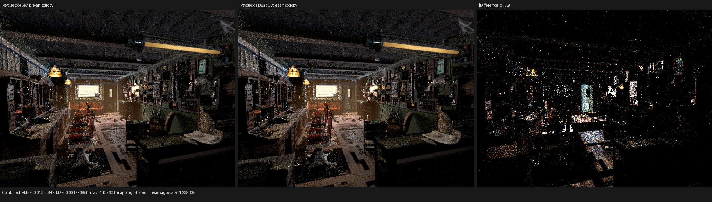
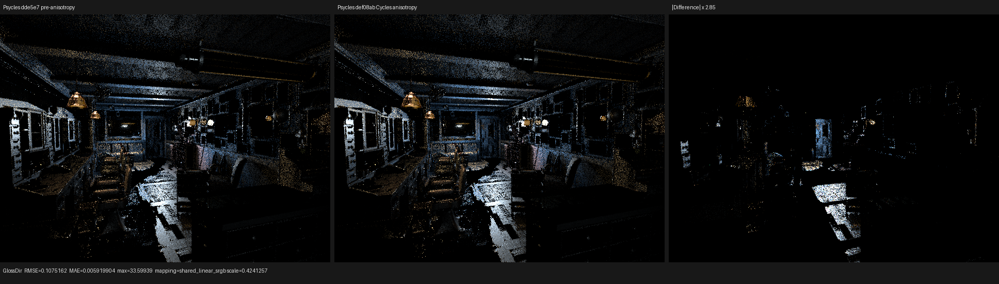
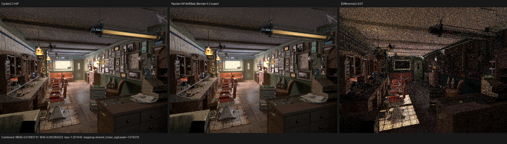
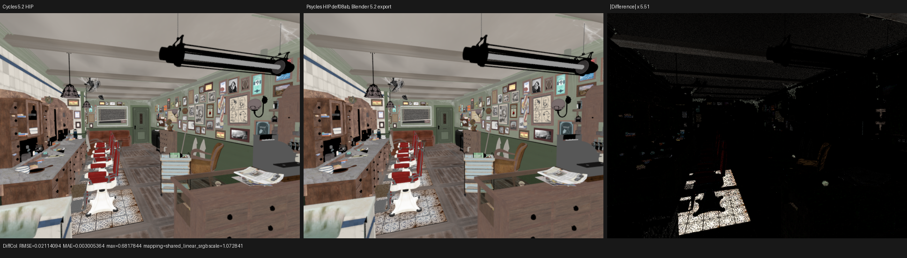
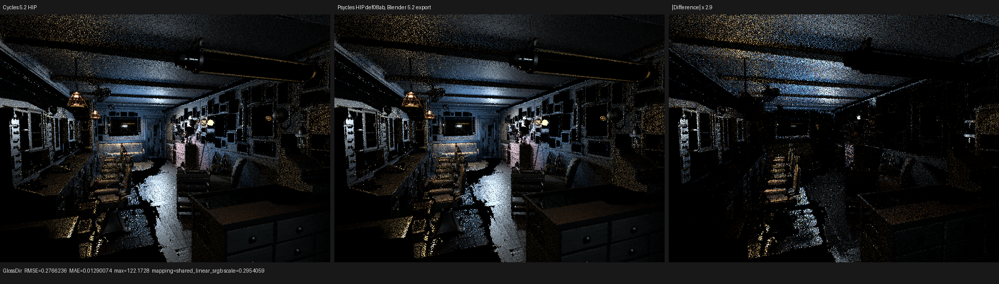
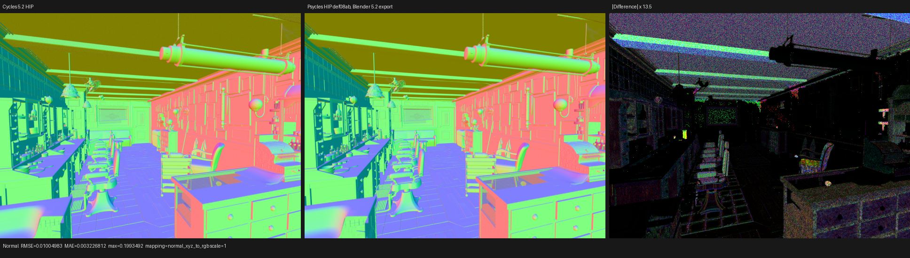

# Microfacet anisotropy checkpoint

## Scope and oracle

This checkpoint closes the standalone Glossy and Principled
metallic/dielectric anisotropy gap against Blender 5.2 Cycles. The source
oracle is the local read-only Blender tree at commit
`9e2066a5d571f50afdf84c6f509a94c08e329f55`, especially:

- `intern/cycles/scene/shader_nodes.cpp` for constant-input specialization and
  default `LINK_TANGENT` behavior;
- `intern/cycles/kernel/svm/closure.h` for setup of tangent and distribution
  roughness;
- `intern/cycles/kernel/closure/bsdf_microfacet.h` for anisotropic GGX and
  Beckmann `D`, masking-shadowing, singular classification, and reported
  roughness;
- `intern/cycles/kernel/sample/mapping.h` for the tangent basis and visible
  normal mapping.

No Cycles SVM bytecode, closure response, or material value is pre-baked. The
Blender graph is imported as typed nodes and lowered to Psycles' own
topological surface IR; all setup, evaluation, and sampling remain Luisa DSL
expressions.

## Formal representation

Closure setup is the unique map from authored node parameters to the physical
state

```text
M = (T, alpha_x, alpha_y).
```

`T` is observationally dead when `alpha_x == alpha_y`. For perceptual
roughness `r`, Principled uses

```text
a = clamp(r, 0, 1)^2
s = sqrt(1 - 0.9 clamp(anisotropy, 0, 1))
alpha_x = clamp(a / s, 0, 1)
alpha_y = clamp(a s, 0, 1),
```

when Cycles retained the tangent input. Standalone Glossy first clamps
anisotropy to `[-0.99, 0.99]`, treats `abs(anisotropy) <= 1e-4` as isotropic,
and applies Cycles' signed reciprocal-axis parameterization. Before setup
saturation both parameterizations preserve `alpha_x * alpha_y`; the common
singular test is therefore the Cycles product threshold `2e-10`.

Principled rotates the authored tangent around the uncorrected shader normal;
standalone Glossy rotates it around the corrected physical reflection normal.
The zero-rotation case is a real device control-flow branch, so it neither
executes trigonometry nor perturbs the authored tangent. Sampling and
evaluation construct Cycles' deliberately unsafe tangent basis only when the
two axes differ.

## Storage proof and root-cause repair

The implementation initially exposed a schema-completeness bug rather than a
scattering bug. The state survived the compact program decoder but was lost at
two independent representation boundaries:

1. the four-matrix complete closure ABI; and
2. the branch-local `SurfaceClosureExpression` handle view.

The complete ABI now has one authoritative semantic-row inverse, shared by
full-record decoding and `SurfaceClosureSet` projections. This avoids both a
second lane decoder and a decode-then-repack AST expansion: the Beckmann
collection fixture fell from 3561 to 3290 pre-optimization XIR instructions
without raising its 3500-instruction ceiling. The physical ABI remains a
two-block tagged sum. Its general payload
uses the five previously spare lanes for `M`; dielectric and BSSRDF payloads
continue to own the same lanes under mutually exclusive tags. Program
compaction and bump expansion now share one canonical list of every
`ValueExpressionId` member, eliminating the duplicated remapping tables that
caused the first typed-bank failure during development.

For every closure family `k`, the retained invariant is

```text
P_k(unpack_k(pack(x))) = P_k(x),
```

where `P_k` is exactly the set of fields observable by that family. Complete
storage additionally checks every canonical closure field, including the new
microfacet state.

## Static specialization

The closure plan schedules anisotropy operands only when they are observable:

- Principled requires a reachable metallic or dielectric lobe and follows
  Cycles' constant `CLOSURE_WEIGHT_CUTOFF` rule; linked or non-finite values
  remain dynamic.
- Glossy follows Cycles' distinct constant isotropic interval
  `[-1e-4, 1e-4]`; linked or non-finite values remain dynamic.
- emission-only projections never carry the operands.

The resulting bit is part of the compact closure instruction identity. The
device decoder therefore does not read anisotropy, rotation, or tangent for a
specialized isotropic topology.

## Regression coverage

The permanent tests cover:

- Blender raw-graph import of unlinked Principled and Glossy tangent sockets,
  proving both become explicit `Geometry.Tangent` edges;
- typed value-bank assignment, dependency scheduling, compact bytecode
  control bits, and plan merging for isotropic versus anisotropic materials;
- complete closure storage, the two-block physical tagged sum, callable
  round trips, and branch-local expression transport;
- the exact Principled and signed Glossy alpha formulas, including negative
  anisotropy's reciprocal-axis branch;
- GGX and Beckmann quarter-turn tangent rotation, sample-direction rotational
  covariance, evaluation covariance, and geometric-mean reported roughness;
- fallback, HIP, and Vulkan execution, with Vulkan forced through native
  XIR-to-SPIR-V and DXC disabled.

Commands used from the build tree:

```sh
cmake --build build --parallel "$(nproc)"
./build/psycles_surface_closure_execution_plan_tests
./build/psycles_blender_import_tests
./build/bin/psycles_luisa_microfacet_anisotropy_tests fallback
./build/bin/psycles_luisa_microfacet_anisotropy_tests hip
LUISA_VULKAN_USE_XIR=1 \
LUISA_VULKAN_REQUIRE_NATIVE_XIR_SPIRV=1 \
LUISA_VULKAN_DISABLE_DXC=1 \
  ./build/bin/psycles_luisa_microfacet_anisotropy_tests vk
LUISA_VULKAN_USE_XIR=1 \
LUISA_VULKAN_REQUIRE_NATIVE_XIR_SPIRV=1 \
LUISA_VULKAN_DISABLE_DXC=1 \
  ctest --test-dir build --output-on-failure --parallel 4
```

The closure collection and physical-ABI fixtures were run through the same
three-backend matrix. The strict complete suite passed 289/295; its six
failures are exactly the previously documented numeric-oracle set
(`stacked_volume_fallback`, `homogeneous_volume_fallback`,
`area_light_forward_vk`, `volume_path_fallback`, `volume_path_vk`, and
`volume_triangle_fallback`), with no new failure. Vulkan's fast-math
compilation produced a
maximum `2.34e-4` component difference between two bit-identical-input,
algebraically equivalent inlined thin-glass sample paths. The difference also
appeared with SPIR-V optimization disabled, while all scalar state was equal;
the regression therefore uses a backend-independent `5e-4` direction bound
(less than `0.05` degrees for unit vectors) and retains `1e-5` for transported
scalar state.

## Barbershop scene activation

The official Barbershop material census proves that this is not merely an
analytic closure fixture. Its 547 materials contain four reachable standalone
Glossy nodes with nonzero anisotropy: two authored at `0.71` and two at `0.5`.
Classroom and Monster Under the Bed do not activate this particular input.

Blender's evaluated dependency graph is part of the oracle. The existing
Blender 5.3-alpha export has 1,649 geometries and 2,565 instances, whereas a
fresh export of the same `.blend` through Blender 5.2 has 1,055 geometries and
1,109 instances. Both inputs have source SHA-256
`95972b56180462cac47ec82f3a755bd9111ec18ca37a6196a319c013db994130`, but
their rendered images are not interchangeable. All cross-renderer numbers
below use the 5.2 export and Blender 5.2 Cycles. The installed oracle reports
Blender `5.2.0 LTS`, build hash `fbe6228777e7`; the inspected Cycles source is
the `blender-v5.2-release` tree at
`9e2066a5d571f50afdf84c6f509a94c08e329f55`.

## Isolated feature cost

An exact pre-feature binary at `dde5e7` and the accepted `def08ab` binary were
profiled on the same 5.3-alpha Barbershop export, at 640x480, 64 fixed samples,
on the same Radeon RX 9070 XT. Both used the HIP staged-wavefront path and the
same launch parameters. Times in the kernel rows are timestamped GPU dispatch
durations from `rocprofv3`; `render-only` is the renderer's warm interval.

| Metric | Pre-anisotropy | Cycles anisotropy | Change |
|---|---:|---:|---:|
| `shade_surface` calls | 359 | 366 | scheduler-dependent |
| `shade_surface` work | 53,558,080 | 53,595,712 | +0.070% |
| `shade_surface` GPU time | 1,229.965 ms | 1,240.189 ms | +0.831% |
| `shade_surface` ns/work | 22.9651 | 23.1397 | +0.760% |
| private bytes / VGPR | 3,136 / 256 | 3,152 / 256 | +16 B / unchanged |
| `intersect_closest` ns/work | 7.97710 | 7.97898 | +0.024% |
| mapped renderer-kernel time | 2,201.177 ms | 2,215.707 ms | +0.660% |
| warm render-only | 2.56890 s | 2.57786 s | +0.349% |

This is the cost of actually evaluating anisotropic lobes in a scene that uses
them, not an optimization claim. The unchanged intersection cost and the
localized glossy image delta rule out an accidental traversal or topology
change. The complete A/B numbers are in
[`barbershop-ab.json`](barbershop-ab.json).





## Blender 5.2 Cycles image alignment

Cycles HIP and Psycles HIP were rendered at 640x480 and 64 fixed samples, with
adaptive sampling and denoising disabled and Tabulated Sobol selected. The
following metrics compare linear full-float passes. They are deliberately
reported beside a second Psycles run: cross-renderer RMSE includes the
different sample streams, while the repeat column shows the local atomic-film
and scheduling floor.

| Pass | Psycles / Cycles mean luminance | Cycles-Psycles RMSE | Psycles repeat RMSE |
|---|---:|---:|---:|
| Combined | 0.999428 | 0.0168374 | 0.0000599 |
| Diffuse Color | 0.997216 | 0.0211409 | 0.00001495 |
| Glossy Color | 1.000544 | 0.0007963 | `1.23e-8` |
| Glossy Direct | 0.996174 | 0.276624 | 0.0006944 |
| Normal | 1.003860 | 0.0100498 | `1.68e-8` |

The exact data are in
[`barbershop-cycles-5.2.json`](barbershop-cycles-5.2.json) and
[`barbershop-repeat.json`](barbershop-repeat.json). The report records the
comparison as unverified because this older 5.2 export predates exact build
metadata in `scene.json`; the command, Cycles sidecar, installed binary
identity, source hash, and matching Blender version were checked separately
above rather than silently bypassing that limitation.

I inspected the Combined, Diffuse Color, Glossy Direct, and Normal triptychs at
native resolution. Geometry silhouettes, floor and wall texture placement,
cabinet and ceiling structure, normals, and the spatial lighting pattern
match. The amplified panels show Monte Carlo edge/highlight noise and no
coherent handedness, UV, missing-object, or material-family region. In
particular, identity orientation has much lower RMSE than all three image-flip
hypotheses. This is sufficient to reject the earlier structural texture and
transform concern; it is not a claim of sample-wise identity.









## Full-scene reproduction

Cycles golden:

```sh
/home/mike/Projects/blender-install-5.2/blender \
  assets/official-blender-scenes/barbershop-interior/barbershop_interior.blend \
  --background --python-exit-code 1 \
  --python tools/render_cycles_golden.py -- \
  cycles-5.2-hip.exr 640 480 64 0 \
  --cycles-device HIP --device-name "Radeon RX 9070 XT"
```

Psycles render and HIP trace:

```sh
build/bin/psycles_render_blender_scene BARBERSHOP_5_2_EXPORT out.exr hip \
  640 480 64 64 - 0 0 0 0 64 - 1 0 wavefront-staged \
  32 32768 32 1 1 0 4 2 4096 0 0 0 1 1048576

PSYCLES_DISABLE_SHADER_CACHE=1 \
rocprofv3 --kernel-trace -f rocpd -d PROFILE_DIR -o trace -- \
  build/bin/psycles_render_blender_scene BARBERSHOP_EXPORT out.exr hip \
  640 480 64 64 - 0 0 0 0 64 - 1 0 wavefront-staged \
  32 32768 32 1 1 0 4 2 4096 0 0 0 1 1048576
```

This promotes the implementation from an analytic checkpoint to an activated
complex-scene checkpoint. It does not yet replace the required multi-scene,
five-backend, high-resolution performance suite.
