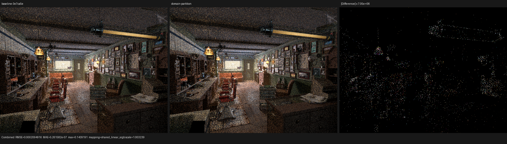
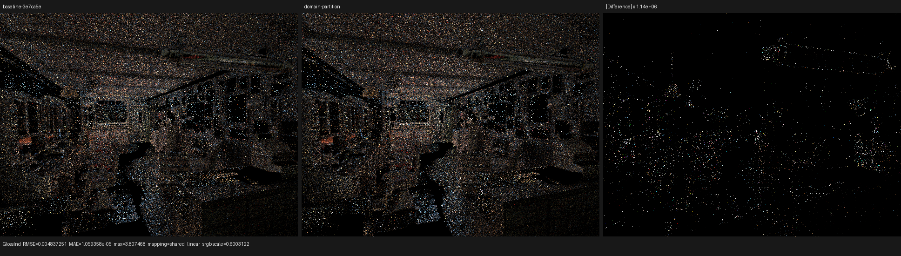
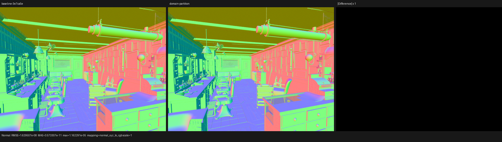

# Microfacet singular-domain partition

## Outcome

The selected-closure microbenchmark exposed two independent sources of eager
work in Psycles' microfacet handlers:

1. GGX and Beckmann VNDFs were both evaluated and then selected by value.
2. The VNDF and finite-direction evaluator were evaluated even when
   `alpha_x * alpha_y <= 2e-10`, where the closure is a delta distribution.

The accepted change expresses both choices as control flow. On the RX 9070 XT,
the isolated singular GGX handler fell from `3.35..3.60 ms` to a median of
`0.822905 ms` for 1,048,576 lanes times 256 iterations. The equivalent Cycles
5.2 handler has a median of `0.985577 ms` in the same probe. The regular GGX
handler remains 47.6% slower than Cycles, and Barbershop has no measurable
end-to-end change. That remaining gap is therefore not reported as fixed.

## Formal model

Let

```text
A = alpha_x * alpha_y
S = (A <= 2e-10)
M = finite solid-angle measure
D = delta measure at the unique specular direction
```

Cycles classifies `S` as a specular closure with no finite-direction
evaluation. The two domains are disjoint:

```text
S       => H = N, p_M(wo) = 0, f_M(wo) = 0
not S   => H is sampled from exactly one tagged VNDF
```

Consequently, every expression used only to construct `H`, `D(H)`, Lambda,
the finite-direction Jacobian, or the finite-direction PDF is observationally
dead under `S`. Removing those expressions from that branch preserves both
the delta sample and the zero density under `M`.

Within `not S`, the distribution tag is a sum-type discriminator. It selects
one of the mutually exclusive implementations

```text
beckmann == false => sample GGX VNDF
beckmann == true  => sample Beckmann VNDF
```

Luisa `select(a, b, condition)` is a value selection: both `a` and `b` already
belong to the expression graph. It does not encode lazy evaluation. A dynamic
`$if/$else` is therefore required to preserve the sum-type work partition.
This is a domain proof, not a list of material-specific exceptions.

The Cycles 5.2 oracle at `9e2066aef7ef7e20c142ad7bd3303138a4304c93`
uses the same partition in
`intern/cycles/kernel/closure/bsdf_microfacet.h`:

- `roughness_is_almost_specular` defines the `2e-10` boundary;
- `bsdf_microfacet_eval_flag` removes finite-direction evaluation for a delta
  closure;
- `bsdf_microfacet_sample<m_type>` chooses `H=N` before VNDF sampling and uses
  the template parameter to instantiate one distribution.

## Implementation scope

The control-flow partition is applied to all affected Psycles handlers:

- glossy reflection, including isotropic/anisotropic GGX and Beckmann;
- microfacet glass/refraction;
- thin-glass transmission;
- their finite-direction evaluators.

The permanent Psycles benchmark additionally contains regular and singular
probes for GGX reflection, Beckmann reflection, glass, refraction, and thin
glass. `tools/benchmark_cycles_surface_closures.hip` is an external oracle: it
includes the Cycles device headers and directly calls Cycles' closure routines;
it does not copy or translate their implementation.

## Compiler configuration audit

This comparison did not find a missing HIP optimization flag:

- Psycles' `ShaderOption::enable_fast_math` remains enabled;
- the HIP backend requests aggressive optimization, mapped to LLVM `-O3`;
- generated floating-point operators receive fast-math flags;
- the target permits fast fusion;
- OCLC unsafe-math and finite-only modes are enabled.

The remaining regular-handler gap must therefore be investigated in generated
work and state, not hidden behind a generic “enable optimization” change.

## Isolated HIP oracle

Environment:

```text
GPU: AMD Radeon RX 9070 XT, gfx1201
ROCm/HIP: 7.2.53211
Psycles baseline: 3e7ca5e85c1204c7ba77e81bfb7186e8f20dfbde
LuisaCompute: eeda4b154fcf43e8709d1b42478e958677b9c6ae
Cycles: Blender v5.2.1, 9e2066aef7ef7e20c142ad7bd3303138a4304c93
Block size: 256
Warmups: 3
Lanes: 1,048,576
Iterations per lane: 256
Repeats: 7
```

Median results from sequential runs:

| Probe | Psycles HIP | Cycles HIP | Psycles relative to Cycles |
|---|---:|---:|---:|
| Diffuse | 1.656830 ms | 1.357534 ms | 22.1% slower |
| GGX regular | 3.495880 ms | 2.368182 ms | 47.6% slower |
| GGX singular | 0.822905 ms | 0.985577 ms | 16.5% faster |

The first three checksum components are evaluation, sampled-direction, and PDF
observables. They agree to normal floating-point rounding. The fourth component
is a sum of event-bit integers and is intentionally not compared numerically,
because Psycles and Cycles use different event enum values.

Build and run the external oracle with:

```sh
tools/build_cycles_surface_closure_benchmark.sh \
    /home/mike/Projects/blender-cycles gfx1201 \
    /var/tmp/cycles_surface_closure_benchmark

build/bin/psycles_benchmark_surface_closures \
    hip glossy_ggx_regular 1048576 256 7
/var/tmp/cycles_surface_closure_benchmark \
    glossy_ggx_regular 1048576 256 7

build/bin/psycles_benchmark_surface_closures \
    hip glossy_ggx_singular 1048576 256 7
/var/tmp/cycles_surface_closure_benchmark \
    glossy_ggx_singular 1048576 256 7
```

The regular result isolates the next structural problem. Psycles samples a
direction and then calls the independent generic evaluator, which reconstructs
the half vector, distribution, Lambda terms, Fresnel, and Jacobian. Cycles
computes the selected sample's evaluation and PDF inside its sampler while the
sampled local `H`, `I`, and `O` are live. A future fused path must retain that
locality without repeating the rejected experiment that widened the generic
conditional-sample ABI for every closure.

## Barbershop A/B

Scene: the Blender 5.2 Barbershop export at 640x480, fixed 64 spp, HIP,
`wavefront-staged`, frame capacity 1,048,576. Both binaries were warmed before
the interleaved runs.

```text
baseline:  2.51930 s, 2.54449 s
candidate: 2.52939 s, 2.52499 s
```

This is noise-level and is recorded as **no measurable end-to-end speedup**.
The labeled `rocprofv3 --kernel-trace` pair gives:

| `shade_surface` | Calls | Total | Scratch | VGPR |
|---|---:|---:|---:|---:|
| Baseline | 293 | 1471.732 ms | 3296 B | 256 |
| Domain partition | 293 | 1470.022 ms | 3296 B | 256 |

The 0.11% stage difference is also too small to claim. Coroutine structure is
unchanged at 9 subroutines, 177 frame fields, and 864 frame bytes.

The render command was:

```sh
PSYCLES_COMPACT_SURFACE_VALUES=1 \
PSYCLES_POPULATE_SURFACE_ONCE=1 \
build/bin/psycles_render_blender_scene \
    /var/tmp/psycles-official-redownload-20260814/exports/barbershop-5.2 \
    OUTPUT.exr hip 640 480 64 64 - 0 0 0 0 64 - 1 0 \
    wavefront-staged 32 32768 32 1 1 0 4 2 4096 0 0 0 1 1048576
```

The profiler command additionally set `LUISA_CORO_SHADER_MAP=1` and wrapped the
same renderer invocation with:

```sh
rocprofv3 --kernel-trace -f rocpd -d PROFILE_DIR -o trace --
```

## Image and pass validation

All 15 Combined/Normal/Albedo/light/volume passes are finite in both the
wavefront 64 spp and serial megakernel 16 spp comparisons. The generated
reports are [wavefront-all-pass-ab.json](wavefront-all-pass-ab.json) and
[megakernel-all-pass-ab.json](megakernel-all-pass-ab.json).

The serial per-pixel megakernel is used as the diagnostic path because it
removes concurrent film accumulation as an explanation. It found:

| Pass | RMSE | Maximum absolute error |
|---|---:|---:|
| Combined | 2.09492e-4 | 0.143919 |
| Normal | 1.62951e-8 | 1.16229e-5 |
| Glossy Indirect | 4.83725e-3 | 3.80747 |

The two formulations are algebraically equivalent, but changing control flow
changes low floating-point bits. Rare later bounces can therefore choose a
different triangle at a boundary or encounter a different high-energy sample;
Monte Carlo path images are not expected to remain bitwise identical. Normal's
`1.63e-8` RMSE remains at floating-point noise and rules out a geometry,
transform, UV, or normal-basis change. Direct passes and color passes are equal
or near floating-point roundoff; the larger Glossy Indirect number is dominated
by isolated samples.

I inspected all three triptychs at native resolution. Geometry, floor, ceiling,
cabinetry, materials, UVs, silhouettes, and lighting structure coincide. The
difference panels contain sparse path samples and no coherent surface or
texture pattern.







## Regression matrix

The following native backend matrix passed after the change:

```sh
LUISA_VULKAN_USE_XIR=1 \
LUISA_VULKAN_REQUIRE_NATIVE_XIR_SPIRV=1 \
LUISA_VULKAN_DISABLE_DXC=1 \
ctest --test-dir build --parallel 1 --output-on-failure \
  -R '^psycles\.luisa_(beckmann_glossy|microfacet_anisotropy|refraction|principled_thin_wall|principled_transmission|surface_closure_collection|surface_closure_reachability)_(fallback|hip|vk)$'
```

Result: 21/21 passed. These tests retain the delta value/PDF/event/eta checks;
the new microbenchmark permanently covers the structural performance failure
for every affected microfacet family.
