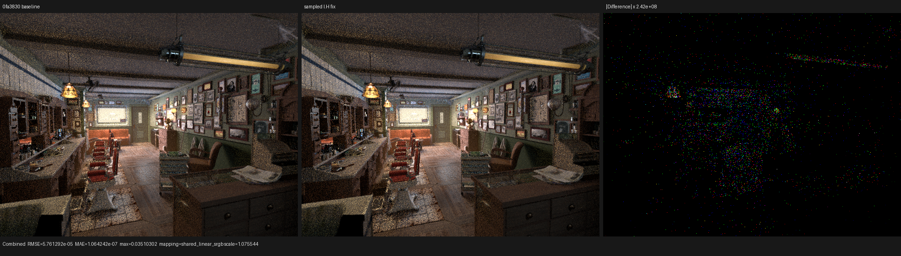
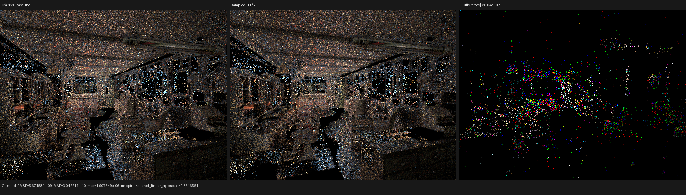
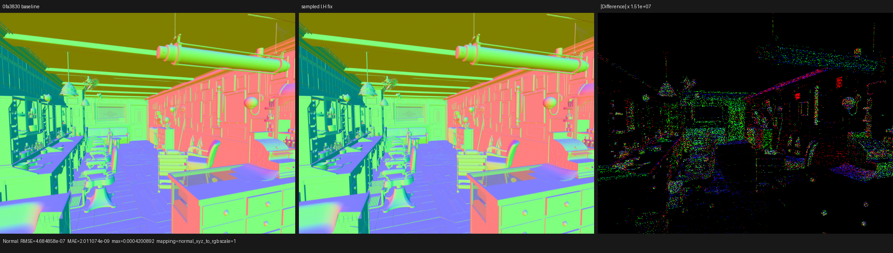

# Sampled microfacet Fresnel angle

## Outcome

Psycles now evaluates the Fresnel term used to validate a sampled regular
microfacet reflection at `I.H`, matching Cycles 5.2. The previous code used
`I.N` for both the singular and regular domains. That is exact only for a
singular closure, where `H=N`; for a VNDF sample it can incorrectly reject a
valid lobe when `F(I.N)=0` but `F(I.H)>0`.

This is a correctness fix, not a performance claim. The normal Barbershop
material set does not exercise the exact zero-Fresnel boundary often enough
to produce a structural image change, and its 64-spp render-only timing is
noise-level relative to `0fa3830`.

## Cycles source oracle

The source oracle is Blender's `blender-v5.2-release` at
`9e2066aef7ef7e20c142ad7bd3303138a4304c93`, in
`intern/cycles/kernel/closure/bsdf_microfacet.h`. Cycles initializes `H=N` for
the singular path, samples a visible normal for the regular path, computes
`cos_HI = dot(H, wi)`, and passes that cosine to `microfacet_fresnel`.

Psycles now has the same domain structure:

```text
singular: H = N, Fresnel cosine = I.N
regular:  H = sample_vndf(...), Fresnel cosine = I.H
```

No pre-baking or Cycles-side material evaluation is involved. The original
closure is still populated and evaluated entirely by the Luisa DSL path.

## Formal argument

Let `D_s` and `D_r` be the disjoint singular and regular microfacet domains.
The half-vector witness is

```text
H = N                    on D_s
H = VNDF(I, alpha, u)    on D_r.
```

The sampled reflection is `O = 2(I.H)H - I`, and the Fresnel factor is a
function of the microscopic incidence angle, `F(I.H)`. Consequently

```text
F(I.N) = F(I.H) on D_s
```

because `H=N`, but no such equality exists on `D_r`. The implementation
initializes the singular value before the branch and overwrites it from the
sampled witness only inside `D_r`. This is a total definition over the
disjoint union and does not add a case-by-case material patch.

The final regular BSDF contribution is independently evaluated at the sampled
direction. The defect therefore affects the conditional sampler's validity
predicate rather than replacing the normal mixture evaluator. That narrow
scope is why a purpose-built zero-Fresnel witness is required for a reliable
regression.

## Permanent regression and negative control

`test_luisa_microfacet_anisotropy.cpp` contains a separate bounded kernel with
a canonical black Principled metallic F82 closure, normal incidence, finite
roughness, and a non-degenerate GGX VNDF sample. For this witness:

```text
N.I       = 1
H.I       = 0.997352
F(N.I)    = 0
F(H.I)    = 1.30163e-13 > 0
singular  = false
```

The fixed sampler returns `valid=true` and its sampled Fresnel payload equals
`F(H.I)`. I then temporarily restored the old `I.N` expression, rebuilt the
same test, and observed the required red result:

```text
sample direction = (0.0081337, 0.144834, 0.989422)
sample valid      = false
sample Fresnel    = 0
```

Restoring the fix makes the same witness pass. This negative control proves
that the test detects the semantic defect and is not merely covering the
surrounding graph machinery. The main anisotropy kernel keeps its existing
90,000-instruction XIR ceiling; the private Fresnel witness kernel has a
12,000-instruction ceiling, so the regression does not hide shader-graph
growth inside a larger test AST.

The final backend matrix is:

```sh
ctest --test-dir build --parallel 1 --output-on-failure \
  -R '^psycles\.luisa_microfacet_anisotropy_(fallback|hip|vk)$'
```

Result: `3/3` passed. The Vulkan registration explicitly sets
`LUISA_VULKAN_USE_XIR=1`, `LUISA_VULKAN_REQUIRE_NATIVE_XIR_SPIRV=1`, and
`LUISA_VULKAN_DISABLE_DXC=1`.

## Barbershop HIP validation

The official Blender 5.2 Barbershop export was rendered at 640x480 and 64
fixed samples with the staged wavefront scheduler. The retained `0fa3830`
samples were 2.52187 and 2.52226 s. The fixed build reported 2.51886 s. The
approximately -0.13% difference from the baseline mean is measurement noise;
no speedup is claimed.

All 15 compared pass families are finite:

| Pass | RMSE | Relative RMSE | luminance ratio | maximum error |
|---|---:|---:|---:|---:|
| Combined | 5.76129e-5 | 3.55407e-4 | 1.00000163 | 0.0351030 |
| Normal | 4.68486e-7 | 8.49409e-7 | 1.00000000 | 4.20089e-4 |
| Glossy Direct | 6.94331e-4 | 4.35812e-4 | 1.00000841 | 0.418444 |
| Glossy Indirect | 5.67158e-9 | 1.81564e-8 | 1.00000000 | 1.90735e-6 |
| Environment | 0 | 0 | 1.00000000 | 0 |
| Volume Direct / Indirect | 0 | 0 | empty passes | 0 |

I inspected Combined, Glossy Indirect, and Normal at native resolution. The
main images coincide in geometry, UVs, floor, ceiling, brick wall, cabinet,
materials, normals, and lighting. The highly amplified panels expose sparse
floating-point/atomic-order differences and edges, not a coherent material,
transform, or sampling discrepancy.







Complete metrics and display mappings are in
[all-pass-report.json](all-pass-report.json) and
[visual-report.json](visual-report.json).

## Reproduction

```sh
cmake --build build --target \
  psycles_luisa_microfacet_anisotropy_tests \
  psycles_render_blender_scene \
  --parallel "$(nproc)"

PSYCLES_COMPACT_SURFACE_VALUES=1 \
PSYCLES_POPULATE_SURFACE_ONCE=1 \
build/bin/psycles_render_blender_scene SCENE OUTPUT.exr hip \
  640 480 64 64 - 0 0 0 0 64 - 1 0 wavefront-staged \
  32 32768 32 1 1 0 4 2 4096 0 0 0 1 1048576
```
