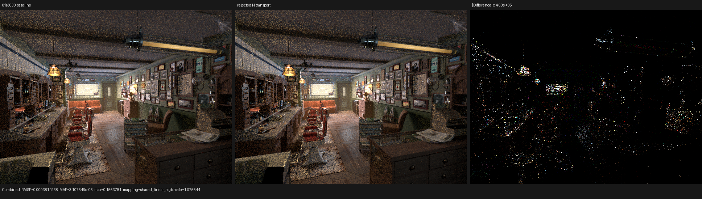
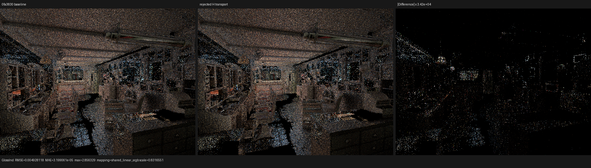
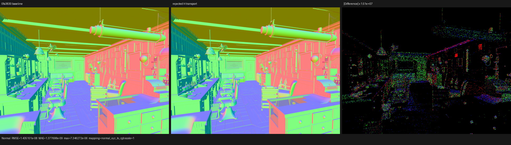

# Selected microfacet half-vector transport experiment

## Outcome

The experiment was rejected and none of its renderer ABI changes were
retained. The exact retained baseline is `0fa3830` (`surface: partition
singular microfacet work`). Carrying the sampled microfacet half vector into
the selected-closure result speeds up an isolated regular-GGX probe by about
10--13%, but the complete Barbershop surface continuation improves by only
0.079%, its HIP object grows by 384 B, and the singular probe regresses by
5.1%. Those full-scene changes are noise and the singular regression is real.

The useful result is negative: reconstructing `H` in the evaluator is not the
current full-scene bottleneck, and extending a hot result record to avoid that
reconstruction is not profitable through the present typed consumer ABI.

## Reference identity

- Psycles baseline: `0fa3830`.
- LuisaCompute: the submodule recorded by `0fa3830`.
- Cycles source: `blender-v5.2-release` at
  `9e2066aef7ef7e20c142ad7bd3303138a4304c93`.
- Device: AMD Radeon RX 9070 XT, `gfx1201`, ROCm 7.2.
- Scene: official Blender 5.2 Barbershop export, 640x480, 64 fixed samples,
  staged wavefront scheduler.

The baseline was rebuilt in the independent worktree
`/var/tmp/psycles-half-vector-baseline-a7USU8`; it did not reuse candidate
objects. The candidate and baseline used identical Release, system-STL,
fallback/HIP/native-XIR-Vulkan configuration and `HIPRT_GPU_ARCHS=gfx1201`.

## Formal basis

For a regular microfacet reflection with unit incoming direction `I`, sampled
unit half vector `H`, and `I.H > 0`, the reflected direction is

```text
O = 2 (I.H) H - I.
```

Therefore

```text
I + O = 2 (I.H) H
normalize(I + O) = H.
```

Transporting the sampler's `H` and consuming it in the selected evaluator is
thus algebraically equivalent to reconstructing `H = normalize(I + O)` in
real arithmetic. The singular domain is separate: there `H=N` and no VNDF is
sampled. The experiment encoded that disjoint union in the existing compact
sample result rather than adding a universal closure record.

That identity proves semantic equivalence but not profitability. Transport
extends a value's live range and changes the result ABI; reconstruction spends
arithmetic locally. The choice must therefore be made from generated-code and
full-scene evidence, not from operation counting alone.

## Isolated HIP result

The exact interleaved probe used 1,048,576 items, 1,024 iterations, and 31
timed repetitions. Across ordering variants, the regular-GGX baseline was
13.8--14.3 ms and the transported-H candidate was 12.0--12.6 ms, a local
10--13% reduction. The retained straight-line form nevertheless changed the
singular median from 2.758 ms to 2.899 ms, a 5.1% regression. A second
straight-line variant reached 3.018 ms on the singular case while preserving
only an 8--9% regular gain, so it was also rejected.

The small probe's machine code did not reveal a spill or occupancy win:

| Metric | baseline | transported H |
|---|---:|---:|
| linked object | 5,696 B | 5,568 B |
| VGPR | 50 | 50 |
| SGPR | 13 | 13 |
| private allocation | 8 B | 8 B |
| decoded instructions, approximate | 495 | 471 |

The local arithmetic saving is genuine. It simply does not survive the
complete shader and worsens the disjoint singular path.

## Complete Barbershop structure and timing

Both cold scene builds reported 9 coroutine subroutines, 177 frame fields,
and an 864 B frame. Every dumped device object had the same size except the
surface object:

| Metric | baseline | transported H | change |
|---|---:|---:|---:|
| surface HIP object | 357,880 B | 358,264 B | +384 B / +0.107% |
| scratch | 3,296 B | 3,296 B | unchanged |
| VGPR | 256 | 256 | unchanged |

Unprofiled interleaved B/A/A/B render-only samples were:

| Build | samples | mean |
|---|---|---:|
| baseline | 2.52187, 2.52226 s | 2.522065 s |
| transported H | 2.51896, 2.51439 s | 2.516675 s |

The apparent 0.21% improvement is below run-to-run noise. The rocprofv3
kernel trace gives the more relevant normalized surface result:

| Build | calls | work | GPU time | ns/item |
|---|---:|---:|---:|---:|
| baseline A | 293 | 53,658,304 | 1,460.832118 ms | 27.224717 |
| baseline B | 293 | 53,658,336 | 1,459.120568 ms | 27.192803 |
| candidate A | 295 | 53,659,008 | 1,459.687654 ms | 27.203031 |
| candidate B | 295 | 53,659,008 | 1,458.010226 ms | 27.171770 |
| baseline mean | | | | 27.208760 |
| candidate mean | | | | 27.187401 |

The candidate is 0.079% faster per launched item. Different path counts are
expected after a floating-point reordering, so the comparison is normalized
by actual work. This result does not justify retaining a larger renderer ABI.

## Full-pass and visual inspection

All 15 compared pass families are finite. The largest relevant differences
are sparse Monte Carlo path changes:

| Pass | RMSE | Relative RMSE | luminance ratio | maximum error |
|---|---:|---:|---:|---:|
| Combined | 3.81494e-4 | 2.35339e-3 | 1.00001121 | 0.156378 |
| Glossy Indirect | 4.92812e-3 | 1.57764e-2 | 1.00015257 | 2.85633 |
| Normal | 1.43510e-8 | 2.60197e-8 | 1.00000000 | 7.34627e-6 |
| Environment | 0 | 0 | 1.00000000 | 0 |
| Volume Direct / Indirect | 0 | 0 | empty passes | 0 |

I inspected Combined, Glossy Indirect, and Normal at native resolution. The
two main panels coincide in geometry, UV placement, floor, ceiling, cabinet,
brick wall, normals, and lighting. Amplified differences are sparse highlights,
edges, and path samples; there is no coherent missing or displaced region.







Complete metrics and display mappings are in
[all-pass-report.json](all-pass-report.json) and
[visual-report.json](visual-report.json).

## Reproduction

```sh
cmake --build build --parallel "$(nproc)"

PSYCLES_COMPACT_SURFACE_VALUES=1 \
PSYCLES_POPULATE_SURFACE_ONCE=1 \
build/bin/psycles_render_blender_scene SCENE OUTPUT.exr hip \
  640 480 64 64 - 0 0 0 0 64 - 1 0 wavefront-staged \
  32 32768 32 1 1 0 4 2 4096 0 0 0 1 1048576
```

The retained implementation reconstructs `H` in the independent evaluator.
Future work should first reduce the executed typed-consumer state or move to a
representation where the sampled witness is already present without extending
a hot ABI.
