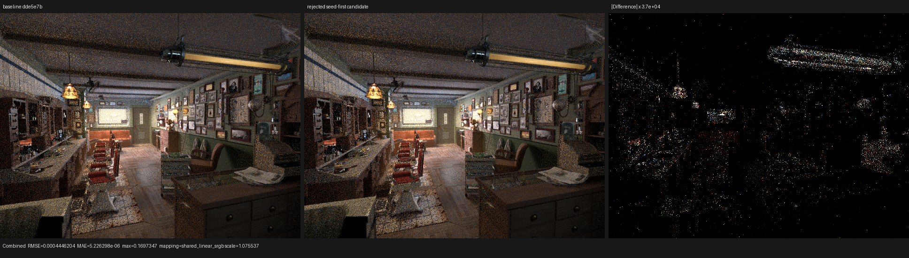
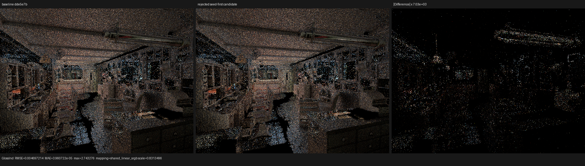
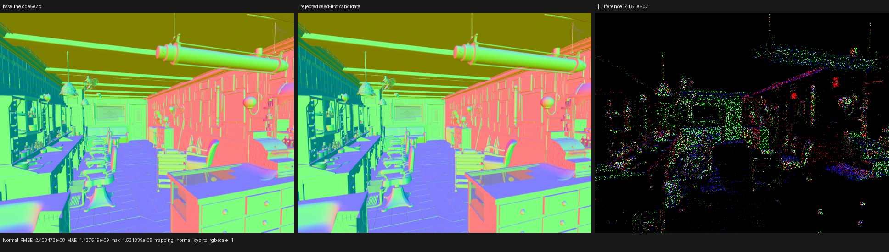

# Selected-sample contribution experiment

## Outcome

The experiment was rejected and no renderer change was retained. Psycles stays
at `dde5e7b` (`surface: reuse populated runtime flags during sampling`).

Cycles seeds the one-sample MIS fold with the contribution returned by the
selected closure sampler and evaluates only the other closures. Psycles
currently evaluates every closure at the sampled direction. Reproducing the
Cycles order is algebraically sound, but it is not a profitable representation
for the current typed Luisa consumer: the best complete form made
`shade_surface` 0.226% slower, increased the HIP surface object by 1.261%, and
increased final LLVM text by 1.251%. The coroutine frame, private allocation,
and VGPR count did not improve.

The two forms have the same estimator. Their only image difference comes from
floating-point evaluation order and from using the sampler's already-computed
microfacet intermediate instead of reconstructing it in the independent
evaluator. At 640x480 and 64 fixed samples the Combined luminance ratio is
`1.00001425`; the two main images are visually indistinguishable. This is not a
missing material feature or a structural rendering discrepancy, so retaining
larger and slower code merely to reproduce the Cycles arithmetic route would
violate the project's performance rule.

## Reference identity

- Retained Psycles baseline: `dde5e7b`.
- LuisaCompute: `eeda4b154fcf43e8709d1b42478e958677b9c6ae`.
- Cycles source: `blender-v5.2-release` at
  `9e2066aef7ef7e20c142ad7bd3303138a4304c93`.
- Device: AMD Radeon RX 9070 XT, `gfx1201`, ROCm 7.2.4.
- Scene: official Blender 5.2 Barbershop export, 640x480, 64 fixed samples,
  Tabulated Sobol, adaptive sampling disabled, staged wavefront scheduler.

The Cycles source evidence is in
`intern/cycles/kernel/integrator/surface_shader.h`. In
`surface_shader_bsdf_sample_closure`, `bsdf_sample` first returns the selected
evaluation and PDF. For more than one closure, `_surface_shader_bsdf_eval_mis`
is then called with that selected term as the initial accumulator and with the
selected `ShaderClosure *` as `skip_sc`. The loop explicitly skips that pointer
and evaluates the competitors.

## Formal model

Let the populated BSDF closures be the finite ordered sequence
`C = (c_0, ..., c_(n-1))`. Closure `c_i` has categorical sample weight `a_i`,
directional density `p_i(w)`, and filtered throughput contribution `g_i(w)`.
After choosing closure `k` and sampling direction `w` from `p_k`, the
one-sample balance mixture is

```text
G(w) = sum_i g_i(w)
P(w) = sum_i a_i p_i(w) / sum_i a_i.
```

The retained Psycles fold evaluates every `g_i(w), p_i(w)`. The candidate used
the selected sampler result `(g'_k(w), p'_k(w))` as the seed and folded only
`i != k`. It is equivalent over real arithmetic provided the closure contract
establishes

```text
g'_k(w) = g_k(w) and p'_k(w) = p_k(w).
```

That contract holds for the represented scattering distributions, events,
weights, roughness, and eta. It is not a bitwise floating-point identity. For
example, one Vulkan glossy fixture produced approximately `1.38265` versus
`1.38263` in one evaluation component and `2.50526` versus `2.50522` in PDF,
while its event, total weight, and roughness agreed. The sampler still owned
its sampled half-vector; the independent evaluator reconstructed the
half-vector from `wi + wo`. Different rounding is therefore expected without
implying an XIR control-flow or ABI failure.

The candidate also applied the exact singleton law: if `n <= 1`, the selected
result is already the complete mixture and no competitor fold is needed. This
reduced the initial regression but did not overcome the extra result transport
and control-flow structure generated by the typed handler.

## Implemented and rejected variants

All variants transported the selected contribution through the existing
compact conditional-sample result rather than introducing another device
record or callable.

| Variant | Definition | `shade_surface` change |
|---|---|---:|
| returned selected term | substitute the selected evaluator result in the existing fold position | +0.540% |
| singleton bypass | additionally seed directly when `n <= 1` | +0.216% |
| Cycles seed order | seed selected first, then fold only `i != k`; singleton bypass retained | +0.226% |

The last row is the formal Cycles-equivalent ordering and is the one used for
the cold structure, final A/B/B/A, and image measurements below. The small
difference between the last two timings is measurement noise; neither is a
speedup.

## Cold generated structure

Both programs were compiled from a cold cache with LLVM and HIP ISA dumps.
The one-sample cold run changes execution work but not the recorded shader AST.

| Metric | exact `dde5e7b` | Cycles-order candidate | Change |
|---|---:|---:|---:|
| coroutine frame | 880 B / 178 fields | 880 B / 178 fields | unchanged |
| final LLVM | 3,374,620 B / 57,804 lines | 3,416,834 B / 58,565 lines | +1.251% bytes |
| HIP surface object | 355,360 B | 359,840 B | +1.261% |
| main entry | 295,728 B | 300,228 B | +1.522% |
| private storage | 3,136 B | 3,136 B | unchanged |
| VGPR / reported spills | 256 / 381 | 256 / 380 | effectively unchanged |

The experiment therefore did not remove a closure evaluator in isolation at
the machine-code level. Transporting the selected typed contribution enlarged
the surrounding specialization enough to dominate the saved arithmetic.

## HIP A/B/B/A result

The exact baseline and final seed-first candidate were run in interleaved
A/B/B/A order. `shade_surface` is normalized by its actual launched work, not
by image pixels or wall time.

| Run | Render-only | all mapped GPU kernels | `shade_surface` ns/item |
|---|---:|---:|---:|
| baseline A | 2.56527 s | 2,235.187 ms | 27.646908 |
| candidate A | 2.56664 s | 2,237.008 ms | 27.711220 |
| candidate B | 2.56965 s | 2,239.388 ms | 27.716045 |
| baseline B | 2.56525 s | 2,235.970 ms | 27.655192 |
| baseline mean | 2.565260 s | 2,235.579 ms | 27.651050 |
| candidate mean | 2.568145 s | 2,238.198 ms | 27.713633 |
| candidate change | **+0.112%** | **+0.117%** | **+0.226%** |

The earlier two candidate forms were also profiled with their own interleaved
baselines. The unqualified form regressed normalized shade time by 0.540%; the
singleton form regressed it by 0.216%. All three measurements reject the same
hypothesis.

## Backend regressions

During the experiment, the differential kernel checked:

1. the selected sampler contribution against an independent closure
   evaluator for every represented closure family;
2. the selected-seed-plus-competitors result against the original all-closure
   fold;
3. event flags, categorical weight, PDF, roughness, eta, and pass-bucket
   contributions; and
4. the singleton bypass and mixed-closure path.

The closure/population/SVM matrix passed on fallback, HIP, and strict native
XIR-to-SPIR-V Vulkan. Film, pass accumulation, closure collection, tail,
point, and execution-plan tests also passed. The independent-algebra oracle
used a scale-aware tolerance only for the sampler-versus-reconstructed
microfacet comparison; the packed tagged-union and ABI equivalence checks
remained exact.

Because the implementation was rejected, its test-only ABI and tolerance were
also removed. The retained baseline was rebuilt with all host threads and then
passed this 18-test matrix:

```sh
LUISA_VULKAN_USE_XIR=1 \
LUISA_VULKAN_REQUIRE_NATIVE_XIR_SPIRV=1 \
LUISA_VULKAN_DISABLE_DXC=1 \
ctest --test-dir build --parallel 1 --output-on-failure \
  -R '^psycles\.luisa_(surface_closure_collection|surface_closure_reachability|surface_population|compact_surface_preparation|compact_surface_tail|surface_closure_point)_(fallback|hip|vk)$'
```

Result: `18/18` passed. No DXC route was available to the Vulkan tests.

## Full-pass and visual comparison

All 15 exported pass families are finite. The most relevant metrics are:

| Pass | RMSE | Relative RMSE | Mean luminance ratio | Maximum absolute error |
|---|---:|---:|---:|---:|
| Combined | 4.4462e-4 | 2.7409e-3 | 1.00001425 | 0.169735 |
| Normal | 2.4085e-8 | 4.3668e-8 | 1.00000000 | 1.5318e-5 |
| Diffuse Color | 8.7830e-6 | 3.3612e-5 | 1.00000007 | 0.004682 |
| Glossy Direct | 6.9669e-4 | 4.3692e-4 | 0.99999240 | 0.418882 |
| Glossy Indirect | 4.6972e-3 | 1.5033e-2 | 1.00018402 | 2.743276 |
| Transmission Indirect | 2.0253e-6 | 1.3499e-4 | 1.00000607 | 0.001561 |
| Environment | 0 | 0 | 1.00000000 | 0 |
| Volume Direct / Indirect | 0 | 0 | empty pass | 0 |

The higher relative error in Glossy Indirect is driven by a sparse,
high-dynamic-range pass. I inspected Combined, Normal, and Glossy Indirect at
original resolution. Geometry, UVs, floor, ceiling, brick wall, cabinet,
lighting, closure identity, and normals coincide. The amplified differences
are sparse highlights and edges, with no coherent missing or shifted region.







The complete machine-readable pass metrics are in `all-pass-report.json`; the
three inspected panels and their display mappings are in `visual-report.json`.

## Reproduction

Build:

```sh
cmake --build build --parallel "$(nproc)"
```

Representative cold structure run:

```sh
PSYCLES_DISABLE_SHADER_CACHE=1 \
PSYCLES_COMPACT_SURFACE_VALUES=1 \
PSYCLES_POPULATE_SURFACE_ONCE=1 \
LUISA_CORO_SHADER_MAP=1 \
LUISA_CORO_DUMP_FRAME_LAYOUT=1 \
LUISA_DUMP_LLVM_IR=1 \
LUISA_DUMP_HIP_ISA=ISA_DIRECTORY \
build/bin/psycles_render_blender_scene SCENE out.exr hip \
  640 480 1 1 - 0 0 0 0 1 - 1 0 wavefront-staged \
  32 32768 32 1 1 0 4 2 4096 0 0 0 1 1048576
```

Representative profiler wrapper:

```sh
rocprofv3 --kernel-trace -f rocpd -d PROFILE_DIR -o trace -- \
  build/bin/psycles_render_blender_scene SCENE out.exr hip \
  640 480 1 64 - 0 0 0 0 1 - 1 0 wavefront-staged \
  32 32768 32 1 1 0 4 2 4096 0 0 0 1 1048576
```

Kernel normalization query:

```sql
select name,
       count(*) as calls,
       sum(duration) / 1000000.0 as milliseconds,
       sum(grid_x * grid_y * grid_z) as work,
       sum(duration) * 1.0 / sum(grid_x * grid_y * grid_z) as ns_per_work,
       max(static_scratch_size) as private_bytes,
       max(vgpr_count) as vgpr
from kernels
where name glob 'kernel_[0-9a-f]*'
group by name
order by milliseconds desc;
```

The conclusion is deliberately negative: Cycles' selected-seed organization
is valid, but importing it through this Psycles ABI is not currently an
optimization. The next surface work should implement missing closure semantics
or reduce the typed consumer's executed state, not preserve this larger fold.
