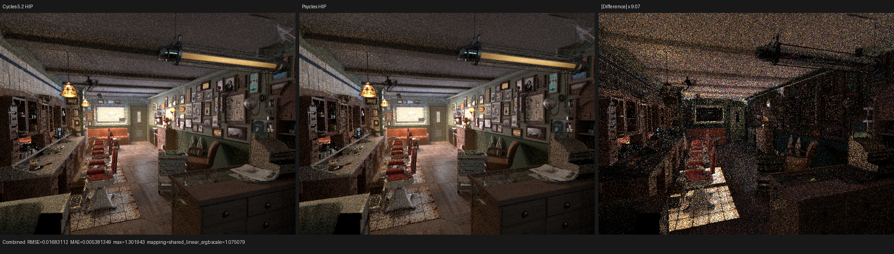
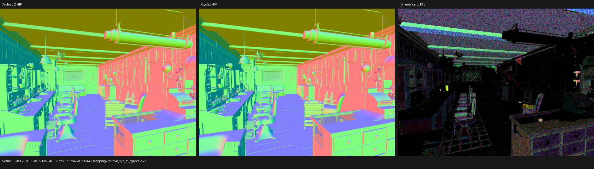
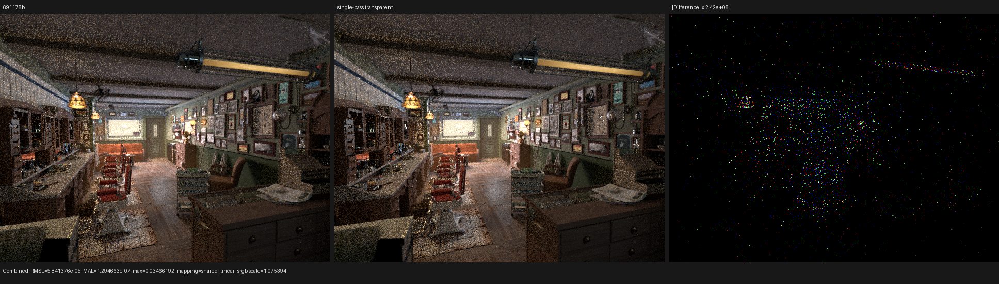

# Single-pass transparent closure population

## Outcome

Compact surface population now executes the closure bytecode once while
preserving Cycles 5.2 transparent-closure allocation semantics. The first
above-cutoff transparent setup occupies its exact source position, later
transparent setups fold into that logical closure even after the closure array
becomes full, and a setup first encountered after capacity exhaustion still
publishes transparent runtime identity and extinction without inventing a
sampleable closure.

On the Radeon RX 9070 XT, the final implementation reduces the controlled
constant-closure `shade_surface` cost by **5.66%** and private storage by
**168 B/thread**. In the complete 640x480, 64-spp Barbershop run it reduces the
same kernel by **2.49%** and render-only time by **1.40%**. The full scene still
uses 144 B/thread more private storage than the parent because the online sum
and retained index must remain live through the interpreter. That cost is
reported rather than hidden.

This is a bounded improvement, not Cycles performance parity. Using the
previous exact-device Cycles 5.2 trace of 10.778 ns/item, the new Barbershop
surface result of 27.130 ns/item remains about 2.52x slower. The remaining
surface value-SVM and closure-consumer gap is still the primary optimization
target.

## Cycles oracle and formal model

The oracle is Blender/Cycles 5.2.1 source commit
`9e2066aef7ef7e20c142ad7bd3303138a4304c93`. In
`intern/cycles/kernel/closure/bsdf_transparent.h`,
`bsdf_transparent_setup` performs these operations in order:

1. compute `sample_weight` and reject it unless it is at least
   `CLOSURE_WEIGHT_CUTOFF`;
2. add the weight to `closure_transparent_extinction`;
3. if a transparent closure already exists, find it and add weight and sample
   weight;
4. otherwise set the transparent/BSDF flags and attempt `closure_alloc`.

Let the source-ordered physical setup events be `e[0..n)`. For every
transparent event define `a(i)` as its exact cutoff predicate. The observable
transparent state is:

```text
p = min { i | e[i] is transparent and a(i) }
W = sum { weight(i)        | e[i] is transparent and a(i) }
S = sum { sample_weight(i) | e[i] is transparent and a(i) }
```

If no such `p` exists, transparent setup is the identity. Otherwise:

- transparent identity and extinction `W` are observable even if capacity is
  already exhausted at `p`;
- if a slot is available at `p`, exactly one transparent record is retained at
  that source position with `(weight, sample_weight) = (W, S)`;
- later transparent events never consume another slot;
- every non-transparent event retains its original relative order and uses the
  ordinary capacity transaction.

This is an additive monoid plus a first-position witness, not a list of special
cases. The compact interpreter keeps the sum in one `float4`; because every
accepted sample weight is at least a strictly positive cutoff, `sum.w == 0`
is an exact unseen-state witness. The collector uses `capacity` as an invalid
index sentinel, so it does not need a separately live retained Boolean.

## Implementation

The population collector advertises write-only transparent finalization. During
the single bytecode traversal:

- the first accepted transparent event starts setup and attempts the physical
  append at its source location;
- later accepted transparent events update only the lexical `float4` sum;
- finalization overwrites the retained physical common block once, without
  reading the dynamically indexed `Local`;
- transparent runtime identity is observed before the append attempt, and
  extinction/AOV state is finalized even when the append failed for capacity.

Collectors without this capability retain the canonical pre-merged route, so
the generic collector contract is unchanged. The expanded graph route now
applies the cutoff before adding a transparent contribution and uses the same
three-stage setup protocol when the population collector supports it.

A first implementation updated the retained `Local` on every transparent
event. It was semantically correct but prevented backend scalar replacement:
private storage rose from 2,424 to 4,192 B/thread and the controlled surface
kernel rose from about 13.33 to 33.98 ns/item. That design was rejected and was
not committed. The accepted design is write-only.

## Regression coverage

The compact-surface fixture now covers both nested and capacity-sensitive
source orders:

- transparency before a diffuse/glass/glossy suffix, proving that the suffix is
  not replayed to reconstruct order;
- a sub-cutoff transparent event, proving it is the identity element;
- eleven prefix closures, a retained transparent event, suffix closures that
  exhaust capacity, and a later transparent event, proving post-capacity merge
  into slot 11;
- twelve prefix closures followed by transparency, proving that exhausted
  capacity stores no transparent record while preserving the transparent
  runtime bit and full extinction sum.

The differential expanded/compact checks plus the independent capacity oracles
passed on fallback, HIP, and Vulkan. Vulkan was run with:

```sh
LUISA_VULKAN_USE_XIR=1 \
LUISA_VULKAN_REQUIRE_NATIVE_XIR_SPIRV=1 \
LUISA_VULKAN_DISABLE_DXC=1 \
ctest --test-dir build --output-on-failure -j1 \
  -R 'psycles\.luisa_(cycles_closure|surface_population|compact_surface_(preparation|tail))_(fallback|hip|vk)$'
```

Result: 12/12 passed in 43.63 seconds. The targeted executables and renderer
were built with all available host threads:

```sh
cmake --build build --target \
  psycles_luisa_compact_surface_preparation_tests \
  psycles_luisa_cycles_closure_tests \
  psycles_luisa_surface_population_tests \
  psycles_render_blender_scene -j"$(nproc)"
```

A broader warm-cache regression additionally covered closure collection,
reachability, point, and physical-storage suites under the same three-backend
environment: 24/24 passed in 4.83 seconds.

```sh
LUISA_VULKAN_USE_XIR=1 \
LUISA_VULKAN_REQUIRE_NATIVE_XIR_SPIRV=1 \
LUISA_VULKAN_DISABLE_DXC=1 \
ctest --test-dir build --output-on-failure -j1 \
  -R 'psycles\.luisa_(cycles_closure|surface_(closure_(collection|reachability|point|physical)|population)|compact_surface_(preparation|tail))_(fallback|hip|vk)$'
```

## HIP performance

Both sides use 640x480, 64 fixed samples, adaptive sampling off, the same
wavefront-staged configuration, warm shader caches, and rocprofv3 kernel traces.
Work is the sum of `grid_x * grid_y * grid_z` over the surface dispatches.

### Controlled constant-closure inputs

The order was parent, candidate, candidate, parent. The 192-work-item
difference is scheduler padding (0.00034% of work), so the comparison uses
normalized ns/item.

| Build | Runs (ns/item) | Mean | Private | VGPR | Shader hash |
|---|---:|---:|---:|---:|---|
| parent `691178b` | 13.06598, 13.10656 | 13.08627 | 2,424 B | 256 | `070c005968d9d9e7` |
| candidate | 12.28638, 12.40366 | 12.34502 | 2,256 B | 256 | `078bd8aa6ed45a88` |

The normalized delta is -5.664%; private storage falls 168 B (-6.931%).

### Complete Barbershop

| Build | Calls / work | GPU time | ns/item | Private | Render-only |
|---|---:|---:|---:|---:|---:|
| parent `691178b` | 293 / 53,663,488 | 1,493.088 ms | 27.82316 | 3,152 B | 2.57533 s |
| candidate | 293 / 53,663,488 | 1,455.906 ms | 27.13029 | 3,296 B | 2.53931 s |

The surface kernel improves 2.490% on identical work. A separate render using
the complete fresh asset bundle measured 2.55667 to 2.51810 seconds (-1.509%).

The profiler command was:

```sh
rocprofv3 --kernel-trace -f rocpd -d PROFILE_DIR -o trace -- \
  ./build/bin/psycles_render_blender_scene EXPORT out.exr hip \
  640 480 64 64 - 0 0 0 0 64 - 1 0 \
  wavefront-staged 64 32768 32 1 1 0 4 2 4096 131072 0 0 1
```

Raw local captures are retained under
`/var/tmp/psycles-transparent-single-pass-20260827`, including the rejected
read/modify/write experiment and final A/B profiles. Machine-readable summary
values are in [metrics.json](metrics.json).

## Numerical and visual validation

The final candidate and parent were rendered from the same complete Blender
5.2 export at 640x480 and 64 spp. All 15 available passes were compared. The
Combined luminance mean ratio is 0.9999982; Combined relative RMSE is 0.0003603
and Normal relative RMSE is 8.46e-7. The sparse differences are expected path
changes from correcting the transparent source position, not a coherent image
shift.

The same candidate was compared with the build-identity-verified Cycles 5.2 HIP
golden. Combined luminance mean ratio is 0.999433, Combined relative RMSE is
0.1040, and Normal relative RMSE is 0.01829. At 64 spp the radiance-pass RMSE is
noise dominated. Manual inspection found no structured material, UV,
coordinate-system, closure, or lighting displacement.







Complete per-pass reports are [cycles-all-pass.json](cycles-all-pass.json) and
[parent-all-pass.json](parent-all-pass.json). The visual reports record the
shared display and difference mappings used by the checked-in triptychs.
