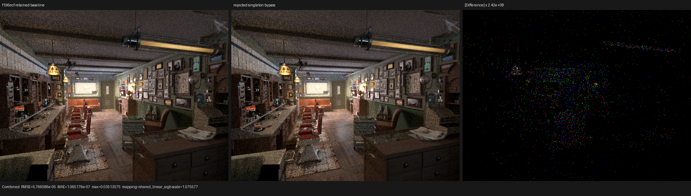
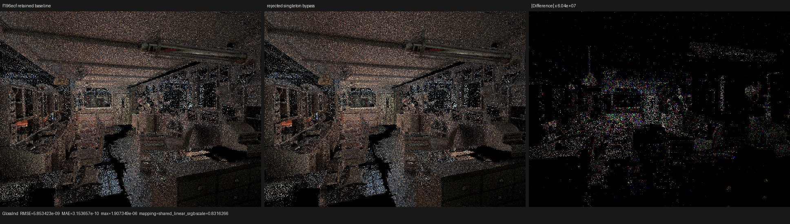
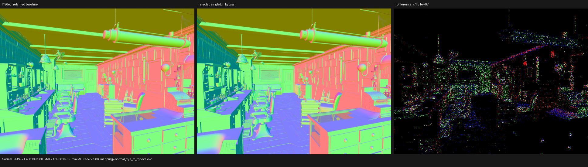

# Runtime singleton categorical bypass: rejected

## Decision

Do not add a runtime `retained_count == 1` branch around surface-closure
inverse-CDF traversal. The transformation is semantically exact, but it is not
profitable on the production HIP renderer. Three complex Blender 5.2 scenes
show noise-level changes or a small regression, and a matched Barbershop kernel
trace measures `shade_surface` 0.248% slower. The original experimental source
changes were therefore removed at commit `f196ecf`.

The decision was re-tested after the single-pass transparent population change
at retained commit `9e20e1a`. The narrower, algebraically specialized form was
again slower: `shade_surface` regressed by 0.111% while render-only time changed
by +0.005%. It was removed as well. This independent re-check rules out the
possibility that the earlier result was an artifact of the old population
shape.

This result complements the runtime closure-count measurement in
`../surface-closure-count-histogram/`: the singleton population is real, but
closure count alone is not a sufficient profitability predicate.

## Formal model

Let the retained, ordered closure sequence be

```text
C = (c_0, ..., c_(N-1)),  s_i >= 0,  W = sum_i s_i,
u = clamp(random_lobe, 0, nextafter(1, 0)).
```

The existing categorical state machine finds the unique retained interval
containing `u W` and returns both its program index and the interval-local
coordinate. For `N == 1 && W > 0`, the solution is provably

```text
selected_index = 0
selected_lobe = (u W - 0) / W = u.
```

For `N == 0`, or a zero-mass singleton, no closure is selected. The experiment
preserved that invalid-measure contract. It also deliberately used structural
retained count rather than positive-support count: an `N > 1` sequence stayed
on the original ordered recurrence even if all but one weight were zero.

Both the dense physical closure path and the branch-local authored-program
path first constructed the complete selection measure. A device branch then
bypassed only the second categorical traversal when the predicate above held.
The selected closure sampler and the full mixture evaluator were unchanged.
This was a host-generated AST transformation, not scene-specific material
specialization.

The exhaustive categorical regression exercised all 16 retained masks of a
four-entry sequence, four lobe coordinates, a retained zero-mass entry, empty
and zero-mass singleton measures, and the general multi-entry recurrence. The
candidate also passed closure-collection and production film tests on fallback,
HIP, and strict native XIR-to-SPIR-V Vulkan with DXC disabled.

## Why the valid rewrite did not pay

The runtime histogram showed singleton hit fractions of 55.14% for Barbershop,
66.69% for Classroom, and 19.12% for Monster. That does not imply a coherent
wave-level branch: neighboring paths can hit different materials and carry
different retained counts. More importantly, the removed work is only the
small inverse-CDF recurrence. The closure sampler and the full closure-mixture
evaluation still dominate the surface continuation.

The generated objects corroborate this. HIP must retain the general path, so
the Barbershop and Classroom linked objects shrink by only 256 bytes; Monster
is unchanged.

| Scene | Baseline object | Candidate object | Change |
|---|---:|---:|---:|
| Barbershop | 364,192 B | 363,936 B | -256 B |
| Classroom | 244,912 B | 244,656 B | -256 B |
| Monster | 247,544 B | 247,544 B | 0 B |

Barbershop resource metadata is unchanged at 256 VGPR, 128 SGPR, and 3,152 B
scratch per `shade_surface` dispatch. The extra divergent predicate therefore
has no occupancy benefit to compensate its control-flow cost.

## HIP performance

Hardware and configuration:

- AMD Radeon RX 9070 XT (`gfx1201`), ROCm 7.2.4;
- Blender 5.2 exports, 640x480, 64 fixed samples, adaptive sampling disabled;
- staged wavefront scheduler, 32-thread continuation blocks;
- compact surface values and one population pass per hit;
- independent executable directories and independent Luisa shader caches;
- warm A/B/B/A ordering, with cold compilation excluded from render time.

### Renderer-reported render-only time

| Scene | Baseline samples (s) | Candidate samples (s) | Median baseline | Median candidate | Change |
|---|---|---|---:|---:|---:|
| Barbershop | 2.60217 / 2.60550 / 2.58727 / 2.60693 | 2.60626 / 2.60237 / 2.60366 / 2.59579 | 2.603835 s | 2.603015 s | -0.032% |
| Classroom | 1.41825 / 1.41280 / 1.41627 | 1.41500 / 1.41127 / 1.41721 | 1.416270 s | 1.415000 s | -0.090% |
| Monster | 1.65457 / 1.66290 / 1.65338 | 1.65897 / 1.65868 / 1.66366 | 1.654570 s | 1.658970 s | +0.266% |

The two apparent improvements are far below run-to-run variation. Monster is
a small regression. There is no defensible end-to-end speedup.

### Barbershop kernel trace

`rocprofv3 --kernel-trace -f rocpd` recorded one matched warm pair. Both sides
issued 293 `shade_surface` continuations over 53,658,304 scheduled work-items.

| Measurement | Baseline | Candidate | Change |
|---|---:|---:|---:|
| `shade_surface` | 1,531.708499 ms | 1,535.501270 ms | +0.248% |
| all mapped Psycles kernels | 2,304.751473 ms | 2,310.017424 ms | +0.228% |
| profiler render-only | 2.61563 s | 2.61918 s | +0.136% |

HIPRT build kernels, copies, and output are excluded from the mapped-kernel
sum. All three measurements agree that this is not the missing Cycles surface
performance optimization.

### Post-transparent-population re-check

The current production histogram was measured again over the complete
640x480, 64-spp Barbershop run. It was exact and contained 53,653,581 surface
events: 1.5547% with zero closures, 55.1364% with one, 40.3104% with two,
2.9969% with three, and 0.0015% with four. Thus 56.6912% of events satisfy
`N <= 1`; the rejected result is not explained by a rare predicate.

For a positive-mass singleton, the general inversion recurrence reduces to

```text
u = clamp(random_lobe, 0, nextafter(1, 0))
target = u * W
selected = W > 0 and target < W
selected_index = 0
selected_lobe = u.
```

The candidate retained `target < W` rather than replacing it with a finite-
number assumption, so NaN, infinity, zero-mass, and the upper clamp boundary
preserved the general state machine's observable invalid-measure behavior. It
added no result fields and did not change the sampler or mixture evaluator.

The interleaved A/B/B/A HIP trace used identical 640x480, 64-spp fixed-sample
Barbershop commands. Both variants issued 293 surface continuations over
53,663,616 scheduled work-items and used 3,296 B private storage and 256 VGPRs.

| Run | Render-only | `shade_surface` ns/item |
|---|---:|---:|
| retained A | 2.52964 s | 27.153786 |
| candidate A | 2.53257 s | 27.188215 |
| candidate B | 2.53259 s | 27.211803 |
| retained B | 2.53529 s | 27.186139 |
| retained mean | 2.532465 s | 27.169963 |
| candidate mean | 2.532580 s | 27.200009 |
| candidate change | **+0.005%** | **+0.111%** |

All three focused surface-population tests passed on fallback, HIP, and strict
native XIR-to-SPIR-V Vulkan before the source was reverted. A fresh 15-pass
comparison found no invalid pixels; Combined relative RMSE was 0.000356,
Normal relative RMSE was 2.79e-8, and the largest pass-relative RMSE was
0.000436 in Glossy Direct. I inspected Combined, Normal, and Glossy Indirect
at original resolution. Geometry, normals, UVs, materials, lighting, and
silhouettes coincide; amplified differences are sparse floating-point and
atomic-accumulation variation. The already checked-in triptychs below remain
representative of this same rejected transformation. Machine-readable re-check
data are in `post-transparent-recheck.json`.

## Numerical and visual validation

The profiler pair produced finite values for every exported pass. Selected
metrics are:

| Pass | RMSE | MAE | Maximum absolute error | Mean luminance ratio |
|---|---:|---:|---:|---:|
| Combined | 5.76659e-5 | 1.06518e-7 | 3.51358e-2 | 1.00000152 |
| Normal | 1.43011e-8 | 1.39061e-9 | 9.33558e-6 | 1.00000000 |
| Glossy Indirect | 5.85342e-9 | 3.15366e-10 | 1.90735e-6 | 1.00000000 |

Combined's maximum is a sparse high-energy outlier; its 99th-percentile pixel
RMSE is `4.30e-9`. I inspected the three triptychs at original resolution.
Camera, geometry, silhouettes, UV placement, floor, ceiling, brick wall,
cabinet, material regions, illumination, and normals coincide. The highly
amplified difference panels contain sparse floating-point/highlight variation,
not a coherent structural change.







Complete metrics are in `all-pass-report.json`; display mappings and inspected
panels are in `visual-report.json`. The comparison intentionally labels the
first Psycles output as the reference, so its historical `cycles` JSON field
does not mean Blender/Cycles in this experiment.

## Reproduction

The production render command shape was:

```sh
PSYCLES_COMPACT_SURFACE_VALUES=1 \
PSYCLES_POPULATE_SURFACE_ONCE=1 \
RUNTIME/psycles_render_blender_scene SCENE out.exr hip \
  640 480 64 64 - 0 0 0 0 64 - 1 0 wavefront-staged \
  32 32768 32 1 1 0 4 2 4096 131072 0 0 1
```

The trace wrapped the same command with:

```sh
rocprofv3 --kernel-trace -f rocpd -d PROFILE_DIR -o trace -- COMMAND
```

The rejected candidate was tested before removal with:

```sh
ctest --test-dir build --output-on-failure -j1 \
  -R '^psycles\.luisa_surface_closure_collection_(fallback|hip|vk)$'

LUISA_VULKAN_USE_XIR=1 \
LUISA_VULKAN_REQUIRE_NATIVE_XIR_SPIRV=1 \
LUISA_VULKAN_DISABLE_DXC=1 \
build/bin/psycles_luisa_sample_dispatch_film_tests vk
```

Equivalent film tests passed on fallback and HIP, and
`psycles_luisa_compile_tests` passed. The original retained tree was byte-for-
byte the already validated `f196ecf` source plus this rejection record. The
post-transparent re-check likewise left the current `9e20e1a` source byte-for-
byte unchanged.

## Next optimization target

The measurement rules out categorical traversal as a material bottleneck.
Future surface work should instead compare Cycles and Psycles at the closure
sampler and full-mixture evaluator boundaries, quantify per-family invocation
cost, and remove redundant closure evaluation through a typed SVM design or an
equivalent formally scheduled representation. Any replacement must preserve
the exact ordered-mixture semantics and must earn its place with per-kernel HIP
evidence.
