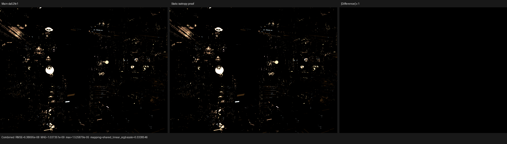
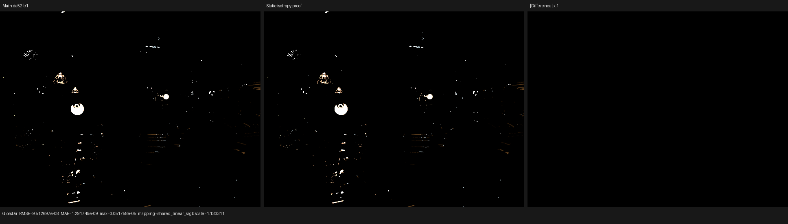
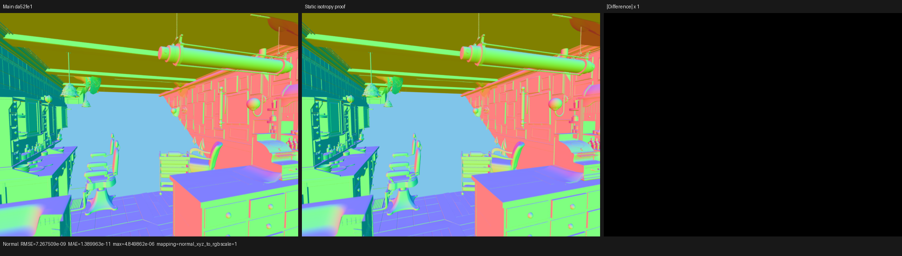

# Static microfacet-anisotropy reachability

## Outcome

The surface JIT now proves whether any reachable Glossy or Principled
metallic/dielectric physical closure can be anisotropic. A proved-isotropic
scene records scalar microfacet evaluation and sampling directly: it does not
name the tangent or two-axis alpha payload and does not record the anisotropic
distribution/basis branch.

On a 640x480, 64-spp constant-Glossy Barbershop-derived probe, an interleaved
HIP A/B/B/A trace reduces normalized `shade_surface` time from 4.017853 to
3.878647 ns/item (-3.46%). Launched work and dispatch count are identical;
private storage falls from 2,112 to 2,096 bytes/thread while VGPR allocation
remains 256.

This specialization is intentionally bounded. The constant-closure-inputs
probe contains four genuinely anisotropic standalone Glossy nodes, so its
scene capability is not isotropic. The candidate remains effectively neutral
there (12.922612 versus 12.894988 ns/item, -0.21%, a single pair within noise),
rather than silently treating isotropic Principled records as proof for the
whole scene. The result is useful for exact isotropic domains, not a claim that
the remaining Barbershop surface/SVM gap is closed.

## Formal domain and transfer

The host/JIT abstract state is the reduced product

```text
R = (K, P, A)

K: reachable canonical SurfaceClosureKind set
P: reachable Principled-lobe set
A: subset of K whose microfacet state may be anisotropic
```

with invariants

```text
Principled not in K  => P is empty
A subset K
```

The order is component-wise subset; join and meet are component-wise union
and intersection followed by reduction. Thus removing anisotropy from `A`
requires a proof and cannot result from a device value guess.

The compact closure image supplies four immutable unions: all closure
operations, all Principled features, operations on leaves that retain the
anisotropy operand, and Principled features on those same anisotropic leaves.
The last union is deliberately computed per leaf before joining. Joining the
scene-wide Principled feature union with an unrelated anisotropic Principled
leaf would create a false correlation (for example an anisotropic diffuse-only
leaf plus a separate isotropic metallic leaf).

For known, consistent metadata, the transfer is a union homomorphism over
bytecode leaves. Only standalone Glossy and Principled metallic/dielectric
features enter `A`. Unknown bits, an anisotropic operation absent from the
operation set, and an anisotropic Principled feature without a matching
Principled operation map to lattice top. Schema drift can therefore disable
specialization but cannot erase required shader code.

The direct graph-expansion path applies the same transfer to its immutable
host-stage `TracedClosure` metadata. This keeps expanded fixtures and compact
scene execution under one proof rather than adding a compact-SVM-only case.

## Scattering specialization

When the General family reachability proves `A` empty, microfacet evaluation
uses the scalar common roughness and scalar GGX/Beckmann distribution terms.
Sampling uses the scalar alpha for both axes and never constructs a tangent
basis. Otherwise the existing exact two-axis path remains unchanged and still
uses the device equality test for individual isotropic records.

Evaluation now returns the already-computed singular-aware roughness squared
alongside value and PDF. General reflection, thin glass, and dielectric glass
therefore do not reconstruct the same alpha/singularity expression DAG after
directional evaluation. This is an algebraic common-result projection, not an
approximation; the validity predicate is not reused as the singular predicate.

The permanent AST regression records isotropic and anisotropic Glossy probes,
requires distinct function hashes, and requires the anisotropic form to
contain strictly more expressions and statements. The same fixture compares a
specialized scene domain to lattice top bit-for-bit on every reachable closure
identity.

## Correctness and visual inspection

The following 15 backend tests passed after a full-thread build:

- microfacet anisotropy on fallback, HIP, and Vulkan;
- film/light-pass accumulation on fallback, HIP, and Vulkan;
- closure collection on fallback, HIP, and Vulkan;
- closure reachability on fallback, HIP, and Vulkan;
- physical-closure evaluation/sampling on fallback, HIP, and Vulkan.

Vulkan used `LUISA_VULKAN_USE_XIR=1`,
`LUISA_VULKAN_REQUIRE_NATIVE_XIR_SPIRV=1`, and
`LUISA_VULKAN_DISABLE_DXC=1`. The reachability fixture reports the complete
domain shrinking from 8,732 to 4,652 AST expressions and from 4,394 to 2,444
statements for a Diffuse-only domain; it separately enforces the
isotropic-versus-anisotropic Glossy reduction.

The retained 46-channel baseline/candidate EXRs were compared for all 15
supported color/vector passes. Every pass has zero invalid pixels. Combined
RMSE is `6.39e-8`, Glossy Direct RMSE is `9.51e-8`, and Normal RMSE is
`7.27e-9`; noncontributing passes are exactly zero. I inspected the Combined,
Glossy Direct, and Normal triptychs at native resolution. Geometry, normal
orientation, material regions, lighting, and highlights coincide; the
difference panels contain no coherent structure.







## HIP measurement

The exact candidate fixed point was measured in an adjacent A/B/B/A sequence
on the Radeon RX 9070 XT (`gfx1201`, ROCm 7.2.4). Both binaries used the same
probe, 640x480, 64 fixed samples, Tabulated Sobol, staged wavefront, 64-thread
surface workgroups, and adaptive sampling disabled.

| Run | `shade_surface` ns/item | Private B | VGPR | Calls / work |
|---|---:|---:|---:|---:|
| baseline A | 4.006317737 | 2,112 | 256 | 100 / 67,632,448 |
| candidate A | 3.901673691 | 2,096 | 256 | 100 / 67,632,448 |
| candidate B | 3.855620101 | 2,096 | 256 | 100 / 67,632,448 |
| baseline B | 4.029388127 | 2,112 | 256 | 100 / 67,632,448 |
| baseline mean | 4.017852932 | 2,112 | 256 | identical |
| candidate mean | 3.878646896 (-3.46%) | 2,096 | 256 | identical |

The earlier, faster-temperature pair measured -4.26%; the retained claim uses
the exact final-candidate A/B/B/A result above. Absolute time varied between
pairs, while the structural resource reduction and within-pair direction were
stable.

The profiler command shape was:

```sh
rocprofv3 --kernel-trace -f rocpd -d PROFILE_DIR -o trace -- \
  BINARY CONSTANT_GLOSSY_EXPORT PROFILE_DIR/out.exr hip \
  640 480 64 64 - 0 0 0 0 64 - 1 0 wavefront-staged \
  64 32768 32 1 1 0 4 2 4096 131072 0 0 1
```

Full generated comparison metrics are in
[`all-pass-report.json`](all-pass-report.json), and the exact profiler rows are
preserved in [`metrics.json`](metrics.json).

