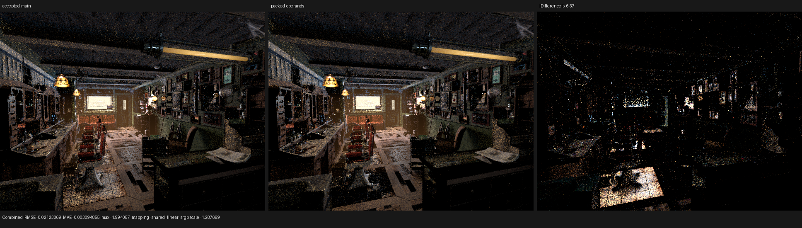
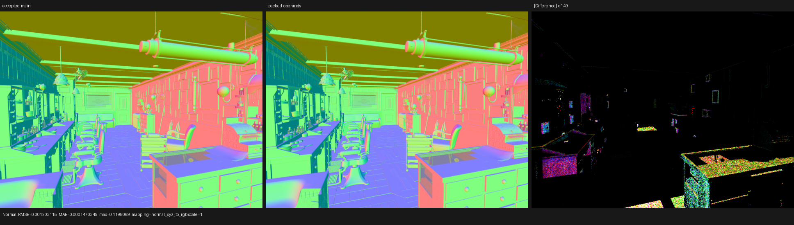

# Packed typed operands for the surface SVM

## Outcome

The compact surface interpreter now stores two complete typed operand
addresses per 32-bit word and embeds the word directly in the 16-byte
instruction for zero-, one-, and two-input operations. Operations with more
than two inputs use a dense pair-packed overflow stream. The opcode remains the
single source of truth for arity.

This is a representation change, not an opcode-specific shortcut. It reduces
the preparation operand stream by 48.3%--54.7% in Barbershop, Classroom, and
Monster Under the Bed while preserving the same topological instruction order,
typed local banks, static variants, and closure programs.

On the RX 9070 XT, paired 640x480/64-spp HIP measurements show:

| Scene | Render-only baseline | Packed operands | Change |
|---|---:|---:|---:|
| Barbershop, mean of two adjacent pairs | 2.6925 s | 2.6151 s | -2.88% |
| Classroom, mean of two adjacent pairs | 1.3476 s | 1.2957 s | -3.85% |
| Monster, mean of two adjacent pairs | 1.6073 s | 1.6103 s | +0.19% |

The Monster result is neutral rather than a hidden win: its compact
preparation domain contains only 239 instructions, and its surface scratch
allocation did not change. This checkpoint does not claim that Psycles has
caught Cycles; the preserved Cycles HIP traces still put current summed Psycles
renderer-kernel time at approximately 1.42x--1.57x across these three scenes.

LLVM-to-SPIR-V was explicitly out of scope. No Vulkan compiler route or DXC
route was changed.

## Formal representation

### Address quotient

A wide value address is the tuple

```text
W = (p, b, i)

p in {0, 1}                         parameter or local storage
b in {scalar, vector, uint64}       typed bank
0 <= i < 2^13                       bank-local index
```

Its compact encoding and exact expansion are

```text
E(W) = (p << 15) | (b << 13) | i
D(e) = (bit15(e) << 31) | (bits13..14(e) << 29) | bits0..12(e)
```

The fields are disjoint, so `D(E(W)) = W`; equality of compact encodings also
implies equality of every tuple component, so `E` is injective on the proved
domain. `0xffff` has bank value three, which is outside the bank set, and is
therefore an unambiguous invalid value and the unique padding lane.

The implementation checks this bijection for parameter/local storage, all
three banks, and both index endpoints. An address outside the 13-bit domain
rejects compact lowering transactionally: no instruction or operand prefix is
returned. The caller may choose the established expanded evaluator rather than
executing a partial compact image.

### Instruction layout

For the closed opcode set `O`, arity is the total function `A : O -> [0, 14]`.
The maximum is computed over every enum member at compile time and asserted to
be 14; arity is no longer duplicated in serialized control bits.

```text
instruction.x = [immediate:14 | result-bank:2 | reserved-zero:8 | opcode:8]
instruction.y = wide result address
instruction.z = packed operand word                   when A(opcode) <= 2
                packed-overflow word offset           when A(opcode) > 2
instruction.w = metadata index
```

For `A <= 2`, unused lanes are exactly `0xffff` and no operand-buffer read is
issued. For `A > 2`, the instruction owns `ceil(A / 2)` consecutive words. A
scene concatenation relocates `instruction.z` only in the latter case.

The serialized-image verifier proves all of the following before upload:

- opcode and reserved-control validity;
- opcode-derived arity and dense overflow ownership;
- compact address validity and typed-bank bounds;
- canonical odd-arity padding;
- forward definite initialization under the existing read-before-write rule;
- result-bank agreement, metadata bounds, and immediate/metadata agreement;
- the absence of an unreferenced operand suffix.

Arity and operand types are host/JIT variant invariants. The Luisa DSL builder
therefore selects inline versus overflow loading while constructing the AST;
there is no device-side layout branch. A pair is expanded to the existing wide
address form before the established typed load operation, so the evaluator and
closure algorithms do not acquire a second address ABI.

### Relation to Cycles

Cycles 5.2's `intern/cycles/kernel/svm/util.h` reads typed SVM records directly
from a packed `uint` stream, while its stack offsets are compact scalar fields
(`SVMStackOffset` in the SVM type definitions). Psycles keeps its own typed
topological IR and Luisa callables, but now applies the same useful structural
principle: shader graph edges are compact data rather than one 32-bit global
load per operand. No Cycles kernel was copied or textually translated.

## Scene structure reduction

`psycles_inspect_blender_material SCENE '*'` reports the preparation-domain
image before and after the change:

| Scene | Unique topologies | Instructions | Operand bytes | Packed global loads | Executable image bytes |
|---|---:|---:|---:|---:|---:|
| Barbershop baseline | 189 | 6,272 | 50,384 | 12,596 | 284,248 |
| Barbershop packed | 189 | 6,272 | 22,816 (-54.72%) | 5,704 (-54.72%) | 256,680 (-9.70%) |
| Classroom baseline | 59 | 829 | 9,348 | 2,337 | 43,308 |
| Classroom packed | 59 | 829 | 4,836 (-48.27%) | 1,209 (-48.27%) | 38,796 (-10.42%) |
| Monster baseline | 18 | 239 | 2,492 | 623 | 11,568 |
| Monster packed | 18 | 239 | 1,200 (-51.85%) | 300 (-51.85%) | 10,276 (-11.17%) |

Barbershop embeds 3,426 operand addresses in 3,694 small instructions. The
complete production runtime, which also contains emission roots and automatic
normal transactions, keeps 10,301 instructions while reducing its operand
stream from 21,602 to 9,628 words.

## HIP profiler result

Each accepted trace is an adjacent baseline/candidate pair using the same
scene export, fixed sample range `[0, 64)`, Tabulated Sobol, fast math, staged
wavefront scheduler, 32-thread continuation blocks, compact surface execution,
and one surface population per hit. Adaptive sampling is not present in this
standalone fixed-sample route.

The changed continuation is identified structurally by its changed kernel
hash and equal role/order; unchanged continuation hashes provide the timing
control. Work is normalized by the sum of `grid_x * grid_y * grid_z` over every
surface dispatch.

| Scene | Surface threads | Surface ms | ns/thread | Scratch B/thread | Code object bytes |
|---|---:|---:|---:|---:|---:|
| Barbershop baseline | 53,816,864 | 1,296.907 | 24.099 | 3,552 | 362,912 |
| Barbershop packed | 53,592,288 | 1,202.784 | 22.443 (-6.87%) | 3,072 (-13.51%) | 351,608 (-3.12%) |
| Classroom baseline | 46,574,464 | 846.891 | 18.184 | 3,208 | 250,672 |
| Classroom packed | 46,574,240 | 795.586 | 17.082 (-6.06%) | 2,696 (-15.96%) | 242,448 (-3.28%) |
| Monster baseline | 40,506,464 | 704.784 | 17.399 | 4,336 | 248,552 |
| Monster packed | 40,507,488 | 705.373 | 17.413 (+0.08%) | 4,336 | 247,016 (-0.62%) |

Thus the Barbershop/Classroom gain is not inferred from buffer size alone:
rocprof also observes a 480/512-byte reduction in per-thread scratch. Monster
constructively bounds the claim--when the compiler's private layout does not
change, pair decoding and the saved traffic approximately cancel.

Summed Psycles renderer kernels in the same profiler pairs were
2,337.879->2,253.043 ms (-3.63%), 1,214.178->1,166.084 ms (-3.96%), and
1,447.598->1,449.558 ms (+0.14%) respectively.

The command shape was:

```sh
env PSYCLES_COMPACT_SURFACE_VALUES=1 \
    PSYCLES_POPULATE_SURFACE_ONCE=1 \
rocprofv3 --kernel-trace -f rocpd -d PROFILE_DIR -o trace -- \
  RUNTIME/psycles_render_blender_scene SCENE PROFILE_DIR/out.exr hip \
  640 480 64 64 - 0 0 0 0 64 - 1 0 wavefront-staged \
  32 32768 32 1 1 0 4 2 4096 131072 0 0 1
```

A secondary single-pair serial-megakernel diagnostic measured
0.6750->0.5971 s at 640x480/8 spp. It is recorded only as corroboration that
the representation is not scheduler-specific; it is not used as the headline
result because no repeated performance sample was collected.

## Correctness and visual validation

The permanent compact-surface device regression executes both the expanded
reference evaluator and compact bytecode evaluator in the same process. It
compares preparation, emission, BSSRDF exit normals, every closure record,
light evaluation, and BSDF sampling across layered Principled, clamp/map range,
automatic normal, nested Bump, BSSRDF, mixed closure, transparency-capacity,
and transformed-coordinate fixtures. It passed on fallback, HIP, and Vulkan.

The complete focused matrix passed 44/44 tests across host, fallback, HIP, and
Vulkan. The Vulkan compact-surface canary carried
`LUISA_VULKAN_REQUIRE_NATIVE_XIR_SPIRV=1`; it did not use DXC fallback.

Barbershop's full-scene cross-process images retain the known repeatability
limit documented by earlier callable work. The accepted-main build compared
against itself at Combined relative RMSE 0.1475; the packed build compared
against itself at 0.1508. The cross-build value is 0.1594. Corresponding Normal
RMSE values are 0.001998, 0.002519, and 0.001203; DiffCol values are 0.003362,
0.003103, and 0.002801. The cross-build differences therefore do not exceed
the same-code noise envelope in Normal or DiffCol, and Combined is close to it.
All 15 cross-build passes contain zero invalid pixels.

Both triptychs were opened at their original 1936x550 resolution. Manual
inspection found identical camera, silhouette, geometry, UV/texture regions,
material boundaries, surface normals, and illumination structure. The
amplified panels contain stochastic high-energy path differences rather than a
coherent opcode-, material-, or object-local error.





The raw 15-pass diagnostic is retained as
[barbershop-wavefront.json](comparisons/barbershop-wavefront.json). Its
historical `cycles` field names the reference input; here that reference is the
accepted Psycles main snapshot, not Blender/Cycles.

## Build and regression commands

The affected targets were rebuilt with every host thread:

```sh
cmake --build build --parallel "$(nproc)" --target \
  psycles_surface_program_metadata_tests \
  psycles_surface_svm_math_immediate_tests \
  psycles_surface_svm_vector_math_immediate_tests \
  psycles_surface_svm_record_immediate_tests \
  psycles_luisa_compact_surface_preparation_tests \
  psycles_render_blender_scene \
  psycles_inspect_blender_material
```

The focused matrix used:

```sh
ctest --test-dir build --output-on-failure --parallel 4 -R surface
```

Result: 44/44 passed. `git diff --check` also passed.

The complete strict suite used:

```sh
LUISA_VULKAN_USE_XIR=1 \
LUISA_VULKAN_REQUIRE_NATIVE_XIR_SPIRV=1 \
LUISA_VULKAN_DISABLE_DXC=1 \
ctest --test-dir build --parallel 1 --output-on-failure
```

Result: 283/289 passed. The six failures are exactly the accepted pre-existing
numeric-oracle set, with no new failure:

- `psycles.luisa_stacked_volume_fallback`;
- `psycles.luisa_homogeneous_volume_fallback`;
- `psycles.luisa_area_light_forward_vk`;
- `psycles.luisa_volume_path_fallback`;
- `psycles.luisa_volume_path_vk`;
- `psycles.luisa_volume_triangle_fallback`.
