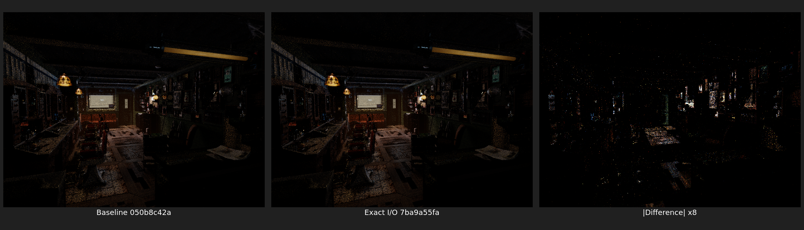

# Exact coroutine frame I/O

## Result

LuisaCompute commit `7ba9a55fa` replaces scheduler-wide frame transfers with
an edge-exact transport plan and is in the history of `next`. Psycles commit
`dedc201` advances the LuisaCompute submodule to the corresponding current
`next` head, `9ae333d05`.

The change fixes two distinct sources of unnecessary traffic:

- persistent scheduling previously wrote the union of every possible outgoing
  payload after each subroutine, even though only one graph edge was realized;
- all schedulers implicitly transferred every reserved field, including fields
  whose routing or invocation identity was carried elsewhere.

The implemented contract is:

```text
Load[t]       = fields actually read by continuation t
Store[s, t]   = fields defined and live on the realized edge s -> t
Relocate[t]   = the complete token-indexed resident payload for t
```

An inactive live-through field is not loaded into or rewritten by a
subroutine. It remains resident in the frame and is copied only when the frame
itself is relocated. Ordinary wavefront scheduling externalizes field 6, the
target token, because it routes from frame storage. Persistent and graph
wavefront scheduling keep token/index state in their queues and do not duplicate
field 6 in frame traffic.

Immutable invocation identity fields 0 through 5 are handled by the least
fixed point

```text
I(n) = UseIdentity(n) union union(n -> t) I(t).
```

Only the entry transition initializes identity fields needed downstream;
later transitions preserve them without rewriting them. Field-sensitive uses
are collected after continuation normalization and argument projection.

## Permanent regression

`T33_persistent_frame_io_is_exact_per_graph_edge` constructs a branch with
mutually exclusive `uint4` and `float3` payloads and checks all of the following:

- an impossible graph edge has an empty store set;
- each realized edge store is smaller than the old source-node union;
- a late-use immutable identity is initialized at entry and preserved through
  relocation, but is not rewritten by intermediate continuations;
- persistent input, output, and relocation sets never contain target-token
  field 6;
- the actual Vulkan global-frame persistent scheduler produces the expected
  values.

The post-rebase LuisaCompute validation covered 13 coroutine programs and
2,099 assertions:

```text
test_xir_coro_cfg_distill                 480 assertions / 54 tests
test_xir_coro_split                       385 assertions / 38 tests
test_coro_graph                           195 assertions /  8 tests
test_coro_persistent_opt vk               125 assertions / 24 tests
test_coro_wavefront_integration vk         52 assertions /  7 tests
test_coro_all_schedulers vk                93 assertions / 18 tests
test_coro_graph_wavefront_policy           54 assertions /  6 tests
test_coro_compaction vk                   190 assertions / 11 tests
test_coro_persistent vk                    16 assertions /  8 tests
test_coro_persistent_integration vk        45 assertions /  9 tests
test_coro_soa_layout vk                   122 assertions / 12 tests
test_coro_pipeline_1suspend vk             18 assertions /  3 tests
test_coro_pipeline_3suspend vk             21 assertions /  3 tests
```

Psycles' full Combined/Normal/Albedo/light-pass film regression passed on both
fallback and HIP, including persistent scheduling. All builds used
`-j"$(nproc)"`.

The separate `test_coro_wavefront vk` tail case still fails native SPIR-V XIR
CFG restructuring. An untouched `bf0c854a5` baseline fails at the same test and
the same two unstructured branches, so that pre-existing failure was not folded
into this transport fix.

## Barbershop HIP check

The successful matched command was:

```bash
./build/bin/psycles_render_blender_scene \
  /home/mike/Projects/psycles-benchmarks/barbershop-480p-64spp/export \
  OUTPUT.ppm hip 640 480 64 64 \
  - 0 0 0 0 64 - 1 0 persistent 32 32768 32 1 \
  1 0 4 2 4096 0 0 0 1 1048576
```

This scene generates 9 coroutine subroutines, 177 physical frame fields, and an
864-byte frame. The optimization deliberately leaves that allocation size
unchanged; it reduces the fields read or written at each transition.

| Luisa revision | render-only | relative to baseline |
| --- | ---: | ---: |
| `050b8c42a` baseline | 13.7039 s | 1.0000x |
| `7ba9a55fa` exact I/O | 13.5626 s | 0.9897x |

This single completed pair is a **1.03% positive signal**, not a statistical
performance claim. Two later repetitions were invalidated by system-level GPU
resets. The kernel log attributed the first timed-out graphics queues to
`zen-bin`, then `kwin_wayland`; VRAM was lost during reset and the HIP process
was aborted. A subsequent profile spent approximately 99% of sampled CPU cycles
polling inside `libhsa-runtime`, so GPU work was stopped rather than treating
the wedged runtime as renderer timing.

The successful 8-bit outputs have normalized MAE `0.00117625`, normalized RMSE
`0.00889570`, and PSNR `41.0164 dB`. Visual inspection found no structured
geometry, material, or lighting displacement; the amplified difference follows
high-variance highlights and noisy surfaces. Because a same-revision repeat was
prevented by the post-reset HSA state, the nonzero difference is recorded but is
not attributed solely to either scheduler traffic or concurrent film ordering.


