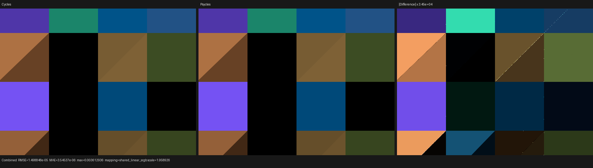
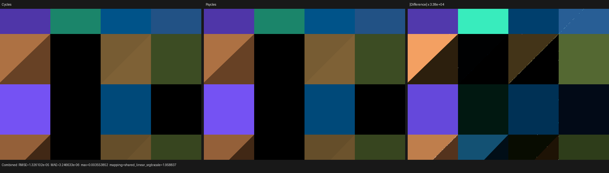

# Cycles 5.2 legacy Hair BSDF

This milestone implements Blender/Cycles' legacy `Hair BSDF` as an original
typed Psycles closure. The Blender graph is exported unchanged: neither
Cycles nor Blender evaluates, bakes, substitutes, or simplifies the closure
for Psycles.

The result covers both static components, linked and implicit tangents,
triangle and curve geometry, closure setup, evaluation, sampling, event/pass
routing, physical tagged storage, and all three Luisa backends. A 640x480,
256-spp raw-node matrix agrees visually with Cycles 5.2.1 on fallback, HIP,
and strict native XIR-to-SPIR-V Vulkan.

## Source oracle

The only scattering oracle was Cycles itself:

- source: `/home/mike/Projects/blender-cycles`
- branch: `blender-v5.2-release`
- commit: `9e2066aef7ef7e20c142ad7bd3303138a4304c93`
- executable: Blender 5.2.1 LTS, build hash `9e2066aef7ef`

The audited implementation is in:

- `intern/cycles/kernel/closure/bsdf_hair.h`
- `intern/cycles/kernel/svm/closure.h`
- `intern/cycles/kernel/closure/bsdf.h`
- `intern/cycles/scene/shader_nodes.cpp`
- `intern/cycles/blender/shader.cpp`
- `intern/cycles/kernel/geom/triangle.h`
- `intern/cycles/kernel/geom/shader_data.h`
- `source/blender/nodes/shader/nodes/node_shader_bsdf_hair.cc`

The installed Blender RNA was also queried directly. The node has a static
`component` property (`Reflection` or `Transmission`) and authored inputs
`Color`, `Offset`, `RoughnessU`, `RoughnessV`, and `Tangent`. `Weight` is an
internal Cycles compiler socket and is not part of the exported parameter ABI.

## Typed graph/SVM contract

The two components lower to distinct `hair_reflection` and
`hair_transmission` opcodes. This is a disjoint sum rather than a runtime mode
branch: component selection, tangent linkage, reachability, support, pass
routing, and light exclusion are graph-topology facts.

Each instruction has exactly five typed value operands in semantic order:

1. Color
2. Offset
3. Roughness U
4. Roughness V
5. Tangent

The Tangent operand is retained only when the Blender socket is linked. Its
linkage is a static instruction bit, so a numerically zero linked vector is
not confused with an unlinked input. The two Hair opcodes participate in
closure allocation metadata, scene reachability, SVM dependency scheduling,
physical closure collection, and emission exclusion.

## Closure setup

For authored color/weight `w`, Cycles first uses

```text
w+ = max(w, 0)
sample_weight = average(abs(w+))
allocated = sample_weight >= 1e-5
```

Both roughness axes are independently clamped to `[0.001, 1]`, and the
internal offset is the negated authored value. The tangent law depends on
topology and primitive kind:

```text
linked Tangent:       T = normalize(authored), offset = -authored_offset
unlinked triangle:    T = normalize(dPdv),     offset = 0
unlinked curve:       T = normalize(dPdu),     offset = -authored_offset
```

The normal goes through Cycles' specular-validity correction on triangles.
Curve closure semantics preserve the curve normal, as established by the
preceding curve-closure milestone.

## Scattering algebra

Let `wi` be the incoming direction, `wo` the queried outgoing direction,
`T` the hair tangent, `u/v` the two clamped roughness values, and `o` the
internal offset. Psycles implements Cycles' longitudinal truncated Cauchy
distribution and the two distinct azimuthal laws directly in Luisa DSL:

```text
Iz      = dot(T, wi)
Y       = normalize(wi - T * Iz)
theta_r = pi/2 - acos(Iz)

a = atan2((( pi/2 + theta_r)/2 - o) / u, 1)
b = atan2(((-pi/2 + theta_r)/2 - o) / u, 1)
t = (theta_i + theta_r)/2 - o

p_theta = u / (2 * (t^2 + u^2) * (a - b) * cos(theta_i))
```

Reflection uses Cycles' compact cosine azimuthal distribution and has support
only for `dot(N, wo) >= 0`. Transmission uses the shifted truncated Cauchy
azimuthal distribution and has support only for `dot(N, wo) < 0`. Both report
sampled roughness `(u, v)` and eta 1. Reflection is glossy/reflection and
routes to Glossy Color/Direct/Indirect; Transmission is glossy/transmission
and routes to Transmission Color/Direct/Indirect.

## Physical tagged sum

The post-population physical ABI remains two `float4x4` blocks. Hair is a
separate payload alternative:

```text
Physical = Common x (Unit + General + Hair + Dielectric + BSSRDF)
Hair     = { tangent: float3, roughness_u, roughness_v, offset }
```

It reuses lanes already reserved by the widest alternatives, so no third
block, product-of-all-closures record, or coroutine-frame field was added.
The exhaustive physical test proves for every reachable closure tag `k`:

```text
P_k(unpack_family_k(pack(x))) = P_k(x)
```

and differentially compares product and tag-directed evaluation/sampling.

## Reachability-specialized identity projection

Adding a closure tag initially grew an unrelated Diffuse-only normal-map
kernel: its `cycles_runtime_flags` and `cycles_closure_type` projections still
compared the dynamic tag against every closure kind. Raising the instruction
ceiling would have hidden a general source of linear code growth.

The identity, selection, type, and runtime-flag projections now consume the
existing host/JIT reachability abstract value. Formally, let `R` be the finite
set of reachable `(kind, Principled lobe)` tags and let `t` be the runtime tag.
Population proves `t in R`. Since closure tags are disjoint, deleting every
comparison and selection arm whose tag is outside `R` preserves the projection
exactly:

```text
t in R  =>  project_R(t) = project_All(t)
```

Unknown schema bits still map reachability to top, so uncertainty disables
specialization rather than removing behavior. The same proof value is passed
through direct graph tracing, post-population evaluation, and the scene-level
sampling callable. The reachability regression compares specialized and top
projections bit-for-bit for every reachable standalone and Principled tag on
fallback, HIP, and Vulkan.

This restored extension-local code size instead of making every existing
material pay for Hair. The Diffuse tangent-normal canary fell from 2,706 to
2,175 XIR instructions. The Hair Reflection/Transmission canaries also fell
from 37,502/36,981 to 36,660/36,139 instructions.

## General bugs found by the Hair oracle

Two fixes are intentionally broader than Hair.

First, sample-event reconstruction previously inferred transmission from an
enumerated list of translucent/glass kinds. The correct algebra is the product
of independent sampler properties:

```text
event = lobe_class(selected_glossy) x transport_side(selected_transmission)
```

Glass, transparent, and BSSRDF retain their explicit overrides. This makes any
future non-glass transmission closure correct without adding another case.

Second, triangle `SurfacePoint.dPdu/dPdv` had been populated with a normalized
UV tangent frame. Cycles defines them in barycentric coordinates from the
same final world-space support used for the hit:

```text
dPdu = p1 - p0
dPdv = p2 - p0
back face: (dPdu, dPdv) = (-dPdu, -dPdv)
```

The wrong contract caused the raw Hair matrix's unlinked-tangent cells to be
structurally different (normalized p99 errors 0.93 Combined, 2.09 GlossDir,
and 2.67 TransDir). A shared geometry helper now owns the relation, with
transform-applied, ordinary-instance, and back-face regressions.

## Automated validation

The focused tests cover:

- raw Blender JSON import without closure substitution;
- the two static opcodes, exact typed operand slice, and tangent-link bit;
- closure allocation and scene metadata;
- triangle/curve and linked/unlinked setup laws;
- roughness bounds, signed offset, tangent and normal behavior;
- reflection/transmission evaluation and sampling against the Cycles laws;
- event labels, lobe masks, AOV routing, and wrong-hemisphere rejection;
- exhaustive reachability and physical tagged-sum projection;
- the final world-support `dPdu/dPdv` relation and back-face sign;
- fallback, HIP, and strict native XIR-to-SPIR-V Vulkan execution.

The 12-test Hair/closure/reachability/physical group passes across fallback,
HIP, and Vulkan, as do all three triangle-support tests and both Blender
import targets. The full build passes with `-j32`. The full 314-test run has
308 passes and exactly the six pre-existing numerical baselines
(`stacked_volume_fallback`, `homogeneous_volume_fallback`,
`area_light_forward_vk`, `volume_path_fallback`, `volume_path_vk`, and
`volume_triangle_fallback`); this milestone adds no failure. The native
Vulkan tests use:

```text
LUISA_VULKAN_USE_XIR=1
LUISA_VULKAN_REQUIRE_NATIVE_XIR_SPIRV=1
LUISA_VULKAN_DISABLE_DXC=1
```

The focused Hair kernels recorded 36,660/36,139 XIR instructions for
Reflection/Transmission. On the RX 9070 XT their first HIP compilation took
approximately 52/49 ms and linked 12,480/12,096-byte code objects. Native
Vulkan produced 7,904/7,161-word optimized SPIR-V modules. These are compiler
canaries, not full-scene performance numbers; the compile-time and object-size
figures were recorded before the reachability-only AST reduction and are kept
as conservative historical measurements.

## Raw Cycles image comparison

`tools/cycles_shader_probe/hair_closures.py` creates 16 equal-area raw Hair
materials: eight Reflection and eight Transmission. The matrix covers both
roughness clamps, signed offset, lower-only Color clamp, implicit triangle
tangent, and four linked tangent directions. Two zero-angle Suns illuminate
opposite hemispheres, so direct evaluation is deterministic. Adaptive
sampling, denoising, and the light tree are disabled.

At 640x480 and 256 spp, all three Psycles backends passed a normalized p99
gate of `1e-3` with zero invalid pixels:

| backend | pass | luminance ratio | relative RMSE | normalized p99 |
|---|---|---:|---:|---:|
| HIP | Combined | 0.9999507 | 1.544e-4 | 1.674e-4 |
| HIP | GlossDir | 0.9999379 | 7.607e-4 | 4.015e-4 |
| HIP | TransDir | 0.9999659 | 1.987e-4 | 4.674e-4 |
| fallback | Combined | 0.9999540 | 1.048e-4 | 1.656e-4 |
| fallback | GlossDir | 0.9999381 | 4.285e-4 | 4.024e-4 |
| fallback | TransDir | 0.9999672 | 1.140e-4 | 4.619e-4 |
| Vulkan | Combined | 0.9999893 | 1.366e-4 | 1.725e-4 |
| Vulkan | GlossDir | 1.0000437 | 7.498e-4 | 2.648e-4 |
| Vulkan | TransDir | 1.0000035 | 2.462e-4 | 4.884e-4 |

GlossCol and TransCol have unit luminance ratios on every backend; Normal is
exact on HIP/Vulkan and differs by only one float ULP on fallback. Cycles CPU
versus Cycles HIP itself reaches `7.04e-4` relative RMSE in GlossDir and has
the same sparse triangle-diagonal maximum-error pattern. The remaining
Psycles differences are therefore numerical/backend-level, not a coherent
closure, tangent, or pass-routing mismatch.

The Combined triptychs below show Cycles, Psycles, and an aggressively
amplified difference image. Visual inspection found no structural difference.
A post-specialization HIP rerun of the same 640x480/256-spp matrix reproduced
the reported Combined/GlossDir/TransDir ratios and relative RMSE to displayed
precision; its triptych was inspected again and likewise showed no coherent
shape, tangent, or material-region change.

| HIP | fallback | native Vulkan |
|---|---|---|
|  |  |  |

The complete selected-pass reports and triptychs are stored in `reports/` and
`triptychs/` beside this document.

## Reproduction

```bash
cmake --build build -j32

ctest --test-dir build --output-on-failure -j1 \
  -R 'psycles\.(volume_scene_metadata|luisa_(legacy_hair|surface_closure_(reachability|physical)|transform_applied_surface)_(fallback|hip|vk))$'

python3 tools/run_cycles_shader_probes.py \
  --blender /home/mike/Projects/blender-install-5.2-hiprt/blender \
  --psycles-render build/bin/psycles_render_blender_scene \
  --output-dir build/validation/hair-cycles-5.2.1-hip-final \
  --backend hip --cycles-device HIP \
  --cycles-device-name 'Radeon RX 9070 XT' \
  --width 640 --height 480 --samples 256 hair_bsdf_matrix
```

Use `--backend fallback --cycles-device CPU` for fallback. The probe runner
automatically enforces the strict native XIR Vulkan environment for
`--backend vk`.
