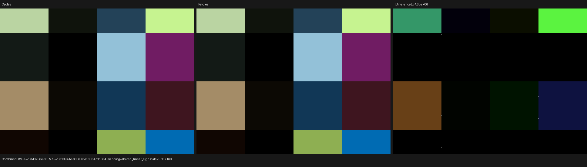
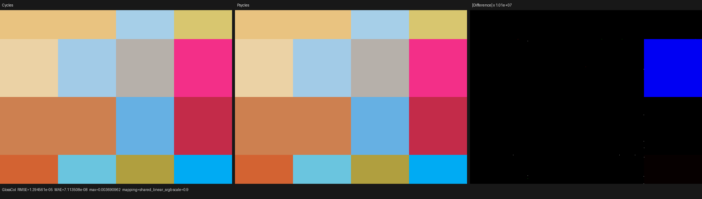
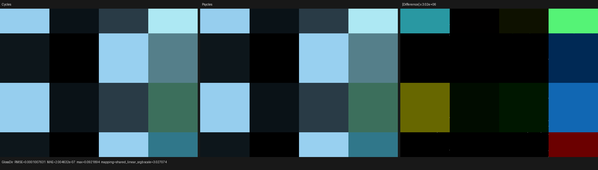
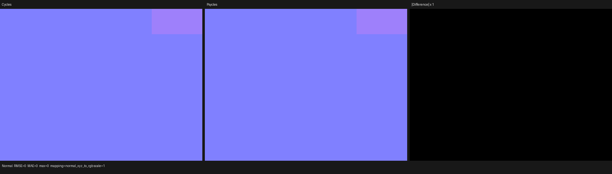
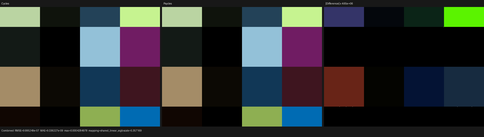
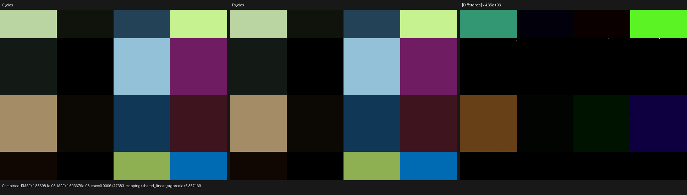

# Cycles 5.2 standalone Metallic BSDF validation

## Outcome

Accepted. Psycles now imports and evaluates Blender 5.2's standalone Metallic
BSDF as an original closure graph. Both F82 Tint and Physical Conductor are
implemented in the Luisa surface path, including GGX, Beckmann, Multiscatter
GGX, anisotropy and rotation, authored normal/tangent, input saturation, and
thin-film interference. No Blender/Cycles pre-bake, converted Principled BSDF,
or CPU reference renderer participates in the result.

A 16-cell raw-closure probe rendered at 640x480 and 256 fixed samples passes
against Blender/Cycles 5.2.1 on Psycles HIP, fallback, and strict Vulkan native
XIR-to-SPIR-V. The HIP Combined mean-energy ratio is `1.0000002581`; its p99
pixel RMSE divided by the Cycles RMS is `2.3544e-6`. The HIP Normal pass is
bit-identical. Native-resolution visual inspection found no structured lobe,
material, orientation, or film difference.

## Oracle identity

The only rendering oracle is Blender/Cycles itself:

- source: `/home/mike/Projects/blender-cycles`
- branch: `blender-v5.2-release`
- commit: `9e2066aef7ef7e20c142ad7bd3303138a4304c93`
- installed binary: Blender 5.2.1 LTS, Release, build hash `9e2066aef7ef`
- source description: `v5.2.1-dirty` only because the pre-existing
  `lib/linux_x64` submodule is dirty; it was not modified for this work
- GPU: AMD Radeon RX 9070 XT (`gfx1201`)

The implementation was checked directly against these Cycles 5.2 paths:

- `intern/cycles/scene/shader_nodes.cpp`
- `intern/cycles/kernel/svm/closure.h`
- `intern/cycles/kernel/closure/bsdf_microfacet.h`
- `intern/cycles/kernel/closure/bsdf_util.h`
- `intern/cycles/blender/shader.cpp`
- `source/blender/nodes/shader/nodes/node_shader_bsdf_metallic.cc`

## Formal representation

The authored node is modeled as a static tagged sum, not a runtime mode:

```text
Metallic = F82(BaseColor, EdgeTint)
         + PhysicalConductor(IOR, Extinction)
```

`FresnelType` selects one of two compiler opcodes,
`metallic_f82` or `metallic_conductor`. Lowering only visits the selected
parameter pair. Consequently, inactive F82 inputs cannot reach a conductor
program and inactive complex-IOR inputs cannot reach an F82 program. The
compact closure instruction has nine semantic operands:

```text
(base_or_ior, edge_tint_or_k, normal, roughness,
 anisotropy, rotation, tangent, film_thickness, film_ior)
```

The opcode is the eliminator for the first two fields; there is no mode lane,
weakly typed `float4` parameter block, or device-side Fresnel switch. The
physical tagged union likewise has two identities but reuses the existing
general payload:

```text
metallic_f82       -> color = F0, specular_tint = fitted B
metallic_conductor -> color = n,  specular_tint = k
```

This preserves the two-block hot closure ABI. No new block or lane was added.
Reachability carries the exact Fresnel kind, anisotropy kind, and thin-film
kind, so Luisa JIT construction does not record the unused algebra.

The Metallic anisotropy projection is the Cycles aspect relation:

```text
a      = clamp(anisotropy, 0, 1)
aspect = sqrt(1 - 0.9 a)
alpha_x = clamp(roughness^2 / aspect, 0, 1)
alpha_y = clamp(roughness^2 * aspect, 0, 1)
T       = rotate(tangent, normal, 2 pi rotation)
```

F82 evaluation stores the fitted `B` term and uses Cycles' generalized-Schlick
albedo table. Physical conductor evaluation uses the exact unpolarized
complex-IOR Fresnel equations. Its Multiscatter GGX average is obtained by
sampling exact conductor Fresnel at cosine 1 and 1/7, fitting the corresponding
F82 curve, and analytically integrating that fit, as Cycles does. Both models
use the exact Cycles 5.2 thin-film spectral/Airy path when thickness exceeds
the `0.1 nm` activity cutoff.

## Regression coverage

Permanent tests cover the representation and every inverse/projection:

- Blender `BSDF_METALLIC` import preserves the original Base Color, Edge
  Tint, IOR, Extinction, roughness, anisotropy, rotation, normal, tangent, and
  thin-film sockets. Blender's GPU-internal `Weight` socket is deliberately
  not exposed as an authored material input.
- compiler tests prove exact opcode selection, nine-operand ordering, static
  enum normalization, and erasure of the inactive Fresnel input graph
- reachability powerset tests prove exact Fresnel, anisotropy, and thin-film
  reduced-product transfers and distinct host-JIT ASTs
- physical-block tests round-trip both identities through the unchanged
  two-block tagged union and compare demand-loaded evaluation/sampling against
  the conservative top projection
- backend tests check setup, input saturation, exact anisotropic axes and
  tangent rotation, F82 and complex-IOR channel ratios, sample/eval
  consistency, both thin-film branches, complete-closure film retention, and
  an XIR AST-size bound on fallback, HIP, and Vulkan
- the probe-runner contract rejects a wrong 1/16 Fresnel cell with a normalized
  p99 gate, even if positive and negative errors cancel in mean energy
- the Vulkan runner overwrites conflicting parent settings and requires
  `USE_XIR=1`, `REQUIRE_NATIVE_XIR_SPIRV=1`, and `DISABLE_DXC=1`

The complete-closure test exposed and prevented one real integration defect:
the hot two-block ABI retained standalone Metallic film fields, while the
four-block diagnostic/complete inverse initially recognized only Principled
and Glass film tags. The fix extends the same exact tagged predicate in the
packer, full inverse, and row-only fast inverse. It does not special-case the
test values.

## Raw Cycles probe

`tools/cycles_shader_probe/metallic_closures.py` constructs 16 equal-area
materials using `ShaderNodeBsdfMetallic` itself. All numeric inputs are linked
through typed Value or Combine XYZ nodes, including zero-film controls. The
matrix spans:

- F82 Tint and Physical Conductor
- GGX, Beckmann, and Multiscatter GGX
- isotropic and strongly anisotropic states, two rotations, two tangents
- zero and active thin film for both Fresnel models
- out-of-domain F82 colors and negative complex-IOR components to verify the
  distinct Cycles saturation laws
- an explicit tilted normal

A zero-angle Sun at an oblique direction makes closure evaluation
deterministic while distinguishing Fresnel angle, microfacet distribution,
and anisotropic orientation. The same `.blend` is first rendered by Cycles,
then exported unchanged, then rendered by Psycles. Adaptive sampling,
denoising, and light trees are disabled.

The exported 16-material scene compiles to 24 compact programs, 94
instructions, 68 operands, three semantic variants, and 13 closure
instructions; the longest program is 11 instructions. This is evidence that
the feature remains data-driven rather than expanding one shader copy per
material.

## Numerical results

All values below come from the checked-in reports. `p99/RMS` is p99 pixel RMSE
divided by the Cycles pass RMS.

### Psycles HIP versus Cycles HIP

| Pass | Mean-energy ratio | Relative RMSE | p99/RMS | Maximum absolute error |
|---|---:|---:|---:|---:|
| Combined | `1.0000002581` | `2.8149e-5` | `2.3544e-6` | `4.7319e-4` |
| Glossy Color | `1.0000001323` | `2.3201e-5` | `9.2511e-8` | `3.6910e-3` |
| Glossy Direct | `1.0000011616` | `8.4270e-4` | `1.4745e-6` | `9.2189e-2` |
| Normal | `1.0` | `0` | `0` | `0` |

### Psycles fallback versus Cycles CPU

| Pass | Mean-energy ratio | Relative RMSE | p99/RMS | Maximum absolute error |
|---|---:|---:|---:|---:|
| Combined | `1.0000002581` | `2.0868e-5` | `2.3506e-6` | `4.2850e-4` |
| Glossy Color | `0.9999998677` | `1.2878e-5` | `2.4053e-6` | `3.6191e-3` |
| Glossy Direct | `1.0000002112` | `8.0049e-5` | `1.4462e-6` | `4.9893e-3` |
| Normal | `1.0` | `2.4333e-8` | `5.9605e-8` | `5.9605e-8` |

### Psycles Vulkan native XIR-to-SPIR-V versus Cycles HIP

| Pass | Mean-energy ratio | Relative RMSE | p99/RMS | Maximum absolute error |
|---|---:|---:|---:|---:|
| Combined | `1.0000002581` | `3.9397e-5` | `2.3510e-6` | `6.4774e-4` |
| Glossy Color | `1.0000001323` | `2.3498e-5` | `1.9119e-6` | `3.6910e-3` |
| Glossy Direct | `1.0000003168` | `8.6175e-4` | `9.7982e-6` | `9.2189e-2` |
| Normal | `0.9999998996` | `2.4117e-6` | `5.9605e-8` | `9.3820e-4` |

The relatively large maximum errors are isolated triangle-edge samples. More
than 99% of pixels remain within about `1e-5` of the pass RMS, and all mean
energy ratios are within `2e-6` of one. No existing tolerance or exact-hash
test was weakened.

## Probe timings

These are probe render-only observations, not full-scene performance claims:

| Renderer/backend | 640x480, 256 spp |
|---|---:|
| Cycles 5.2.1 HIP | `1.788 s` |
| Cycles 5.2.1 CPU | `2.134 s` |
| Psycles HIP megakernel | `0.409 s` |
| Psycles fallback megakernel | `4.464 s` |
| Psycles Vulkan megakernel | `7.222 s` |

The first HIP Psycles run recorded 1.168 s LLVM code generation, 2.103 s
bitcode/code-object linking, a 225,032-byte code object, and 3.627 s total
shader JIT. Vulkan recorded native SPIR-V optimization from 218,707 to 194,118
words and 2.617 s total shader JIT. These compile times are excluded from the
render-only table.

## Visual inspection

Each image is Cycles on the left, Psycles in the center, and an explicitly
amplified absolute difference on the right. All images were opened at native
resolution. The two rendered panels have the same 16-cell layout, colors,
thin-film interference, anisotropic rotations, and tilted-normal cell. The
difference panels require amplification of roughly 0.4 to 15 million times;
they show backend rounding fields and isolated triangle diagonals, not a
coherent closure difference.

### HIP









### Fallback



[Glossy Color](triptychs/fallback/glosscol.png) ·
[Glossy Direct](triptychs/fallback/glossdir.png) ·
[Normal](triptychs/fallback/normal.png)

### Vulkan native XIR-to-SPIR-V



[Glossy Color](triptychs/vk/glosscol.png) ·
[Glossy Direct](triptychs/vk/glossdir.png) ·
[Normal](triptychs/vk/normal.png)

## Reproduction

The complete project was built with all 32 host threads:

```sh
cmake --build build -j32
```

The three image runs were:

```sh
python3 tools/run_cycles_shader_probes.py \
  --blender /home/mike/Projects/blender-install-5.2-hiprt/blender \
  --psycles-render build/bin/psycles_render_blender_scene \
  --output-dir build/validation/metallic-cycles-5.2.1-hip \
  --backend hip --cycles-device HIP \
  --cycles-device-name 'Radeon RX 9070 XT' \
  --width 640 --height 480 --samples 256 metallic_bsdf_matrix

python3 tools/run_cycles_shader_probes.py \
  --blender /home/mike/Projects/blender-install-5.2-hiprt/blender \
  --psycles-render build/bin/psycles_render_blender_scene \
  --output-dir build/validation/metallic-cycles-5.2.1-fallback \
  --backend fallback --cycles-device CPU \
  --width 640 --height 480 --samples 256 metallic_bsdf_matrix

python3 tools/run_cycles_shader_probes.py \
  --blender /home/mike/Projects/blender-install-5.2-hiprt/blender \
  --psycles-render build/bin/psycles_render_blender_scene \
  --output-dir build/validation/metallic-cycles-5.2.1-vk \
  --backend vk --cycles-device HIP \
  --cycles-device-name 'Radeon RX 9070 XT' \
  --width 640 --height 480 --samples 256 metallic_bsdf_matrix
```

Focused structural tests passed 7/7; HIP backend tests passed 3/3; strict
Vulkan native-XIR backend tests passed 3/3. `psycles.source_size` and
`psycles.shader_probe_runner_contract` are included in those results. The full
suite passed 298/304. Its six failures are the same pre-existing fallback/VK
volume and area-light float-tolerance fixtures reproduced by the immediately
preceding 295/301 baseline: `luisa_stacked_volume_fallback`,
`luisa_homogeneous_volume_fallback`, `luisa_area_light_forward_vk`,
`luisa_volume_path_fallback`, `luisa_volume_path_vk`, and
`luisa_volume_triangle_fallback`. None reaches a Metallic opcode or payload.
