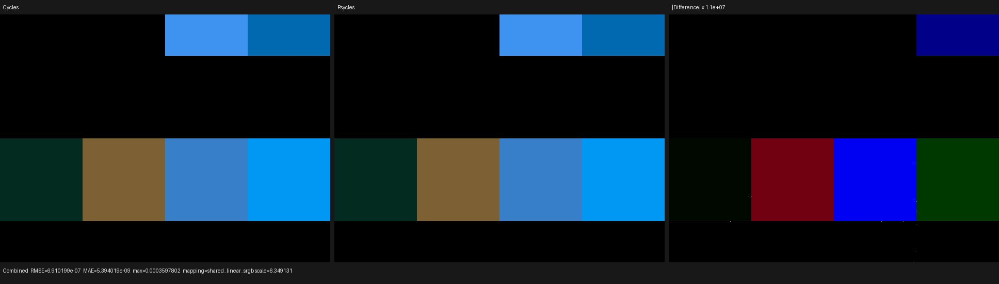
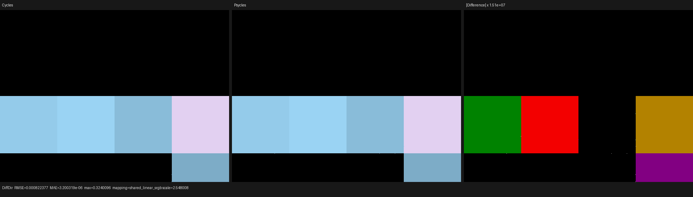
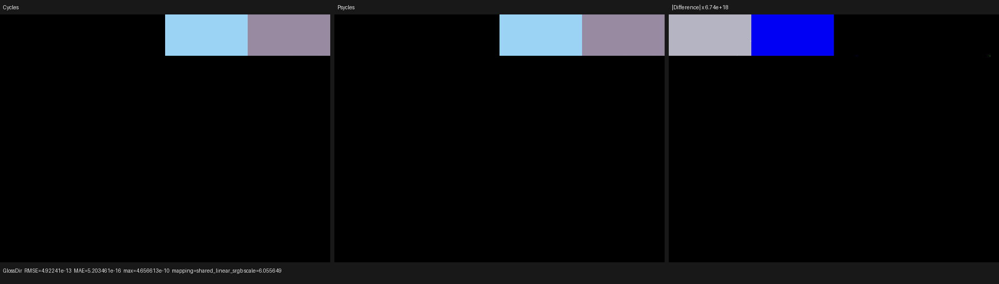
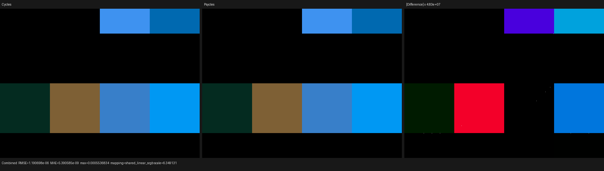
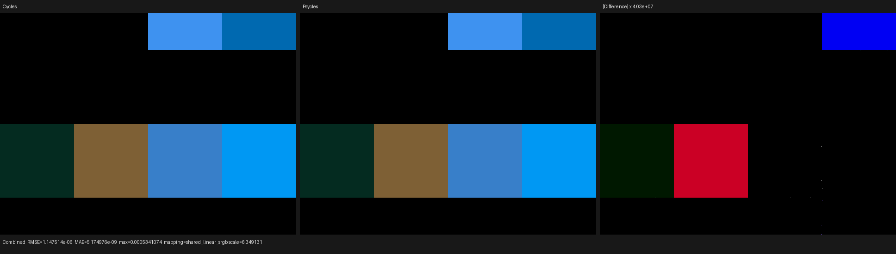

# Cycles 5.2 standalone Sheen BSDF validation

## Outcome

Accepted. Psycles now preserves Blender 5.2's standalone Sheen BSDF as an
original closure and implements both Microfiber and Ashikhmin distributions in
the Luisa surface path. Color, Roughness, Normal, distribution identity,
closure allocation, evaluation, sampling, pass routing, light exclusion, and
bump-normal policy are derived from the raw node. No Blender/Cycles pre-bake,
Principled conversion, or CPU reference renderer participates.

A 16-cell raw `ShaderNodeBsdfSheen` matrix rendered at 640x480 and 256 fixed
samples passes against Blender/Cycles 5.2.1 on HIP, fallback, and strict Vulkan
native XIR-to-SPIR-V. HIP Combined has mean-energy ratio `1.0000000842` and
normalized p99 pixel RMSE `1.3153e-6`. HIP Ashikhmin Glossy Direct agrees to
`4.66e-10` maximum absolute error over all finite Cycles samples. Native-size
visual inspection found no structured model, color, normal, roughness, or pass
classification difference.

The first image run exposed a real classification defect rather than being
accepted by tolerance. Ashikhmin direct energy was `0.996623x` Cycles because
Psycles applied diffuse bump-terminator softening to it. The fixed run is
`1.000000x`; its Glossy Direct RMSE fell from `1.1269e-4` to `4.9224e-13` on
HIP. A focused regression now preserves the underlying type relation.

## Oracle identity

The only rendering oracle is Blender/Cycles:

- source: `/home/mike/Projects/blender-cycles`
- branch: `blender-v5.2-release`
- commit: `9e2066aef7ef7e20c142ad7bd3303138a4304c93`
- binary: Blender 5.2.1 LTS, Release, build hash `9e2066aef7ef`
- source description: `v5.2.1-dirty` only because the pre-existing
  `lib/linux_x64` submodule is dirty
- GPU: AMD Radeon RX 9070 XT (`gfx1201`)
- CPU: AMD Ryzen 9 9950X3D

The implementation was checked directly against:

- `source/blender/nodes/shader/nodes/node_shader_bsdf_sheen.cc`
- `intern/cycles/blender/shader.cpp`
- `intern/cycles/scene/shader_nodes.cpp`
- `intern/cycles/kernel/svm/closure.h`
- `intern/cycles/kernel/closure/bsdf_sheen.h`
- `intern/cycles/kernel/closure/bsdf_ashikhmin_velvet.h`
- `intern/cycles/kernel/closure/bsdf.h`

## Formal representation

The distribution is a static tagged sum:

```text
Sheen = Microfiber(Color, Normal, Roughness)
      + Ashikhmin(Color, Normal, Sigma)
```

It lowers to distinct `sheen_microfiber` and `sheen_ashikhmin` opcodes. The
compact instruction has only three typed operands `(Color, Normal,
Roughness)`. Distribution never becomes a runtime lane, so the JIT records
only the selected model and identical graph topologies remain shareable.

Microfiber setup is the Cycles LTC relation:

```text
r  = clamp(clamp(authored_roughness, 0, 1), 1e-3, 1)
(A, B, albedo) = sheen_ltc(cos(N, wi), r)
valid = abs(A) >= 1e-5 and albedo >= 1e-5
weight'        = max(Color, 0) * albedo
sample_weight' = average(max(Color, 0)) * albedo
```

An invalid LTC retains the already allocated closure slot, changes its type to
`CLOSURE_NONE`, and clears sample weight. Evaluation and sampling use the same
linearly transformed cosine density. The sampled-path roughness is one, exactly
as written by Cycles' `bsdf_sample()` for Sheen. This is intentionally distinct
from Cycles' `bsdf_roughness_eta()` helper, which returns the authored, clamped
`r` when classifying an externally chosen guiding direction.

Ashikhmin setup is:

```text
sigma     = max(clamp(authored_roughness, 0, 1), 0.01)
invsigma2 = 1 / sigma^2
pdf       = 1 / (2 pi)
```

Its analytic `D` and `G` equations and uniform-hemisphere direction mapping
follow Cycles on their accepted domain. Expressions are totalized only outside
that domain; accepted operands and operation order remain unchanged.

The two physical variants reuse the existing two-block tagged union.
Microfiber uses the general payload's two Sheen-transform lanes. Ashikhmin is
common-only and stores `invsigma2` in its model-specific roughness scalar. No
closure block or runtime mode was added.

## Three independent classifications

Cycles does not identify a closure solely by its sample label:

| Model | Sample event | ClosureType family | AOV/NEE family | Diffuse bump softening |
|---|---|---|---|---|
| Microfiber, type 7 | diffuse reflection | diffuse | diffuse | yes |
| Ashikhmin, type 16 | diffuse reflection | glossy | glossy | no |

The initial implementation correctly preserved Ashikhmin's diffuse selection
event and glossy pass routing, but the common evaluator supplied its family
branch as the bump classifier. Formally, that substituted `sample_label(c)`
for `CLOSURE_IS_BSDF_DIFFUSE(type(c))`; the two predicates differ exactly for
Ashikhmin Velvet. The correction passes `!is_ashikhmin` to the shared bump
relation while retaining diffuse sample eligibility and glossy NEE/AOV
routing. It is a closure-type law, not a scene or value special case.

The permanent tilted-normal test selects directions for which the erroneous
softening factor is about `0.992`, well above float tolerance. It evaluates a
physically reachable Ashikhmin common record and requires the unsoftened
Cycles result on fallback, HIP, and native-XIR Vulkan.

## Regression coverage

Permanent tests cover:

- raw Blender `BSDF_SHEEN` import, both distribution strings, authored socket
  links, and exclusion of Blender's GPU-internal Weight input
- static opcode selection, semantic operand indices, dependency slicing, and
  absence of a distribution parameter lane
- closure reachability and distinct reduced host/JIT ASTs for both variants
- unchanged two-block physical packing, including Microfiber general payload
  and Ashikhmin common-only demand loading
- Microfiber LTC lookup, albedo rescaling, invalid-closure behavior, exact
  sample mapping, sample/eval consistency, and sampled-path roughness reporting
- Ashikhmin setup, analytic evaluation, uniform sample mapping, event mask,
  glossy AOV/NEE routing, and the type-based bump-normal rule
- XIR AST-size bounds and execution on fallback, HIP, and strict native-XIR
  Vulkan
- probe gates that reject a wrong 1/16 cell even when mean energy cancels
- comparison-report attribution of non-finite reference and actual pixels;
  this probe requires every Psycles pass to remain finite

## Raw Cycles probe

`tools/cycles_shader_probe/sheen_closures.py` creates 16 equal-area materials
with `ShaderNodeBsdfSheen` itself: eight Microfiber and eight Ashikhmin. Every
numeric socket is linked through a typed Value or Combine XYZ node. The matrix
covers negative, zero, exact lower-bound, ordinary, one, and over-one
roughness; lower-only color clamping and over-one colors; and two linked tilted
normals. The internal Weight socket is untouched.

An oblique zero-angle Sun makes direct closure evaluation deterministic while
separating the angular models. Adaptive sampling, denoising, and the light tree
are disabled. Blender first renders the `.blend`, then exports the unchanged
node graph, then Psycles renders that export.

The exported 16-material graph compiles to eight compact programs, 12
instructions, eight operands, two semantic variants, and five closure
instructions. The longest program has six instructions. This is data-driven
SVM execution, not one expanded shader copy per material.

## Numerical results

`p99/RMS` is p99 pixel RMSE divided by the Cycles pass RMS. Full-frame RMSE
and maximum error include isolated reconstruction samples on material/triangle
boundaries; the p99 column distinguishes those from a coherent closure error.

### Psycles HIP versus Cycles HIP

| Pass | Mean ratio | Relative RMSE | p99/RMS | Maximum error |
|---|---:|---:|---:|---:|
| Combined | `1.0000000842` | `1.9208e-5` | `1.3153e-6` | `3.5978e-4` |
| Diffuse Color | `1.0000001989` | `2.3428e-5` | `0` | `1.3186e-3` |
| Diffuse Direct | `1.0000095768` | `5.4750e-3` | `2.2910e-7` | `3.2401e-1` |
| Glossy Color | `1.0000001346` | `1.8594e-5` | `0` | `4.3750e-3` |
| Glossy Direct | `1.0` | `1.9549e-11` | `3.0604e-18` | `4.6566e-10` |
| Normal | `1.0000001591` | `5.2270e-6` | `6.8286e-8` | `9.3820e-4` |

### Psycles fallback versus Cycles CPU

| Pass | Mean ratio | Relative RMSE | p99/RMS | Maximum error |
|---|---:|---:|---:|---:|
| Combined | `0.9999999158` | `3.3098e-5` | `2.9902e-7` | `5.5368e-4` |
| Diffuse Color | `0.9999998011` | `2.4141e-5` | `0` | `1.6024e-3` |
| Diffuse Direct | `0.9999688767` | `5.2014e-3` | `4.1246e-6` | `3.2401e-1` |
| Glossy Color | `1.0` | `1.0876e-5` | `8.2188e-8` | `3.2031e-3` |
| Glossy Direct | `0.9999996901` | `2.1762e-4` | `5.3435e-7` | `5.1753e-3` |
| Normal | `1.0` | `2.0743e-6` | `1.1921e-7` | `8.9535e-4` |

### Psycles Vulkan native XIR-to-SPIR-V versus Cycles HIP

| Pass | Mean ratio | Relative RMSE | p99/RMS | Maximum error |
|---|---:|---:|---:|---:|
| Combined | `0.9999999158` | `3.1897e-5` | `3.5871e-7` | `5.3411e-4` |
| Diffuse Color | `1.0000000994` | `2.1292e-5` | `0` | `1.3186e-3` |
| Diffuse Direct | `1.0000095768` | `5.4749e-3` | `2.2910e-7` | `3.2401e-1` |
| Glossy Color | `1.0000001346` | `2.5279e-5` | `0` | `3.2031e-3` |
| Glossy Direct | `0.9999990972` | `3.0955e-4` | `5.7300e-7` | `5.1753e-3` |
| Normal | `1.0000000796` | `5.4870e-6` | `6.8286e-8` | `8.9538e-4` |

All reported Psycles passes contain zero non-finite pixels. Cycles HIP emits
non-finite Glossy Direct values at 8,893 pixels in two Ashikhmin cells; Cycles
CPU and all three Psycles paths remain finite. The report records these as
`reference_invalid_pixels=8893` and `actual_invalid_pixels=0`. The comparator
excludes the invalid reference samples from numerical metrics, while Combined
remains finite and fully covered. Psycles deliberately does not reproduce this
Cycles HIP failure.

## Probe timings and code size

These are closure-probe render-only observations, not full-scene performance
claims:

| Renderer/backend | 640x480, 256 spp |
|---|---:|
| Cycles 5.2.1 HIP | `1.324 s` |
| Cycles 5.2.1 CPU | `1.224 s` |
| Psycles HIP megakernel | `0.265 s` |
| Psycles fallback megakernel | `2.182 s` |
| Psycles Vulkan megakernel | `5.761 s` |

The cold HIP production shader used `0.892 s` LLVM code generation and
`1.513 s` bitcode/code-object linking; the final object is 142,472 bytes and
total shader JIT is `2.576 s`. Vulkan's native path optimized SPIR-V from
113,688 to 98,013 words in `1.402 s` total JIT. These compile times are
excluded from the render table. Focused Microfiber, Ashikhmin, and
type-classification kernels produce HIP objects of 7,616, 7,360, and 4,160
bytes respectively.

## Visual inspection

Each triptych is Cycles on the left, Psycles in the center, and an explicitly
amplified absolute difference on the right. All were opened at native
resolution. The two rendered panels have the same active cells, colors,
roughness response, tilted-normal response, and diffuse/glossy split. The
difference panels require amplification between roughly 10 million and
`6.7e18`; visible fields are backend rounding and isolated triangle/material
boundaries, not a coherent lobe difference.

### HIP







[Diffuse Color](triptychs/hip/diffcol.png) ·
[Glossy Color](triptychs/hip/glosscol.png) ·
[Normal](triptychs/hip/normal.png)

### Fallback



[Diffuse Direct](triptychs/fallback/diffdir.png) ·
[Glossy Direct](triptychs/fallback/glossdir.png) ·
[Diffuse Color](triptychs/fallback/diffcol.png) ·
[Glossy Color](triptychs/fallback/glosscol.png) ·
[Normal](triptychs/fallback/normal.png)

### Vulkan native XIR-to-SPIR-V



[Diffuse Direct](triptychs/vk/diffdir.png) ·
[Glossy Direct](triptychs/vk/glossdir.png) ·
[Diffuse Color](triptychs/vk/diffcol.png) ·
[Glossy Color](triptychs/vk/glosscol.png) ·
[Normal](triptychs/vk/normal.png)

## Build and regression status

The complete 32-thread build passed. The 16 focused import, execution-plan,
probe-runner, comparator, Principled-Sheen, standalone-Sheen, physical-closure,
and reachability tests passed on every requested backend.

The full suite passed `301/307`. The six failures are exactly the established
pre-existing baseline set; this change added three passing standalone-Sheen
tests without adding a failure:

- `psycles.luisa_stacked_volume_fallback`
- `psycles.luisa_homogeneous_volume_fallback`
- `psycles.luisa_area_light_forward_vk`
- `psycles.luisa_volume_path_fallback`
- `psycles.luisa_volume_path_vk`
- `psycles.luisa_volume_triangle_fallback`

## Reproduction

The project was built with all 32 host threads:

```sh
cmake --build build -j32
```

The image runs were:

```sh
python3 tools/run_cycles_shader_probes.py \
  --blender /home/mike/Projects/blender-install-5.2-hiprt/blender \
  --psycles-render build/bin/psycles_render_blender_scene \
  --output-dir build/validation/sheen-cycles-5.2.1-hip-final \
  --backend hip --cycles-device HIP \
  --cycles-device-name 'Radeon RX 9070 XT' \
  --width 640 --height 480 --samples 256 sheen_bsdf_matrix

python3 tools/run_cycles_shader_probes.py \
  --blender /home/mike/Projects/blender-install-5.2-hiprt/blender \
  --psycles-render build/bin/psycles_render_blender_scene \
  --output-dir build/validation/sheen-cycles-5.2.1-fallback-final \
  --backend fallback --cycles-device CPU \
  --width 640 --height 480 --samples 256 sheen_bsdf_matrix

python3 tools/run_cycles_shader_probes.py \
  --blender /home/mike/Projects/blender-install-5.2-hiprt/blender \
  --psycles-render build/bin/psycles_render_blender_scene \
  --output-dir build/validation/sheen-cycles-5.2.1-vk-final \
  --backend vk --cycles-device HIP \
  --cycles-device-name 'Radeon RX 9070 XT' \
  --width 640 --height 480 --samples 256 sheen_bsdf_matrix
```

The Vulkan runner forcibly sets `LUISA_VULKAN_USE_XIR=1`,
`LUISA_VULKAN_REQUIRE_NATIVE_XIR_SPIRV=1`, and
`LUISA_VULKAN_DISABLE_DXC=1`; the recorded run did not load DXC.
