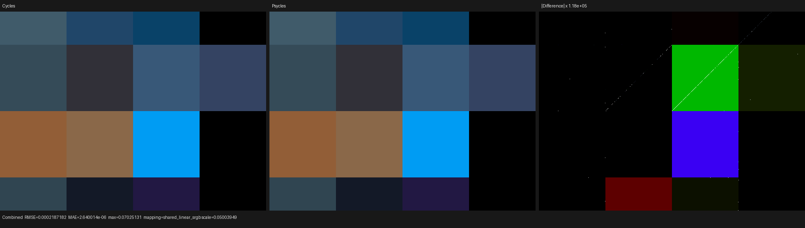
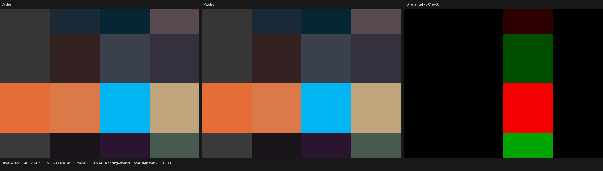
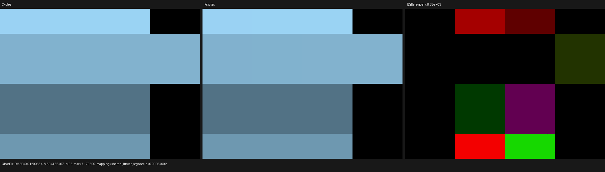
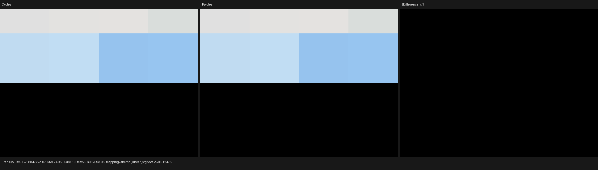
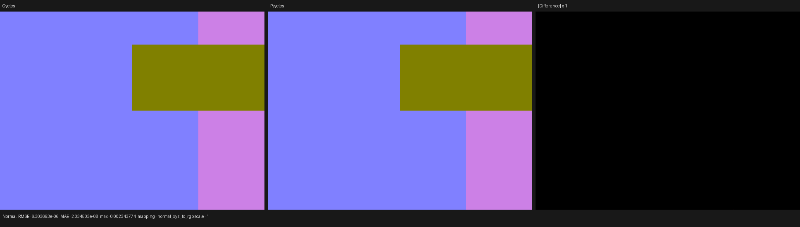

# Cycles 5.2 thin-film closure validation

## Outcome

Accepted. Psycles' Luisa surface path matches the Blender/Cycles 5.2.1 HIP
oracle for the raw Principled and Glass thin-film closures, including
dielectric, metallic, thick-transmission, thin-wall transmission, zero-film
controls, linked film inputs, several film IOR/thickness pairs, and explicit
normal inputs.

The final 640x480, 256-fixed-sample comparison has zero invalid pixels.
Combined luminance differs by `7.24e-8` relative, Glossy Color by `1.19e-7`,
Glossy Direct by `2.84e-7`, and Transmission Color is equal at reported mean
precision. Visual inspection found no structural color, lobe, normal,
orientation, or cell-assignment difference.

This is a closure-compatibility result, not a complete-scene performance
claim. Psycles reported 0.442157 s render-only and Blender reported 1.863078 s
for this deliberately trivial matrix, but the two host integrations do not
define an end-to-end apples-to-apples benchmark.

## Exact oracle identity

- Blender/Cycles source:
  `9e2066aef7ef7e20c142ad7bd3303138a4304c93`, branch
  `blender-v5.2-release`, tag description `v5.2.1-dirty` solely because the
  prebuilt-library submodule is locally populated.
- Installed oracle: Blender 5.2.1 LTS Release, build hash `9e2066aef7ef`, from
  `/home/mike/Projects/blender-install-5.2-hiprt/blender`.
- Device: AMD Radeon RX 9070 XT (`gfx1201`), Cycles HIP and Psycles Luisa HIP.
- Psycles implementation baseline: `6f5cd1ce3ddfc2a136ab6860337386dcd1774098`.
- LuisaCompute: `ca29d37d3458bd44c4d7bbc55f69c7bf047f83ae`.
- Sampling: Tabulated Sobol, seed 20903, adaptive sampling disabled, denoising
  disabled, 640x480, 256 fixed samples.

The machine-readable comparison independently verifies that the Blender
build identity embedded in the exported scene equals the golden renderer
identity. See [report.json](report.json) and
[cycles-metadata.json](cycles-metadata.json).

## Rejected stale oracle

The earlier installed Blender 5.2.0 binary was built from `fbe6228777e7`.
Against it, the new matrix showed a Transmission Color mean ratio of about
`1.2399` and relative RMSE `0.4837`, localized exclusively to thin-wall
Principled transmission. That was not evidence for changing Psycles.

Cycles commit `de47f7c5e3430e98db54e3bb58cb7580b63a0890`, included by 5.2.1,
fixes this exact oracle defect: thin glass is sampled using the mirrored
reflection construction but must still be classified as transmission when
writing render passes. After rebuilding the exact 5.2.1 source, the existing
`principled_thin_wall_surface` probe gives:

| Pass | Relative RMSE | Luminance ratio |
|---|---:|---:|
| Combined | `2.412e-6` | `0.9999990153` |
| Glossy Color | `3.218e-8` | `1.0` |
| Transmission Color | `4.925e-8` | `1.0` |
| Glossy Direct | `2.340e-6` | `1.000001728` |
| Transmission Direct | `2.247e-6` | `0.999998084` |
| Normal | `1.345e-8` | `1.0` |

This source-level version audit prevents a stale golden image from forcing a
known Cycles bug back into Psycles.

## Raw-closure probe

The 4x4 matrix contains these equal-area cases:

| Row | Closure domain | Cases |
|---|---|---|
| 0 | Principled dielectric reflection | 0, 100, 300, and 600 nm; last case uses film IOR 1.70 and a tilted normal |
| 1 | Principled metallic reflection | 0, 150, 450, and 900 nm; multiple base colors and film IORs, last case tilted |
| 2 | Principled transmission | thick 0/275 nm and thin-wall 0/275 nm controls |
| 3 | standalone Glass | 0, 180, 350, and 650 nm; multiple film IORs, last case tilted |

Every Thin Film Thickness and Thin Film IOR socket is driven by an authored
Value node. Optional normals are also linked nodes. The exporter serializes
these original node graphs; it does not bake closure values, ask Cycles to
evaluate a material, or substitute a preview shader. Psycles receives the
raw Principled/Glass closures and evaluates them in the Luisa DSL/SVM path.

A single zero-angle Sun and a one-bounce direct-light configuration remove
finite-emitter choice and direct-light variance. Zero-film pairs are semantic
controls for the identity branch, while nonzero cases exercise spectral
thin-film Fresnel and its interaction with the underlying dielectric or
conductor Fresnel.

## Formal regression criterion

Let the image domain be the disjoint union of 16 equal-area constant-material
cells `C_i`. Apart from a measure-zero set of shared triangle boundaries, the
closure inputs and incident direction are constant within each cell. A
structural error in any authored closure case therefore changes all of
`C_i`, or `1/16 = 6.25%` of the image.

For each stable nonzero pass, the runner checks both:

```text
0.9995 <= Psycles mean luminance / Cycles mean luminance <= 1.0005
p99(pixel RGB RMSE) / Cycles RMS <= 1e-4
```

Since 6.25% is greater than the 1% upper tail removed by p99, a wrong cell
cannot be hidden by this robust statistic, even if errors in different cells
cancel in the global mean. Conversely, a sparse shared-edge ray choice cannot
dominate the result as it does in ordinary whole-frame RMSE. The permanent
runner-contract regression explicitly proves both properties: it accepts a
large global RMSE confined below 1%, then rejects a p99 error that represents
a structural cell mismatch.

Transmission Direct and Transmission Indirect remain in the report but are
not gated here. Their Cycles reference means are approximately `1.33e-8` and
`1.62e-6`; ratios and relative errors at numerical zero are ill-conditioned.
The existing two-sided thin-wall probe supplies stable nonzero direct
transmission coverage instead.

## Numerical result

| Pass | Luminance ratio | Relative RMSE | Normalized p99 RMSE | Maximum absolute error |
|---|---:|---:|---:|---:|
| Combined | `0.9999999276` | `5.902e-5` | `1.190e-6` | `0.0702513` |
| Glossy Color | `0.9999998810` | `3.266e-5` | `1.034e-7` | `0.00308564` |
| Glossy Direct | `1.0000002843` | `3.352e-4` | `1.691e-6` | `7.17970` |
| Transmission Color | `1.0` | `3.486e-7` | `0` | `9.608e-5` |
| Normal | `0.9999998888` | `1.092e-5` | `0` | `0.00234377` |

The apparently large maxima are extremely sparse: for Glossy Direct the
whole-frame maximum is `7.17970`, while p95 and p99 pixel RMSE are only
`4.625e-5` and `6.057e-5` against a Cycles RMS of `35.82085`. The mean energy,
cell structure, and more than 99% of pixels remain aligned. No tolerance in an
existing exact-hash regression was weakened.

## Visual inspection

Each triptych shows Cycles on the left, Psycles in the center, and an
explicitly amplified absolute difference on the right. Inspection at native
resolution found the same 16-cell layout, film colors, zero-film controls,
thin-wall classification, tilted-normal regions, and orientation. The
amplified panels expose uniform float32 rounding fields, triangle diagonals,
and isolated bright samples; they do not reveal a coherent material or lobe
difference.











## Verification and reproduction

The exact Cycles source was built with all 32 host threads, installed to its
isolated prefix, and identified before rendering:

```sh
cmake --build /home/mike/Projects/blender-build-5.2 -j32
cmake --install /home/mike/Projects/blender-build-5.2
/home/mike/Projects/blender-install-5.2-hiprt/blender --version
```

The formal probe run was:

```sh
python3 tools/run_cycles_shader_probes.py \
  --blender /home/mike/Projects/blender-install-5.2-hiprt/blender \
  --psycles-render build/bin/psycles_render_blender_scene \
  --output-dir build/validation/thin-film-cycles-5.2.1-final-gated \
  --backend hip \
  --cycles-device HIP \
  --cycles-device-name 'Radeon RX 9070 XT' \
  --width 640 --height 480 --samples 256 \
  thin_film_surface
```

The focused permanent regressions pass:

```text
psycles.shader_probe_runner_contract  passed
psycles.source_size                   passed
```

The preceding implementation milestone built the complete project and passed
26/26 focused backend tests. Its full suite result was 295/301; the same six
pre-existing tolerance failures were reproduced on the baseline. The changes
in this validation follow-up are Python probe, runner-contract test, and
documentation only.
