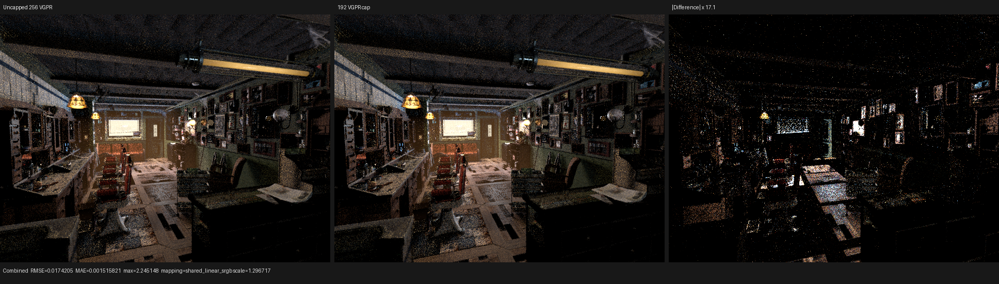
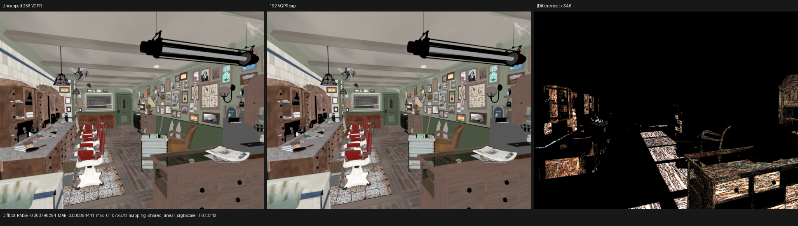
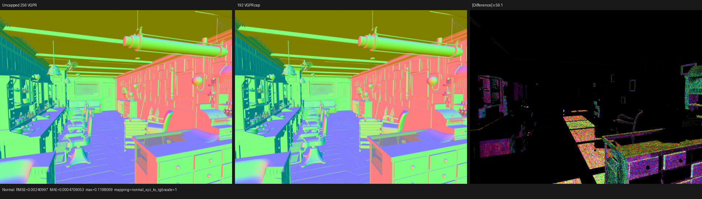

# HIP surface register cap audit

## Outcome

Hard-capping the Psycles HIP surface continuation to the register count reported
by Cycles is rejected. The uncapped Psycles kernel uses 256 VGPRs and 3,096 B of
private storage. Caps of 224, 192, and 160 VGPRs monotonically increased both
private storage and normalized `shade_surface` time. The temporary diagnostic
configuration was removed; no hidden register-cap environment variable remains
in the renderer.

This result separates a consequence from a cause. Cycles reaches 192 VGPRs
because its translated surface program has a different live set and control/data
shape. Asking LLVM to fit the existing Psycles program into the same allocation
does not establish equivalent occupancy: it forces additional values into
private storage and makes the kernel slower. The next optimization must reduce
the live set or executed work structurally, not copy a resource number.

## Formal hypothesis and rejection criterion

Let `P` be the fixed XIR/LLVM program and let `R` be a backend register budget.
The cap constrains allocation only; it does not change the renderer algorithm or
the shader AST/cache identity. For a fixed scene and launch topology, define

```text
T(R) = total shade_surface GPU duration / launched shade_surface work items.
```

The occupancy hypothesis predicts a useful interval below the uncapped
allocation: there must exist `R < 256` for which `T(R)` decreases outside the
uncapped repeat interval without changing output semantics. It is not enough
for `R` to equal the number printed for a different program.

All cap runs retained the same surface structural hash
`34ce4f608fa88ce2`. The measured sequence instead satisfies

```text
T(224) < T(192) < T(160), but T(224) > max(T(unlimited run 1),
                                          T(unlimited run 2)).
```

Private storage also rises monotonically as the cap falls. This rejects the
occupancy hypothesis for the tested program: allocator pressure is being paid
as spill/private traffic before any occupancy benefit can win.

## Fresh Cycles comparison

Both renderers were traced on the Radeon RX 9070 XT at 640x480 and 64 fixed
samples. Cycles used Blender 5.2.0 LTS build `fbe6228777e7`, HIP, Tabulated
Sobol, adaptive sampling disabled, and denoising disabled. Psycles used the
staged wavefront path with compact values and populate-once enabled.

| Renderer / stage | Calls | Work items | GPU time | ns/item | VGPR | Private B |
| --- | ---: | ---: | ---: | ---: | ---: | ---: |
| Psycles `shade_surface`, uncapped run 1 | 366 | 53,601,728 | 1,154.071 ms | 21.530472 | 256 | 3,096 |
| Cycles `kernel_gpu_integrator_shade_surface` | 296 | 54,061,056 | 584.528 ms | 10.812362 | 192 | 6,976 |

The fresh normalized Psycles/Cycles surface ratio is `1.991x`. The work counts
differ by less than one percent, so the gap is not explained by dispatch count
alone. This table does not claim that the two stages execute an identical set
of operations; it establishes the same-device target for the subsequent
handler and live-set attribution.

## Register-cap sweep

The two uncapped measurements bracket run-to-run noise. Cap deltas below use
their mean, `21.576679 ns/item`, as the baseline.

| Budget | Calls | Work items | GPU time | ns/item | Change | Private B | Render-only |
| ---: | ---: | ---: | ---: | ---: | ---: | ---: | ---: |
| unlimited, run 1 | 366 | 53,601,728 | 1,154.071 ms | 21.530472 | -0.214% | 3,096 | 2.50755 s |
| 224 | 367 | 53,570,592 | 1,211.576 ms | 22.616437 | +4.819% | 3,240 | 2.58427 s |
| 192 | 359 | 53,560,192 | 1,310.919 ms | 24.475624 | +13.436% | 3,384 | 2.69632 s |
| 160 | 355 | 53,566,976 | 1,432.714 ms | 26.746225 | +23.959% | 3,560 | 2.82686 s |
| unlimited, run 2 | 357 | 53,557,504 | 1,158.068 ms | 21.622885 | +0.214% | 3,096 | 2.50843 s |

The first tested cap is already more than ten times farther from the baseline
mean than the two uncapped endpoints. Matching Cycles at 192 VGPRs makes the
surface stage 13.44% slower and the complete render 7.51% slower relative to
the uncapped mean. Shader JIT time is excluded from render-only timing.

## Output inspection

The triptychs compare the second uncapped HIP run on the left with the 192-VGPR
run in the middle; the right panel is an amplified absolute difference. The
generic JSON schema calls the inputs `cycles` and `psycles`, but the explicit
labels and paths identify both as Psycles runs.

| Pass | RMSE | MAE | Maximum error | Mean luminance ratio | Invalid pixels |
| --- | ---: | ---: | ---: | ---: | ---: |
| Combined | 0.0174205 | 0.00151582 | 2.24515 | 1.012528 | 0 |
| DiffCol | 0.00379829 | 0.000864441 | 0.107258 | 0.999811 | 0 |
| Normal | 0.00240997 | 0.000470905 | 0.119807 | 1.000009 | 0 |

Visual inspection finds no geometry, UV, material-class, texture-placement, or
normal-orientation change. DiffCol and Normal are visually coincident in the
unamplified panels. Their amplified differences, and the larger sparse
Combined outliers, follow high-frequency edges and Monte Carlo contributions
rather than a coherent scene feature. This is consistent with scheduling- and
floating-point-order-sensitive atomic film accumulation, but is not used as a
semantic proof. Backend exactness remains covered by deterministic fallback
regressions; the cap itself was a rejected local diagnostic and was removed.







`visual-report.json` records all 46 EXR channels, orientation checks, invalid
pixel counts, percentile errors, and the exact input paths.

## Reproduction and provenance

The production tree was rebuilt with all 32 requested host threads after the
temporary diagnostic was removed:

```sh
cmake --build build --parallel 32 --target \
  psycles_render_blender_scene \
  psycles_surface_program_metadata_tests \
  psycles_luisa_sample_dispatch_film_tests
```

Each Psycles point used the same render command under `rocprofv3`; only the
temporary mapping of `ShaderOption::max_registers` to `0`, `224`, `192`, or
`160` changed. That mapping was deliberately not retained because a rejected
allocator experiment is not a renderer feature:

```sh
rocprofv3 --kernel-trace -f rocpd -d PROFILE_DIR -o trace -- \
  build/bin/psycles_render_blender_scene \
  /home/mike/Projects/psycles-benchmarks/barbershop-480p-64spp/export \
  OUTPUT.exr hip 640 480 64 64 - 0 0 0 0 64 - 1 0 \
  wavefront-staged 32 32768 32 1 1 0 4 2 4096 0 0 0 1 1048576
```

The Cycles reference was freshly generated and traced with:

```sh
rocprofv3 --kernel-trace -f rocpd -d PROFILE_DIR -o trace -- \
  /home/mike/Projects/blender-install-5.2/blender \
  /home/mike/Projects/Psycles/assets/official-blender-scenes/barbershop-interior/barbershop_interior.blend \
  --background --python tools/render_cycles_golden.py -- \
  OUTPUT.exr 640 480 64 0 --cycles-device HIP \
  --device-name 'Radeon RX 9070 XT' \
  --sampling-pattern TABULATED_SOBOL --scrambling-distance 1.0
```

The next attribution target is the structural surface live set: value-SVM
state, closure population, and individual closure consumers must be measured
without blanket `inline`/`noinline` annotations or a forced register budget.
