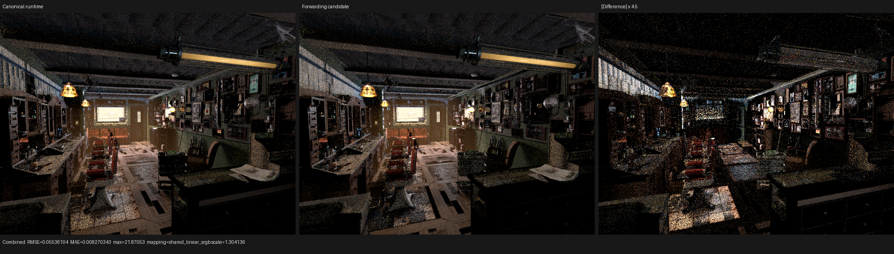

# Surface SVM last-use forwarding runtime: rejected

## Outcome

The exact adjacent last-use relation is now a reusable compiler plan and the
surface histogram consumes that plan as its legality oracle. The attempted
device rewrite was removed after correctness, generated-code, resource, image,
and HIP profile validation.

The rewrite was semantically general and had no operation- or scene-specific
cases, but its callable ABI made every value handler accept an incoming mask
and payload, dynamically select forwarded operands, and return an aggregate
payload. On Blender 5.2 Barbershop this increased the surface HIP object by
10.70%, fixed private storage by 216 B, and VGPR spills by 89 while changing
normalized `shade_surface` time by less than 0.5%, inside the measured run-to-run
range. Reducing the payload from four to the minimum sufficient three 32-bit
lanes did not change the object or private-storage cost.

No device forwarding, bytecode overlay, environment switch, or shader/cache
identity change remains in production. The retained planner prevents the
experiment from becoming throwaway knowledge and ensures future implementations
use one proven relation rather than reconstructing it in diagnostics.

## Formal rewrite and retained plan

For adjacent ordinary instructions `(i, i + 1)`, let `D_i` be the definition
produced by `i`, let `U_(i+1,j)` be the definition read by target operand `j`,
and let `L(D_i)` be the exact final serialized observer computed by definition
epochs over typed local addresses. The plan emits

```text
M_i = { j | U_(i+1,j) = D_i }
```

only when

```text
M_i != empty and L(D_i) = i + 1.
```

Under this condition, evaluating `i` to `v`, omitting the bank write, and
substituting `v` for every operand in `M_i` preserves the target evaluation.
All earlier observers precede the definition and the last-use equality proves
that no later instruction, normal commit, or closure endpoint can observe the
removed bank definition. Reads are analyzed before each in-place definition,
so slot coloring and address reuse do not invalidate the proof. Surface-normal
commits remain hard namespace boundaries.

`plan_surface_value_forwarding` returns a mask parallel to the program's
instruction slice and fails closed on malformed or undefined data flow. It
does not mutate the scene image. Permanent regressions cover:

- an in-place scalar chain;
- duplicate reads of one producer by two target operands;
- a source that remains live after its immediate consumer;
- undefined local data flow; and
- a surface-normal transaction boundary.

The histogram now compares its independently decoded direct-dependency mask
with the compiler plan's complete mask. A disagreement makes the report
inexact. This removes the previous risk that measurement and a future rewrite
silently use different legality predicates.

## Rejected device representation

The experimental runtime overlaid the successor mask into unused high bits of
an uploaded ordinary result word; the canonical compiler bytecode stayed
unchanged. Each exact handler had one call site and no manual inline or noinline
attribute. Its generic ABI was conceptually

```text
payload handler(..., instruction, incoming_mask, incoming_payload, banks...)
```

The handler substituted the incoming payload for every marked operand, omitted
its own bank write when its result carried an outgoing mask, and returned the
result bits. The first carrier was `uint4`. Since the largest value is a
`float3` and `uint64` needs only two lanes, a second implementation used the
provably minimal `uint3` carrier.

Both implementations passed the all-pass fallback, HIP, and strict native
Vulkan fixtures before removal. Nevertheless, LLVM could not turn the dynamic
cross-callable protocol back into local SSA. The cost came from the universal
branches and aggregate call/return boundary, not the unused fourth lane.

## Generated code and resources

All cold variants used the same RX 9070 XT, Barbershop export, 640x480
one-sample AST, staged wavefront topology, disabled shader cache, LLVM dump,
and HIP object dump. One sample changes execution count but not the generated
surface stage.

| Metric | Canonical | `uint4` carrier | `uint3` carrier |
| --- | ---: | ---: | ---: |
| Final surface LLVM IR | 3,001,514 B | 3,227,724 B (+7.54%) | 3,217,710 B (+7.20%) |
| Surface HIP object | 339,800 B | 376,152 B (+10.70%) | 376,152 B (+10.70%) |
| Fixed private storage | 3,096 B | 3,312 B (+216 B) | 3,312 B (+216 B) |
| VGPR / SGPR | 256 / 128 | 256 / 128 | 256 / 128 |
| Reported VGPR spills | 365 | 454 (+89) | not separately dumped |
| Coroutine frame | 864 B | 864 B | 864 B |

The unchanged coroutine frame is expected: forwarding lives entirely inside
one `shade_surface` continuation. The private-memory and spill increase is the
relevant execution cost.

## HIP performance

`rocprofv3 --kernel-trace` measured the mapped `shade_surface` continuation at
640x480 and 64 fixed samples. Work-item normalization is required because
scheduler execution counts vary slightly between runs.

| Variant | Kernel | Calls | Work items | GPU time | ns/item |
| --- | --- | ---: | ---: | ---: | ---: |
| Current canonical profile | `kernel_171a68c453a88f60` | 356 | 53,612,352 | 1,166.280 ms | 21.753938 |
| Rejected `uint4` | `kernel_91076d36866f4f7c` | 360 | 53,613,856 | 1,160.548 ms | 21.646414 |
| Rejected `uint3` | `kernel_d15fbf32cc481951` | 355 | 53,567,616 | 1,160.438 ms | 21.663048 |
| Independent canonical K=0 trace | `kernel_4201432322c51ca1` | 355 | 53,568,704 | 1,157.628 ms | 21.610160 |

Relative to the current canonical profile the candidates appear 0.42--0.49%
faster; relative to the independent canonical trace they are 0.17--0.24%
slower. The sign changes across valid baselines, so there is no demonstrated
speedup. A sub-percent ambiguous movement cannot justify a 10.7% object
increase and materially worse private/spill pressure.

## Image check

The rejected `uint3` candidate and the restored canonical runtime were each
rendered at 640x480, 64 fixed samples. Combined-pass comparison reports RMSE
0.055361, MAE 0.008270, and no invalid pixels. A separate canonical-versus-
canonical repeat has a larger RMSE of 0.056781 and MAE of 0.008960, establishing
the stochastic/scheduler noise floor for this low-sample full-scene check.

The triptych was inspected at original resolution. Geometry, material regions,
textures, silhouettes, and illumination structure agree; the amplified panel
contains unstructured path/firefly noise rather than a node-family or spatially
coherent error. Exact per-sample film regressions remain the stronger semantic
gate for this bit-preserving rewrite.



## Validation commands

The candidate source is intentionally absent from `main`; the profile command
records the historical command shape rather than a currently selectable mode.

```sh
cmake --build build --parallel 32 --target \
  psycles_surface_program_metadata_tests \
  psycles_luisa_sample_dispatch_film_tests \
  psycles_render_blender_scene

build/psycles_surface_program_metadata_tests
build/bin/psycles_luisa_sample_dispatch_film_tests fallback
build/bin/psycles_luisa_sample_dispatch_film_tests hip

LUISA_VULKAN_USE_XIR=1 \
LUISA_VULKAN_REQUIRE_NATIVE_XIR_SPIRV=1 \
LUISA_VULKAN_DISABLE_DXC=1 \
build/bin/psycles_luisa_sample_dispatch_film_tests vk

rocprofv3 --kernel-trace -f rocpd -d PROFILE_DIR -o trace -- \
  env PSYCLES_COMPACT_SURFACE_VALUES=1 \
      PSYCLES_POPULATE_SURFACE_ONCE=1 \
      LUISA_CORO_SHADER_MAP=1 \
  build/bin/psycles_render_blender_scene BARBERSHOP_EXPORT out.exr hip \
    640 480 64 64 - 0 0 0 0 64 - 1 0 wavefront-staged \
    32 32768 32 1 1 0 4 2 4096 131072 0 0 1
```

All retained-code commands passed. Vulkan used native XIR-to-SPIR-V with DXC
disabled. A final Barbershop histogram run after the planner became the shared
oracle completed in 0.411862 s with `exact=true`, 468 exact transition classes,
292,769,460 ordinary transition executions, 233,981,309 direct executions, and
214,610,635 last-use-forwardable executions (73.30% of all and 91.72% of
direct). The small raw-count movement from the earlier histogram follows the
stochastic surface-population count; the classification shares remain stable.

## Consequence for the next implementation

The opportunity bound remains real, but it must be realized inside a typed
region where producer and consumer are simultaneously visible to SSA
optimization. Passing a universal payload across every callable is the wrong
abstraction. A future block/threaded-SVM representation should form typed
straight-line regions from the same exact masks, keep one copy of every
semantic handler, and reject a region before code generation whenever its
projected live payload or duplicated dispatch structure exceeds the canonical
interpreter cost. That is a structural requirement, not a list of profitable
node pairs.
