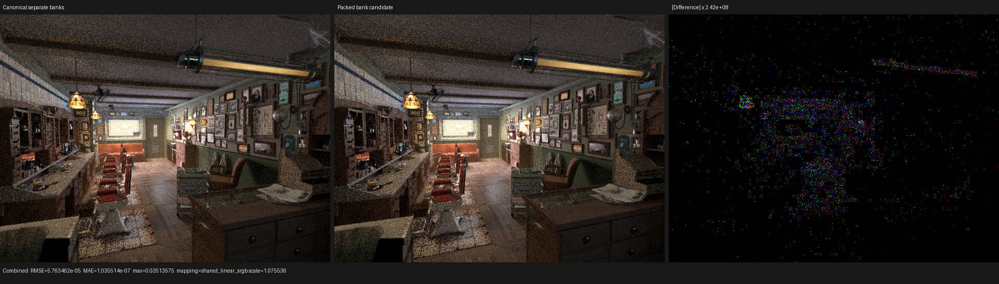

# Unified surface value bank: rejected

## Result

Packing the compact surface interpreter's eight scalar slots and twelve vector
slots into one equal-byte `float4[14]` private bank removes the native
`<8 x float>` loop-carried value, but it does not reduce the production HIP
kernel's register pressure. The experiment was removed after backend
regressions and three complete Barbershop profiles. The coroutine frame stays
at 177 fields / 864 B, while fixed private storage grows by 32 B, the reported
VGPR spill count grows by one, and normalized `shade_surface` changes by only
-0.27% at the median. That timing is below the established run-to-run noise
threshold and does not justify a more complex physical ABI.

Both forms use Psycles commit `cbb4946`, LuisaCompute
`d4c3fca3806acdf6f6d028b825ef6fc608d156c5`, RX 9070 XT (`gfx1201`), the
official Blender 5.2 Barbershop export, 640x480, 64 fixed samples, Tabulated
Sobol, compact surface values, single surface population, fast math, and the
staged wavefront scheduler. Adaptive sampling and denoising are disabled.

| Metric | Separate typed banks | Unified packed bank | Change |
|---|---:|---:|---:|
| Coroutine frame | 177 fields / 864 B | 177 fields / 864 B | unchanged |
| Final LLVM | 53,903 lines / 3,001,514 B | 54,698 / 3,036,555 B | +795 lines / +35,041 B |
| LLVM allocas | 17 | 16 | -1 |
| LLVM loads / stores | 2,527 / 1,275 | 2,556 / 1,310 | +29 / +35 |
| LLVM phi / select | 2,281 / 2,666 | 2,275 / 2,666 | -6 / unchanged |
| LLVM calls / switches | 3,351 / 38 | 3,349 / 38 | -2 / unchanged |
| Main HIP object | 339,800 B | 337,880 B | -1,920 B (-0.565%) |
| Main kernel symbol | 318,104 B | 316,240 B | -1,864 B (-0.586%) |
| Fixed private storage | 3,096 B | 3,128 B | +32 B (+1.034%) |
| VGPR / SGPR | 256 / 107 | 256 / 107 | unchanged |
| VGPR / SGPR spills | 365 / 0 | 366 / 0 | +1 / unchanged |

The smaller object is therefore not evidence of a faster kernel. The resource
metadata and complete instruction-form counts show that the eliminated scalar
vector-PHI was exchanged for more private-bank traffic and address handling.

## Formal representation audit

Let the original physical state be two disjoint typed arrays

```text
S = F^8
V = (F^3)^12
```

whose C++ ABI occupies 32 B and 192 B respectively. The candidate used

```text
P = (F^4)^14
phi_v(v, c) = (v, c),                  0 <= v < 12, 0 <= c < 3
phi_s(s)    = (12 + floor(s / 4), s mod 4), 0 <= s < 8.
```

`phi_v` and `phi_s` are injective on their domains, and their first coordinates
belong to disjoint intervals `[0, 12)` and `[12, 14)`. Thus scalar and vector
writes cannot alias. `sizeof(P) = 14 * 16 = 224` B, equal to the original
physical storage. Typed scalar/vector views hid the representation from shader
nodes and the callable's logical semantics. A compile-time exhaustive proof and
a device regression traversing every dynamic address in both write orders
passed on fallback, HIP, and strict native Vulkan XIR-to-SPIR-V.

That proves semantic equivalence, not profitability. The performance
hypothesis was that preventing promotion of `S` into one loop-carried
`<8 x float>` value would shorten live ranges. The final LLVM confirms that the
type disappears, but unifying the two address spaces forces each handler to
access the larger `P` aggregate. AMDGPU then emits 29 more loads and 35 more
stores, allocates 32 more private bytes, and reports one more VGPR spill. This
is a structural counterexample to using an equal byte count as a proxy for
equal register-allocation cost.

The next admissible experiment is narrower: alter only `S` while leaving `V`
and the callable ABI disjoint. It must be judged by the same final-resource and
full-scene gates; merely removing the vector-PHI remains insufficient.

## HIP profile

The control trace was captured immediately before the candidate traces with
the same binary options and scene. Every surface run launches 293 kernels over
53,660,800-53,660,864 work-items. Durations are normalized by the actual
`grid_x * grid_y * grid_z` sum.

| Run | Calls | Work-items | `shade_surface` ns/item | Render-only |
|---|---:|---:|---:|---:|
| Separate banks control | 293 | 53,660,864 | 26.407983107 | 2.50428 s |
| Packed bank 1 | 293 | 53,660,864 | 26.313010633 | 2.49714 s |
| Packed bank 2 | 293 | 53,660,864 | 26.337659546 | 2.50014 s |
| Packed bank 3 | 293 | 53,660,800 | 26.338119223 | 2.50071 s |
| Packed mean / median | | | 26.329596467 / 26.337659546 | 2.49933 s mean |

The candidate median is 0.266% lower and its mean is 0.297% lower than the
single same-session control; mean render-only time is 0.198% lower. These are
noise-level observations, not a retained speedup. In particular, they do not
offset the deterministic private-memory and spill regressions.

## Numerical and visual inspection

All fifteen Combined, data, light, and volume passes contain zero invalid
pixels. The complete reports are
[`all-pass-report.json`](all-pass-report.json) and
[`candidate-repeat-report.json`](candidate-repeat-report.json).

| Pass | Packed vs separate RMSE | Packed repeat RMSE | Mean result |
|---|---:|---:|---:|
| Combined | 5.763462e-5 | 5.763462e-5 | luminance ratio 0.99999848 |
| Normal | 1.436947e-8 | 2.409813e-8 | luminance ratio 1.0 |
| Diffuse Color | 7.817326e-6 | 1.450093e-5 | luminance ratio 0.99999993 |

The candidate-versus-control residual is no larger than the candidate's own
parallel atomic-accumulation repeat noise. Original-resolution inspection found
matching geometry, floor, ceiling, cabinets, textures, material boundaries,
normal orientation, and illumination. The amplified difference is sparse and
contains no coherent shader-node or spatial structure.



- [Normal triptych](triptychs/normal.png)
- [Diffuse Color triptych](triptychs/diffcol.png)
- [Triptych metrics](triptych-report.json)

## Reproduction

The candidate source is intentionally absent from `main`; these commands record
the rejected experiment's validation shape.

```sh
cmake --build build --parallel 32 --target \
  psycles_luisa_compact_surface_preparation_tests \
  psycles_render_blender_scene

build/bin/psycles_luisa_compact_surface_preparation_tests fallback
build/bin/psycles_luisa_compact_surface_preparation_tests hip

LUISA_VULKAN_USE_XIR=1 \
LUISA_VULKAN_REQUIRE_NATIVE_XIR_SPIRV=1 \
LUISA_VULKAN_DISABLE_DXC=1 \
build/bin/psycles_luisa_compact_surface_preparation_tests vk

PSYCLES_DISABLE_SHADER_CACHE=1 \
LUISA_DUMP_LLVM_IR=1 \
LUISA_DUMP_HIP_ISA=ISA_DIR \
PSYCLES_COMPACT_SURFACE_VALUES=1 \
PSYCLES_POPULATE_SURFACE_ONCE=1 \
LUISA_CORO_SHADER_MAP=1 \
build/bin/psycles_render_blender_scene BARBERSHOP_EXPORT out.exr hip \
  640 480 1 1 - 0 0 0 0 1 - 1 0 wavefront-staged \
  32 32768 32 1 1 0 4 2 4096 131072 0 0 1 1048576

rocprofv3 --kernel-trace -f rocpd -d PROFILE_DIR -o trace -- \
  env PSYCLES_COMPACT_SURFACE_VALUES=1 \
      PSYCLES_POPULATE_SURFACE_ONCE=1 \
      LUISA_CORO_SHADER_MAP=1 \
  build/bin/psycles_render_blender_scene BARBERSHOP_EXPORT out.exr hip \
    640 480 64 64 - 0 0 0 0 64 - 1 0 wavefront-staged \
    32 32768 32 1 1 0 4 2 4096 131072 0 0 1
```

The candidate backend regressions all passed. After rejection, the production
sources were restored exactly before this document was committed.
