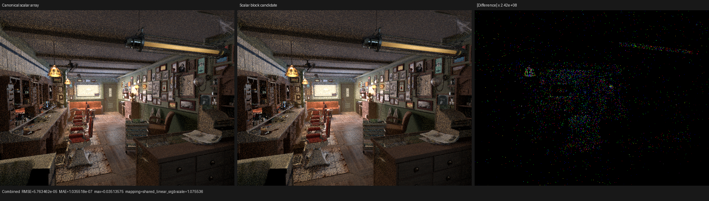

# Blocked scalar surface value bank: rejected

## Result

Changing only the compact surface interpreter's eight-scalar physical bank
from `float[8]` to an equal-byte `float4[2]` representation removes the native
`<8 x float>` loop-carried value without touching the separate vector bank.
The experiment was removed: three complete Barbershop HIP traces change
normalized `shade_surface` by only -0.128% at the median and -0.099% at the
mean, while fixed private storage deterministically grows by 32 B and the
reported VGPR spill count grows by one.

Both forms use Psycles commit `00eee3d`, LuisaCompute
`d4c3fca3806acdf6f6d028b825ef6fc608d156c5`, RX 9070 XT (`gfx1201`), the
official Blender 5.2 Barbershop export, 640x480, 64 fixed samples, Tabulated
Sobol, compact surface values, single surface population, fast math, and the
staged wavefront scheduler. Adaptive sampling and denoising are disabled.

| Metric | Canonical `float[8]` | Scalar `float4[2]` | Change |
|---|---:|---:|---:|
| Coroutine frame | 177 fields / 864 B | 177 fields / 864 B | unchanged |
| Final LLVM | 53,903 lines / 3,001,514 B | 54,511 / 3,029,455 B | +608 lines / +27,941 B |
| LLVM allocas | 17 | 19 | +2 |
| LLVM loads / stores | 2,527 / 1,275 | 2,559 / 1,297 | +32 / +22 |
| LLVM phi / select | 2,281 / 2,666 | 2,275 / 2,666 | -6 / unchanged |
| LLVM calls / switches | 3,351 / 38 | 3,355 / 38 | +4 / unchanged |
| Main HIP object | 339,800 B | 338,776 B | -1,024 B (-0.301%) |
| Main kernel symbol | 318,104 B | 317,176 B | -928 B (-0.292%) |
| Fixed private storage | 3,096 B | 3,128 B | +32 B (+1.034%) |
| VGPR / SGPR | 256 / 107 | 256 / 107 | unchanged |
| VGPR / SGPR spills | 365 / 0 | 366 / 0 | +1 / unchanged |

## Formal model and falsified hypothesis

For logical scalar addresses `s in [0, 8)`, the candidate used

```text
phi(s) = (floor(s / 4), s mod 4) in [0, 2) x [0, 4).
```

If `phi(a) = phi(b)`, equality of the quotient and remainder under Euclidean
division by four implies `a = b`; therefore `phi` is injective. Both the source
and target occupy exactly 32 B. The vector and unsigned banks remain separate,
so their non-aliasing and typed node ABI are unchanged. A compile-time
exhaustive proof accompanied the candidate.

This isolates the earlier unified-bank experiment's two possible causes. If
the extra pressure came from merging scalar and vector address spaces, the
scalar-only form should eliminate the `<8 x float>` PHI without disturbing the
vector bank's resource use. Instead, it reproduces exactly the earlier +32 B
private and +1 VGPR-spill result. It also emits 32 more loads, 22 more stores,
and two more allocas.

The falsified proposition is therefore:

```text
eliminating the scalar vector-PHI alone => lower AMDGPU register pressure.
```

The measurements instead support a control-flow explanation: dynamic scalar
state remains live across the interpreter backedge and handler call boundary.
Changing its aggregate syntax merely trades SSA operations for addressable
private state. The next optimization must change the interpreter's typed
straight-line regions or state projection across those regions, rather than
trying more physical array wrappers.

## HIP profile

Every run launches 293 surface kernels over 53,660,800-53,660,864 work-items.
Durations are normalized by the actual sum of `grid_x * grid_y * grid_z`.

| Run | Calls | Work-items | `shade_surface` ns/item | Render-only |
|---|---:|---:|---:|---:|
| Canonical control | 293 | 53,660,864 | 26.407983107 | 2.50428 s |
| Scalar block 1 | 293 | 53,660,864 | 26.367554350 | 2.49858 s |
| Scalar block 2 | 293 | 53,660,864 | 26.374087156 | 2.50292 s |
| Scalar block 3 | 293 | 53,660,800 | 26.403560569 | 2.50147 s |
| Scalar mean / median | | | 26.381734025 / 26.374087156 | 2.50099 s mean |

The candidate median is 0.128% lower and its mean is 0.099% lower than the
same-session control. Mean render-only time is 0.131% lower. These are
noise-level observations and cannot outweigh the deterministic resource
regression.

## Backend, numerical, and visual validation

The existing compact surface regression passed on fallback and HIP. Vulkan
also passed with `LUISA_VULKAN_USE_XIR=1`,
`LUISA_VULKAN_REQUIRE_NATIVE_XIR_SPIRV=1`, and
`LUISA_VULKAN_DISABLE_DXC=1`; the log confirms native SPIR-V optimization and
contains no DXC route.

All fifteen Combined, data, light, and volume passes contain zero invalid
pixels. The complete reports are
[`all-pass-report.json`](all-pass-report.json) and
[`candidate-repeat-report.json`](candidate-repeat-report.json).

| Pass | Scalar block vs canonical RMSE | Scalar block repeat RMSE | Mean result |
|---|---:|---:|---:|
| Combined | 5.763462e-5 | 3.887080e-9 | luminance ratio 0.99999848 |
| Normal | 1.435041e-8 | 9.781321e-9 | luminance ratio 1.0 |
| Diffuse Color | 1.647105e-5 | 9.934963e-6 | luminance ratio 0.99999972 |

Original-resolution inspection found matching geometry, floor, ceiling,
cabinets, textures, material boundaries, normal orientation, and illumination.
Even at an amplified difference scale near `2.42e8`, the residual is sparse
atomic-arrival noise and contains no coherent node-family or spatial error.



- [Normal triptych](triptychs/normal.png)
- [Diffuse Color triptych](triptychs/diffcol.png)
- [Triptych metrics](triptych-report.json)

## Reproduction

The candidate source is intentionally absent from `main`; these commands record
the rejected experiment's validation shape.

```sh
cmake --build build --parallel 32 --target \
  psycles_luisa_compact_surface_preparation_tests \
  psycles_render_blender_scene

build/bin/psycles_luisa_compact_surface_preparation_tests fallback
build/bin/psycles_luisa_compact_surface_preparation_tests hip

LUISA_VULKAN_USE_XIR=1 \
LUISA_VULKAN_REQUIRE_NATIVE_XIR_SPIRV=1 \
LUISA_VULKAN_DISABLE_DXC=1 \
build/bin/psycles_luisa_compact_surface_preparation_tests vk

PSYCLES_DISABLE_SHADER_CACHE=1 \
LUISA_DUMP_LLVM_IR=1 \
LUISA_DUMP_HIP_ISA=ISA_DIR \
PSYCLES_COMPACT_SURFACE_VALUES=1 \
PSYCLES_POPULATE_SURFACE_ONCE=1 \
LUISA_CORO_SHADER_MAP=1 \
build/bin/psycles_render_blender_scene BARBERSHOP_EXPORT out.exr hip \
  640 480 1 1 - 0 0 0 0 1 - 1 0 wavefront-staged \
  32 32768 32 1 1 0 4 2 4096 131072 0 0 1 1048576

rocprofv3 --kernel-trace -f rocpd -d PROFILE_DIR -o trace -- \
  env PSYCLES_COMPACT_SURFACE_VALUES=1 \
      PSYCLES_POPULATE_SURFACE_ONCE=1 \
      LUISA_CORO_SHADER_MAP=1 \
  build/bin/psycles_render_blender_scene BARBERSHOP_EXPORT out.exr hip \
    640 480 64 64 - 0 0 0 0 64 - 1 0 wavefront-staged \
    32 32768 32 1 1 0 4 2 4096 131072 0 0 1
```

The production header was restored exactly before this document was committed.
