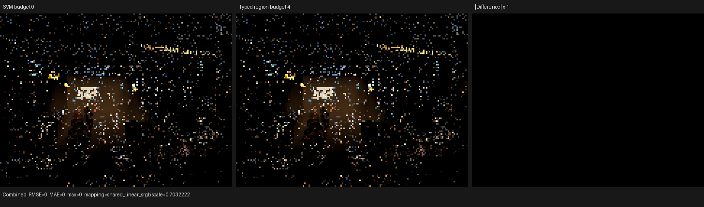
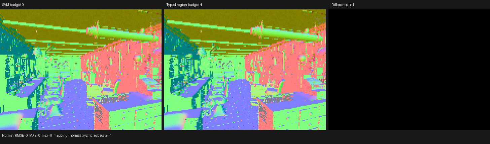
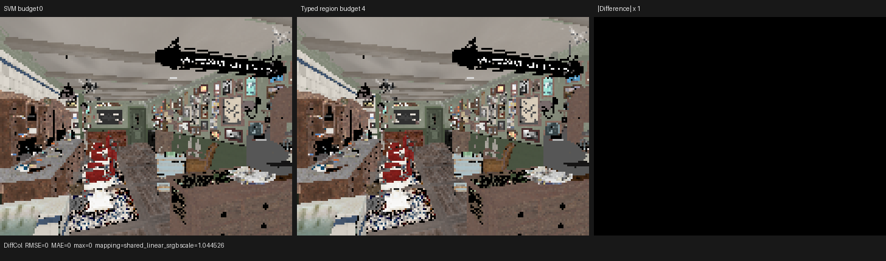

# Typed surface-region lowering

## Outcome

Psycles now has a formally bounded, exact hybrid lowering for repeated typed
surface-value regions. The host compiler selects whole, non-overlapping region
shapes under an exact handler-site budget; the Luisa host stage expands each
selected shape in topological order, retains intermediate values as typed SSA,
loads each live input once, and writes only live outputs. The ordinary SVM
remains the route for every unselected instruction.

The implementation is retained as opt-in infrastructure, but the production
default remains a zero-site budget:

```sh
PSYCLES_SURFACE_VALUE_REGION_HANDLER_SITE_BUDGET=4 <render command>
```

This is intentionally **not** promoted as a performance optimization yet. On
the Blender 5.2 Barbershop export, the best bounded static candidate measured
in this checkpoint changed the mapped HIP surface time by `+0.213%` and the
render-only interval by `+0.384%`, both regressions/noise rather than a win.
It also enlarged the final surface LLVM by `0.335%`. Keeping the default at
zero prevents an unproved scene-specific heuristic from entering production.

The result is still useful compiler infrastructure: it establishes the exact
region ABI, lowering proof, bounded code-generation mechanism, native XIR
coverage, and permanent regressions needed for future profile-guided or
backend-guided selection. It also rules out several plausible but slower
dispatch encodings with measured evidence.

## Formal model

For one validated ordinary-instruction region `R = [b, e]`, let `D_i` denote
the definition epoch produced by instruction `i`. The preceding region planner
constructs the unique maximal path components of the exact adjacent-forwarding
relation and projects each operand to one of:

```text
parameter(runtime bytecode address)
live_input(canonical boundary index)
instruction_result(region-relative producer index)
```

The specialization identity is complete lexicographic data, not a hash-only
shortcut. It contains the exact scene-wide evaluator variants, all operand
source kinds and indices, typed live-input banks, and sorted live-output
instruction offsets. Runtime parameter ids normalize to zero because their
concrete addresses remain in each bytecode occurrence. Colored local-slot ids
are absent because definition epochs, rather than reusable storage locations,
are the semantic identity.

For every candidate shape `s`, define:

```text
cost(s) = number of statically generated evaluator-handler sites
benefit(s) = sum over serialized occurrences of removed local-bank accesses
```

For each forwarded producer/successor edge, the exact static benefit is one
omitted producer write plus one omitted read for every successor operand that
uses that producer. Maximal regions partition each program, so selecting a
shape selects disjoint occurrences. Selection is therefore the finite 0/1
knapsack

```text
maximize sum selected(s) * benefit(s)
subject to sum selected(s) * cost(s) <= handler_site_budget.
```

The implementation solves this dynamic program exactly. Ties are resolved by
higher benefit, then lower actual cost, then lexicographically smaller shape
order, making the output deterministic. A second full instruction-owner map
checks every selected occurrence extent; it does not rely only on the public
beginning tags or on the current partition theorem.

## Lowering proof obligation

Before constructing a Luisa callable, the lowering validates:

- non-empty, parallel variant and operand-source streams;
- exact operand arity for every evaluator variant;
- normalized parameter sources;
- in-range live inputs whose bank matches the operand execution bank;
- internal results that strictly precede their uses and have the exact
  canonical execution type expected by the consumer;
- observation of every declared live input; and
- strictly increasing, unique, in-range live outputs.

The callable then evaluates members in increasing region-relative index. By
induction, every operand expression equals the canonical SVM bank read at that
instruction: parameters read the same runtime address, a live input is cached
from its first exact occurrence address, and an internal operand refers to the
already-proved producer result. Only definitions observed after `e` are
written. The post-region bank state may therefore differ only in definitions
whose final use is inside `R`; no later instruction, normal transition, or
closure operand can observe that difference.

The runtime instruction image is validated before it is changed. For at most
255 selected shapes, a one-based 8-bit tag is then placed in the previously
reserved control byte. Tag zero denotes the ordinary interpreter. The tag bits
are statically proven disjoint from opcode, result-bank, immediate, and BOX
family bits. The device uses one direct-product switch key:

```text
(ordinary first-handler key, region tag)
```

Plans larger than 255 shapes retain the exact parallel `uint32` side stream;
they never truncate a specialization identity. This path is diagnostic and
does not replace the faster inline encoding for bounded plans.

## Barbershop static and dynamic audit

The exhaustive diagnostic plan contains 557 selectable non-singleton shapes,
1,790 static occurrences, and 3,235 handler sites. With a four-site budget,
the exact static objective selects one three-handler shape:

```text
variants                 [0, 0, 7]
static occurrences       87
handler sites            3
static removed accesses  348
dynamic invocations      2,199,016
dynamic removed accesses 8,796,064
```

The dynamic v6 census shows that this shape ranks only twelfth by removed
runtime accesses. A profile-guided four-site oracle would choose
`[3, 6, 10, 11]`: 1,972,298 invocations times six removed accesses, or
11,833,788 accesses. That is 34.5% more dynamic work removed than the static
choice. The static selector is exact for its declared compile-time objective,
but the objective is not a runtime-optimal estimator. No profile data is
silently folded into shader AST/cache identity in this checkpoint.

## HIP code generation and timing

The matched runs used the RX 9070 XT, warm caches, fixed 640x480 output at 64
spp, staged wavefront scheduling, and identical launch topology. `rocprofv3`
mapped the surface continuation by its stable resource/work signature.

| Metric | Budget 0 | Budget 4 | Change |
| --- | ---: | ---: | ---: |
| `shade_surface`, run 1 | 21.516493 ns/item | 21.544299 ns/item | +0.129% |
| `shade_surface`, run 2 | 21.516224 ns/item | 21.580126 ns/item | +0.297% |
| `shade_surface`, mean | 21.516358 ns/item | 21.562213 ns/item | +0.213% |
| Render-only, mean | 2.496785 s | 2.506380 s | +0.384% |
| Final surface LLVM | 3,001,514 B / 53,903 lines | 3,011,563 B / 54,089 lines | +0.335% bytes |
| HIP cache entry | 341,631 B | 343,295 B | +0.487% |
| Private storage | 3,096 B | 3,096 B | unchanged |
| VGPR / SGPR | 256 / 128 | 256 / 128 | unchanged |

LLVM inspection confirms that the region callable is inlined into the existing
surface evaluator and that the selected internal bank stores/loads disappear.
No blanket `inline` or `noinline` attribute is added. The residual cost is not
an extra callable boundary: it is the larger sparse dispatch/code body, while
resource pressure remains pinned at the same limits.

Two alternatives were measured and rejected:

- A nested region switch before the ordinary switch added about `0.783%` to
  the mapped surface time at budget 4.
- A reserved runtime sentinel opcode preserved the ordinary handler mask but
  added about `0.506%`; moving the sparse branch did not remove its cost.

An earlier 64-site expansion selected 19 shapes and 589 occurrences, but
created 2,714 static eliminated accesses at the price of a 484,040-byte HIP
object (`+42.4%`), 3,607,824-byte/64,840-line final LLVM, 3,328-byte private
storage, and reported 389 VGPR plus 7 SGPR spills. This rejects broad AST
expansion as a solution to the surface gap.

For context only, the retained same-device Cycles 5.2 surface reference is
10.778 ns/item. The present budget-zero Psycles surface result is therefore
about `1.996x` that reference. Cycles was not rerun during this specific
checkpoint, so this is not presented as a fresh end-to-end comparison.

## Correctness and backend matrix

Permanent compiler regressions cover disabled, insufficient, and selected
budgets; exact shape identity; parameter-index normalization; deterministic
mapping of occurrence beginnings; the injective/disjoint one-based tag
encoding; and transactional rejection of a malformed variant stream. The
all-pass integration test covers Combined, Normal, Albedo, every direct and
indirect light pass, emission/environment, transmission, and volume passes.

| Validation | Result |
| --- | --- |
| 32-thread targeted build | passed |
| Compiler metadata regression | passed |
| fallback, budget 4 | passed |
| HIP, budget 4 | passed |
| Vulkan, budget 4 | passed with native XIR to SPIR-V and DXC disabled |

The strict Vulkan canary emitted successful native SPIR-V compilations with
the required environment:

```sh
PSYCLES_SURFACE_VALUE_REGION_HANDLER_SITE_BUDGET=4 \
LUISA_VULKAN_USE_XIR=1 \
LUISA_VULKAN_REQUIRE_NATIVE_XIR_SPIRV=1 \
LUISA_VULKAN_DISABLE_DXC=1 \
build/bin/psycles_luisa_sample_dispatch_film_tests vk
```

Deterministic fallback renders compare budget 0 against budget 4 without
floating-point scheduling ambiguity:

| Blender 5.2 scene | Selected regions / sites | Resolution / spp | Result |
| --- | ---: | ---: | --- |
| Barbershop | 1 / 3 | 160x120 / 1 | all 15 PFM passes and 46-channel EXR bit-identical |
| Classroom | 1 / 3 | 160x120 / 1 | all 15 PFM passes and EXR bit-identical |
| Monster under the Bed | 2 / 4 | 160x120 / 1 | all 15 PFM passes and EXR bit-identical |

HIP output can use unordered floating-point accumulation, so cross-process
exact hashes are not treated as a lowering proof there. HIP is covered by the
all-pass numerical integration test and profiler pair; the exact image oracle
uses deterministic fallback.

## Visual inspection

The triptychs use Barbershop budget 0 on the left, budget 4 in the middle, and
an amplified absolute difference on the right. Combined, Normal, and DiffCol
all report RMSE, mean absolute error, and maximum absolute error equal to zero.
The two image panels are visually identical and each difference panel is pure
black; no geometry, texture, material, or normal-space structural difference
is visible. `visual-report.json` retains the channel-level measurements. Its
generic differential schema calls the left input `cycles`, but the explicit
labels and paths identify it as the Psycles SVM budget-zero oracle.







## Reproduction

```sh
cmake --build build --parallel 32 --target \
  psycles_surface_program_metadata_tests \
  psycles_luisa_sample_dispatch_film_tests \
  psycles_render_blender_scene

build/psycles_surface_program_metadata_tests

PSYCLES_SURFACE_VALUE_REGION_HANDLER_SITE_BUDGET=4 \
build/bin/psycles_luisa_sample_dispatch_film_tests fallback

PSYCLES_SURFACE_VALUE_REGION_HANDLER_SITE_BUDGET=4 \
build/bin/psycles_luisa_sample_dispatch_film_tests hip

rocprofv3 --kernel-trace -f rocpd -d PROFILE_DIR -o trace -- \
  env PSYCLES_SURFACE_VALUE_REGION_HANDLER_SITE_BUDGET=4 \
  build/bin/psycles_render_blender_scene \
  /home/mike/Projects/psycles-benchmarks/barbershop-480p-64spp/export \
  OUTPUT.exr hip 640 480 64 64 - 0 0 0 0 64 - 1 0 \
  wavefront-staged 32 32768 32 1 1 0 4 2 4096 0 0 0 1 1048576
```

The same render command with budget `0` is the baseline. The short fallback
scene checks use identical arguments except for backend, resolution, sample
count, output directory, and budget, then compare every `out-*.pfm` and
`out.exr` with `idiff -a`.

## Decision

Retain the exact lowering and diagnostics, default it off, and do not spend the
next optimization cycle growing the region dictionary. The measured remaining
surface gap is dominated by the shared evaluator/closure body and its
256-VGPR/private-state pressure. The next work should compare those handlers
against Cycles stage by stage, while a future region selector may use an
explicit dynamic profile or a backend profitability model without weakening
the exact shape identity or changing shader cache identity accidentally.
