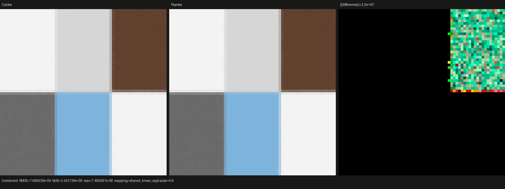

# Cycles 5.2 Ambient Occlusion SVM

## Outcome

Psycles now executes Blender's Ambient Occlusion shader node as a typed,
scene-dependent operation in the Luisa surface SVM. The material graph remains
the original graph: neither Blender nor Cycles pre-evaluates or bakes the AO
result. The implementation covers the node's `AO` and `Color` outputs,
authored or linked Distance and Normal inputs, uint8 Samples behavior,
`Inside`, `Only Local`, and Cycles' implicit Global Radius mode.

The focused 64x64, 64-spp oracle is effectively bit-aligned with Blender 5.2
Cycles CPU on all three Luisa routes tested. fallback, HIP, and strict native
XIR-to-SPIR-V Vulkan produced the same metrics:

| Pass | Mean ratio | Relative RMSE | MAE | Maximum error |
|---|---:|---:|---:|---:|
| Combined | 1.000000 | 1.10601e-8 | 2.42214e-9 | 7.45058e-8 |
| Emit | 1.000000 | 1.10601e-8 | 2.42214e-9 | 7.45058e-8 |
| Normal | 1.000000 luminance | 3.34629e-8 | 6.26217e-9 | 5.96046e-8 |

This is a functionality result, not a full-scene performance claim. After the
final scene-component and context-lifetime refactors, the tiny probe rendered
in 30.34 ms on fallback, 18.46 ms on HIP, and 42.42 ms on Vulkan; launch,
synchronization, and scene size dominate those values. Cold shader JIT took
0.43 s, 3.37 s, and 1.48 s respectively. These numbers identify the exact run,
not as evidence of renderer throughput.

## Reference identity

- Cycles source: Blender `blender-v5.2-release` at
  `9e2066aef7ef7e20c142ad7bd3303138a4304c93`.
- Cycles renderer: Blender 5.2.0 LTS, build hash `fbe6228777e7`.
- LuisaCompute: `9ae333d05ed028c20b369555c350fbfd6ac8ba43`.
- GPU: AMD Radeon RX 9070 XT, `gfx1201`, ROCm 7.2.53211; Vulkan used RADV
  GFX1201 and native XIR-to-SPIR-V code generation.
- Cycles adaptive sampling and denoising were disabled. Cycles CPU is the only
  semantic oracle; no independent CPU renderer or baked material data was
  introduced.

## Formal model

For a surface point `p`, immutable node flags `f`, path RNG state `r`, and
scene `S`, define

```text
d = f.global_radius ? S.world_ao_distance : node.distance
N = normalize_zero_only(f.normal_linked ? node.normal : p.shading_normal)
N' = f.inside ? -N : N
```

If `d <= 0`, `samples < 1`, or `p.object` is absent, the result is exactly
one. Otherwise branch `i` uses the same Cycles address function as
`path_branched_rng_2D`:

```text
sample_i    = r.sample * samples + i
dimension_i = r.rng_offset + PRNG_SURFACE_AO
u_i         = path_rng_2D(r.pixel_hash, sample_i, dimension_i)
D_i         = to_global(cosine_hemisphere(u_i), make_orthonormals(N'), N')
ray_i       = (P=p.P, D=D_i, tmin=0, tmax=d, self=(p.object,p.primitive))
AO          = count_i(not intersect(domain(f), ray_i)) / samples
```

The two traversal domains are deliberately different:

```text
domain(global)     = ordinary shadow-visible triangle and curve TLAS
domain(only_local) = every triangle of the current object, ignoring ordinary
                     instance visibility and excluding curves
```

Exact self identity is rejected in both domains. The implementation uses an
any-hit query and terminates on the first accepted candidate; it does not
restart a closest-hit query per candidate.

### Local-instance identity

The secondary Only Local TLAS stores a primary-scene instance index in each
local instance's user id. Its candidate `hit.inst` is a local ordinal, so the
correct mapping is

```text
primary_instance = local_accel.instance_user_id(hit.inst)
```

and only then may the renderer read the primary instance's Cycles object and
primitive offsets. Treating the local ordinal as a primary index is invalid
whenever the local TLAS is a strict projection or has a different ordering.
The traversal regression includes coincident instances with distinct user ids
and proves both exact self rejection and cross-object acceptance.

## No-AO non-interference

Let `E(D)` mean that value-program domain `D` contains a reachable external
query. Kernel construction uses a host/JIT sum type:

```text
E(D) = false -> original SurfaceValueProgramCallable ABI
E(D) = true  -> AO-aware callable with Sobol/path identity suffix
```

There is no device-side variant and no dormant AO parameter on an ordinary
scene. The World AO distance is a one-element optional scene buffer allocated
only when AO is reachable; it is not a kernel parameter or shader cache
specialization constant. Standalone emission/preparation/BSSRDF domains retain
the ordinary feature-masked route and therefore return one for AO, matching
Cycles' `node_feature_mask` behavior.

An external query is a value-region boundary. Forwarding and region formation
may not cross it, so a region callable can never silently acquire traversal
state through a bank convention. The permanent metadata test constructs
`Absolute -> AO -> Absolute` and requires three singleton regions and zero
cross-edge forwarding masks.

## Scene probe

`ambient_occlusion_matrix` is generated by the shared Blender probe tooling.
Its six cells cover explicit radius, Only Local plus the AO Color output,
Global Radius, Inside, linked side normal, and a colored explicit-radius
output. A camera-invisible but shadow-visible plane at `z=0.2` is a distinct
object. Explicit distance is `0.5`; World AO distance is `0.1`, so Global
Radius cannot reach the blocker. Each AO node uses 16 internal samples.

The rendered cells have distinct means; for example, the global explicit
cell is about 0.164, the Only Local colored cell is approximately
`(0.231, 0.505, 0.780)`, and Global Radius/Inside cells are near one. Thus the
comparison cannot pass by replacing AO with a constant or by ignoring the
flag-dependent traversal domain.

I inspected the Combined triptych at its original generated resolution.
Cycles and Psycles have the same six cell boundaries, occlusion levels, linked
normal response, and colored AO outputs. Only the amplified difference panel
shows sparse float/EXR quantization noise; it is scaled by about `2.2e7`.



## Commands and regressions

```sh
cmake --build build --target \
  psycles_luisa_sobol_fallback_tests \
  psycles_luisa_scene_traversal_tests \
  psycles_luisa_surface_population_tests \
  psycles_luisa_compact_surface_preparation_tests \
  psycles_luisa_random_walk_tests \
  psycles_blender_import_tests \
  psycles_blender_ambient_occlusion_import_tests \
  psycles_surface_program_metadata_tests \
  -j"$(nproc)"

ctest --test-dir build --output-on-failure \
  -R 'psycles\.(luisa_sobol_fallback|luisa_scene_traversal_(fallback|hip|vk)|luisa_surface_population_(fallback|hip|vk)|luisa_compact_surface_preparation_(fallback|hip|vk)|luisa_random_walk_(fallback|hip|vk)|blender_import|blender_ambient_occlusion_import|surface_program_metadata|source_size)$'

python3 tools/run_cycles_shader_probes.py ambient_occlusion_matrix \
  --blender /home/mike/Projects/blender-install-5.2/blender \
  --psycles-render build/bin/psycles_render_blender_scene \
  --output-dir /tmp/psycles-ao-final-fallback \
  --backend fallback --cycles-device CPU --width 64 --height 64 --samples 64

python3 tools/run_cycles_shader_probes.py ambient_occlusion_matrix \
  --blender /home/mike/Projects/blender-install-5.2/blender \
  --psycles-render build/bin/psycles_render_blender_scene \
  --output-dir /tmp/psycles-ao-final-hip \
  --backend hip --cycles-device CPU --width 64 --height 64 --samples 64

LUISA_VULKAN_USE_XIR=1 \
LUISA_VULKAN_REQUIRE_NATIVE_XIR_SPIRV=1 \
LUISA_VULKAN_DISABLE_DXC=1 \
python3 tools/run_cycles_shader_probes.py ambient_occlusion_matrix \
  --blender /home/mike/Projects/blender-install-5.2/blender \
  --psycles-render build/bin/psycles_render_blender_scene \
  --output-dir /tmp/psycles-ao-final-vk \
  --backend vk --cycles-device CPU --width 64 --height 64 --samples 64
```

The focused permanent coverage includes:

- exact fallback bit fixtures for AO branched Sobol samples;
- fallback/HIP/Vulkan any-hit, curve, visibility, Only Local, and exact-self
  traversal cases;
- typed graph-provider inputs plus the no-provider feature-mask result;
- Blender node sharing, both outputs, uint8 Samples, flags, and World distance;
- external-query storage/region barriers;
- the original no-AO callable ABI canary; and
- a Cycles CPU versus fallback/HIP/native-XIR-Vulkan EXR gate for Combined and
  Emit (`mean ratio 0.99999..1.00001`, relative RMSE at most `1e-6`).

The strict Vulkan run emitted the native SPIR-V optimization/code-generation
messages (`108583 -> 93217` words) and succeeded with
`LUISA_VULKAN_DISABLE_DXC=1`. A second cached canary rejected any log containing
`DXC` or `HLSL`; none was present. Thus the Vulkan result is not evidence from
the legacy DXC route.

## Repository-wide validation

The final all-thread build completed, followed by all 316 registered tests in
12.49 s. The result was 310 passed and six failed:

- `psycles.luisa_stacked_volume_fallback`;
- `psycles.luisa_homogeneous_volume_fallback`;
- `psycles.luisa_area_light_forward_vk`;
- `psycles.luisa_volume_path_fallback`;
- `psycles.luisa_volume_path_vk`; and
- `psycles.luisa_volume_triangle_fallback`.

These are not attributed to AO. The exact six tests were rebuilt and executed
in a separate detached worktree at clean `origin/main@1eeeb2c`, with the same
LuisaCompute commit. The 40 emitted `Cycles ... failed` records from clean main
and this branch compared byte-for-byte equal; both normalized files have
SHA-256
`efbbfbcea365bb14ce5aa0cf0a1f3aecd6bd6eedf81e0aeb7f45cb1d5cc5d099`.
They are existing environment/oracle numeric drift in volume and area-light
fixtures, not a reason to widen tolerances in this change.

The full run also exposed two stale structural tests which were fixed instead
of hidden:

- the coroutine random-walk regression now requires each continuation to load
  exactly its ten live payload fields and proves that scheduler-reserved frame
  fields are not spuriously transferred; and
- AO scene ownership was extracted into a stateful component, bringing
  `path_tracer_scene.cpp` to 1995 lines while retaining the project-wide
  source-size gate.

## Known complex-scene risk

A no-AO Barbershop cold-JIT canary was intentionally attempted to prove that
the ordinary callable ABI remained usable on a complex graph. Host AST/JIT
construction remained at roughly one CPU core and reached about 12.7 GiB RSS
without producing a shader after more than 20 minutes, so it was interrupted.
This is unresolved evidence of surface-program/code-generation bloat. It is
not an AO semantic failure, but it prevents any honest full-scene performance
claim for this milestone and remains a primary target of the Surface SVM
replacement.

No LuisaCompute backend defect was exposed by this work: every backend passed
the same semantic canaries. Consequently there is no unrelated Luisa commit;
future proven backend defects will be fixed and pushed directly to Luisa's
`next` branch as required.
