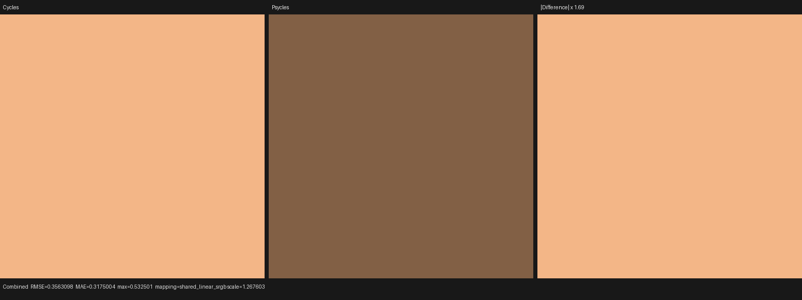
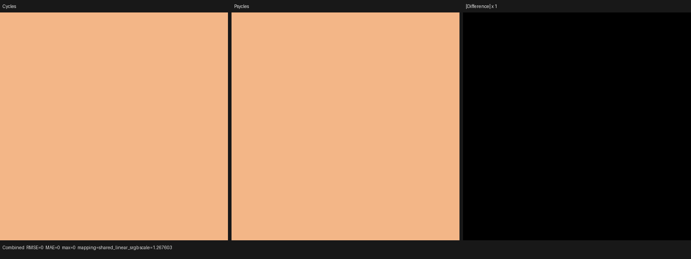
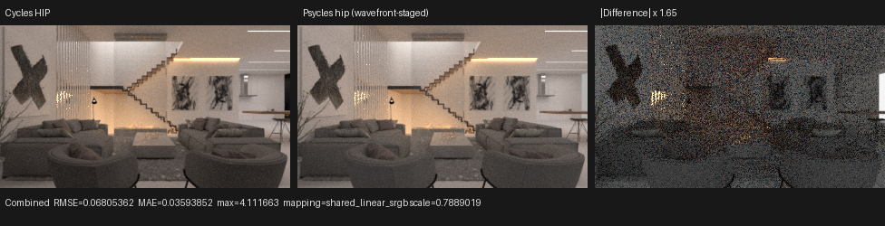

# Cycles path visibility versus traversal visibility

This checkpoint fixes one renderer-wide state projection error found while
isolating Blender 4.1 Splash's `Window Glass` material. The reference is
Blender/Cycles 5.2.1 commit
`9e2066aef7ef7e20c142ad7bd3303138a4304c93`, rendered on the same RX 9070 XT
through HIP. The test scene exports and executes the original closure graph;
it contains no baked Cycles result.

## Formal contract

Let `P` be the canonical Cycles `PathRayVisibility` bit set, and let `S(P)` be
the representation-only mapping to Psycles' `RayVisibility` bit positions.
Cycles defines two different projections:

```text
shader(P)    = S(P)
traversal(P) = S(P - {DIFFUSE, GLOSSY})  when TRANSMIT is in P
               S(P)                      otherwise
```

`path_state_ray_visibility()` applies the second projection only for object
and BVH visibility. Surface, background, and ordinary volume shader
evaluation receive the first projection. This follows directly from
`integrator/path_state.h`, `integrator/shade_surface.h`,
`integrator/shade_background.h`, and `integrator/shade_volume.h` in the pinned
Cycles tree.

The old Psycles data flow used `traversal(P)` for both purposes. A singular
refraction therefore retained `TRANSMIT` for intersection but incorrectly
lost `GLOSSY` before the next material's Light Path node. The fix introduces
two named pure projections and audits every consumer:

- closest-hit, analytic-endpoint, world/object visibility: traversal
  projection;
- surface, background, and non-shadow volume shader state: shader projection;
- transparent-shadow shader state: the existing explicit `SHADOW` projection.

No scene/material/backend special case is involved.

## Permanent regression

`transmission_light_path_visibility` puts a full-frame singular Refraction
closure in front of an emissive plane. The emission strength is
`0.25 + 0.75 * Is Glossy Ray`. At normal incidence the only relevant state
transition is a singular transmission, so Cycles must expose both TRANSMIT and
GLOSSY to the second shader while exposing only TRANSMIT to traversal.

Before the fix, both Combined and Transmission Direct were exactly 0.25 of
Cycles, with relative RMSE 0.75. After the fix both passes match every pixel:

| pass | before ratio | before relative RMSE | after ratio | after relative RMSE |
|---|---:|---:|---:|---:|
| Combined | 0.25 | 0.75 | 1.0 | 0.0 |
| Transmission Direct | 0.25 | 0.75 | 1.0 | 0.0 |

Complete reports: [before](before-report.json) and [after](after-report.json).





The GPU path-state unit oracle also records the distinction explicitly:
`TRANSMIT | DIFFUSE | GLOSSY` maps to transmission-only for traversal and to
all three classifications for shader evaluation.

## Splash diagnostic result

This is a real renderer bug, but it is not the remaining Splash root cause.
Re-rendering the unchanged area-light-only Splash scene at 320x180/1024 spp
after this fix reproduces the previous metrics: Combined luminance ratio
1.125181, Diffuse Direct 1.185525, Diffuse Indirect 1.109496, and Glossy
Direct 1.151930. The result prevents a valid independent fix from being
mistaken for completion of the `Window Glass` investigation.



The complete diagnostic is
[splash-diagnostic-report.json](splash-diagnostic-report.json).

## Validation

```sh
cmake --build build --parallel "$(nproc)"
ctest --test-dir build -R '_hip$' -j1 --output-on-failure
ctest --test-dir build \
  -R '^psycles\.(source_size|shader_probe_runner_contract)$' \
  --output-on-failure

python tools/run_cycles_shader_probes.py \
  transmission_light_path_visibility \
  --blender /home/mike/Projects/blender-install-5.2-hiprt/blender \
  --psycles-render build/bin/psycles_render_blender_scene \
  --output-dir OUTPUT --backend hip \
  --cycles-device HIP --cycles-device-name 'Radeon RX 9070 XT' \
  --width 64 --height 64 --samples 256
```

- full all-thread build: passed;
- serial HIP CTest suite: 85/85 passed in 94.22 s;
- source-size and probe-runner contracts: 2/2 passed;
- focused Cycles/Psycles HIP probe: passed with exact Combined and
  Transmission Direct images;
- visual inspection: the pre-fix frame has the predicted uniform 0.25
  attenuation; the post-fix Cycles/Psycles panels are identical and the
  amplified difference panel is black.

Only HIP was exercised. Vulkan and fallback remain deferred until the HIP
scene gates are complete.
