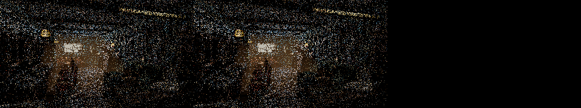
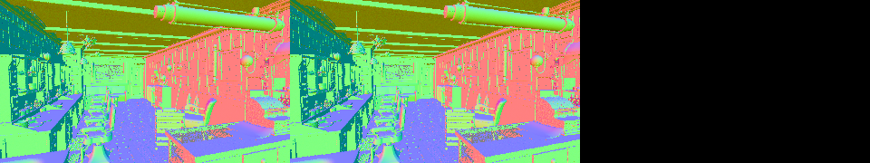
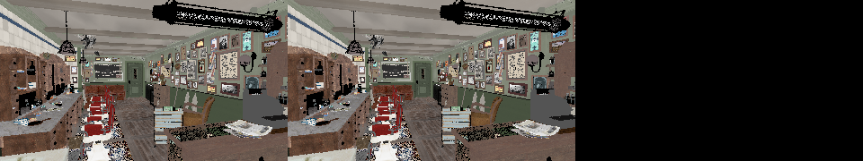

# Cycles-aligned surface value family bytecode

This checkpoint replaces the material-provenance callable identity with a
Cycles-style SVM family ABI. It is the dispatch foundation for the direct
typed-stack evaluator; it is **not** the completed evaluator replacement.
The current family bodies still call the old `ValueNode`/
`SurfaceValueExpression` implementation, so performance is reported without a
speedup claim.

## Formal model

For each value record let

```text
O = exact frontend ValueOperation
B = typed result bank in {scalar, float3, uint64}
I = 14-bit operation immediate
F = pi(O, I), the Cycles-aligned execution family
S = (O, B), the family-local typed subtype
```

The serialized 32-bit control word is

```text
[ I:14 | B:2 | O:8 | F:8 ].
```

`pi` is total over every `ValueOperation`; a compile-time exhaustive check
rejects an unmapped operation. All but two families depend only on `O`.
Image BOX projection and non-uniform Mix Vector have different typed execution
shapes, so they are explicit family refinements derived from `I`.

Primary device dispatch uses only `F`. A family callable dispatches `S` when
it contains multiple semantic/result shapes. The compiler interner separately
retains exact host provenance and proves the functional dependency

```text
(F, S) -> exact typed evaluator shape.
```

A collision is a bytecode-design error and is rejected during scene
compilation; it is not repaired with a material ID switch. The record verifier
also checks `F == pi(O, I)` and validates `O` and `B` before publication.

The first real Barbershop attempt found why `B` must participate in `S`:
Cycles' RGB Ramp family contains both Color and Alpha results. Dispatching only
on `O` merged their float3 and scalar evaluator shapes. The corrected product
`(O, B)` accepts both outputs in one family callable while retaining an
injective typed selector.

## Production census

The unchanged official Blender 5.2 Barbershop export reports:

```text
380 programs
10177 total SVM records
8808 value records
34 device SVM families
67 exact semantic/provenance variants
33 maximum semantic stack lanes
```

Thus host provenance no longer multiplies the primary callable set: 67
variants project to 34 actually reached execution families. The largest newly
emitted HIP cache entry containing `shade_surface` fell from 390,784 to
312,991 bytes, a 77,793-byte (19.91%) reduction.

## Correctness validation

The all-thread build succeeded. The six compiler gates and six compact
cross-backend gates passed:

```text
psycles.surface_program_metadata
psycles.surface_svm_math_immediate
psycles.surface_svm_vector_math_immediate
psycles.surface_svm_record_immediates
psycles.surface_svm_schedule
psycles.surface_svm_scene

psycles.luisa_compact_surface_preparation_fallback
psycles.luisa_compact_surface_preparation_hip
psycles.luisa_compact_surface_preparation_vk
psycles.luisa_compact_surface_tail_fallback
psycles.luisa_compact_surface_tail_hip
psycles.luisa_compact_surface_tail_vk
```

The Vulkan tests use the configured native XIR-to-SPIR-V route. Focused
regressions prove:

- distinct Math operations share one family but retain distinct semantic
  subtypes;
- RGB Ramp Color and Alpha share one family but retain distinct result-bank
  subtypes;
- Image BOX and non-BOX projections remain different execution families;
- uniform and non-uniform Mix Vector remain different execution families;
- a mismatched serialized family/operation/immediate tuple is rejected.

Full CTest passed 312/318 in 38.77 s. The only failures are the same six small
volume/area-light numerical fixture drifts reproduced before this change:

```text
psycles.luisa_stacked_volume_fallback
psycles.luisa_homogeneous_volume_fallback
psycles.luisa_area_light_forward_vk
psycles.luisa_volume_path_fallback
psycles.luisa_volume_path_vk
psycles.luisa_volume_triangle_fallback
```

This HIP smoke command completed on the unchanged official scene:

```sh
env PSYCLES_COMPACT_SURFACE_VALUES=1 \
    PSYCLES_POPULATE_SURFACE_ONCE=1 \
build/bin/psycles_render_blender_scene \
  /var/tmp/psycles-official-redownload-20260814/exports/barbershop-5.2 \
  out.exr hip 320 180 1 1 - 0 0 0 0 1 - 1 0 \
  wavefront-staged 32 32768 32 1 1 0 4 2 auto 0 0 0 1 1048576
```

All 15 emitted PFM passes are byte-for-byte equal to the retained pre-family
HIP baseline: Combined, Normal, Albedo, Emission, Environment, all Diffuse,
Glossy and Transmission passes, and both Volume passes. The inspected
Combined triptych below shows the retained baseline, family ABI result, and
absolute-error heatmap; the heatmap is black because the linear images are
exact.







At one sample the image is deliberately noisy, but visual inspection found
the same camera, salon silhouette, ceiling lights, furniture and material
regions, with no structural corruption. Exact pass equality is the stronger
check for this ABI-only change.

## HIP performance checkpoint

Two warm `rocprofv3 --kernel-trace --scratch-memory-trace --stats` runs used
640x480, 64 fixed samples, block size 64, and the staged wavefront scheduler.
The shader map identified structural hash `e2b9206153388ca1` as
`wavefront_resume_5/shade_surface`.

| measurement | retained pre-family baseline | family ABI, mean of 2 | change |
|---|---:|---:|---:|
| `shade_surface` ns/item | 25.7397 | 26.0082 | +1.04% |
| `shade_surface` total | 1381.346 ms | 1395.754 ms | +1.04% |
| static scratch/thread | 3364 B | 3380 B | +16 B |
| VGPR / SGPR | 256 / 128 | 256 / 128 | unchanged |
| render-only | retained run 2.478 s | 2.466 s mean | noise |

The two new per-item measurements were 26.0107 and 26.0056 ns/item, so the
small regression is repeatable. Callable quotienting reduces code size but
does not remove the old evaluator machinery; its extra family-local switch
currently costs about 1%. The next implementation stage must evaluate the hot
families directly against the typed stack and remove `TracedValues`,
`SurfaceValueExpression`, and host `ValueNode` capture from the production
interpreter. No end-to-end speedup is claimed at this checkpoint.

The profile command shape was:

```sh
env PSYCLES_COMPACT_SURFACE_VALUES=1 \
    PSYCLES_POPULATE_SURFACE_ONCE=1 \
    LUISA_CORO_SHADER_MAP=1 \
rocprofv3 --kernel-trace --scratch-memory-trace --stats -f rocpd -- \
  build/bin/psycles_render_blender_scene \
  /var/tmp/psycles-official-redownload-20260814/exports/barbershop-5.2 \
  out.exr hip 640 480 64 64 - 320 240 0 0 64 - 1 0 \
  wavefront-staged 64 32768 32 1 1 0 4 2 auto 0 0 0 1 1048576
```
