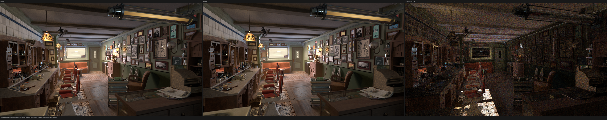
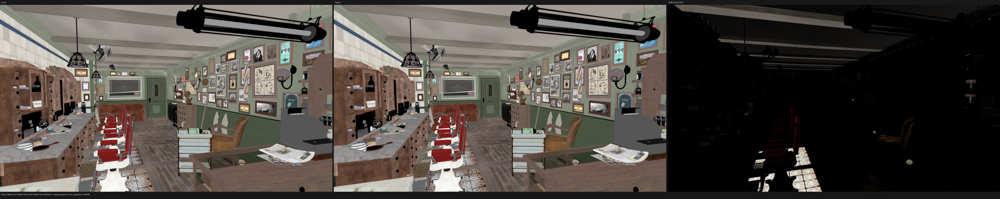
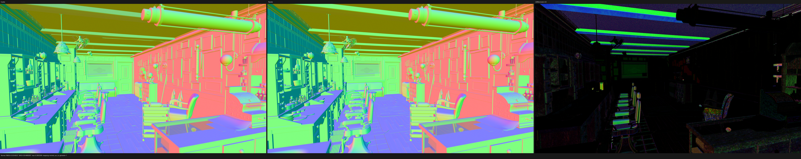
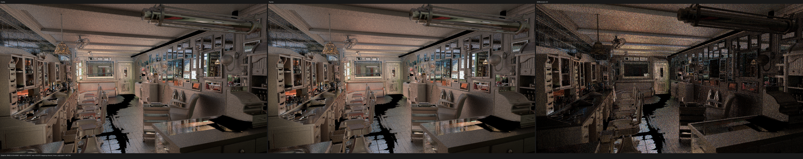

# Direct surface color/algebra SVM validation

This checkpoint validates implementation commit `9b8cbd8` on the RX 9070 XT
after moving the remaining finite color/algebra families in this boundary from
retained `GraphSurface` evaluation to direct typed-stack SVM evaluation. The
implementation and permanent regressions were pushed directly to
`origin/main`. Validation remains HIP-first; fallback and Vulkan were not
launched during this checkpoint.

## Result

- The all-thread build and complete HIP gate pass. The final clean-tree HIP
  CTest run is 85/85 in 19.96 s.
- Fourteen execution families now directly own 15 operations: HSV, Invert,
  Gamma, Brightness/Contrast, Blackbody, Wavelength, RGB Curve, Separate
  Color, Combine Color, scalar/vector Map Range, Mix Float, and the scalar- and
  vector-factor forms of Mix Vector.
- The exact Barbershop execution census moves another 98,114,306 value-record
  executions to direct typed SVM. Cumulative direct coverage is
  4,746,323,157 / 4,818,350,450, or 98.5051%.
- A cold 320x180/1 spp HIP canary produces the 46-channel EXR and all 15 finite
  linear PFM passes. The first JIT takes 12.205 s. The shade-surface code object
  is 311,672 B, 128 B smaller than the preceding checkpoint.
- Two complete 1920x1080/1024 fixed-spp runs take 235.852 s and 235.965 s;
  their 235.909 s mean is 1.6341x, or 63.41%, slower than the matched Cycles
  5.2.1 HIP reference at 144.368 s.
- A matched same-source, same-machine A/B temporarily disabled only these new
  direct-family capability predicates. Direct shade-surface is +0.0372% in raw
  ns/item and -0.3545% after normalization by the unchanged closest kernel.
  The direct boundary is therefore performance-neutral. The 1.52% difference
  from the older single full-resolution Psycles result is machine/reboot-state
  drift and is not attributed to this implementation.
- Against Cycles, Combined RMSE is `0.0109836524`, relative RMSE is
  `0.0570545222`, and luminance ratio is `1.00326203`. All 15 passes contain
  zero invalid pixels. Native-resolution visual inspection finds no new
  transform, handedness, UV, geometry, or material-class shift.
- The coroutine frame remains 848 B with 176 fields. Shade-surface remains at
  3,412 B static private storage per thread, 256 VGPR, 128 SGPR, and a 64-thread
  block. This refactor does not claim to have solved the remaining resource or
  Cycles performance gap.

## Formal execution model

Let `P` be the already topologically ordered surface bytecode program, `B_s`
and `B_v` its scalar and vector stack banks, and `D_f` the exact finite
immediate image admitted for execution family `f`. Each direct instruction is
implemented as the typed state transition

```text
T_f : (B_s, B_v, operands_f, immediate in D_f, runtime metadata)
      -> (B_s', B_v')
```

with these invariants:

1. the operation, result bank, operand arity, operand banks, and complete
   immediate image are validated while constructing the shader AST;
2. every operand is read once, in compiler bytecode ABI order, from its typed
   stack bank;
3. exactly one result bank is written at the instruction position in `P`;
4. host specialization uses only the finite semantic shape of `D_f`, never a
   material value, buffer handle, path value, image extent, spp count, or table
   address; and
5. malformed compiler/runtime products abort during AST construction rather
   than entering an invented fallback interpretation.

This is a projection of the existing compact SVM state machine, not graph
re-expansion. No `ValueNode`, `SurfaceValueExpression`, `TracedValues`, weak
`float4` value wrapper, or per-material callable is constructed by the direct
path.

The finite products are represented explicitly:

```text
RGB Curve       = {control, sampled}
Color mode      = {RGB, HSV, HSL}
Map Range       = interpolation mode x clamp bit
Mix Float       = {unclamped factor, clamped factor}
Mix Vector      = {scalar factor, vector factor} x clamp bit
```

RGB Curve table offsets remain runtime metadata. Separate/Combine emit only
the color modes present in the exact scene domain. Mix Vector is split into two
strongly typed evaluator families because a scalar factor and a vector factor
have different operand-bank products; this is not a runtime weak-type test.

## Cycles 5.2.1 semantic audit

The only semantic oracle is Blender/Cycles commit
`9e2066aef7ef7e20c142ad7bd3303138a4304c93` on
`blender-v5.2-release`. The audit covered the SVM dispatcher and the exact
implementations in `intern/cycles/kernel/svm/{hsv,invert,gamma,brightness,
blackbody,wavelength,ramp,sepcomb_color,map_range,mix}.h`.

The shared Luisa semantic primitives preserve the non-obvious Cycles rules:

- HSV leaves Fac unclamped, wraps Hue, clamps Saturation, and lower-clamps only
  the final RGB result.
- Gamma returns one for a zero exponent, applies `pow` only to positive color
  components, and otherwise passes the component through. A safe positive
  predicated operand prevents invalid speculative `pow` evaluation without
  changing the selected result.
- Brightness/Contrast uses Cycles' affine form and lower clamp.
- Blackbody performs the same Rec.709-to-render-space transform; Wavelength
  performs the same XYZ conversion and `1 / 2.52` normalization.
- RGB Curve retains the control-point and sampled-table paths, extrapolation
  data, range operands, and runtime table identity.
- Separate/Combine preserve the RGB, HSV, and HSL domains exactly.
- Map Range and Mix preserve Cycles' interpolation, factor-clamp, and typed
  scalar/vector semantics.

`GraphSurface` now calls the same shared primitives. It remains a differential
test oracle during the replacement, but it no longer owns duplicate formulas.

## Permanent regressions

`compact_surface_color_family_test_support.cpp` is a separate translation
unit, keeping the main compact-surface test at exactly 2,000 lines. Four
dynamic graph configurations jointly cover every finite mode and typed shape,
including:

- negative and greater-than-one HSV factors;
- zero, positive, negative, and fractional Gamma exponents;
- both RGB Curve representations and changing runtime table contents;
- RGB, HSV, and HSL Separate/Combine;
- all scalar/vector Map Range modes and clamp states;
- Mix Float factor clamp; and
- scalar-factor and non-uniform vector-factor Mix Vector, both with and without
  factor clamp.

The regressions prove that every operation routes through a direct family,
that the exact typed/immediate product is retained, and that direct and
expanded evaluation agree through preparation, emission, closure evaluation,
and closure sampling. Zero-count production operations remain covered by these
fixtures rather than being removed from the contract.

| gate | outcome |
|---|---:|
| all-thread build, `cmake --build build --parallel $(nproc)` | pass |
| complete HIP CTest suite after final restoration | 85/85 in 19.96 s |
| focused compact preparation/tail HIP tests | pass |
| 320x180/1 spp, 46-channel EXR and 15 PFM passes | pass |
| 1920x1080/1024 spp, repeated twice | pass |
| all 15 full-resolution passes finite | pass |
| exact Blender/Cycles source and export identity | pass |
| native-resolution visual inspection | pass |
| `git diff --check` | pass |
| changed source/test file size | every file at or below 2,000 lines |

## Dynamic coverage

The exact 640x480/64 spp Barbershop census contains 4,818,350,450 value-record
executions. Newly direct production executions are:

| operation | executions |
|---|---:|
| Hue/Saturation | 49,869,093 |
| Invert | 2,744,364 |
| Brightness/Contrast | 754,876 |
| RGB Curve | 44,614,533 |
| Separate B | 131,440 |
| **new total** | **98,114,306** |

Gamma, Blackbody, Wavelength, Separate R/G, Combine Color, scalar/vector Map
Range, Mix Float, and scalar-/vector-factor Mix Vector have zero executions in
this Barbershop capture but are exercised by permanent dynamic fixtures.
Direct coverage rises from 4,648,208,851 / 4,818,350,450 (96.4689%) to
4,746,323,157 / 4,818,350,450 (98.5051%). The remaining retained boundary is
72,027,293 executions, or 1.4949%.

## HIP profile and matched A/B

The production profile uses the same Blender 5.2.1 export, 640x480, 64 fixed
samples, and staged-wavefront configuration. Work is the sum of launched
`grid_x * grid_y * grid_z` items over all matching dispatches.

| direct run | shade total | shade ns/item | closest ns/item | shade/closest |
|---|---:|---:|---:|---:|
| 1 | 1435.686 ms | 26.751837 | 4.734787 | 5.6501 |
| 2 | 1434.162 ms | 26.723474 | 4.725968 | 5.6546 |
| 3 | 1434.794 ms | 26.735241 | 4.722954 | 5.6607 |
| mean | - | 26.736851 | 4.727903 | 5.6551 |

For causal attribution, a temporary local build changed only the capability
predicate for the 14 new families to false. It retained commit `9b8cbd8`, the
same shared Cycles formulas, compiler, driver, scene, scheduler, launch shape,
and shader settings. The diagnostic change was never committed and was removed
before the final build and 85-test HIP gate.

| direct families disabled | shade total | shade ns/item | closest ns/item | shade/closest |
|---|---:|---:|---:|---:|
| 1 | 1434.145 ms | 26.723165 | 4.701523 | 5.6839 |
| 2 | 1434.549 ms | 26.730654 | 4.717260 | 5.6666 |
| mean | - | 26.726910 | 4.709392 | 5.6752 |

The direct mean is +0.0372% in raw shade ns/item. Normalized by closest in the
same captures, it is -0.3545%. Both indicate a neutral boundary at this noise
level. Consequently the older 232.382 s single-run checkpoint cannot be used
as a causal A/B for the post-reboot 235.909 s mean.

## Full-resolution HIP comparison

Both renderers use the RX 9070 XT, 1920x1080, 1024 fixed samples,
TABULATED_SOBOL, scrambling distance 1.0, adaptive sampling disabled, and
denoising disabled. The scene is the raw node/closure export from the exact
Blender 5.2.1 build above; there is no Cycles material baking.

| renderer/run | render-only | relative to Cycles |
|---|---:|---:|
| Cycles 5.2.1 HIP | 144.368 s | 1.0000x |
| Psycles HIP run 1 | 235.852 s | 1.6337x |
| Psycles HIP run 2 | 235.965 s | 1.6345x |
| Psycles HIP mean | 235.909 s | 1.6341x |

The first complete run reports 2.128 s of JIT orchestration and the repeat
reports 2.172 s; both are excluded from render-only time. During the stable
render region the correct `gfx1201` device stays at 100% GPU use, approximately
212-224 W, and 69% VRAM. Utilization drops only during final film writeback and
resource destruction.

Against the preceding Psycles checkpoint, five passes are byte-exact:
Emission, Environment, Transmission Color, Volume Direct, and Volume
Indirect. Other deltas are sparse floating-atomic ordering changes. Combined
has RMSE `2.64894e-6`, maximum absolute error `0.00370212`, and only 998 of
6,220,800 scalar values differ. This is not a structural image change.

Against Cycles, Combined has RMSE `0.0109836524`, relative RMSE
`0.0570545222`, luminance ratio `1.00326203`, and zero invalid pixels. The
complete per-pass evidence is [all-pass-report.json](all-pass-report.json).

## Visual inspection

I opened Combined, Diffuse Color, Normal, and Glossy Indirect at the original
5776x1150 triptych resolution. The checked-in files are 50% documentation
previews; metrics use the original linear 1920x1080 passes.

- Combined aligns the cabinet, floor gaps, brick/wall surfaces, ceiling beams,
  doorway/window, silhouettes, and texture placement. No new UV, transform,
  handedness, geometry, or material-class error is visible.
- Diffuse Color retains the previously known AOV/closure-classification
  residual. Its support does not expand after this refactor.
- Normal retains the previously known local bump-normal residual and shows no
  new coordinate or high-frequency pattern shift.
- Glossy Indirect remains dominated by finite-sample stochastic highlights and
  fireflies rather than a systematic reflection or material mismatch.









## Commands

```sh
cmake --build build --parallel "$(nproc)"
ctest --test-dir build --output-on-failure -R '(_hip|hip_)$' -j1

build/bin/psycles_render_blender_scene EXPORT psycles.exr hip \
  1920 1080 1024 64 - 960 540 0 0 1024 - 1 0 \
  wavefront-staged 64 32768 32 1 1 0 4 2 auto 0 0 0 1 1048576

rocprofv3 --kernel-trace --stats -f rocpd -o trace_results -d PROFILE -- \
  build/bin/psycles_render_blender_scene EXPORT out.exr hip \
  640 480 64 64 - 320 240 0 0 64 - 1 0 \
  wavefront-staged 64 32768 32 1 1 0 4 2 auto 0 0 0 1 1048576
```

The next HIP work continues the structural replacement of the remaining
1.4949% retained surface value executions and expands full-scene acceptance
before any non-HIP backend is launched.
