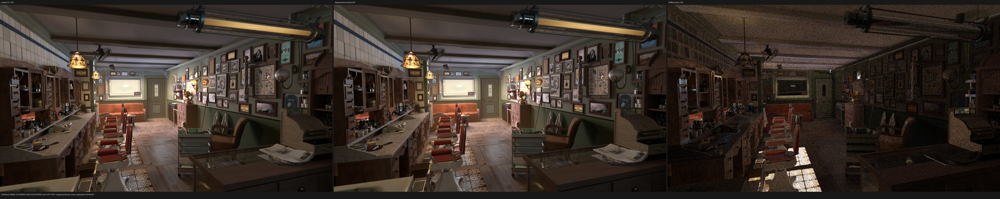
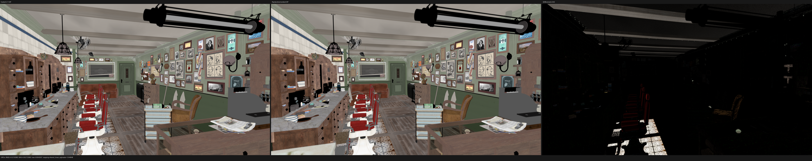
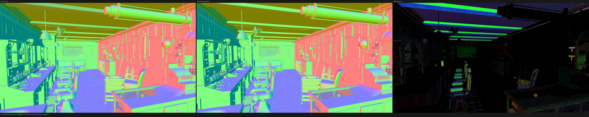
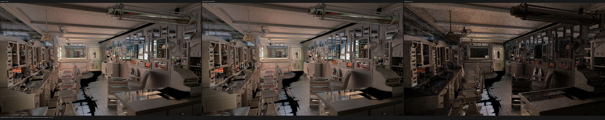

# Direct surface context SVM validation

This checkpoint validates commit `0e24299` on the RX 9070 XT after replacing
the retained GraphSurface context nodes with direct typed-stack SVM families.
The implementation and permanent regressions were pushed directly to
`origin/main`. Validation is deliberately HIP-first; fallback and Vulkan were
not launched during this checkpoint.

## Result

- The all-thread build and complete HIP gate pass; HIP CTest is 85/85 in
  20.14 s.
- The direct path now owns Tangent, Object Info, Particle Info, Hair Info,
  Light Path, Fresnel and Layer Weight. It constructs no `ValueNode`,
  `SurfaceValueExpression` or weak `float4` value wrapper.
- Direct typed-SVM dynamic coverage on the exact Barbershop census rises from
  93.0795% to 96.4689% by moving 163,311,856 executions. Only 170,141,599 of
  4,818,350,450 value-record executions remain outside direct families.
- A 320x180/1 spp HIP smoke render produces all 15 finite PFM passes. Seven are
  byte-exact against the preceding checkpoint. The only material differences
  are sparse paths affected by the intentional Geometry Tangent correction;
  the remaining small differences are float-rounding scale.
- At 1920x1080/1024 fixed spp, Psycles takes 232.382 s. The preceding Psycles
  result was 232.417 s, a -0.015% change that is run noise, not a speedup.
- The matched Blender/Cycles 5.2.1 HIP reference takes 144.368 s. Psycles is
  1.6097x, or 60.97%, slower.
- The corrected Tangent improves Combined RMSE against Cycles from
  0.01107573 to 0.01098365 (-0.83%). Combined luminance ratio is 1.003262.
  All 15 passes contain zero invalid pixels.
- The shade-surface code object is 311,800 B versus 311,032 B previously. The
  coroutine frame remains 848 B with 176 fields. Static private storage rises
  from 3,380 B to 3,412 B per thread; VGPR/SGPR ceilings remain 256/128.
- Four warm profiles measure shade-surface at 26.6477, 26.2451, 26.4468 and
  26.2346 ns/item. Their mean is 26.3936 ns/item, +1.30% versus the preceding
  two-run mean. Normalizing by the unchanged closest-intersection kernel in the
  same captures leaves +0.47%. This is a small measurable kernel-local cost,
  not an end-to-end regression claim.

## Formal execution model

Each direct context evaluator is a pure typed projection

```text
E_f : SurfacePoint x Operand_f x Immediate_f -> StackBank_f
```

executed at the instruction's position in the already topologically ordered
surface SVM. The family selector `f` and its admitted semantic variant are host
specialization data. Runtime-varying operands and immediates remain device
values; no material or path value enters shader cache identity.

For Tangent, Object Info, Particle Info, Hair Info and Light Path, the admitted
immediate image is proven to be exactly `{0}`, the operand arity is zero and
the result bank is checked against the operation. A malformed compiler/runtime
contract aborts during AST construction instead of being silently interpreted.

Fresnel and Layer Weight have the finite normal-source domain

```text
N = {0: use ShaderData shading normal,
     1: read the linked vector operand}.
```

The direct evaluator proves that the scene-owned immediate image is a
duplicate-free non-empty subset of `{0, 1}`. If only one member is reachable,
the choice is host-specialized. If both are reachable, the vector stack slot is
loaded only inside the runtime linked branch. Thus an unlinked instruction
cannot observe an undefined operand, while a linked instruction cannot fall
back to the shading normal.

Light Path reads explicit Cycles visibility/event bits. `SurfacePoint` already
owns the background, light-emission and shadow depth adjustment, so the direct
evaluator consumes the preadjusted depth exactly once. Particle Random uses the
Cycles `hash_uint2` and inclusive uint-to-float map. Fresnel and Layer Weight
share the same dielectric primitive as closure setup and preserve Cycles'
exact `blend != 0.5` identity branch.

## Geometry Tangent correction

The audit found an independent semantic bug shared by the old graph evaluator
and the first direct implementation: Geometry Tangent returned `dPdu` for all
surfaces. Blender/Cycles 5.2.1 commit `9e2066aef7ef` instead defines:

```text
curve or objectless ShaderData:
    normalize(dPdu)

object-backed mesh:
    T_obj = (-(Generated.y - 0.5), Generated.x - 0.5, 0)
    T_world = normalize(inverse-transpose(object) * T_obj)
    T = cross(N, normalize(cross(T_world, N)))
```

The shared `surface_geometry_tangent` primitive now implements this definition
for both legacy and direct paths. `is_curve` selects the curve rule and
`geometry_index != ~0u` distinguishes an object-backed mesh from objectless
ShaderData. There is no epsilon or invented singular fallback. Permanent HIP
regressions use constant mesh, curve and objectless oracles, and the compact
differential fixture uses a non-singular Generated coordinate.

## Permanent regressions

`compact_surface_context_family_test_support.cpp` is a separate translation
unit, keeping the main compact-surface test below 2,000 lines. The regressions
prove:

1. all seven context opcodes route through direct typed evaluators;
2. operation, bank, operand arity and exact immediate images are validated;
3. mixed linked/unlinked Fresnel and Layer Weight preserve lazy normal reads;
4. direct and expanded paths agree through preparation, emission, closure
   evaluation and closure sampling;
5. Light Path visibility, event and depth fields agree with the Cycles path
   state contract;
6. mesh, curve and objectless Geometry Tangent match independent constant
   oracles; and
7. existing anisotropy and metallic tests use non-singular Generated
   coordinates and continue to pass.

Validation commands and outcomes:

| gate | outcome |
|---|---:|
| all-thread build, `cmake --build build --parallel $(nproc)` | pass |
| complete HIP CTest suite | 85/85 in 20.14 s |
| focused compact/context HIP tests | pass |
| 320x180/1 spp, all 15 PFM passes finite | pass |
| 1920x1080/1024 spp, all 15 PFM passes finite | pass |
| exact Blender/Cycles build identity | pass |
| visual inspection at native triptych resolution | pass |
| `git diff --check` | pass |
| changed source/test file size | every file below 2,000 lines |

## Dynamic coverage

The exact 640x480/64 spp execution census contains 4,818,350,450 value-record
executions. The newly direct context families contribute 163,311,856:

| operation group | newly direct executions |
|---|---:|
| Tangent | 11,715 |
| Object Random | 51,481,243 |
| Hair Curve Intercept | 22,948 |
| Light Path Camera | 2,999,932 |
| Light Path Shadow | 74,572 |
| Light Path Diffuse | 32,827,363 |
| Light Path Glossy | 135,247 |
| Ray Depth | 325,913 |
| Diffuse Depth | 32,827,363 |
| Fresnel | 41,060,468 |
| Layer Weight Fresnel | 17,744 |
| Layer Weight Facing | 1,527,348 |

Zero-count admitted operations remain covered by compact fixtures rather than
being removed from the semantic contract. Total direct execution is now
4,648,208,851 / 4,818,350,450, or 96.4689%.

## HIP profile

The profile uses 640x480, 64 fixed samples, the same exported scene and the
same staged-wavefront configuration as the preceding checkpoint. Work is the
sum of launched `grid_x * grid_y * grid_z` items over all surface dispatches.

| run | shade time | ns/item | closest ns/item | shade/closest |
|---|---:|---:|---:|---:|
| 1 | 1430.096 ms | 26.6477 | 4.78918 | 5.56414 |
| 2 | 1408.493 ms | 26.2451 | 4.73992 | 5.53705 |
| 3 | 1419.315 ms | 26.4468 | 4.76204 | 5.55368 |
| 4 | 1407.930 ms | 26.2346 | 4.75411 | 5.51831 |
| mean | - | 26.3936 | 4.76131 | 5.54329 |

The preceding means are 26.0555 ns/item for shade and 4.72258 ns/item for the
unchanged closest kernel, with shade/closest 5.51722. Raw shade time is +1.30%;
the same-capture normalized ratio is +0.47%. The 32 B private-storage increase
and 768 B object increase are real compiler outputs. A later structural A/B
must separate the necessary Tangent semantic correction from direct-family
dispatch; deleting the correct Cycles tangent is not an admissible optimization.

## Full-resolution HIP comparison

Both renderers use the RX 9070 XT, 1920x1080, 1024 fixed samples,
TABULATED_SOBOL, scrambling distance 1.0, adaptive sampling disabled and
denoising disabled. The scene is the raw node/closure export from the exact
Blender 5.2.1 build `9e2066aef7ef`; there is no Cycles material baking.

| renderer | render-only | relative |
|---|---:|---:|
| Cycles 5.2.1 HIP | 144.368 s | 1.0000x |
| Psycles `0e24299`, HIP staged wavefront | 232.382 s | 1.6097x |

Psycles stayed at 100% GPU busy during the stable interval, sampled 215-225 W
and used 67% VRAM. The first full-resolution invocation generated the new
capacity-specific shader objects and reported 10.307 s of JIT orchestration;
the warm profiler invocations report 2.18-2.48 s. JIT is excluded from the
render-only comparison.

Against Cycles, Combined RMSE is `0.0109836524`, relative RMSE is
`0.0570545222`, and luminance ratio is `1.00326212`. The preceding Combined
RMSE was `0.0110757258`; the corrected Tangent reduces it by `9.207e-5`.
The complete per-pass report is [all-pass-report.json](all-pass-report.json).

## Visual inspection

I opened Combined, Diffuse Color, Normal and Glossy Indirect at the original
generated 5776x1150 triptych resolution. The checked-in images are 50%
documentation previews; metrics use the original linear 1920x1080 passes.

- Combined preserves cabinet, wall tile/trim, ceiling beam, floor plank,
  furniture and image registration. The floor gaps and object silhouettes
  remain in the same locations; there is no transform, handedness or UV shift.
- Diffuse Color retains the known AOV/closure-classification residuals on
  non-diffuse foreground objects and known missing source textures. Their
  spatial support does not expand.
- Normal preserves the major geometric and bump-normal fields. The remaining
  local residuals are unchanged at image scale.
- Glossy Indirect remains dominated by stochastic highlights/fireflies rather
  than a material-class, silhouette or texture-placement mismatch.









## Commands

```sh
cmake --build build --parallel "$(nproc)"
ctest --test-dir build --output-on-failure -R '(_hip|hip_)$' -j1

build/bin/psycles_render_blender_scene EXPORT psycles.exr hip \
  1920 1080 1024 64 - 960 540 0 0 1024 - 1 0 \
  wavefront-staged 64 32768 32 1 1 0 4 2 auto 0 0 0 1 1048576

rocprofv3 --kernel-trace --stats -f rocpd -o trace_results -d PROFILE -- \
  build/bin/psycles_render_blender_scene EXPORT out.exr hip \
  640 480 64 64 - 320 240 0 0 64 - 1 0 \
  wavefront-staged 64 32768 32 1 1 0 4 2 auto 0 0 0 1 1048576
```

The next HIP work should isolate the 32 B private increase and continue moving
the remaining 3.5311% of value execution into direct, formally validated SVM
families. Fallback and native-XIR Vulkan remain deferred until that HIP work is
stable.
