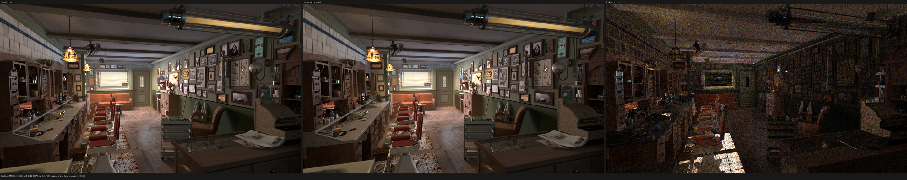
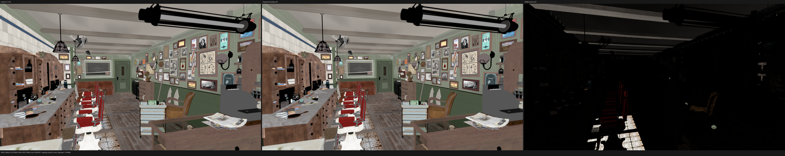
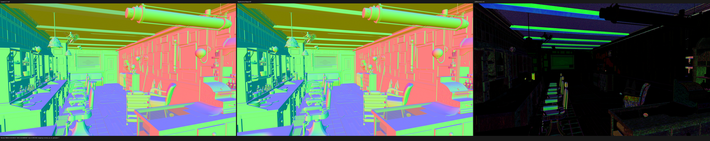
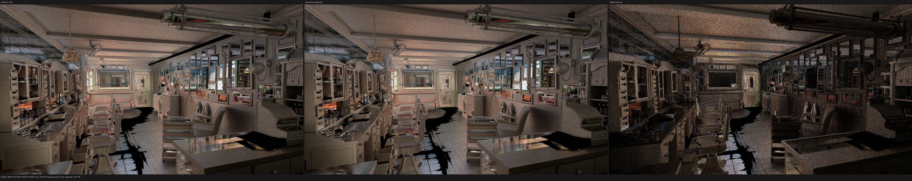

# Direct surface Noise SVM validation

This checkpoint validates commit `fb664f5` on the RX 9070 XT after replacing
the retained GraphSurface Noise node with a direct typed-stack SVM family. The
implementation and its permanent regressions were pushed directly to
`origin/main`. Per the HIP-first validation order, no fallback or Vulkan GPU
work was started at this checkpoint.

## Result

- The all-thread build and complete HIP gate pass; HIP CTest is 84/84 in
  23.21 s.
- A same-export 320x180/1 spp Barbershop render is byte-for-byte identical in
  all 15 PFM passes to the preceding direct state-family checkpoint.
- At 1920x1080/1024 fixed spp, Psycles takes 232.417 s. The preceding Psycles
  result was 232.073 s, so the +0.15% difference is run noise and is not claimed
  as a regression or speedup.
- The matched Blender/Cycles 5.2.1 HIP reference remains 144.368 s. Psycles is
  1.6099x, or 60.99%, slower.
- The shade-surface code object shrinks from 312,735 B to 311,032 B (-1,703 B,
  -0.54%). The coroutine frame remains 848 B with 176 fields.
- Direct typed-SVM dynamic coverage rises from 90.2515% to 93.0795% by moving
  136,265,549 Noise executions. This does not reduce the resource ceiling:
  shade-surface remains at 256 VGPR, 128 SGPR and 3,380 B private memory per
  thread.
- Two warm HIP profiles average 26.0555 ns/launched shade item, versus
  26.0488 ns/item before the change. The +0.026% delta is noise.

## Formal execution model

Cycles Noise has the finite immutable semantic domain

```text
D = {1, 2, 3, 4 dimensions}
  x {multifractal, FBM, hybrid, ridged, hetero terrain}
  x {raw, normalized}.
```

For dimensions `d`, noise type `t` and normalize bit `n`, the compact
instruction encoding is

```text
i(d, t, n) = n | (d << 1) | (t << 4).
```

On the valid domain this encoding is injective. The direct evaluator first
rejects every immediate containing a non-Noise bit, then decodes and validates
`1 <= d <= 4` and `0 <= t <= 4`. The exact scene-owned immediate image is
quotiented only by the AST shape `(d, t)`; `n` remains an ordinary Luisa
`Bool` loaded from the current instruction. A device switch is emitted only
for shapes actually present in the scene. If the exact domain contains one
shape, the switch is proven redundant and omitted.

The compiler `NoiseType` and Luisa `cycles_noise::Type` are independent enums.
Static assertions establish the complete order-preserving isomorphism instead
of relying on an unchecked cast. Factor and Color remain distinct typed result
variants, and each variant verifies that its result bank is scalar or vector,
respectively.

The nine operands are read exactly once in ABI order:

```text
Vector, Scale, Detail, Roughness, Lacunarity,
Distortion, W, Offset, Gain.
```

Only after the strong typed projection does the evaluator form
`P = Vector * Scale` and `W' = W * Scale`. It then calls the shared Cycles
semantic core with Cycles' argument order. That core retains the exact Detail
clamp, Roughness lower bound, coordinate selection, hash/gradient functions,
fractal recurrence, distortion seeds and optional color seeds. No
`TracedValues`, `SurfaceValueExpression`, weak `float4` node value or
polymorphic `ValueNode` is constructed in the direct path, and no callable is
manually marked inline or noinline.

The common typed-family layer now also owns control-word immediate extraction,
removing three duplicate local decoders from the numeric, texture and state
families.

## Permanent regression

`compact_surface_procedural_family_test_support.cpp` is a separate translation
unit, keeping the main compact-surface test at 1,990 lines. Seven dynamic
coordinate graphs cover all four dimensions and all five Noise types. Both
Factor and Color contain a repeated `(dimension, type)` shape with Normalize
false and true, which proves that Normalize is retained as per-record device
data rather than accidentally specialized by the host.

The runtime regression proves:

1. Factor and Color each intern to exactly one semantic evaluator class;
2. both evaluator classes have the exact sorted immediate image authored by
   the fixture;
3. every Noise instruction has all nine typed operands;
4. direct and expanded Luisa implementations agree through preparation,
   emission, closure evaluation and closure sampling;
5. the dedicated HIP Noise callable test still proves shared callable shape
   and runtime-Normalize numerical equivalence.

Validation commands and outcomes:

| gate | outcome |
|---|---:|
| all-thread build, `cmake --build build --parallel $(nproc)` | pass |
| complete HIP CTest suite | 84/84 in 23.21 s |
| focused compact/Noise HIP tests | 2/2 |
| same-export 320x180/1 spp | 15/15 PFM byte-exact |
| 1920x1080/1024 spp, all passes finite | pass |
| `git diff --check` | pass |
| changed source/test file size | every file below 2,000 lines |

## Dynamic coverage and HIP profile

The exact 640x480/64 spp execution census contains 4,818,350,450 value-record
executions. Noise Factor contributes 117,441,443 and Noise Color contributes
18,824,106, for 136,265,549 newly direct executions. Total direct coverage is
therefore 4,484,896,995 / 4,818,350,450, or 93.0795%.

Two warm-cache `rocprofv3` 1.1.0 runs used ROCm 7.2.4:

| run | shade-surface time | ns/item | private | VGPR | SGPR | block |
|---|---:|---:|---:|---:|---:|---:|
| 1 | 1398.617 ms | 26.0614 | 3380 B | 256 | 128 | 64 |
| 2 | 1397.978 ms | 26.0495 | 3380 B | 256 | 128 | 64 |
| mean | - | 26.0555 | 3380 B | 256 | 128 | 64 |

The preceding mean is 26.0488 ns/item. The profile therefore rejects a runtime
speedup claim even though the code object is smaller. The retained implementation
already entered the same shared Noise callables, so removing its weak wrapper
does not address the dominant register/private-memory pressure.

## Full-resolution HIP comparison

Both renderers use the RX 9070 XT, 1920x1080, 1024 fixed samples,
TABULATED_SOBOL, scrambling distance 1.0, adaptive sampling disabled and
denoising disabled. The scene is the raw node/closure export from the exact
Blender 5.2.1 build `9e2066aef7ef`; there is no Cycles material baking.

| renderer | render-only | relative |
|---|---:|---:|
| Cycles 5.2.1 HIP | 144.368 s | 1.0000x |
| Psycles `fb664f5`, HIP staged wavefront | 232.417 s | 1.6099x |

Psycles stayed at 100% GPU busy in the stable interval, sampled 221-223 W and
used 66% VRAM. Shader JIT orchestration was 2.056 s and the shade-surface code
object came from the warm cache.

The 1024-spp old/new images are not byte-identical because changing the kernel
shape perturbs wavefront execution and floating accumulation order. This is not
silently treated as equality: old/new Combined RMSE is `2.565e-6`, relative
RMSE is `1.330e-5`, and all 15 passes contain zero invalid pixels. Against the
Cycles reference, Combined RMSE remains `0.0110757258` and its luminance ratio
remains `1.00320796`; every pass metric is unchanged within `5.6e-9` absolute
RMSE. The complete report is [all-pass-report.json](all-pass-report.json).

## Visual inspection

I opened Combined, Diffuse Color, Normal and Glossy Indirect at the original
generated 5776x1150 triptych resolution. The checked-in images are 50%
documentation previews; metrics use the original linear 1920x1080 passes.

- Combined retains the same cabinet, wall tile/trim, ceiling beam, floor plank,
  furniture and image registration. There is no new texture-coordinate,
  handedness, transform or procedural-pattern shift.
- Diffuse Color retains the known AOV/closure-classification residuals on
  non-diffuse foreground objects and known missing source textures; their
  spatial support is unchanged.
- Normal retains the previously documented local bump/geometric-normal
  residuals without displacement or a new high-frequency Noise pattern.
- Glossy Indirect remains dominated by stochastic highlights/fireflies; object
  silhouettes, floor gaps, wall/cabinet texture placement and reflection
  structure align.









## Commands

```sh
cmake --build build --parallel "$(nproc)"
ctest --test-dir build --output-on-failure -R '(_hip|hip_)$' -j1

build/bin/psycles_render_blender_scene EXPORT psycles.exr hip \
  1920 1080 1024 64 - 960 540 0 0 1024 - 1 0 \
  wavefront-staged 64 32768 32 1 1 0 4 2 auto 0 0 0 1 1048576

rocprofv3 --kernel-trace --stats -f rocpd -o trace_results -d PROFILE -- \
  build/bin/psycles_render_blender_scene EXPORT out.exr hip \
  640 480 64 64 - 320 240 0 0 64 - 1 0 \
  wavefront-staged 64 32768 32 1 1 0 4 2 auto 0 0 0 1 1048576
```

The next HIP work should continue replacing the remaining hot semantic
families while measuring whether any change actually lowers shade-surface
resources. Fallback and native-XIR Vulkan remain deferred until the HIP family
and complex-scene gates close.
