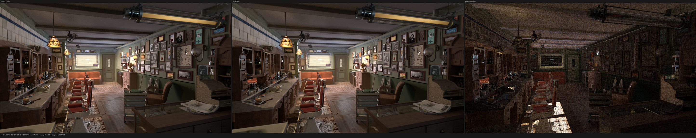
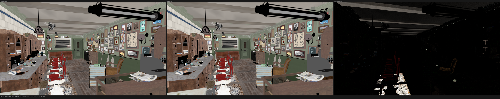
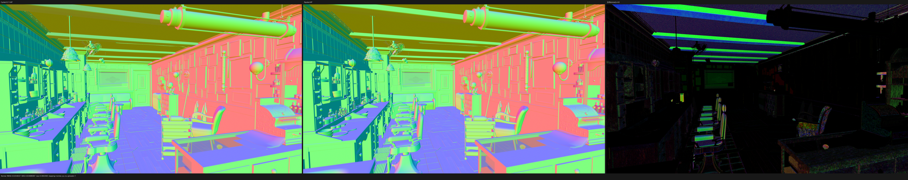
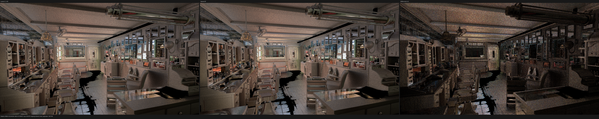

# Direct surface-state SVM validation

This checkpoint validates commit `4fc57da` on the RX 9070 XT after moving the
Cycles ShaderData-reading Geometry, Texture Coordinate and Bump-support SVM
families into the typed direct evaluator. The implementation, regression tests
and this validation were pushed directly to `origin/main`.

## Result

- The complete HIP gate passes: 84/84 tests.
- The controlled 320x180/1 spp Barbershop render is byte-for-byte identical in
  all 15 PFM passes to the preceding direct Vector Math/Clamp checkpoint when
  both use the same Blender 5.2.0 export.
- The staged-wavefront frame remains 848 B with 176 fields. The shade-surface
  code object grows only 256 B, from 312,479 B to 312,735 B.
- Barbershop dynamic value-record coverage handled by direct typed SVM code
  increases from 75.2232% to 90.2515%.
- This coverage gain does **not** produce a measurable HIP speedup. Two
  `shade_surface` profiles average 26.0488 ns/item versus 26.0569 ns/item at the
  previous checkpoint, a 0.03% noise-level change; private memory and register
  counts remain 3380 B/thread, 256 VGPR and 128 SGPR.
- At matched Blender/Cycles 5.2.1 build identity, 1920x1080/1024 spp takes
  232.073 s in Psycles and 144.368 s in Cycles HIP. Psycles is 1.6075x, or
  60.75%, slower. The larger gap than the previous 41.8% report is caused
  primarily by the updated Cycles 5.2.1 baseline, whose elapsed time fell from
  164.048 s; Psycles itself changes by only -0.21%, within run noise.

## Formal implementation model

The implementation was checked against Blender/Cycles 5.2.1 source commit
`9e2066aef7ef`, principally `kernel/svm/geometry.h`, `tex_coord.h` and
`util.h`. Ordinary and derivative records share one semantic family over an
explicit differential sample. For every differentiable member `q` of the
surface point,

```text
q'(dx, dy) = q + dq/dx * dx + dq/dy * dy.
```

The projection is applied to position, object position, generated coordinate,
UV and barycentric coordinate. Bump expansion has already converted Cycles'
offset/filter-width state into explicit scalar SSA operands; nested bump
offsets compose additively before the evaluator. The direct evaluator is
therefore a pure projection and not a second hidden bump interpreter.

The executable invariants are:

1. operands are read in strictly increasing ABI order;
2. the UV immediate domain is proven to contain only the named-attribute bit;
3. each transform record owns one in-domain 16-float `PackedTransform` payload,
   and transform-record-to-payload ownership is injective;
4. one metadata range is loaded per transform record and the 16 matrix elements
   are addressed relative to that range;
5. authored semantic subtypes remain runtime data and do not specialize the
   shader cache identity;
6. only typed scalar/vector stack outputs cross the family boundary; no
   `TracedValues`, `SurfaceValueExpression` or polymorphic `ValueNode` is
   constructed in the direct path.

The old GraphSurface bump path now calls the same
`surface_differential_sample_point` primitive, so the replacement and retained
diagnostic implementations cannot silently drift in differential semantics.

## Permanent regression

`compact_surface_state_family_test_support.cpp` is a separate translation unit
so the main compact-surface test remains below 2000 lines. Its controlled graph
uses a coordinate-driven Bump height and retains all of these runtime records:

```text
surface_position, shading_normal, geometric_normal, incoming,
uv, generated, object_position, object_position_with_transform,
bump_offset_zero, bump_filter_width, bump_samples,
sampled_surface_position, sampled_uv, sampled_generated,
sampled_object_position, sampled_object_position_with_transform
```

The test checks the semantic domain and the record-to-transform-payload
injection rather than a fixture-specific hard-coded payload count. This keeps
the proof valid when unrelated fixtures add their own metadata.

Validation commands and outcomes:

| gate | outcome |
|---|---:|
| all-thread build, `cmake --build build --parallel 32` | pass |
| HIP CTest suite | 84/84 in 19.66 s |
| same-export 320x180/1 spp, all PFM passes | 15/15 byte-exact |
| `git diff --check` | pass |
| source/test file size audit | every changed file below 2000 lines |

## Dynamic coverage and HIP profile

The Barbershop executable image remains 380 programs and 10,177 records. Since
that image is unchanged, the preceding per-record execution census can be
projected exactly onto the newly direct families:

| newly direct family | dynamic records |
|---|---:|
| Texture Coordinate | 237,412,666 |
| Geometry | 170,996,542 |
| Texture Coordinate derivative | 165,191,280 |
| Bump support | 112,635,679 |
| Geometry derivative | 37,879,482 |
| added direct records | 724,115,649 |
| all direct records | 4,348,631,446 / 4,818,350,450 (90.2515%) |

ROCm 7.2.4 renamed the profiler database output from `sqlite` to `rocpd`.
Two warm-cache 640x480/64 spp runs used `rocprofv3` 1.1.0:

| run | shade-surface time | ns/item | private | VGPR | SGPR | block |
|---|---:|---:|---:|---:|---:|---:|
| 1 | 1396.990 ms | 26.0311 | 3380 B | 256 | 128 | 64 |
| 2 | 1398.887 ms | 26.0665 | 3380 B | 256 | 128 | 64 |
| mean | - | 26.0488 | 3380 B | 256 | 128 | 64 |

The direct-family architecture is now substantially more complete, but the
profile proves that the remaining performance problem is still structural:
the kernel remains at the register/private-memory ceiling and the newly moved
state operations were not the dominant time within this scene.

## Matched 5.2.1 full-resolution comparison

The first post-reboot Psycles run used the existing 5.2.0 export and took
232.413 s. The local Cycles reference was then updated to Blender 5.2.1. The
comparison tool correctly rejected treating the old export as a verified
identity match, so Barbershop was re-exported with the same 5.2.1 build before
the formal rerun. This is a raw node/closure export; no Cycles material baking
or renderer-side preprocessing is used.

Both renderers used the RX 9070 XT, 1920x1080, 1024 fixed samples,
TABULATED_SOBOL, scrambling distance 1.0, adaptive sampling disabled and
denoising disabled. Both observed the same two missing external source images.

| renderer | build/device | render-only | relative |
|---|---|---:|---:|
| Cycles | Blender 5.2.1 `9e2066aef7ef`, HIP | 144.368 s | 1.0000x |
| Psycles `4fc57da` | matching 5.2.1 export, HIP staged wavefront | 232.073 s | 1.6075x |

Psycles stayed at 100% GPU busy in the stable render interval, used 66% VRAM,
and sampled approximately 222-225 W. Its shader JIT orchestration was 2.054 s;
all shader code objects were loaded from cache.

## Fifteen-pass numerical and visual check

Build identity verification succeeded and every pass has zero invalid pixels.
The full report is [all-pass-report.json](all-pass-report.json).

| pass | RMSE | relative RMSE | mean luminance ratio |
|---|---:|---:|---:|
| Combined | 0.0110757 | 0.057533 | 1.003208 |
| Diffuse Color | 0.0219288 | 0.085631 | 1.002347 |
| Diffuse Direct | 0.0118119 | 0.023057 | 1.000575 |
| Glossy Color | 0.00140223 | 0.006644 | 1.000648 |
| Normal | 0.0254926 | 0.046369 | 1.013643 |
| Emission | 0.00001184 | 0.000162 | 1.000000 |
| Environment | 0.00000477 | 0.000432 | 0.999982 |
| Volume Direct / Indirect | 0 / 0 | 0 / 0 | both exactly zero |

I inspected the generated triptychs at their native 5760x1080 resolution. The
checked-in images are 50% documentation previews; metrics always use the
original linear 1920x1080 passes.

- Combined keeps the cabinet, wall tiles and trim, ceiling beams, floor plank
  topology, furniture and image placement registered. There is no new UV,
  handedness, transform or geometry offset; the amplified difference is
  dominated by stochastic/highlight noise.
- Diffuse Color retains the known Cycles `DiffCol` versus Psycles albedo/AOV
  closure-classification difference on foreground non-diffuse objects and the
  known missing-texture regions. Its RMSE changes by only `+4.0e-7` from the
  preceding checkpoint, so this is not introduced by direct state evaluation.
- Normal retains localized bump/geometric-normal differences without spatial
  displacement; its RMSE changes by `-1.9e-9`.
- Glossy Indirect remains dominated by fireflies and low-energy sampling noise;
  material and geometry silhouettes align.









## Commands

```sh
cmake --build build --parallel 32
ctest --test-dir build --output-on-failure -R '(_hip|hip_)$' -j1

rocprofv3 --kernel-trace --stats -f rocpd -o trace_results -d PROFILE -- \
  build/bin/psycles_render_blender_scene EXPORT out.exr hip \
  640 480 64 64 - 320 240 0 0 64 - 1 0 \
  wavefront-staged 64 32768 32 1 1 0 4 2 auto 0 0 0 1 1048576

blender barbershop_interior.blend --background --python-exit-code 1 \
  --python tools/export_psycles_scene.py -- EXPORT_5_2_1

build/bin/psycles_render_blender_scene EXPORT_5_2_1 psycles.exr hip \
  1920 1080 1024 64 - 960 540 0 0 1024 - 1 0 \
  wavefront-staged 64 32768 32 1 1 0 4 2 auto 0 0 0 1 1048576

blender barbershop_interior.blend --background --python-exit-code 1 \
  --python tools/render_cycles_golden.py -- \
  cycles.exr 1920 1080 1024 0 \
  --cycles-device HIP --device-name 'Radeon RX 9070 XT' \
  --sampling-pattern TABULATED_SOBOL --scrambling-distance 1.0
```

The next HIP work should target the remaining hot interpreted families and the
unchanged 256-VGPR/3380-B shade-surface resource footprint. Vulkan and fallback
remain intentionally deferred until the HIP family and scene gates are closed.
