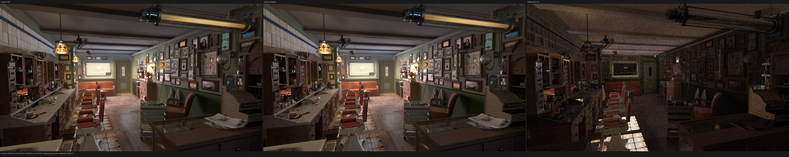
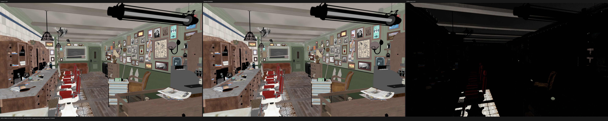
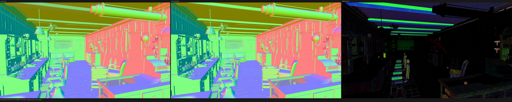
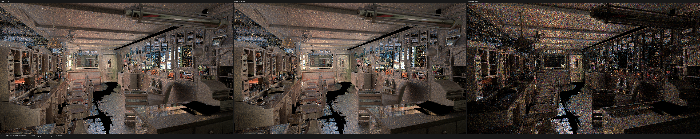

# Direct texture-trunk surface SVM and ordered staged operands

This checkpoint moves the hot Mix Color, RGB Ramp, Mapping, Image Texture,
and Image Texture BOX families onto the direct typed-stack surface SVM. Along
with the existing Convert and Math families, these instructions no longer
construct `TracedValues`, `SurfaceValueExpression`, or a host `ValueNode` in
the production evaluator.

The initial implementation was numerically exact but exposed a multistage
performance bug: several device operand reads were written as arguments of a
single host C++ call. C++ does not specify function-argument evaluation order,
while Luisa DSL calls append device expressions to the shader AST as the host
executes. GCC selected texture-handle before coordinate evaluation, extending
the live 64-bit handle dependency across the coordinate load. Barbershop made
the effect repeatable because Image/BOX executes 291,175,545 times in the
640x480, 64-spp census.

## Formal staging contract

For a direct value record with logical operands `A = (a0, ..., an-1)`, let
`R = (r0, ..., rk-1)` be the operands actually observed by its static family
subtype. Psycles now requires

```text
0 <= r0 < r1 < ... < rk-1 < n.
```

An evaluator may skip an unobserved operand, but it cannot read an operand
twice or construct a later observed operand before an earlier one. Every read
is a separate C++ full-expression. `SurfaceValueOperandReader` advances a
host-only cursor and aborts shader construction if the contract is violated;
compile-time regressions prove ordered, skipped, repeated, and reversed cases.
The controlled compact-surface graph exercises Math, Mix, Ramp, Mapping,
Image and Image BOX through the real HIP callable builder.

This contract removes host compiler evaluation order from shader identity and
makes the emitted dependency order an explicit part of the SVM ABI. The Image
family materializes coordinate, texture handle, and optional BOX blend in that
order before entering the shared Cycles-compatible semantic evaluator. Math
and Mapping likewise name operands before combining or forwarding them.

## Production execution census

The exact Blender 5.2 Barbershop run contains 53,656,078 surface populations
and 4,818,350,450 value-instruction executions. The now-direct families account
for 3,304,545,382 executions (68.60%):

| family | executions |
|---|---:|
| Convert | 881,192,619 |
| Mix Color | 773,824,881 |
| Math | 656,448,096 |
| RGB Ramp | 395,177,469 |
| Mapping | 306,726,772 |
| Image Texture | 196,165,527 |
| Image Texture BOX | 95,010,018 |

The scene runtime remains 380 programs, 10,177 records, 8,808 value records,
34 reached SVM families, 67 exact semantic variants, and 33 stack lanes.

## HIP root-cause A/B

All runs below used the same boot, official Blender 5.2 export, 640x480,
64 fixed samples, block 64, staged wavefront, and 53,666,1xx
`shade_surface` work items. Static resources remain 3380 B scratch/thread,
256 VGPR and 128 SGPR.

| evaluator configuration | `shade_surface` ns/item | conclusion |
|---|---:|---|
| new texture families disabled, run 1 | 26.0183 | retained evaluator baseline |
| new texture families disabled, run 2 | 26.0099 | retained evaluator baseline |
| direct Mix only | 26.0200 | neutral |
| direct RGB Ramp only | 26.0077 | neutral |
| direct Mapping only | 26.0256 | neutral |
| direct Image/BOX, unordered | 26.6707 | reproduces the regression |
| direct Image/BOX, explicitly ordered | 25.9923 | regression eliminated |
| all direct families, ordered, run 1 | 26.0638 | final combined result |
| all direct families, ordered, run 2 | 26.0816 | final combined result |

Thus the unordered Image path explains essentially all of the original
26.69 ns/item result. The final combined kernel is within 0.23% of the
26.0141 ns/item retained-evaluator mean, and whole-render time is flat at
2.432/2.437 s versus 2.435 s. No speedup over Cycles is claimed.

## Correctness gates

- all-thread build passed;
- HIP-only CTest passed 84/84 in 6.75 s;
- the focused compact preparation HIP regression passed after the new cursor
  assertions were added;
- all 15 320x180 one-sample PFM files are byte-for-byte equal to the preceding
  direct-family checkpoint;
- no full-resolution pass contains NaN or infinity.

For completeness, a cross-backend CTest invocation still reproduced the same
six pre-existing small fallback/Vulkan fixture drifts. They are outside this
HIP-first checkpoint and were not used to weaken the HIP result.

## Full-resolution HIP validation

The official Blender 5.2 Barbershop scene was rendered at 1920x1080 and
1024 fixed spp. Adaptive sampling and denoising were disabled in Cycles.
Both used the RX 9070 XT; Psycles remained at 100% GPU busy throughout the
render, used 66% VRAM, and sampled 197-266 W package power.

| renderer | device | render time | relative |
|---|---|---:|---:|
| Cycles 5.2 `fbe6228777e7` | HIP | 164.048 s | 1.000x |
| Psycles `fae8afc` | HIP staged wavefront | 232.554 s | 1.418x |

Psycles is therefore 41.8% slower on this complete image. Its coroutine frame
is 848 B with 176 fields and capacity 1,048,576; all shaders were loaded from
cache and reported JIT orchestration was 2.101 s.

The verified 15-pass comparison is in
[all-pass-report.json](all-pass-report.json). Representative values are:

| pass | RMSE | relative RMSE | luminance ratio |
|---|---:|---:|---:|
| Combined | 0.011078 | 0.05754 | 1.00323 |
| Diffuse Color | 0.021928 | 0.08563 | 1.00235 |
| Diffuse Direct | 0.011995 | 0.02342 | 1.00060 |
| Glossy Color | 0.001395 | 0.00661 | 1.00064 |
| Normal | 0.025493 | 0.04637 | 1.01364 |
| Emission | 0.00001194 | 0.000164 | 1.00000 |
| Environment | 0.00000552 | 0.000501 | 0.99995 |

Indirect glossy/diffuse relative RMSE remains dominated by stochastic
fireflies and low-energy pixels. Both volume passes are exactly zero because
this scene has no active volume contribution.

## Visual inspection

I inspected the generated triptychs at their native 5760x1080 resolution.
Combined preserves camera, cabinet, wall, floor, lights, furniture and texture
topology without a new UV, handedness, or transform error. Diffuse Color
differences concentrate around chairs, floor/contact boundaries and the same
missing source textures. Normal retains localized bump/geometric-normal
differences on beams and furniture. Glossy Indirect is visually dominated by
sampling noise and fireflies rather than a displaced material layout.









## Commands

```sh
ctest --test-dir build --output-on-failure --parallel 32 -R hip

build/bin/psycles_render_blender_scene \
  EXPORT out.exr hip 1920 1080 1024 64 - 960 540 0 0 1024 - 1 0 \
  wavefront-staged 64 32768 32 1 1 0 4 2 auto 0 0 0 1 1048576

blender barbershop_interior.blend --background --python-exit-code 1 \
  --python tools/render_cycles_golden.py -- \
  cycles.exr 1920 1080 1024 0 \
  --cycles-device HIP --device-name 'Radeon RX 9070 XT' \
  --sampling-pattern TABULATED_SOBOL --scrambling-distance 1.0
```

The next performance work remains structural: migrate the remaining hot
coordinate, Vector Math, Noise, Bump-support and query families directly, then
profile the residual `shade_surface` and traversal kernels against Cycles.
